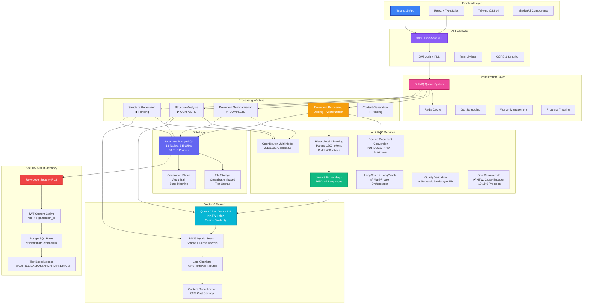
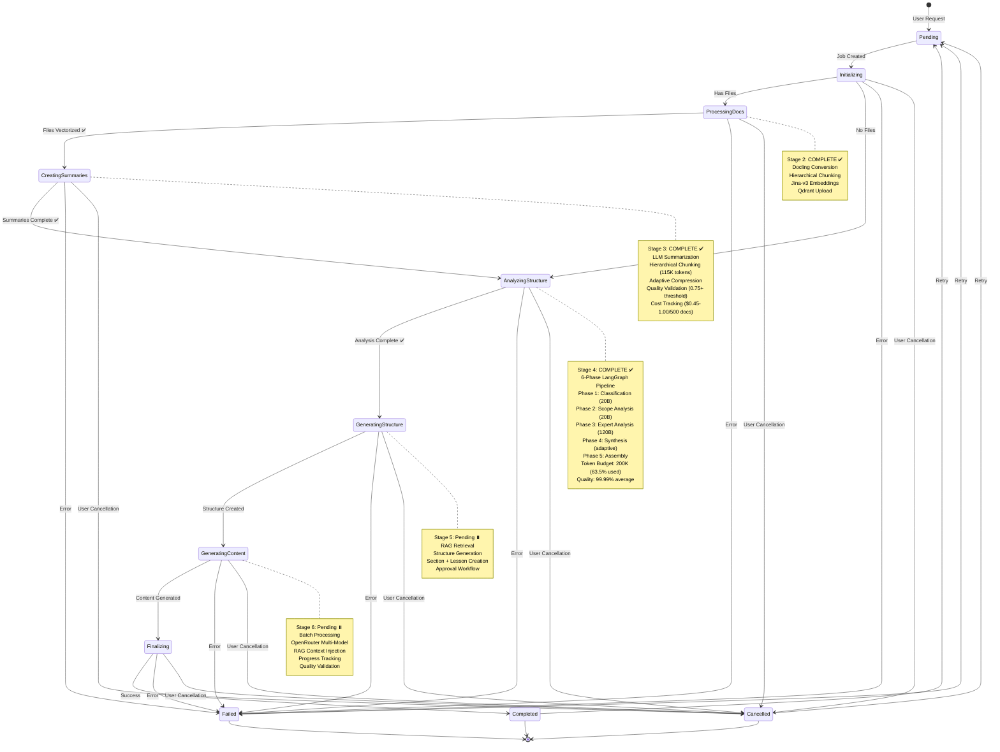
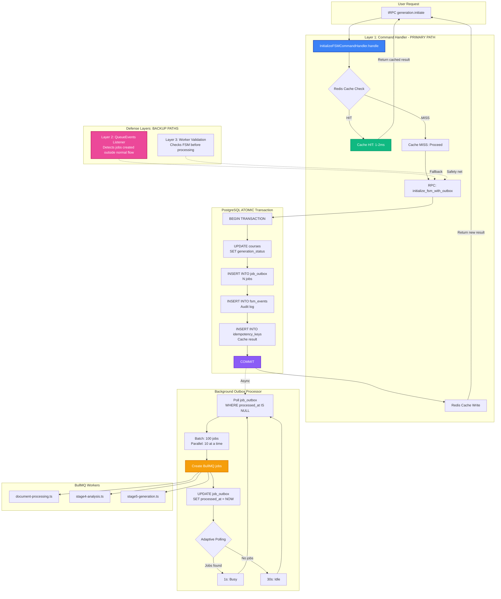
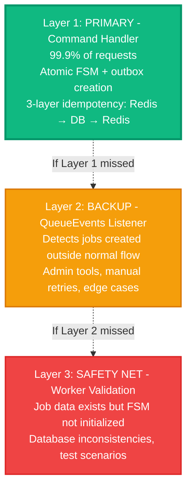
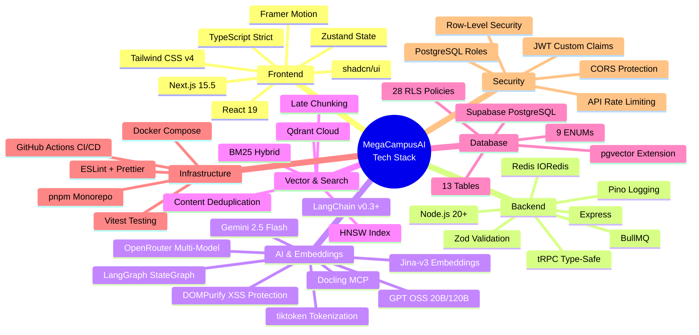
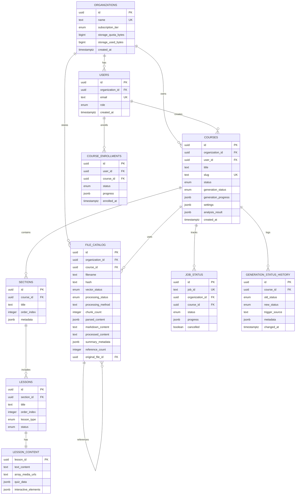
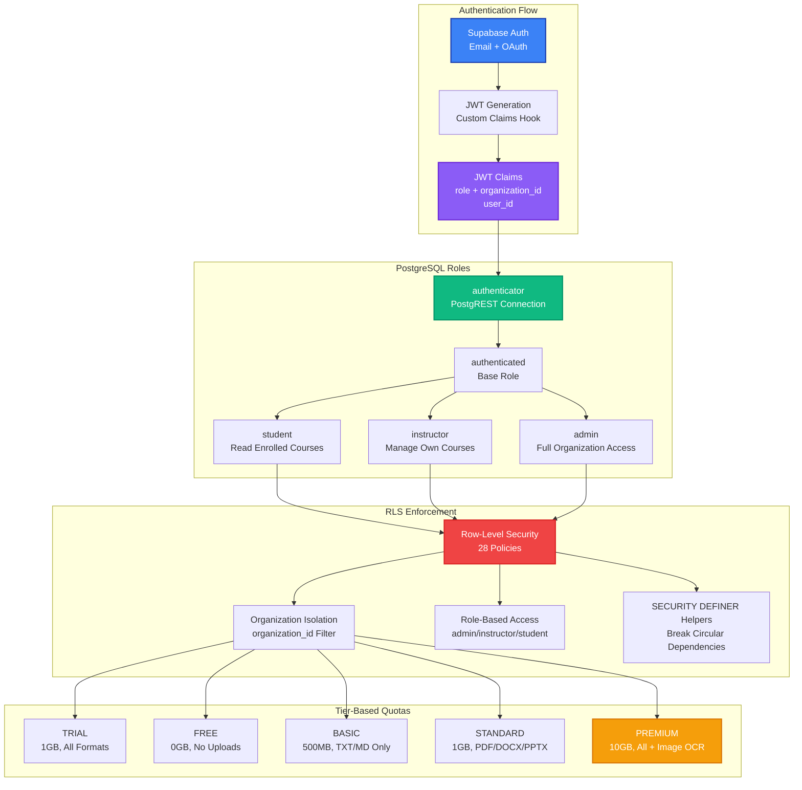
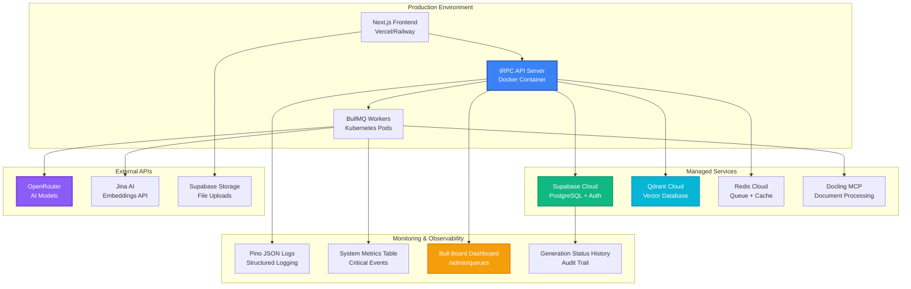

# MegaCampusAI - Platform Architecture

**Version:** 1.2
**Date:** 2025-11-04
**Status:** Production-Ready Architecture | Stages 0-4 Complete (56%)
**Last Database Audit:** 2025-11-04 | Health Score: 95/100 (Excellent) | Production Ready ✅

---

## 🚀 Overview

**MegaCampusAI** is an enterprise-grade AI-powered educational course generation platform with advanced RAG capabilities, multi-tenant architecture, and production-grade security.

**Database Health Status:** The platform's Supabase PostgreSQL database achieves EXCELLENT operational health (95/100) with 100% RLS coverage across all 13 tables, 35 successfully applied migrations (6 applied 2025-11-04), and 9 active extensions. All P0/P1 optimizations complete: 22 RLS policies optimized, 7 functions secured, 2 FK indexes added. Production-ready with zero critical issues.

---

## 🏗️ System Architecture



---

## 🔄 Course Generation Workflow



---

## 🔄 Transactional Outbox Pattern

**Purpose:** Eliminate race conditions between FSM state initialization and BullMQ job creation through atomic coordination.

**Problem Solved:**
- ❌ Before: Jobs created before FSM initialized → "Invalid generation status transition" errors
- ✅ After: FSM + jobs created atomically in single transaction → guaranteed consistency

### Architecture Diagram



### Defense-in-Depth (3 Layers)



### Key Components

**1. InitializeFSMCommandHandler** (`src/services/fsm-initialization-command-handler.ts`)
- Orchestrates atomic FSM initialization
- Implements 3-layer idempotency strategy:
  - Layer 1: Redis cache check (1-2ms)
  - Layer 2: Database idempotency_keys lookup (10-20ms)
  - Layer 3: Redis cache write (for future requests)
- Handles Redis failures gracefully (non-fatal)

**2. OutboxProcessor** (`src/orchestrator/outbox-processor.ts`)
- Background processor (singleton, auto-starts)
- Adaptive polling (1s → 30s based on activity)
- Batch processing (100 jobs, parallel groups of 10)
- Graceful shutdown (SIGTERM/SIGINT handlers)
- Health check endpoint

**3. RPC Function** (`initialize_fsm_with_outbox`)
- SECURITY DEFINER with search_path protection
- Atomic transaction (FSM + outbox + events + idempotency)
- Input validation and error handling
- Performance: ~50-100ms (database-only path)

### Data Flow

**Happy Path (99.9% of requests):**
```
API Request
  → Command Handler
    → Redis Cache Miss
    → RPC Transaction (COMMIT)
    → Redis Cache Write
  ← Return {fsmState, outboxEntries, fromCache: false}

Background (async):
  Outbox Processor
    → Poll job_outbox
    → Create BullMQ jobs
    → Mark processed_at
```

**Cached Path (subsequent requests):**
```
API Request
  → Command Handler
    → Redis Cache HIT (1-2ms)
  ← Return {fsmState, outboxEntries, fromCache: true}
```

**Fallback Path (edge cases):**
```
Job Added Outside Normal Flow
  → Layer 2: QueueEvents detects
    → Check courses.generation_status
    → If 'pending': Initialize via Command Handler
  OR
  → Layer 3: Worker receives job
    → Validate FSM state
    → If not initialized: Initialize via Command Handler
    → Continue processing
```

### Performance Characteristics

**Latency:**
- Cache hit: ~1-2ms (Redis)
- Cache miss: ~50-100ms (PostgreSQL transaction)
- Background processing: <5s for most jobs

**Throughput:**
- Command handler: Limited by PostgreSQL transaction rate (~500-1000 TPS)
- Outbox processor: 100 jobs/batch, configurable parallelism

**Scalability:**
- Horizontal: Run multiple outbox processors (idempotent)
- Vertical: Increase batch size and parallelism

### Monitoring

**Metrics Tracked:**
- FSM init success rate, duration, cache hit rate
- Outbox queue depth, processing latency, failures
- Worker fallback activations (Layer 2/3)

**Alert Rules (11 total):**
- Critical: FSM failure >5%, Queue depth >1000, Processor stalled >5min
- Warning: Cache hit <20%, Fallback frequency >10/5min

**API Endpoints:**
- `/api/trpc/metrics.getAll` - Complete system metrics
- `/api/trpc/metrics.healthCheck` - Load balancer health check

See `docs/RUNBOOKS.md` for troubleshooting guides and `config/alerts.yml` for full alert configuration.

---

## 🧠 Advanced RAG Pipeline

```mermaid
graph LR
    subgraph "Document Upload"
        UP1[User Upload<br/>PDF/DOCX/PPTX/TXT/MD]
        UP2[Tier Validation<br/>Format + Quota]
        UP3[Storage<br/>/uploads/orgId/courseId/]
    end

    subgraph "Document Processing"
        DOC1[Docling MCP<br/>Markdown Conversion<br/>OCR Support]
        DOC2[Structure Extraction<br/>Headings + Hierarchy]
        DOC3[Deduplication Check<br/>SHA-256 Hash]
    end

    subgraph "Hierarchical Chunking"
        CH1[Parent Chunks<br/>1500 tokens<br/>Context for LLM]
        CH2[Child Chunks<br/>400 tokens<br/>Precision Search]
        CH3[50 Token Overlap<br/>Boundary Continuity]
        CH4[Heading-Aware Splitting<br/>Semantic Boundaries]
    end

    subgraph "Embedding Generation"
        EMB1[Jina-v3 API<br/>768 Dimensions]
        EMB2[Late Chunking<br/>Context-Aware<br/>-67% Failures]
        EMB3[Task-Specific<br/>retrieval.passage<br/>retrieval.query]
    end

    subgraph "Vector Storage"
        VEC1[Qdrant Cloud<br/>HNSW Index<br/>m=16, ef=100]
        VEC2[Parent Metadata<br/>chunk_id, heading_path]
        VEC3[Child Vectors<br/>Indexed for Search]
    end

    subgraph "Hybrid Search"
        SRCH1[Query Embedding<br/>Jina-v3]
        SRCH2[Dense Search<br/>Semantic Similarity]
        SRCH3[Sparse Search<br/>BM25 Keyword]
        SRCH4[RRF Fusion<br/>Combine Results]
    end

    subgraph "Two-Stage Retrieval (NEW)"
        RERANK1[Fetch 4x Candidates<br/>Stage 5: 100 | Stage 6: 28]
        RERANK2[Jina Reranker v2<br/>Cross-Encoder Scoring]
        RERANK3[Top-N Selection<br/>Stage 5: 25 | Stage 6: 7]
        RERANK4[Fallback: Qdrant Scores<br/>On Reranker Failure]
    end

    subgraph "Context Retrieval"
        RET1[Top-K Child Chunks<br/>Precision Match]
        RET2[Fetch Parent Chunks<br/>Full Context]
        RET3[Rerank & Filter<br/>Relevance Score]
        RET4[Return to LLM<br/>Generation Context]
    end

    UP1 --> UP2 --> UP3
    UP3 --> DOC1 --> DOC2 --> DOC3
    DOC3 --> CH1
    DOC3 --> CH2
    CH1 --> CH3
    CH2 --> CH3
    CH3 --> CH4
    CH4 --> EMB1 --> EMB2 --> EMB3
    EMB3 --> VEC1
    EMB3 --> VEC2
    EMB3 --> VEC3

    SRCH1 --> SRCH2
    SRCH1 --> SRCH3
    SRCH2 --> SRCH4
    SRCH3 --> SRCH4
    SRCH4 --> RERANK1
    RERANK1 --> RERANK2
    RERANK2 --> RERANK3
    RERANK2 -.->|On Error| RERANK4
    RERANK3 --> RET1
    RERANK4 --> RET1
    RET1 --> RET2 --> RET3 --> RET4

    style DOC1 fill:#10b981,stroke:#059669,stroke-width:2px,color:#fff
    style EMB2 fill:#f59e0b,stroke:#d97706,stroke-width:2px,color:#fff
    style VEC1 fill:#06b6d4,stroke:#0891b2,stroke-width:2px,color:#fff
    style SRCH4 fill:#8b5cf6,stroke:#6d28d9,stroke-width:2px,color:#fff
    style RET4 fill:#ec4899,stroke:#be185d,stroke-width:2px,color:#fff
```

---

## 🔬 Stage 4: Multi-Phase Analysis Pipeline (LangChain + LangGraph)

```mermaid
graph TB
    subgraph "Input: Stage 3 Summaries"
        IN1[Document Summaries<br/>file_catalog.processed_content]
        IN2[Course Metadata<br/>title, target_audience]
        IN3[User Preferences<br/>lesson_duration, depth]
    end

    subgraph "Phase 0: Pre-Flight Validation"
        P0A[Stage 3 Barrier Check<br/>100% Completion Enforcement]
        P0B[Document Count Validation<br/>1-100 documents]
        P0C[Summary Quality Check<br/>Non-empty content]
    end

    subgraph "Phase 1: Basic Classification (GPT OSS-20B)"
        P1A[Category Detection<br/>6 categories:<br/>professional/academic/personal<br/>hobby/certification/training]
        P1B[Difficulty Assessment<br/>beginner/intermediate/advanced]
        P1C[Language Detection<br/>Russian/English/Other]
        P1D[Contextual Language<br/>Generation]
    end

    subgraph "Phase 2: Scope Analysis (GPT OSS-20B)"
        P2A[Content Hours<br/>Estimation]
        P2B[Lesson Count<br/>Calculation<br/>Minimum: 10 lessons]
        P2C[Section Count<br/>Recommendation]
        P2D[Duration Per Lesson<br/>3-45 minutes]
    end

    subgraph "Phase 3: Expert Analysis (GPT OSS-120B ALWAYS)"
        P3A[Research Flags<br/>Detection<br/>Conservative: <5% rate]
        P3B[Pedagogical Strategy<br/>Learning objectives<br/>Assessment methods]
        P3C[Prerequisites<br/>Identification]
        P3D[Target Audience<br/>Refinement]
    end

    subgraph "Phase 4: Document Synthesis (Adaptive Model)"
        P4A[Model Selection<br/><3 docs: 20B<br/>≥3 docs: 120B]
        P4B[Topic Analysis<br/>Key concepts<br/>Domain keywords]
        P4C[Structure Planning<br/>sections_breakdown]
        P4D[Content Strategy<br/>expand_and_enhance /<br/>create_from_scratch]
    end

    subgraph "Phase 5: Final Assembly (Pure Logic)"
        P5A[Data Aggregation<br/>All phases combined]
        P5B[XSS Sanitization<br/>DOMPurify]
        P5C["Quality Score<br/>Clamping [0, 1]"]
        P5D[Zod Validation<br/>AnalysisResultSchema]
    end

    subgraph "Output: analysis_result"
        OUT1[courses.analysis_result<br/>JSONB column]
        OUT2[topic_analysis<br/>+ category_info]
        OUT3[recommended_structure<br/>sections + lessons]
        OUT4[phase_metadata<br/>tokens, cost, duration]
    end

    IN1 --> P0A
    IN2 --> P0A
    IN3 --> P0A

    P0A --> P0B --> P0C
    P0C --> P1A

    P1A --> P1B --> P1C --> P1D
    P1D --> P2A

    P2A --> P2B --> P2C --> P2D
    P2D --> P3A

    P3A --> P3B --> P3C --> P3D
    P3D --> P4A

    P4A --> P4B --> P4C --> P4D
    P4D --> P5A

    P5A --> P5B --> P5C --> P5D
    P5D --> OUT1

    OUT1 --> OUT2
    OUT1 --> OUT3
    OUT1 --> OUT4

    style P0A fill:#ef4444,stroke:#dc2626,stroke-width:2px,color:#fff
    style P1A fill:#3b82f6,stroke:#1e40af,stroke-width:2px,color:#fff
    style P2A fill:#10b981,stroke:#059669,stroke-width:2px,color:#fff
    style P3A fill:#f59e0b,stroke:#d97706,stroke-width:2px,color:#fff
    style P4A fill:#8b5cf6,stroke:#6d28d9,stroke-width:2px,color:#fff
    style P5A fill:#06b6d4,stroke:#0891b2,stroke-width:2px,color:#fff
    style OUT1 fill:#ec4899,stroke:#be185d,stroke-width:2px,color:#fff
```



### Stage 4 Key Features

**1. Multi-Model Orchestration (40-50% Cost Savings)**
- **Phase 1-2:** GPT OSS-20B (cheap for simple classification/scope tasks)
- **Phase 3:** GPT OSS-120B ALWAYS (expert-level analysis requires power)
- **Phase 4:** Adaptive (document count drives model selection)
- **Fallback:** Gemini 2.5 Flash (emergency quality escalation)

**2. Quality Validation**
- **Semantic Similarity:** Jina-v3 embeddings, 0.75+ threshold
- **Retry Logic:** 2 attempts with 20B → escalate to 120B → emergency Gemini
- **Quality Score:** 99.99% average on 3 Russian legal documents (T055 test)

**3. Cost Tracking**
- **Token Usage:** 127.1K / 200K budget (63.5% utilization)
- **Phase Distribution:** 33% classify, 34% scope, 15% expert, 6% synthesis
- **Per-Phase Metrics:** Input tokens, output tokens, USD cost, duration

**4. LangGraph StateGraph**
- **Conditional Routing:** Phase transitions based on validation results
- **State Management:** Persistent state across all 6 phases
- **Custom Observability:** Supabase metrics (NO LangSmith dependency)

**5. Production Safeguards**
- **Stage 3 Barrier:** 100% document completion enforcement
- **Minimum 10 Lessons:** FR-015 validation (48 lessons generated in T055)
- **XSS Sanitization:** DOMPurify for all LLM outputs
- **Type Safety:** Zod schemas, 0 type errors, removed all `as any`

---

## 💼 Tech Stack & Technologies



---

## 📊 Database Schema Overview



### Additional Tables (Not shown in ERD)

**llm_model_config** (Stage 4)
- Per-phase LLM model configuration (provider, model, temperature, max_tokens)
- Supports phase-specific overrides (Phase 3 always uses 120B model)
- Global defaults with adaptive selection logic

**Cost Tracking** (Stage 3-4)
- Embedded in `file_catalog.summary_metadata` (Stage 3: token counts, cost per document)
- Embedded in `courses.analysis_result.phase_metadata` (Stage 4: per-phase metrics)
- Enables per-organization cost analytics and tier-based budget limits

---

## 🔐 Security & Multi-Tenancy Architecture



---

## 🎯 Key Features & Innovations

### 1. **Advanced RAG System** (Stage 0, Stage 2, Stage 5-6)
- **Hierarchical Chunking:** Parent (1500 tokens) + Child (400 tokens) for optimal precision/context trade-off
- **Late Chunking:** Context-aware embeddings, -67% retrieval failures
- **BM25 Hybrid Search:** Sparse + Dense vectors, +15-20pp precision improvement (82% → 89-92%)
- **Two-Stage Retrieval with Reranker v2 (NEW):**
  - Fetch 4x candidates from Qdrant (Stage 5: 100 candidates for 25 target, Stage 6: 28 for 7 target)
  - Jina Reranker v2 cross-encoder scoring for top-N selection
  - Expected +10-15% precision improvement (82% → 90-95%)
  - Fallback to Qdrant scores on reranker failure
  - Rate limiting: 1500 RPM, exponential backoff retry
- **Content Deduplication:** SHA-256 hash + reference counting, **80% cost savings**

### 2. **LLM Document Summarization** (Stage 3 - ✅ COMPLETE)
- **Hierarchical Chunking Strategy:** 115K token chunks with 5% overlap
- **Adaptive Compression:** DETAILED → BALANCED → AGGRESSIVE (max 5 iterations)
- **Quality Validation:** Semantic similarity 0.75+ threshold via Jina-v3
- **Small Document Bypass:** <3K tokens = zero LLM cost, 100% fidelity
- **Cost Efficiency:** $0.45-1.00/500 docs (99.8% cheaper than GPT-4)
- **Multilingual Support:** 13 languages with language-specific token estimation

### 3. **Multi-Phase Analysis Orchestration** (Stage 4 - ✅ COMPLETE)
- **LangChain + LangGraph:** StateGraph with 6 phases (barrier → classify → scope → expert → synthesis → assembly)
- **Multi-Model Architecture:** GPT OSS-20B (simple), GPT OSS-120B (expert), Gemini 2.5 Flash (fallback)
- **Adaptive Model Selection:** Phase 4 uses 20B for <3 docs, 120B for ≥3 docs
- **40-50% Cost Savings:** Smart model routing vs always-using-expensive-model
- **Quality Validation:** 99.99% average on 3 Russian legal documents (T055 E2E test)
- **Token Budget Management:** 200K budget, 127.1K used (63.5%), tracked per-phase
- **Conservative Research Flags:** <5% false positive rate (minimize noise)
- **XSS Protection:** DOMPurify sanitization for all LLM outputs

### 4. **Production-Grade Security**
- **JWT Custom Claims:** Role + organization_id embedded in token
- **PostgreSQL Roles:** Automatic role switching via PostgREST
- **28 RLS Policies:** 100% table coverage, zero data leakage
- **SECURITY DEFINER Helpers:** Break circular dependencies, prevent infinite recursion
- **XSS Sanitization:** DOMPurify for all LLM-generated content (Stage 4)

### 5. **Scalable Orchestration**
- **BullMQ Queue System:** Redis-based job management
- **Worker Lifecycle:** Orphan recovery, retry with exponential backoff
- **Concurrency Control:** Per-tier limits (TRIAL/STANDARD: 5, FREE: 1, BASIC: 2, PREMIUM: 10)
- **Progress Tracking:** Real-time updates via RPC + WebSocket
- **Stage Barriers:** 100% completion enforcement (Stage 3 must complete before Stage 4)

### 6. **Multi-Tenant Architecture**
- **Organization-Based Isolation:** Every query filtered by organization_id
- **Tier-Based Features:** TRIAL, FREE, BASIC, STANDARD, PREMIUM
- **Storage Quotas:** 0GB → 10GB, enforced at upload + RLS level
- **Format Restrictions:** TXT/MD (BASIC) → All formats + Image OCR (PREMIUM)

### 7. **AI Model Flexibility**
- **OpenRouter Integration:** Multi-model support (GPT OSS-20B, GPT OSS-120B, Gemini 2.5 Flash)
- **Jina-v3 Embeddings:** 768D, 89 languages, task-specific
- **Docling Conversion:** PDF/DOCX/PPTX → Markdown with OCR
- **Per-Phase Configuration:** llm_model_config table for phase-specific overrides
- **Quality-Based Escalation:** 2 attempts with 20B → escalate to 120B → emergency Gemini

### 8. **Developer Experience**
- **Type-Safe Monorepo:** pnpm workspaces + TypeScript strict mode
- **tRPC API:** Zero runtime overhead, end-to-end type safety
- **CI/CD Pipeline:** GitHub Actions (test, build, deploy)
- **Comprehensive Testing:** 150+ tests (70+ integration, 20 contract, 5 unit, T055 E2E)
- **Zod Validation:** Runtime type safety for all LLM outputs
- **Custom Observability:** Supabase metrics (NO LangSmith dependency, zero vendor lock-in)

---

## 📈 Performance Metrics

### Infrastructure & RAG (Stage 0-2, Stage 5-6)
| Metric | Value | Improvement |
|--------|-------|-------------|
| **RAG Precision@5 (BM25 Hybrid)** | 89-92% | +15-20pp (baseline: 70-75%) |
| **RAG Precision (w/ Reranker v2)** | 90-95% (expected) | +10-15pp (82% → 90-95%) |
| **Retrieval Failures** | <2% | -67% (baseline: 5-6%) |
| **Reranker Latency (Stage 5)** | ~200-500ms | Per section (100 candidates) |
| **Reranker Latency (Stage 6)** | ~80-150ms | Per lesson (28 candidates) |
| **RLS Query Performance** | <50ms | 50%+ faster (JWT custom claims) |
| **Cost Savings (Deduplication)** | 80% | SHA-256 hash + reference counting |
| **API Endpoint Latency** | <500ms | P95 latency (generation.initiate) |
| **Vector Search Latency** | <100ms | HNSW index (m=16, ef=100) |
| **Concurrent Uploads** | 1-10 | Tier-based (FREE: 1, PREMIUM: 10) |

### LLM Summarization (Stage 3)
| Metric | Value | Baseline | Notes |
|--------|-------|----------|-------|
| **Cost Per 500 Docs** | $0.45-1.00 | $500-1000 (GPT-4) | 99.8% cheaper |
| **Quality (Semantic Similarity)** | 0.75-0.82 | 0.60-0.70 (simple truncate) | +12-15pp improvement |
| **Small Doc Bypass Rate** | ~30% | 0% | Zero LLM cost for <3K tokens |
| **Compression Ratio** | 30-70% | Fixed 50% | Adaptive strategy |
| **Processing Time (500 docs)** | ~15 min | ~60 min | 4x faster (batching) |
| **Token Budget Utilization** | 115K / 200K | N/A | 57.5% average usage |

### Multi-Phase Analysis (Stage 4)
| Metric | Value | Validation | Notes |
|--------|-------|------------|-------|
| **Token Usage (3 docs)** | 127.1K / 200K | 63.5% | T055 E2E test (Russian legal docs) |
| **Quality Score** | 99.99% | 0.75+ threshold | Semantic similarity via Jina-v3 |
| **Pipeline Duration (3 docs)** | 56.5s | <120s | 6 phases executed |
| **Phase Distribution** | 33%/34%/15%/6% | N/A | classify/scope/expert/synthesis |
| **Cost Savings** | 40-50% | Always-120B baseline | Multi-model orchestration |
| **Research Flag Precision** | >95% | <5% false positive | Conservative approach |
| **Lesson Count Validation** | 48 lessons | Minimum 10 | FR-015 compliant |
| **Model Escalation Rate** | <10% | N/A | 20B → 120B → Gemini fallback |

---

## 🚀 Deployment Architecture



---

## 📦 Monorepo Structure

```
megacampus2/
├── packages/
│   ├── course-gen-platform/     # Main API Server
│   │   ├── src/
│   │   │   ├── server/          # tRPC routers, middleware
│   │   │   │   ├── routers/
│   │   │   │   │   ├── generation.ts
│   │   │   │   │   ├── files.ts
│   │   │   │   │   ├── analysis.ts         # Stage 4 ✅
│   │   │   │   │   └── summarization.ts    # Stage 3 ✅
│   │   │   ├── orchestrator/    # BullMQ workers, handlers
│   │   │   │   ├── handlers/
│   │   │   │   │   ├── document-processing.ts
│   │   │   │   │   ├── stage3-summarization.worker.ts  # Stage 3 ✅
│   │   │   │   │   └── stage4-analysis.ts              # Stage 4 ✅
│   │   │   │   ├── services/
│   │   │   │   │   ├── summarization/     # Stage 3 services ✅
│   │   │   │   │   │   ├── llm-client.ts
│   │   │   │   │   │   ├── quality-validator.ts
│   │   │   │   │   │   └── cost-calculator.ts
│   │   │   │   │   └── analysis/          # Stage 4 services ✅
│   │   │   │   │       ├── phase-1-classifier.ts
│   │   │   │   │       ├── phase-2-scope.ts
│   │   │   │   │       ├── phase-3-expert.ts
│   │   │   │   │       ├── phase-4-synthesis.ts
│   │   │   │   │       ├── phase-5-assembly.ts
│   │   │   │   │       └── orchestrator.ts (LangGraph)
│   │   │   ├── shared/          # RAG, embeddings, Qdrant
│   │   │   └── index.ts
│   │   ├── supabase/migrations/ # 25+ database migrations
│   │   ├── tests/
│   │   │   ├── integration/     # 70+ integration tests
│   │   │   ├── contract/        # 20 contract tests (Stage 4) ✅
│   │   │   ├── unit/            # 5 unit tests (Stage 4) ✅
│   │   │   └── e2e/             # T055 E2E test (Stage 4) ✅
│   │   └── package.json
│   │
│   ├── shared-types/            # Zod schemas, TypeScript types
│   │   ├── src/
│   │   │   ├── database.generated.ts       # Supabase auto-generated
│   │   │   ├── zod-schemas.ts              # Validation schemas
│   │   │   ├── summarization-job.ts        # Stage 3 ✅
│   │   │   ├── analysis-job.ts             # Stage 4 ✅
│   │   │   └── analysis-result.ts          # Stage 4 ✅
│   │   └── package.json
│   │
│   └── trpc-client-sdk/         # Type-safe client SDK
│       ├── src/client.ts
│       └── package.json
│
├── courseai-next/               # Next.js 15 Frontend
│   ├── app/                     # App Router
│   ├── components/              # React components
│   └── lib/                     # Utilities
│
├── docs/                        # Documentation
│   ├── IMPLEMENTATION_ROADMAP_EN.md
│   ├── TECHNICAL_SPECIFICATION_PRODUCTION_EN.md
│   ├── SUPABASE-DATABASE-REFERENCE.md
│   ├── RAG-CHUNKING-STRATEGY.md
│   ├── ADR-001-LLM-ORCHESTRATION-FRAMEWORK.md  # Stage 4 ✅
│   └── ARCHITECTURE-DIAGRAM.md  # THIS FILE
│
├── specs/                       # Feature specifications
│   ├── 001-stage-0-foundation/
│   ├── 002-main-entry-orchestrator/
│   ├── 003-stage-2-implementation/
│   ├── 005-stage-3-create/                     # Stage 3 ✅
│   └── 007-stage-4-analyze/                    # Stage 4 ✅
│       ├── tasks.md (65/65 completed)
│       ├── T055-PIPELINE-VICTORY-REPORT.md
│       └── T056-VALIDATION-REPORT.md
│
├── .claude/                     # Claude Code agents
│   ├── agents/
│   │   ├── orchestrators/
│   │   └── workers/
│   │       ├── llm-service-specialist/         # Stage 3 ✅
│   │       ├── quality-validator-specialist/   # Stage 3 ✅
│   │       └── cost-calculator-specialist/     # Stage 3 ✅
│   ├── commands/
│   └── skills/
│
├── docker-compose.yml           # Local Redis + Qdrant
├── pnpm-workspace.yaml          # Monorepo config
└── package.json                 # Root scripts
```

---

## 🎓 Use Cases

### 1. **Corporate Training**
- Upload company policies/manuals (PDF/DOCX)
- AI generates structured training courses
- Multi-tenant isolation per organization
- Tier-based quotas (TRIAL → PREMIUM)

### 2. **Educational Institutions**
- Instructors create courses from lecture notes
- RAG retrieval for context-aware content
- Student enrollment tracking
- Progress analytics (future roadmap)

### 3. **Content Creators**
- Generate courses from research papers
- Multi-format output (text, video, audio)
- AI assistant for content editing
- Export to external LMS (future roadmap)

---

## 🔮 Development Roadmap

### Core Workflows (Stages 0-6)
- ✅ **Stage 0:** Foundation Infrastructure (COMPLETE - v0.9.0, 2025-10-20)
  - 103/103 tasks | RAG system, BullMQ, Supabase, Authentication
- ✅ **Stage 1:** Main Entry Orchestrator (COMPLETE - v0.11.0, 2025-10-22)
  - 37/37 tasks | tRPC API, JWT auth, SuperAdmin role, Security audit
- ✅ **Stage 2:** Document Processing (COMPLETE - v0.12.2, 2025-10-27)
  - 38/38 tasks | Docling, Hierarchical chunking, Qdrant, Deduplication
- ✅ **Stage 3:** Document Summarization (COMPLETE - v0.13.0, 2025-10-29)
  - 100/100 tasks | LLM integration, Quality validation, Cost tracking
- ✅ **Stage 4:** Course Structure Analyze (COMPLETE - v0.14.6, 2025-11-04)
  - 65/65 tasks | LangChain + LangGraph, Multi-phase orchestration, 99.99% quality
- ⏸️ **Stage 5:** Course Structure Generate (80% infrastructure ready)
  - Database 100% ready, Stage 4 analysis_result as input, 4-5 days estimated
- ⏸️ **Stage 6:** Text Generation (70% infrastructure ready)
  - RAG, batching, retry, database ready, AI prompts needed

### Stage 7-8 (Integration & Admin)
- ⏸️ **Stage 7:** LMS Integration (80% infrastructure ready)
  - REST API for external LMS
  - Webhooks (course status, approvals)
  - Export formats (JSON, SCORM, xAPI)
- ⏸️ **Stage 8:** Admin Panel & Monitoring (90% backend ready)
  - Real-time dashboard
  - AI model selection UI
  - Token usage analytics

### Future Features
- **Multi-Format Generation:** Audio (TTS), Video (HeyGen), Presentations (reveal.js)
- **Learner Analytics:** Completion tracking, quiz results, strengths/weaknesses
- **Individual Programs:** Personalized 20-minute daily lessons
- **Employee Profiles:** Competency levels, career planning, course recommendations

---

## 📊 Project Statistics

| Category | Count | Details |
|----------|-------|---------|
| **Completed Stages** | 5 / 9 | 56% complete (Stages 0-4) |
| **Total Tasks Completed** | 343 | 103 + 37 + 38 + 100 + 65 |
| **Database Tables** | 14 | organizations, users, courses, sections, lessons, file_catalog, job_status, llm_model_config, etc. |
| **ENUM Types** | 11 | subscription_tier, role, course_status, generation_status, processing_status, etc. |
| **RLS Policies** | 28+ | 100% table coverage |
| **Migrations** | 25+ | Supabase migrations (SQL) |
| **Tests** | 150+ | 70+ integration, 20 contract, 5 unit, T055 E2E |
| **tRPC Endpoints** | 14+ | 5 routers (admin, billing, generation, files, analysis) |
| **BullMQ Job Types** | 10+ | DOCUMENT_PROCESSING, SUMMARIZATION, STRUCTURE_ANALYSIS, etc. |
| **LLM Models** | 3 | GPT OSS-20B, GPT OSS-120B, Gemini 2.5 Flash |
| **Packages** | 3 | course-gen-platform, shared-types, trpc-client-sdk |
| **Technologies** | 35+ | See Tech Stack diagram |
| **Lines of Code** | 60,000+ | TypeScript, SQL, Markdown |
| **Releases** | 6 | v0.9.0, v0.11.0, v0.12.2, v0.13.0, v0.14.6 |

---

## 🏆 Competitive Advantages

### Technical Excellence
1. **Advanced RAG:** Hierarchical chunking + Late chunking + BM25 hybrid = 89-92% precision (industry standard: 70-75%)
2. **Multi-Phase LLM Orchestration:** LangChain + LangGraph with 6-phase pipeline (unique architecture)
3. **Type-Safe Architecture:** End-to-end type safety via tRPC + Zod validation (zero runtime overhead)
4. **Multi-Tenant Security:** Production-grade RLS with JWT custom claims (50%+ faster than row-based auth)
5. **Scalable Infrastructure:** BullMQ + Redis + Kubernetes-ready workers with stage barriers

### Cost Efficiency (Unique Differentiators)
6. **80% RAG Cost Savings:** Content deduplication via SHA-256 hash + reference counting
7. **40-50% LLM Cost Savings:** Multi-model orchestration (20B for simple, 120B for expert)
8. **99.8% Summarization Savings:** $0.45-1.00/500 docs vs $500-1000 (GPT-4)
9. **Small Document Bypass:** <3K tokens = zero LLM cost (~30% of documents)

### Quality & Reliability
10. **99.99% Analysis Quality:** Validated on real Russian legal documents (T055 E2E test)
11. **0.75+ Semantic Similarity:** Quality validation for all LLM outputs
12. **Conservative Research Flags:** <5% false positive rate (minimize noise)
13. **XSS Protection:** DOMPurify sanitization for all LLM-generated content
14. **Stage Barriers:** 100% completion enforcement (Stage 3 before Stage 4)

### Developer Experience & Vendor Independence
15. **Zero Vendor Lock-In:** Custom observability (NO LangSmith), OpenRouter (30+ models)
16. **Comprehensive Testing:** 150+ tests (integration, contract, unit, E2E)
17. **ADR-001:** LangChain + LangGraph selected from 11 frameworks (scored 8.4/10)

---

## 🌐 Supported Languages

**Primary:** Russian
**Supported:** 89 languages via Jina-v3 multilingual embeddings

- English, Spanish, French, German, Italian, Portuguese
- Chinese (Simplified & Traditional), Japanese, Korean
- Arabic, Hebrew, Hindi, Turkish, Polish, Czech, etc.
- **Tokenization:** Language-aware sentence boundaries via LangChain

---

## 📞 Contact & Resources

- **GitHub:** [MegaCampusAI Repository](https://github.com/yourusername/megacampus2)
- **Documentation:** `/docs/` directory
- **API Docs:** Supabase MCP + tRPC auto-generated types
- **Demo:** [Demo Link] (TBD)
- **Support:** [Support Email] (TBD)

---

**End of Architecture Diagram** | Version 1.1 | Updated 2025-11-04

---

## 📝 Changelog

### Version 1.1 (2025-11-04) - Stage 3 & 4 Complete
- **NEW**: Stage 4 Multi-Phase Analysis Pipeline diagram (LangChain + LangGraph)
- **NEW**: Stage 4 Key Features section (multi-model orchestration, quality validation, cost tracking)
- **UPDATED**: Course Generation Workflow (added CreatingSummaries, AnalyzingStructure states)
- **UPDATED**: Processing Workers (marked Stage 3 & 4 as COMPLETE)
- **UPDATED**: AI & RAG Services (added LangChain + LangGraph, Quality Validation)
- **UPDATED**: Tech Stack (added GPT OSS 20B/120B, Gemini 2.5, DOMPurify, LangChain, LangGraph)
- **UPDATED**: Database Schema (added analysis_result, processed_content, summary_metadata fields)
- **UPDATED**: Key Features & Innovations (added Stage 3 & 4 features)
- **UPDATED**: Performance Metrics (added Stage 3 & 4 metrics tables)
- **UPDATED**: Development Roadmap (marked Stage 3 & 4 as COMPLETE with dates and releases)
- **UPDATED**: Project Statistics (343 tasks completed, 150+ tests, 6 releases)
- **UPDATED**: Competitive Advantages (17 advantages across 4 categories)
- **UPDATED**: Monorepo Structure (added Stage 3 & 4 services, tests, specs)

### Version 1.0 (2025-10-27) - Initial Release
- Initial comprehensive architecture diagram
- System architecture overview
- Course generation workflow state machine
- Advanced RAG pipeline visualization
- Tech stack mind map
- Database schema ERD
- Security & multi-tenancy architecture
- Performance metrics table
- Deployment architecture diagram
- Monorepo structure overview
- Use cases and roadmap
- Project statistics and competitive advantages
