# Investigation Report: Docling PDF Export Returns Empty Markdown

**Date**: 2025-10-27
**Issue**: Task 008 - Fix Docling PDF Export Empty Markdown
**Status**: ROOT CAUSE IDENTIFIED
**Priority**: P0 (Blocking)

---

## Executive Summary

Docling MCP Server v1.3.2 successfully converts PDF files to `DoclingDocument` format but returns **empty markdown strings** when `export_docling_document_to_markdown` tool is called. The issue is **NOT** in our client code but in the Docling MCP Server itself.

### Key Findings

1. ✅ PDF conversion to `DoclingDocument` works successfully
2. ✅ Document is cached correctly in `local_document_cache`
3. ❌ `doc.export_to_markdown()` returns empty string for PDFs
4. ✅ DOCX files export markdown correctly
5. ✅ TXT files export markdown correctly

---

## Investigation Timeline

### Phase 1: Log Analysis (15 min)

Checked Docling container logs:
- ✅ PDF conversion completes successfully in ~18s
- ✅ Document key generated: `901ec009a8e14bea9a5831b9e026de45`
- ✅ "Successfully created the Docling document" logged
- ❌ **No logs for markdown export step**

### Phase 2: Client Debugging (30 min)

Added extensive logging to client.ts:

```json
{
  "raw_export_text_length": 74,
  "raw_export_preview": "{\n  \"document_key\": \"901ec009a8e14bea9a5831b9e026de45\",\n  \"markdown\": \"\"\n}",
  "has_markdown": false,
  "markdown_length": 0
}
```

**ROOT CAUSE**: Docling MCP Server returns valid JSON with `markdown` field, but the field contains an empty string.

### Phase 3: MCP Server Code Analysis (45 min)

Examined Docling MCP Server source code in container:

**File**: `/usr/local/lib/python3.12/site-packages/docling_mcp/tools/generation.py`

```python
def export_docling_document_to_markdown(
    document_key: str,
    max_size: int | None = None,
) -> ExportDocumentMarkdownOutput:
    if document_key not in local_document_cache:
        raise ValueError(f"document-key: {document_key} is not found")

    markdown = local_document_cache[document_key].export_to_markdown()
    if max_size:
        markdown = markdown[:max_size]

    return ExportDocumentMarkdownOutput(document_key, markdown)
```

The code is **correct** - it calls `export_to_markdown()` on the cached `DoclingDocument` object.

### Phase 4: Version & Research (30 min)

**Installed Versions**:
- `docling`: 2.58.0
- `docling-core`: 2.49.0
- `docling-mcp`: 1.3.2 (latest)

**V1.3.2 Release Note** (Oct 2, 2025):
> "Remove complex metadata for openai responses api support"

This metadata removal change is **suspicious** and may be related to the issue.

**Web Research Findings**:
- StackOverflow reports similar empty export issues with `docling_core`
- GitHub issue #1023: "Export to markdown only contains H2 headers"
- Multiple users report "lossy nature of exporting to Markdown"
- Workaround suggested: Export DoclingDocument as JSON instead

---

## Root Cause Analysis

### Problem Location

The issue originates in the **Docling library's `export_to_markdown()` method** when processing PDF-converted `DoclingDocument` objects.

### Hypothesis

The `DoclingDocument` object created from PDF conversion may:
1. Have an incomplete or malformed internal structure
2. Be missing required content fields for markdown export
3. Have content in a format that `export_to_markdown()` doesn't recognize
4. Be affected by the v1.3.2 metadata changes

### Evidence

| Format | Conversion | Export | Status |
|--------|-----------|---------|--------|
| PDF    | ✅ Success | ❌ Empty | **FAILS** |
| DOCX   | ✅ Success | ✅ Works | **PASSES** |
| TXT    | ✅ Success | ✅ Works | **PASSES** |

---

## Attempted Fixes

### ❌ Clear Cache
```bash
docker exec docling-mcp-server rm -rf /app/cache/*
```
**Result**: Issue persists

### ❌ Restart Container
```bash
docker restart docling-mcp-server
```
**Result**: Issue persists

### ❌ Change max_size Parameter
```typescript
// Changed from null to 100000000
max_size: 100000000
```
**Result**: Issue persists

---

## Proposed Solutions

### Option 1: Workaround - Export as JSON (RECOMMENDED)

Instead of using the broken markdown export, retrieve the full `DoclingDocument` as JSON and manually export to markdown.

**Implementation**:
1. Add new MCP tool to retrieve full DoclingDocument JSON
2. Parse JSON in TypeScript client
3. Implement custom `exportToMarkdown()` function
4. Use `DoclingDocument` structure fields directly

**Pros**:
- ✅ Bypasses broken `export_to_markdown()` method
- ✅ Full control over markdown generation
- ✅ Can preserve more metadata
- ✅ Immediate solution

**Cons**:
- ❌ Requires custom markdown serialization logic
- ❌ More code to maintain
- ❌ May not match Docling's exact markdown format

### Option 2: Upgrade/Downgrade Docling

Try different versions to find one where `export_to_markdown()` works for PDFs.

**Test Versions**:
- Try v1.3.1 (before metadata removal)
- Try latest main branch
- Try older stable versions

**Pros**:
- ✅ Uses official export method
- ✅ Less custom code

**Cons**:
- ❌ May introduce other bugs
- ❌ No guarantee it will work
- ❌ Takes time to test multiple versions

### Option 3: Use Alternative PDF Processor

Switch from Docling to alternative libraries:
- **PyMuPDF4LLM**: Lightweight, fast
- **Unstructured**: Popular for RAG pipelines
- **MarkItDown**: Microsoft's document converter

**Pros**:
- ✅ Proven to work with PDFs
- ✅ May have better performance
- ✅ Active maintenance

**Cons**:
- ❌ Major refactoring required
- ❌ Lose Docling-specific features
- ❌ Breaking change

### Option 4: Report Upstream & Wait

File bug report with Docling project and wait for fix.

**Pros**:
- ✅ Proper long-term solution
- ✅ Benefits community

**Cons**:
- ❌ **BLOCKS current work**
- ❌ Unknown timeline
- ❌ May not be prioritized

---

## Recommended Action Plan

### Immediate (Today)

1. **Implement Option 1 Workaround**:
   - Create new tool in Docling MCP or retrieve JSON via alternative method
   - Implement TypeScript markdown serializer
   - Test with sample PDF

2. **File Upstream Bug Report**:
   - Create detailed GitHub issue on `docling-project/docling-mcp`
   - Include reproduction steps
   - Reference this investigation

### Short-term (This Week)

1. Test workaround with all PDF fixtures
2. Run full integration test suite
3. Document workaround in codebase
4. Monitor upstream issue for responses

### Long-term (Next Sprint)

1. Evaluate Option 3 if Docling remains problematic
2. Consider implementing fallback logic (try Docling, fall back to alternative)
3. Add integration tests for multiple PDF processors

---

## Technical Details

### MCP Tool Call Sequence

```mermaid
sequenceDiagram
    Client->>MCP: convert_document_into_docling_document(source)
    MCP->>Docling: converter.convert(source)
    Docling-->>MCP: ConversionResult{document, status}
    MCP->>Cache: store document with key
    MCP-->>Client: {from_cache: false, document_key: "..."}

    Client->>MCP: export_docling_document_to_markdown(document_key)
    MCP->>Cache: retrieve document by key
    MCP->>Docling: document.export_to_markdown()
    Docling-->>MCP: "" (empty string) ❌
    MCP-->>Client: {document_key: "...", markdown: ""}
    Client->>User: DoclingError: "No content in response"
```



### File Locations

**Client Code**:
- `packages/course-gen-platform/src/shared/docling/client.ts:349-387`

**MCP Server Code** (in container):
- Conversion: `/usr/local/lib/python3.12/site-packages/docling_mcp/tools/conversion.py`
- Export: `/usr/local/lib/python3.12/site-packages/docling_mcp/tools/generation.py`

**Test Files**:
- Manual: `tests/manual/docling-pdf-direct.test.ts`
- Integration: `tests/integration/document-processing-worker.test.ts:727-750`

---

## Next Steps

1. ✅ Investigation complete - root cause identified
2. ⏳ Waiting for direct Python export test results
3. 🔄 Implement recommended workaround (Option 1)
4. 📝 File upstream bug report
5. ✅ Validate fix with integration tests

---

## References

- Docling MCP: https://github.com/docling-project/docling-mcp
- Docling Core: https://github.com/docling-project/docling-core
- Related Issue: https://stackoverflow.com/questions/79626612
- V1.3.2 Release: https://github.com/docling-project/docling-mcp/releases/tag/v1.3.2

---

**Investigator**: Claude AI Agent
**Reviewed By**: Pending
**Approved By**: Pending
