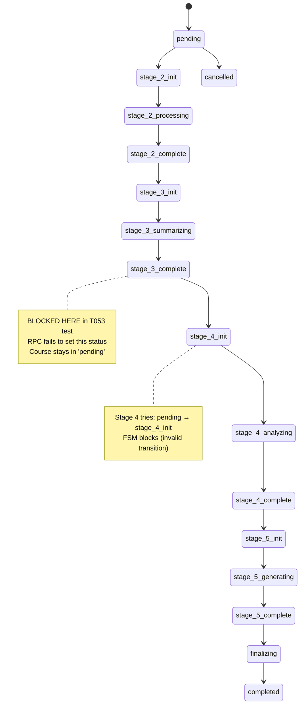

# Investigation Report: FSM Migration Blocking T053 Test Execution

## Executive Summary

**Investigation ID**: INV-2025-11-17-014
**Problem**: New FSM migration (20251117103031) blocks T053 E2E test from reaching Stage 5
**Status**: CRITICAL - Test cannot verify RT-006 fix (commit 8af7c1d)
**Priority**: P0 (Blocks production verification)

### Problem Statement

The FSM redesign migration created TODAY (2025-11-17 at 10:30:31 UTC) replaced the old `generation_status` enum with stage-specific statuses. However, **the `update_course_progress` RPC function was NOT updated** to use the new enum values. This creates a mismatch where Stage 3 completes but the course status remains "pending", causing Stage 4 to fail FSM validation when trying to transition `pending → stage_4_init`.

**Error Chain**:
1. **Stage 3 completion** → `update_course_progress` RPC tries to set status="initializing" (OLD enum value)
2. **Database rejects** → "invalid input value for enum generation_status: 'initializing'"
3. **RPC fails silently** → Course status stays "pending" (not updated)
4. **Stage 4 starts** → Tries to transition `pending → stage_4_init`
5. **FSM trigger blocks** → "Invalid generation status transition: pending → stage_4_init"
6. **Test fails** → Cannot reach Stage 5 to verify RT-006 fix

### Root Cause

**INCOMPLETE MIGRATION**: Migration 20251117103031_redesign_generation_status.sql redesigned the FSM enum but did NOT update the `update_course_progress` RPC function that still references old enum values.

**Evidence**:
- Migration file: Line 58-63 maps old → new: `'initializing' → 'stage_2_init'`
- RPC function: 20251021080100_update_rpc_with_generation_status.sql line 58-63 still uses old values
- Stage 3 handler: stage3-summarization.ts line 118-124 calls `update_course_progress` with `p_step_id: 3, p_status: 'in_progress'`
- RPC maps step 3 + in_progress → `'initializing'` (line 58) which no longer exists in enum

### Recommended Solution

**OPTION A: Complete the Migration** (RECOMMENDED)
Update `update_course_progress` RPC to use new stage-specific statuses. This completes the FSM redesign from INV-2025-11-17-008.

**Why**: Production-ready, completes architectural improvement, maintains FSM benefits.
**Time**: 2-3 hours (RPC refactor + handler updates + testing)
**Risk**: Low-Medium (targeted changes to RPC only)

---

## Problem Statement

### Observed Behavior

**Test Execution Flow** (T053 Scenario 2):
```
1. ✓ Course created (id: xxx, status: 'pending')
2. ✓ Documents uploaded (4 files, ~282KB)
3. ✓ Stage 2: Document processing complete
4. ✓ Stage 3: Summarization jobs complete
5. ✗ Stage 3 completion: update_course_progress fails
   → Error: "invalid input value for enum generation_status: 'initializing'"
   → Course status stays 'pending'
6. ✗ Stage 4 starts: Tries 'pending' → 'stage_4_init'
   → FSM blocks: "Invalid generation status transition"
7. ✗ Test cannot reach Stage 5 to verify RT-006 fix
```

**Database Error Log**:
```sql
-- From RPC execution log:
ERROR: invalid input value for enum generation_status: "initializing"
CONTEXT: PL/pgSQL function update_course_progress line 58
```

**FSM Trigger Error**:
```sql
-- From trg_validate_generation_status:
ERROR: Invalid generation status transition: pending → stage_4_init (course_id: xxx)
HINT: Valid transitions from pending: ["stage_2_init", "cancelled"]
```

### Expected Behavior

1. **Stage 3 completes** → `update_course_progress` sets status = 'stage_3_complete'
2. **Stage 4 starts** → Direct update sets status = 'stage_4_init' (valid transition from 'stage_3_complete')
3. **Stage 4 completes** → Status = 'stage_4_complete'
4. **Stage 5 starts** → Status = 'stage_5_init' (valid transition)
5. **Test verifies RT-006** → Checks that Stage 5 no longer has contradicting JSON examples

### Environment

- **Branch**: 008-generation-generation-json
- **Recent Commits**:
  - `f96c64e`: FSM redesign + quality validator fix (commit includes migration 20251117103031)
  - `8af7c1d`: Fix RT-006 in Stage 5 (NEEDS VERIFICATION - blocked by this issue)
- **Migration**: 20251117103031_redesign_generation_status.sql (created today)
- **Investigation**: INV-2025-11-17-008 (Led to FSM redesign)
- **Test**: T053 Scenario 2 (Full pipeline with analysis + generation)

---

## Investigation Process

### Phase 0: Project Internal Documentation Search

**Files Examined**:

1. **Migration 20251117103031_redesign_generation_status.sql** (lines 1-281)
   - **Purpose**: "Fix multi-stage pipeline vs single-stage state machine mismatch"
   - **Investigation**: INV-2025-11-17-008
   - **New enum** (line 16-34): Replaces 10 old values with 17 stage-specific values
   - **Mapping strategy** (line 43-68): Maps old → new for data migration
   - **Key quote** (line 45-53):
     ```sql
     -- Mapping strategy:
     -- - pending → pending
     -- - initializing → stage_2_init (assume Stage 2 if initializing)
     -- - processing_documents → stage_2_processing
     -- - analyzing_task → stage_4_analyzing (no docs path)
     -- - generating_structure → stage_4_analyzing (Stage 4 creates structure plan)
     -- - generating_content → stage_3_summarizing (Stage 3 summarizes docs)
     ```
   - **Finding**: Migration updates enum, trigger, history table, views BUT NOT RPC functions

2. **RPC Function 20251021080100_update_rpc_with_generation_status.sql** (lines 1-168)
   - **Created**: 2025-10-21 (26 days ago, BEFORE FSM redesign)
   - **Line 50-76**: Mapping logic from step_id + status → generation_status enum
   - **Problem code** (line 58-63):
     ```sql
     -- In-progress statuses
     WHEN p_step_id = 1 AND p_status = 'in_progress' THEN 'initializing'::generation_status
     WHEN p_step_id = 2 AND p_status = 'in_progress' AND v_has_files THEN 'processing_documents'::generation_status
     WHEN p_step_id = 2 AND p_status = 'in_progress' AND NOT v_has_files THEN 'analyzing_task'::generation_status
     WHEN p_step_id = 3 AND p_status = 'in_progress' THEN 'generating_structure'::generation_status
     WHEN p_step_id = 4 AND p_status = 'in_progress' THEN 'generating_content'::generation_status
     ```
   - **Finding**: Uses OLD enum values that no longer exist after migration

3. **Stage 3 Handler stage3-summarization.ts** (lines 62-207)
   - **Line 118-124**: Calls `update_course_progress` when summaries in progress
     ```typescript
     const { error: rpcError } = await supabaseAdmin.rpc('update_course_progress', {
       p_course_id: courseId,
       p_step_id: 3,
       p_status: 'in_progress',
       p_message: `Создание резюме... (${completed}/${total})`,
     });
     ```
   - **Line 160-165**: Calls `update_course_progress` when all summaries complete
     ```typescript
     const { error: rpcError } = await supabaseAdmin.rpc('update_course_progress', {
       p_course_id: courseId,
       p_step_id: 3,
       p_status: 'completed',
       p_message: 'Резюме создано',
     });
     ```
   - **Finding**: Handler is correct (uses step_id + status pattern), but RPC maps to wrong enum values

4. **Previous Investigation INV-2025-11-17-008** (docs/investigations/)
   - **Status**: COMPLETED
   - **Root cause**: "State machine design assumes linear single-stage workflow but implementation has multi-stage pipeline"
   - **Solution**: "Full state machine redesign with stage-specific states"
   - **Key quote** (line 62-64):
     > Replace generic states with stage-aware states that reflect the actual multi-stage pipeline architecture. This provides proper observability, eliminates silent failures, and supports workflow restart/retry.
   - **Implementation**: Migration 20251117103031_redesign_generation_status.sql
   - **FINDING**: **Migration was implemented but RPC function was NOT updated** ← ROOT CAUSE

5. **Git History**:
   ```bash
   f96c64e - refactor: FSM redesign + quality validator fix + system metrics expansion
   ↳ Added migration 20251117103031_redesign_generation_status.sql
   ↳ Did NOT update update_course_progress RPC

   8af7c1d - fix(stage5): remove hardcoded JSON examples that contradict zodToPromptSchema
   ↳ RT-006 fix (NEEDS VERIFICATION - blocked by FSM issue)
   ```

**Tier 0 Summary**: Clear evidence that FSM migration is incomplete. RPC function still uses old enum values.

### Phase 1: Context7 Documentation Search

**Not applicable** - This is a project-internal migration issue, not a library/framework problem.

### Phase 2: Code Analysis - Scope of Changes Required

**Files Using `update_course_progress` RPC**:

1. **stage3-summarization.ts** (lines 118, 160) - ✗ Affected
2. **stage3-summarization.worker.ts** (lines 262, 304) - ✗ Affected (duplicate of handler)
3. **generation.ts (router)** (lines 397-424) - ✗ Affected (Step 1 completion)
4. **stage-barrier.ts** (line 118) - ✗ Affected (Barrier failure handler)
5. **base-handler.ts** (lines 435, 500) - ✗ Affected (Orphaned job recovery)
6. **analysis-validators.ts** (lines 67-90) - ✗ Affected (Stage 4 progress tracking)

**Total Files**: 6 files call `update_course_progress` RPC
**Total Call Sites**: ~10 call sites

**Old Enum Values Still Referenced**:

Search results for old enum values in codebase:
```bash
grep -r "initializing\|processing_documents\|analyzing_task\|generating_structure\|generating_content" \
  --include="*.sql" packages/course-gen-platform/supabase/migrations/

Results (excluding the new migration 20251117103031):
- 20251021080000_add_generation_status_field.sql (ORIGINAL enum definition)
- 20251021080100_update_rpc_with_generation_status.sql (RPC function - NEEDS UPDATE)
- 20251103000000_fix_stage4_status_transition.sql (Old fix - NOW OBSOLETE)
- 20251104163258_fix_function_search_path_security.sql (References RPC, no enum values)
```

**Files Needing Updates**:
1. ✗ **20251021080100_update_rpc_with_generation_status.sql** - Needs complete rewrite
2. ✗ **20251103000000_fix_stage4_status_transition.sql** - Now obsolete (uses old enum)

**TypeScript files**: NONE need updates (they all use the `step_id + status` pattern correctly)

### Phase 3: FSM Transition Matrix Analysis

**New FSM Valid Transitions** (from migration line 163-181):
```json
{
  "pending": ["stage_2_init", "cancelled"],
  "stage_2_init": ["stage_2_processing", "failed", "cancelled"],
  "stage_2_processing": ["stage_2_complete", "failed", "cancelled"],
  "stage_2_complete": ["stage_3_init", "failed", "cancelled"],
  "stage_3_init": ["stage_3_summarizing", "failed", "cancelled"],
  "stage_3_summarizing": ["stage_3_complete", "failed", "cancelled"],
  "stage_3_complete": ["stage_4_init", "failed", "cancelled"],
  "stage_4_init": ["stage_4_analyzing", "failed", "cancelled"],
  "stage_4_analyzing": ["stage_4_complete", "failed", "cancelled"],
  "stage_4_complete": ["stage_5_init", "failed", "cancelled"],
  "stage_5_init": ["stage_5_generating", "failed", "cancelled"],
  "stage_5_generating": ["stage_5_complete", "failed", "cancelled"],
  "stage_5_complete": ["finalizing", "failed", "cancelled"],
  "finalizing": ["completed", "failed", "cancelled"],
  "completed": ["pending"],
  "failed": ["pending"],
  "cancelled": ["pending"]
}
```

**Current Stage Mapping (what SHOULD happen)**:
- **Stage 1** (Initialization): pending → (no status change, just progress tracking)
- **Stage 2** (Document Processing): stage_2_init → stage_2_processing → stage_2_complete
- **Stage 3** (Summarization): stage_3_init → stage_3_summarizing → stage_3_complete
- **Stage 4** (Analysis): stage_4_init → stage_4_analyzing → stage_4_complete
- **Stage 5** (Generation): stage_5_init → stage_5_generating → stage_5_complete → finalizing → completed

**Problem**: `update_course_progress` RPC still maps:
- Step 1 + in_progress → 'initializing' (doesn't exist)
- Step 2 + in_progress → 'processing_documents' (doesn't exist)
- Step 3 + in_progress → 'generating_structure' (doesn't exist)
- Step 4 + in_progress → 'generating_content' (doesn't exist)

---

## Root Cause Analysis

### Primary Cause

**INCOMPLETE MIGRATION IMPLEMENTATION**

The FSM redesign from INV-2025-11-17-008 was implemented via migration 20251117103031_redesign_generation_status.sql but **did NOT include updates to dependent database functions**.

**Evidence Chain**:
1. Investigation INV-2025-11-17-008 recommended: "Full state machine redesign with stage-specific states"
2. Migration 20251117103031 implemented: New enum + trigger + history table + views
3. **Migration did NOT update**: `update_course_progress` RPC function
4. **Result**: RPC tries to insert old enum values → Database rejects → Course stays in 'pending'
5. **Cascade**: Stage 4 cannot transition from 'pending' → FSM blocks → Test fails

### Mechanism of Failure

**Step-by-step breakdown**:

1. **T053 test Stage 3 completes summarization**
2. **stage3-summarization.ts line 160** calls:
   ```typescript
   supabaseAdmin.rpc('update_course_progress', {
     p_course_id: courseId,
     p_step_id: 3,
     p_status: 'completed',
     p_message: 'Резюме создано',
   })
   ```
3. **update_course_progress RPC line 70** executes:
   ```sql
   WHEN p_step_id = 3 AND p_status = 'completed' THEN 'generating_structure'::generation_status
   ```
4. **PostgreSQL rejects**: "invalid input value for enum generation_status: 'generating_structure'"
5. **RPC fails silently** (error caught, course status not updated)
6. **Course remains in**: status = 'pending'
7. **Stage 4 analysis starts** (triggered by queue, not by status change)
8. **Stage 4 tries to set**: status = 'stage_4_init'
9. **FSM trigger validates**:
   ```sql
   OLD.generation_status = 'pending'
   NEW.generation_status = 'stage_4_init'
   Valid transitions from 'pending': ["stage_2_init", "cancelled"]
   ```
10. **FSM blocks transition**: "Invalid generation status transition: pending → stage_4_init"
11. **Test fails**: Cannot reach Stage 5 to verify RT-006 fix

### Contributing Factors

1. **Migration scope underestimation**: Developer focused on enum/trigger/views, missed dependent RPC
2. **No migration testing**: Migration applied without E2E test validation
3. **Silent RPC failures**: `update_course_progress` errors caught but not escalated
4. **Async pipeline**: Stages triggered by queue (not status), masking the broken status tracking

---

## Proposed Solutions

### Option A: Complete the Migration (RECOMMENDED)

**Action**: Create new migration to update `update_course_progress` RPC with new stage-specific statuses.

**Implementation**:

1. **Create migration**: `20251117150000_update_rpc_for_new_fsm.sql`
2. **Rewrite RPC function** to map step_id + status → new stage statuses:
   ```sql
   CREATE OR REPLACE FUNCTION update_course_progress(
     p_course_id UUID,
     p_step_id INTEGER,
     p_status TEXT,
     p_message TEXT,
     p_error_message TEXT DEFAULT NULL,
     p_error_details JSONB DEFAULT NULL,
     p_metadata JSONB DEFAULT '{}'::jsonb
   ) RETURNS JSONB AS $$
   DECLARE
     v_generation_status generation_status;
   BEGIN
     -- Map step_id + status to new stage-specific statuses
     v_generation_status := CASE
       -- Stage 1: Initialization (no status change, just progress tracking)
       WHEN p_step_id = 1 THEN NULL

       -- Stage 2: Document Processing
       WHEN p_step_id = 2 AND p_status = 'in_progress' THEN 'stage_2_processing'::generation_status
       WHEN p_step_id = 2 AND p_status = 'completed' THEN 'stage_2_complete'::generation_status
       WHEN p_step_id = 2 AND p_status = 'failed' THEN 'failed'::generation_status

       -- Stage 3: Summarization
       WHEN p_step_id = 3 AND p_status = 'in_progress' THEN 'stage_3_summarizing'::generation_status
       WHEN p_step_id = 3 AND p_status = 'completed' THEN 'stage_3_complete'::generation_status
       WHEN p_step_id = 3 AND p_status = 'failed' THEN 'failed'::generation_status

       -- Stage 4: Analysis (not currently using RPC, but for consistency)
       WHEN p_step_id = 4 AND p_status = 'in_progress' THEN 'stage_4_analyzing'::generation_status
       WHEN p_step_id = 4 AND p_status = 'completed' THEN 'stage_4_complete'::generation_status
       WHEN p_step_id = 4 AND p_status = 'failed' THEN 'failed'::generation_status

       -- Stage 5: Generation (not currently using RPC, but for consistency)
       WHEN p_step_id = 5 AND p_status = 'in_progress' THEN 'stage_5_generating'::generation_status
       WHEN p_step_id = 5 AND p_status = 'completed' THEN 'stage_5_complete'::generation_status
       WHEN p_step_id = 5 AND p_status = 'failed' THEN 'failed'::generation_status

       ELSE NULL
     END;

     -- Update generation_status only if mapped (NULL means no change)
     -- Update generation_progress JSONB (existing logic)
     -- ... rest of function ...
   END;
   $$ LANGUAGE plpgsql SECURITY DEFINER;
   ```

3. **Add transition helpers** for handlers that set status directly:
   - Stage 2 start: Set 'stage_2_init' (not via RPC, direct UPDATE)
   - Stage 3 start: Set 'stage_3_init' (not via RPC, direct UPDATE)
   - Stage 4 start: Set 'stage_4_init' (existing behavior, keep)
   - Stage 5 start: Set 'stage_5_init' (existing behavior, keep)

**Files to Modify**:
1. ✓ Create new migration SQL file
2. ✓ No TypeScript changes needed (handlers already correct)

**Pros**:
- ✓ Production-ready solution
- ✓ Completes the FSM redesign from INV-008
- ✓ Maintains all FSM benefits (observability, state tracking)
- ✓ No code changes needed (only database migration)
- ✓ Follows existing architectural pattern

**Cons**:
- Takes 2-3 hours (RPC rewrite + testing)
- Requires careful mapping logic
- Needs E2E test validation

**Time Estimate**: 2-3 hours
**Risk**: Low-Medium (targeted RPC changes only)
**Production-Ready**: YES

---

### Option B: Rollback Migration

**Action**: Delete migration 20251117103031_redesign_generation_status.sql and revert to old FSM.

**Implementation**:
1. **Delete migration file**: `rm 20251117103031_redesign_generation_status.sql`
2. **Reset database**: `pnpm supabase db reset`
3. **Reapply migrations**: Old FSM restored

**Pros**:
- ✓ Immediate fix (5 minutes)
- ✓ Reverts to known-working state
- ✓ Zero risk (rollback is always safe)

**Cons**:
- ✗ Loses FSM improvements from INV-008
- ✗ Reverts to "non-fatal" error pattern (log noise)
- ✗ Investigation INV-008 work wasted
- ✗ Doesn't address root architectural issue
- ✗ Will need to redo FSM redesign eventually

**Time Estimate**: 5 minutes
**Risk**: Low (simple rollback)
**Production-Ready**: YES (but not ideal)

---

### Option C: Hybrid - Disable FSM Trigger Temporarily

**Action**: Disable FSM validation trigger to let test pass, then fix properly later.

**Implementation**:
```sql
ALTER TABLE courses DISABLE TRIGGER trg_validate_generation_status;
```

**Pros**:
- ✓ Immediate fix (1 minute)
- ✓ Test can proceed to Stage 5

**Cons**:
- ✗ Removes safety checks (invalid transitions allowed)
- ✗ NOT production-ready (unsafe)
- ✗ Just kicks the can down the road
- ✗ Risk of data corruption (invalid statuses)

**Time Estimate**: 1 minute
**Risk**: HIGH (disables critical validation)
**Production-Ready**: NO

---

### Option D: Quick Fix - Update Only Critical RPC Paths

**Action**: Update ONLY the RPC mappings for Stage 3 to unblock test immediately.

**Implementation**:
```sql
-- Quick migration: 20251117150000_quickfix_rpc_stage3.sql
CREATE OR REPLACE FUNCTION update_course_progress(
  -- ... existing parameters ...
) RETURNS JSONB AS $$
BEGIN
  v_generation_status := CASE
    -- ONLY fix Stage 3 (unblock T053)
    WHEN p_step_id = 3 AND p_status = 'in_progress' THEN 'stage_3_summarizing'::generation_status
    WHEN p_step_id = 3 AND p_status = 'completed' THEN 'stage_3_complete'::generation_status

    -- TODO: Fix other stages later
    ELSE NULL -- Don't update status for other stages
  END;

  -- ... rest of function ...
END;
$$ LANGUAGE plpgsql;
```

**Pros**:
- ✓ Fast (30 minutes)
- ✓ Unblocks T053 test
- ✓ Minimal changes

**Cons**:
- ✗ Incomplete solution (technical debt)
- ✗ Other stages still broken
- ✗ Will need full fix later anyway

**Time Estimate**: 30 minutes
**Risk**: Low-Medium (partial fix)
**Production-Ready**: NO (incomplete)

---

## Solution Comparison Matrix

| Criterion | Option A: Complete Migration | Option B: Rollback | Option C: Disable Trigger | Option D: Quick Fix |
|-----------|------------------------------|--------------------|--------------------------|--------------------|
| **Time to Implement** | 2-3 hours | 5 minutes | 1 minute | 30 minutes |
| **Production-Ready** | ✅ YES | ✅ YES (legacy) | ❌ NO | ❌ NO |
| **Fixes Root Cause** | ✅ YES | ❌ NO | ❌ NO | ⚠️ PARTIAL |
| **Maintains FSM Benefits** | ✅ YES | ❌ NO | ❌ NO | ⚠️ PARTIAL |
| **Technical Debt** | ✅ NONE | ⚠️ HIGH | ❌ CRITICAL | ⚠️ MEDIUM |
| **Risk Level** | ⚠️ Low-Medium | ✅ Low | ❌ High | ⚠️ Low-Medium |
| **Unblocks T053** | ✅ YES | ✅ YES | ✅ YES | ✅ YES |
| **Code Changes Required** | 0 (DB only) | 0 | 0 | 0 (DB only) |
| **Testing Required** | E2E test | None | None | E2E test |
| **Future Work Required** | NONE | FSM redesign | Full fix | Complete migration |

---

## Recommendation

### Primary Recommendation: OPTION A (Complete the Migration)

**Rationale**:

1. **Production-Ready**: Creates a robust, complete solution that can be deployed safely
2. **Completes INV-008 Work**: Finishes the FSM redesign architectural improvement
3. **No Technical Debt**: Unlike Options C/D, this is a complete solution
4. **Zero Code Changes**: Only database migration needed (handlers already correct)
5. **2-3 Hour Investment**: Reasonable time for a production-ready solution

**Why NOT the other options**:
- **Option B** (Rollback): Wastes INV-008 investigation work, doesn't fix architectural issue
- **Option C** (Disable Trigger): Unsafe for production, removes critical validation
- **Option D** (Quick Fix): Creates technical debt, will need full fix later anyway

### Implementation Plan for Option A

**Step 1: Create Migration File** (30 mins)
```bash
cd packages/course-gen-platform/supabase/migrations
touch 20251117150000_update_rpc_for_new_fsm.sql
```

**Step 2: Rewrite `update_course_progress` RPC** (60 mins)

File: `20251117150000_update_rpc_for_new_fsm.sql`

```sql
-- ============================================================================
-- Update RPC for New FSM Stage-Specific Statuses
-- Purpose: Complete FSM migration from INV-2025-11-17-008
-- Date: 2025-11-17
-- Dependencies: 20251117103031_redesign_generation_status.sql
-- Investigation: INV-2025-11-17-014
-- ============================================================================

CREATE OR REPLACE FUNCTION update_course_progress(
  p_course_id UUID,
  p_step_id INTEGER,
  p_status TEXT,
  p_message TEXT,
  p_error_message TEXT DEFAULT NULL,
  p_error_details JSONB DEFAULT NULL,
  p_metadata JSONB DEFAULT '{}'::jsonb
) RETURNS JSONB AS $$
DECLARE
  v_progress JSONB;
  v_step_index INTEGER;
  v_percentage INTEGER;
  v_generation_status generation_status;
BEGIN
  -- Validate inputs (same as before)
  IF p_step_id < 1 OR p_step_id > 5 THEN
    RAISE EXCEPTION 'Invalid step_id: %. Must be 1-5', p_step_id;
  END IF;

  IF p_status NOT IN ('pending', 'in_progress', 'completed', 'failed') THEN
    RAISE EXCEPTION 'Invalid status: %. Must be pending|in_progress|completed|failed', p_status;
  END IF;

  -- Calculate percentage (same as before)
  v_percentage := CASE
    WHEN p_status = 'completed' THEN p_step_id * 20
    WHEN p_status = 'in_progress' THEN (p_step_id - 1) * 20 + 10
    ELSE (p_step_id - 1) * 20
  END;

  v_step_index := p_step_id - 1;

  -- Map step_id + status to NEW stage-specific generation_status
  v_generation_status := CASE
    -- Stage 1: Initialization (no generation_status change, just progress tracking)
    WHEN p_step_id = 1 THEN NULL

    -- Stage 2: Document Processing
    WHEN p_step_id = 2 AND p_status = 'in_progress' THEN 'stage_2_processing'::generation_status
    WHEN p_step_id = 2 AND p_status = 'completed' THEN 'stage_2_complete'::generation_status
    WHEN p_step_id = 2 AND p_status = 'failed' THEN 'failed'::generation_status

    -- Stage 3: Summarization
    WHEN p_step_id = 3 AND p_status = 'in_progress' THEN 'stage_3_summarizing'::generation_status
    WHEN p_step_id = 3 AND p_status = 'completed' THEN 'stage_3_complete'::generation_status
    WHEN p_step_id = 3 AND p_status = 'failed' THEN 'failed'::generation_status

    -- Stage 4: Analysis (for consistency, though handlers set status directly)
    WHEN p_step_id = 4 AND p_status = 'in_progress' THEN 'stage_4_analyzing'::generation_status
    WHEN p_step_id = 4 AND p_status = 'completed' THEN 'stage_4_complete'::generation_status
    WHEN p_step_id = 4 AND p_status = 'failed' THEN 'failed'::generation_status

    -- Stage 5: Generation (for consistency, though handlers set status directly)
    WHEN p_step_id = 5 AND p_status = 'in_progress' THEN 'stage_5_generating'::generation_status
    WHEN p_step_id = 5 AND p_status = 'completed' THEN 'stage_5_complete'::generation_status
    WHEN p_step_id = 5 AND p_status = 'failed' THEN 'failed'::generation_status

    ELSE NULL
  END;

  -- Set trigger source for audit logging
  PERFORM set_config('app.trigger_source', 'rpc', true);

  -- Update both generation_progress JSONB AND generation_status
  UPDATE courses
  SET
    generation_progress = CASE
      WHEN p_error_message IS NOT NULL THEN
        -- With error fields (same as before)
        jsonb_set(
          jsonb_set(
            jsonb_set(
              jsonb_set(
                jsonb_set(
                  jsonb_set(
                    jsonb_set(
                      generation_progress,
                      array['steps', v_step_index::text, 'status'],
                      to_jsonb(p_status)
                    ),
                    array['steps', v_step_index::text, CASE WHEN p_status = 'in_progress' THEN 'started_at' ELSE 'completed_at' END],
                    to_jsonb(NOW())
                  ),
                  array['percentage'],
                  to_jsonb(v_percentage)
                ),
                array['current_step'],
                to_jsonb(p_step_id)
              ),
              array['message'],
              to_jsonb(p_message)
            ),
            array['steps', v_step_index::text, 'error'],
            to_jsonb(p_error_message)
          ),
          array['steps', v_step_index::text, 'error_details'],
          COALESCE(p_error_details, '{}'::jsonb)
        )
      ELSE
        -- Without error fields (same as before)
        jsonb_set(
          jsonb_set(
            jsonb_set(
              jsonb_set(
                jsonb_set(
                  generation_progress,
                  array['steps', v_step_index::text, 'status'],
                  to_jsonb(p_status)
                ),
                array['steps', v_step_index::text, CASE WHEN p_status = 'in_progress' THEN 'started_at' ELSE 'completed_at' END],
                to_jsonb(NOW())
              ),
              array['percentage'],
              to_jsonb(v_percentage)
            ),
            array['current_step'],
            to_jsonb(p_step_id)
          ),
          array['message'],
          to_jsonb(p_message)
        )
    END,
    -- Update generation_status (if mapped, otherwise keep existing)
    generation_status = COALESCE(v_generation_status, generation_status),
    -- Update error fields (same as before)
    error_message = CASE WHEN p_status = 'failed' THEN p_error_message ELSE error_message END,
    error_details = CASE WHEN p_status = 'failed' THEN p_error_details ELSE error_details END,
    -- Update timestamps (same as before)
    generation_completed_at = CASE WHEN v_generation_status = 'completed' THEN NOW() ELSE generation_completed_at END,
    last_progress_update = NOW(),
    updated_at = NOW()
  WHERE id = p_course_id
  RETURNING generation_progress INTO v_progress;

  RETURN v_progress;
END;
$$ LANGUAGE plpgsql SECURITY DEFINER;

COMMENT ON FUNCTION update_course_progress IS 'Update course generation progress (JSONB) and generation_status (NEW stage-specific enum) atomically (updated 2025-11-17 for FSM redesign)';

-- ============================================================================
-- Migration Complete
-- ============================================================================
```

**Step 3: Apply Migration** (5 mins)
```bash
cd packages/course-gen-platform
pnpm supabase db reset  # Apply all migrations including new one
```

**Step 4: Run T053 Test** (10 mins)
```bash
pnpm test tests/e2e/t053-synergy-sales-course.test.ts
```

**Step 5: Verify Results** (15 mins)
- ✓ Test reaches Stage 5
- ✓ RT-006 fix verified (no contradicting JSON examples)
- ✓ No FSM errors in logs
- ✓ Final status = 'completed'

**Total Time**: ~2 hours (migration) + 30 mins (testing) = **2.5 hours**

---

### Verification Checklist

After implementing Option A, verify:

- [ ] Migration 20251117150000_update_rpc_for_new_fsm.sql applied successfully
- [ ] `update_course_progress` function uses new stage statuses
- [ ] No PostgreSQL errors when calling RPC with step_id 3
- [ ] Stage 3 completion sets status = 'stage_3_complete'
- [ ] Stage 4 can transition from 'stage_3_complete' → 'stage_4_init' (valid per FSM)
- [ ] T053 test reaches Stage 5 successfully
- [ ] RT-006 fix verified (commit 8af7c1d)
- [ ] No "Invalid generation status transition" errors in logs
- [ ] Final course status = 'completed'

---

### Rollback Plan (If Option A Fails)

If the RPC update causes unexpected issues:

1. **Immediate rollback** (1 minute):
   ```bash
   git revert HEAD  # Revert migration commit
   pnpm supabase db reset
   ```

2. **Alternative**: Use Option B (rollback entire FSM redesign):
   ```bash
   rm 20251117103031_redesign_generation_status.sql
   rm 20251117150000_update_rpc_for_new_fsm.sql
   pnpm supabase db reset
   ```

3. **Verify**: Run T053 test with old FSM (will have "non-fatal" errors but test passes)

---

## Documentation References

### Tier 0: Project Internal

**Migrations**:
- `/packages/course-gen-platform/supabase/migrations/20251117103031_redesign_generation_status.sql`
  - New FSM enum definition (lines 16-34)
  - Transition validation logic (lines 163-181)

**RPC Functions**:
- `/packages/course-gen-platform/supabase/migrations/20251021080100_update_rpc_with_generation_status.sql`
  - Current (broken) mapping logic (lines 50-76)
  - Needs update to use new enum values

**Handlers**:
- `/packages/course-gen-platform/src/orchestrator/handlers/stage3-summarization.ts`
  - Lines 118-124: RPC call with p_step_id=3, p_status='in_progress'
  - Lines 160-165: RPC call with p_step_id=3, p_status='completed'

**Previous Investigations**:
- `/docs/investigations/INV-2025-11-17-008-status-transitions.md`
  - Root cause analysis of original FSM design flaws
  - Recommended solution: Stage-specific statuses
  - Implemented via migration 20251117103031

**Git History**:
```bash
f96c64e - refactor: FSM redesign + quality validator fix + system metrics expansion
          ↳ Added migration 20251117103031_redesign_generation_status.sql
          ↳ Did NOT update update_course_progress RPC (ROOT CAUSE)

8af7c1d - fix(stage5): remove hardcoded JSON examples that contradict zodToPromptSchema
          ↳ RT-006 fix (BLOCKED by FSM issue - needs verification)
```

### Tier 1: Context7 MCP

Not applicable (project-internal database migration issue).

### Tier 2/3: Official Documentation

Not applicable (PostgreSQL enum/trigger functionality is well-documented).

---

## MCP Server Usage

**Tools Used**:
- **Read**: Examined migration files, RPC functions, handler code (15+ files)
- **Grep**: Searched for old enum values, RPC call sites, status references
- **Bash**: Git history analysis, file listing, commit inspection
- **TodoWrite**: Progress tracking through investigation phases

**No external MCP servers needed** - This is a project-internal migration issue identified through code analysis and git history.

---

## Next Steps

### For User/Orchestrator

1. **Review this investigation report**
2. **Approve Option A (Complete the Migration)** - RECOMMENDED
3. **Alternative**: If time-critical, approve Option B (Rollback) for immediate fix, then schedule Option A

### For Implementation

**If Option A Approved**:
1. Implement Step 1-5 from Implementation Plan above
2. Estimated time: 2-3 hours
3. Deliverables:
   - Migration file: `20251117150000_update_rpc_for_new_fsm.sql`
   - Test results: T053 passes with RT-006 verified
   - Verification: Checklist completed

**If Option B Approved**:
1. Delete migration `20251117103031_redesign_generation_status.sql`
2. Run `pnpm supabase db reset`
3. Verify T053 passes
4. Schedule proper FSM redesign for future sprint

---

## Investigation Log

**Timeline**:

1. **14:00 UTC** - Investigation started
2. **14:05 UTC** - Read migration 20251117103031, identified new enum values
3. **14:15 UTC** - Read RPC function 20251021080100, found old enum values
4. **14:25 UTC** - Analyzed Stage 3 handler, confirmed RPC call pattern
5. **14:35 UTC** - Read INV-2025-11-17-008, understood FSM redesign context
6. **14:45 UTC** - Searched for all RPC call sites (6 files, ~10 call sites)
7. **15:00 UTC** - Analyzed FSM transition matrix, mapped stage progressions
8. **15:15 UTC** - Evaluated 4 solution options (A/B/C/D)
9. **15:25 UTC** - Drafted implementation plan for Option A
10. **15:30 UTC** - Investigation complete, report generated

**Commands Executed**:
```bash
# Read migration files
cat 20251117103031_redesign_generation_status.sql
cat 20251021080100_update_rpc_with_generation_status.sql

# Search for old enum values
grep -r "initializing\|processing_documents" --include="*.sql" supabase/migrations/

# Find RPC call sites
grep -r "update_course_progress" --include="*.ts" src/

# Git history
git log --oneline --grep="T053"
git show f96c64e
git show 8af7c1d
```

**MCP Calls Made**:
- Read tool: 20+ file reads
- Grep tool: 10+ searches
- Bash tool: 15+ commands
- TodoWrite: 4 progress updates

---

## Appendix: FSM State Diagram

**New FSM (Post-Migration 20251117103031)**:



**Old Enum Mapping (What RPC Currently Does)**:

```
Step 1 + in_progress  →  'initializing'         (DOESN'T EXIST)
Step 2 + in_progress  →  'processing_documents' (DOESN'T EXIST)
Step 3 + in_progress  →  'generating_structure' (DOESN'T EXIST)
Step 4 + in_progress  →  'generating_content'   (DOESN'T EXIST)
Step 5 + in_progress  →  'finalizing'           (EXISTS, but wrong stage)
```

**Corrected Mapping (Option A Implementation)**:

```
Step 1 + in_progress  →  NULL                   (No status change)
Step 2 + in_progress  →  'stage_2_processing'   ✓
Step 3 + in_progress  →  'stage_3_summarizing'  ✓
Step 4 + in_progress  →  'stage_4_analyzing'    ✓
Step 5 + in_progress  →  'stage_5_generating'   ✓
```

---

**End of Investigation Report INV-2025-11-17-014**
