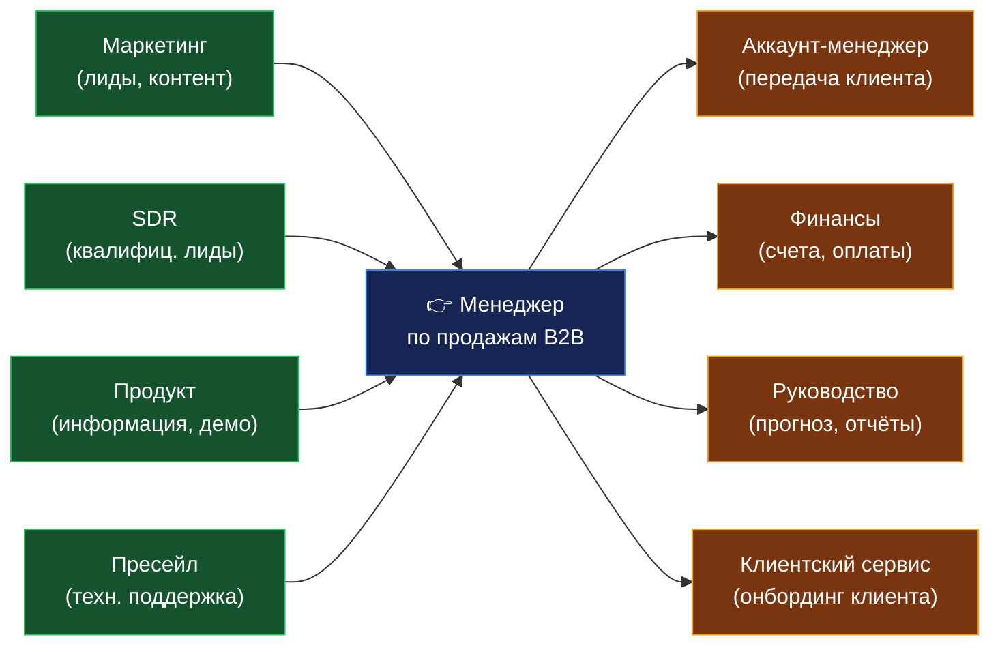
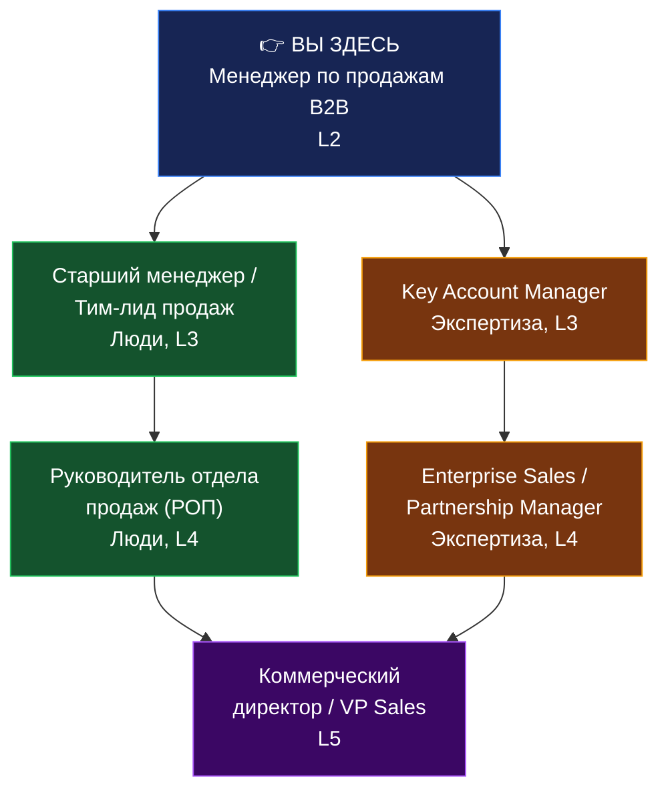
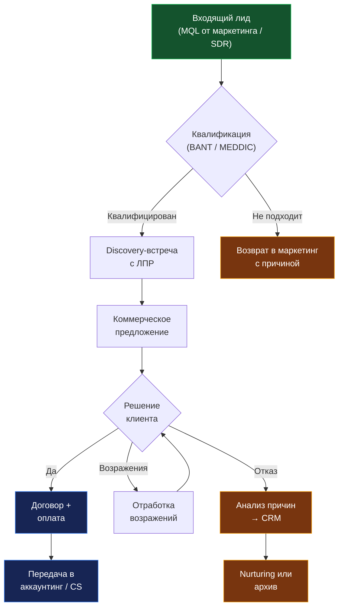

# Менеджер по продажам B2B: операционный playbook

> Человек, который приносит деньги в компанию — находит корпоративных клиентов, проводит сделки через все этапы воронки и превращает pipeline в выручку.

---

**Отдел:** Продажи
**Подчинение:** Руководитель отдела продаж (РОП) / Коммерческий директор
**Подчинённые:** Нет (линейная роль)
**Уровень:** Middle
**Специализация:** B2B (корпоративные продажи)
**North Star Metric:** Объём квалифицированного pipeline (>=3x от месячного плана продаж)

---

## 1. Миссия и ключевые результаты

**Миссия:** Генерировать прогнозируемую выручку для компании через системное привлечение и закрытие корпоративных клиентов. Эта роль — прямой мост между продуктом и деньгами: без неё лиды остаются необработанными, а конкуренты забирают клиентов, которые могли стать вашими.

**Ключевые результаты (в порядке приоритета):**

| #   | Результат                                         | Измерение                                        | Срок          |
| --- | ------------------------------------------------- | ------------------------------------------------ | ------------- |
| 1   | Pipeline всегда >= 3x от плана                    | Объём квалифицированных возможностей в CRM       | Еженедельно   |
| 2   | Выполнение плана продаж >= 100%                   | Закрытая выручка / план                          | Ежемесячно    |
| 3   | Конверсия из SQL в сделку >= 20%                  | Закрытые сделки / квалифицированные лиды         | Ежемесячно    |
| 4   | Средний цикл сделки сокращается на 10% за квартал | Дни от первого контакта до оплаты                | Ежеквартально |
| 5   | Retention клиентов первого года >= 80%            | Клиенты с повторной покупкой / все новые клиенты | Ежеквартально |

**North Star Metric:** Объём квалифицированного pipeline. Почему именно он? По данным Gartner и Forrester, это единственная метрика, которая одновременно предсказывает будущую выручку и показывает качество текущей работы. Если pipeline >= 3x — план будет закрыт с высокой вероятностью. Если < 2x — пора бить тревогу.

---

## 2. Анти-цели: что эта роль НЕ делает

| #   | Анти-цель                                                         | Чья ответственность                         |
| --- | ----------------------------------------------------------------- | ------------------------------------------- |
| 1   | НЕ занимается холодным обзвоном по необработанным базам           | SDR / телемаркетинг                         |
| 2   | НЕ пишет маркетинговые материалы и КП с нуля                      | Маркетинг / пресейл                         |
| 3   | НЕ согласовывает юридические условия договоров                    | Юрист / бэк-офис                            |
| 4   | НЕ ведёт клиента после подписания договора (внедрение, поддержка) | Аккаунт-менеджер / клиентский сервис        |
| 5   | НЕ настраивает интеграции и техническую часть продукта            | Технический специалист / пресейл-инженер    |
| 6   | НЕ формирует стратегию ценообразования                            | Коммерческий директор / продуктовая команда |

> Если вы регулярно делаете что-то из списка — это сигнал о проблеме в процессах. Сообщите руководителю. Каждый час, потраченный на чужую работу, — это час, не потраченный на закрытие сделок.

---

## 3. Ключевые зоны ответственности

| #   | Зона                           | Вес (%) | Definition of Done                                                       |
| --- | ------------------------------ | ------- | ------------------------------------------------------------------------ |
| 1   | Привлечение новых клиентов     | 30%     | Pipeline >= 3x от плана, все лиды в CRM с next step и датой              |
| 2   | Ведение переговоров и закрытие | 30%     | Win rate >= 20%, каждая встреча завершена записью в CRM в течение 30 мин |
| 3   | Развитие текущих клиентов      | 20%     | Upsell/cross-sell >= 15% от выручки, NPS клиентов >= 8                   |
| 4   | Ведение CRM и прогнозирование  | 10%     | Воронка актуальна на 100%, прогноз отклоняется от факта <= 15%           |
| 5   | Саморазвитие и обмен опытом    | 10%     | 4 ч/нед на обучение, 1 кейс/мес для команды                              |

---

## 4. Обязанности

### Ежедневно

| Обязанность                                 | Измеримый результат                             | Definition of Done                             |
| ------------------------------------------- | ----------------------------------------------- | ---------------------------------------------- |
| Проводить 3-5 встреч/звонков с ЛПР          | Записи в CRM с результатом и next step          | Все встречи задокументированы в течение 30 мин |
| Квалифицировать входящие лиды (BANT/MEDDIC) | Каждый лид — статус Qualified/Disqualified      | Решение по лиду в течение 24 ч                 |
| Отправлять follow-up по открытым сделкам    | Ни одна сделка не "висит" без действия > 3 дней | Все next steps в CRM актуальны                 |
| Обновлять воронку в CRM                     | Pipeline отражает реальность                    | Статусы, суммы и даты — точные                 |

### Еженедельно

| Обязанность                                                      | Измеримый результат                    | Definition of Done                             |
| ---------------------------------------------------------------- | -------------------------------------- | ---------------------------------------------- |
| Планировать неделю: приоритизация сделок по вероятности закрытия | Top-10 сделок с конкретными действиями | План в CRM/таск-менеджере к понедельнику 10:00 |
| Готовить и отправлять КП (персонализированные)                   | >= 5 КП в неделю                       | КП отправлено + follow-up запланирован         |
| Участвовать в командном стендапе                                 | Делиться blockers и wins               | Все blockers озвучены, помощь запрошена        |
| Анализировать причины проигранных сделок                         | 1 разбор lost deal                     | Root cause записан в CRM                       |

### Ежемесячно

| Обязанность                                        | Измеримый результат                      | Definition of Done             |
| -------------------------------------------------- | ---------------------------------------- | ------------------------------ |
| Формировать прогноз выручки на следующий месяц     | Прогноз с точностью >= 85%               | Документ сдан РОПу до 25 числа |
| Проводить ревью pipeline с РОПом                   | Pipeline >= 3x, "зависшие" сделки решены | Протокол встречи в CRM         |
| Анализировать win/loss по сегментам                | Отчёт с 3 actionable выводами            | Презентация команде            |
| Связаться с top-5 клиентами для развития отношений | Upsell-возможности выявлены              | Результат в CRM                |

---

## 5. Матрица решений: что вы решаете сами

| Решение                                      | Уровень автономии        | Действие                                           |
| -------------------------------------------- | ------------------------ | -------------------------------------------------- |
| Приоритизация задач и сделок на день/неделю  | ✅ Полная автономия      | Решаете сами                                       |
| Выбор стратегии работы с конкретным клиентом | ✅ Полная автономия      | Решаете сами                                       |
| Скидка до 10% от стандартной цены            | 📋 Решаете, информируете | Применяете, сообщаете РОПу по итогам недели        |
| Скидка 10-20%                                | 🤝 Рекомендуете          | Предлагаете решение, РОП утверждает до отправки КП |
| Скидка > 20% или нестандартные условия       | ⛔ Только с одобрения    | Согласуете с РОПом + коммерческим директором       |
| Изменение условий типового договора          | ⛔ Только с одобрения    | Согласуете с юристом + руководством                |
| Перенос сделки в другой квартал              | 📋 Решаете, информируете | Переносите, обосновываете РОПу на ближайшем 1-on-1 |
| Отказ от клиента (токсичный/нерентабельный)  | 🤝 Рекомендуете          | Обосновываете, РОП принимает решение               |

> **Принцип Amazon:** Большинство решений — "двусторонняя дверь" (можно откатить). Принимайте их быстро. Только необратимые решения (скидка > 20%, изменение договора, отказ от клиента) требуют согласования. Скорость принятия решений — конкурентное преимущество: по данным Corporate Visions, сделки, закрытые за < 50 дней, имеют win rate 47% против 20% у длинных сделок.

---

## 6. KPI и метрики

### Что вы контролируете -> Что мы измеряем

| Input (ваши действия)                                | Output (результат)      | Counter-метрика (качество)          |
| ---------------------------------------------------- | ----------------------- | ----------------------------------- |
| 15-25 целевых касаний/день (звонки, email, LinkedIn) | 4-8 закрытых сделок/мес | Win rate >= 20%                     |
| 3-5 встреч с ЛПР/день                                | Pipeline >= 3x от плана | Конверсия встреча -> КП >= 50%      |
| 5+ персонализированных КП/нед                        | Выручка >= 100% плана   | Средний чек не падает (+-10%)       |
| 1 разбор lost deal/нед                               | Цикл сделки сокращается | Retention клиентов 1-го года >= 80% |

> По данным monday.com: команды, которые отслеживают 5-7 ключевых метрик, достигают 91% квоты. Команды с < 3 метриками — только 73%.

### Светофор: что делать при отклонении

| Статус     | Порог        | Обязательное действие                                                                |
| ---------- | ------------ | ------------------------------------------------------------------------------------ |
| 🟢 Зелёный | >= 90% плана | Продолжаем. Делитесь тем, что работает, с командой                                   |
| 🟡 Жёлтый  | 75-89% плана | Анализ воронки на этой неделе: где bottleneck? Корректировка действий с РОПом        |
| 🔴 Красный | < 75% плана  | 15-мин экстренный разбор с РОПом в течение 48 часов. План восстановления на 2 недели |

### Анти-метрики (не используйте как единственный показатель)

- **Количество звонков без учёта конверсии** — приводит к имитации деятельности. 100 пустых звонков хуже 20 целевых
- **Время в офисе / время онлайн** — измеряет присутствие, а не результат
- **Количество отправленных КП без win rate** — раздувает pipeline "мёртвыми" сделками
- **Только выручка без retention** — провоцирует продажи любой ценой, клиенты уходят через 3 месяца

> Закон Гудхарта: когда метрика становится целью, она перестаёт быть хорошей метрикой. Именно поэтому каждый output парируется counter-метрикой.

---

## 7. Необходимые компетенции

### Суперсила этой роли

**Главная суперсила:** Умение задавать правильные вопросы и слушать — вскрывать реальную боль клиента за 15 минут, когда конкуренты ещё рассказывают о себе.

> Это то, что отличает отличного B2B-продавца от хорошего. Не презентация, не скрипты, а способность быстро понять, чего клиент хочет на самом деле — и показать, как ваш продукт решает именно ЭТУ проблему.

### Hard Skills

| Навык                                                | Уровень (1-5) | Критичность |
| ---------------------------------------------------- | ------------- | ----------- |
| Методологии продаж (SPIN, MEDDIC, Challenger Sale)   | 4             | Критично    |
| Работа с CRM (Bitrix24, amoCRM, Salesforce, HubSpot) | 4             | Критично    |
| Подготовка и проведение презентаций                  | 4             | Критично    |
| Анализ данных и прогнозирование pipeline             | 3             | Важно       |
| Навыки переговоров и работы с возражениями           | 5             | Критично    |
| Знание основ юридического оформления B2B-сделок      | 2             | Полезно     |
| Работа с LinkedIn Sales Navigator                    | 3             | Важно       |
| Использование AI-инструментов для продаж             | 3             | Важно       |

### Soft Skills

| Навык                          | Почему критично именно для B2B-продаж                                              |
| ------------------------------ | ---------------------------------------------------------------------------------- |
| Активное слушание              | B2B-клиент покупает решение проблемы, а не продукт. Без слушания — не найдёте боль |
| Эмпатия                        | ЛПР рискует репутацией, рекомендуя ваш продукт. Нужно понять его страхи            |
| Настойчивость без навязчивости | Средний B2B-цикл = 1-3 мес. Нужно держать контакт, не раздражая                    |
| Системное мышление             | Нужно видеть всю картину: кто в компании влияет на решение, каков бюджетный цикл   |
| Самоорганизация                | Без внешнего контроля управлять 20-40 параллельными сделками                       |

### Карта энергии: каких людей искать

| Задача                        | Заряжает                                                    | Истощает                            |
| ----------------------------- | ----------------------------------------------------------- | ----------------------------------- |
| Переговоры с новыми клиентами | Первый звонок, discovery-встречи, закрытие                  | Рутинный follow-up, CRM-рутина      |
| Подготовка КП                 | Кастомизация под клиента, решение нетривиальных задач       | Заполнение шаблонов, форматирование |
| Презентации и демо            | Выступление перед группой ЛПР, работа с возражениями вживую | Подготовка слайдов                  |
| Аналитика и отчётность        | Нахождение паттернов, инсайты из данных                     | Ручной ввод данных, сверка таблиц   |

> Идеальный кандидат находит >= 60% задач роли заряжающими. Если человек "умирает" от звонков с незнакомыми людьми — это не его роль, каким бы опытным он ни был.

---

## 8. Инструменты и технологии

| Инструмент                                     | Для чего                                         | Уровень владения |
| ---------------------------------------------- | ------------------------------------------------ | ---------------- |
| CRM (amoCRM / Bitrix24 / Salesforce / HubSpot) | Воронка, контакты, прогнозирование               | Продвинутый      |
| LinkedIn Sales Navigator                       | Поиск ЛПР, social selling, research              | Уверенный        |
| Google Workspace / MS Office                   | Презентации, КП, переписка                       | Продвинутый      |
| Zoom / Google Meet / Teams                     | Онлайн-встречи с клиентами                       | Уверенный        |
| AI-ассистенты (ChatGPT, Claude, Gemini)        | Подготовка КП, research, персонализация outreach | Базовый+         |
| Сервисы аналитики (Power BI / Google Sheets)   | Дашборды, прогнозы, анализ pipeline              | Базовый          |
| Инструменты автоматизации (Zapier, Make)       | Автоматизация рутинных процессов                 | Базовый          |
| Конструкторы предложений (Pandadoc, GetAccept) | Создание и трекинг КП                            | Уверенный        |

---

## 9. Как AI меняет эту роль

| Задача                               | Уровень автоматизации          | Как это работает                                                                         |
| ------------------------------------ | ------------------------------ | ---------------------------------------------------------------------------------------- |
| Первый драфт КП                      | AI делает -> человек проверяет | AI генерирует КП из шаблона + данных клиента, вы персонализируете и проверяете цифры     |
| Research клиента перед встречей      | AI делает -> человек дополняет | AI собирает данные о компании, ключевых лицах, новостях — вы дополняете из личного опыта |
| Персонализация outreach              | Партнёрство (50/50)            | AI пишет варианты писем, вы выбираете тон и добавляете контекст                          |
| Анализ pipeline и прогнозирование    | Партнёрство (50/50)            | AI строит модели на основе данных CRM, вы интерпретируете и корректируете                |
| Квалификация лидов (первичная)       | AI делает -> человек проверяет | AI скорит лиды по BANT-критериям, вы перепроверяете top-20%                              |
| Переговоры с ЛПР                     | Только человек                 | Эмпатия, доверие, считывание невербалики, политические нюансы                            |
| Построение долгосрочных отношений    | Только человек                 | Личное доверие, понимание корпоративной культуры клиента                                 |
| Сложные переговоры о цене и условиях | Только человек                 | Стратегическое мышление, интуиция, umение читать ситуацию                                |

> **Ваша истинная ценность** — то, что AI НЕ может: построение доверия, эмпатия в сложных переговорах, политическая навигация внутри компании клиента, интуитивное считывание готовности к сделке. По данным Gartner, 89% B2B-покупателей уже используют GenAI в процессе закупки — ваш клиент подготовлен лучше, чем когда-либо. Вы должны быть подготовлены ещё лучше.
>
> **Экономия:** AI-инструменты экономят менеджерам по продажам 4-7 часов в неделю на рутинных задачах (Highspot, 2025). Это время должно идти на встречи и переговоры, а не на "ещё отчёты".

---

## 10. Взаимодействие и зависимости

### Карта зависимостей

> 🟢 Зелёный = кто даёт вам входные данные · 🟠 Оранжевый = кто зависит от вашего результата

### Blast Radius: через сколько заблокируется

| Направление       | Кто               | Что зависит                        | Через сколько заблокируется |
| ----------------- | ----------------- | ---------------------------------- | --------------------------- |
| ⬆️ Вам дают       | Маркетинг         | Квалифицированные MQL              | —                           |
| ⬆️ Вам дают       | SDR               | Назначенные встречи с ЛПР          | —                           |
| ⬆️ Вам дают       | Продукт           | Информация о фичах, roadmap        | —                           |
| ⬆️ Вам дают       | Пресейл           | Техническая экспертиза на встречах | —                           |
| ⬇️ От вас зависят | Аккаунт-менеджер  | Данные о клиенте для онбординга    | 1-2 дня                     |
| ⬇️ От вас зависят | Финансы           | Данные для выставления счёта       | 1 день                      |
| ⬇️ От вас зависят | Руководство       | Прогноз выручки на месяц/квартал   | 1 неделя                    |
| ⬇️ От вас зависят | Клиентский сервис | Контекст сделки, ожидания клиента  | 2 дня                       |

### Как общаться

| Канал                       | Для чего                                 | Время ответа     | Не использовать для  |
| --------------------------- | ---------------------------------------- | ---------------- | -------------------- |
| CRM (комментарии)           | Контекст сделки, history, handoff        | В момент события | Срочных вопросов     |
| Мессенджер (Telegram/Slack) | Быстрые вопросы, координация             | 2-4 часа         | Длинных решений, КП  |
| Email                       | Формальные запросы, переписка с клиентом | 24 часа          | Срочных вопросов     |
| Звонок                      | Только ЧП: клиент уходит, срыв сделки    | Сразу            | Всего остального     |
| 1-on-1 с РОПом              | Стратегия, развитие, blockers            | Еженедельно      | Оперативных вопросов |

---

## 11. Карьерный рост

### Два пути развития: экспертный и управленческий

> 🟢 Зелёный = управленческий трек (люди) · 🟠 Оранжевый = экспертный трек (мастерство)
> Оба трека равноценны по зарплате. Выбирайте по энергии, а не по давлению.

### Критерии перехода

| Переход               | Что нужно показать                                                           | Примерный срок |
| --------------------- | ---------------------------------------------------------------------------- | -------------- |
| L2 -> L3 (управление) | >= 120% плана 4 кв. подряд + менторинг 2 джуниоров + инициатива по процессам | 1.5-2 года     |
| L2 -> L3 (экспертиза) | >= 130% плана + 3 enterprise-клиента + экспертиза в отрасли                  | 1.5-2 года     |
| L3 -> L4 (управление) | Рост команды, достижение плана отдела, построение процессов с нуля           | 2-3 года       |
| L3 -> L4 (экспертиза) | Портфель enterprise-клиентов >= 30% выручки, стратегические партнёрства      | 2-3 года       |
| L4 -> L5              | P&L ответственность, кросс-функциональное лидерство, стратегия GTM           | 3-5 лет        |

---

## 12. Профиль кандидата

### Образование и опыт

| Параметр            | Требование                                                                  |
| ------------------- | --------------------------------------------------------------------------- |
| Образование         | Высшее (экономика, менеджмент, маркетинг — преимущество, но не обязательно) |
| Опыт в B2B-продажах | >= 2 лет активных продаж корпоративным клиентам                             |
| Средний чек сделок  | Опыт работы со сделками >= $5K                                              |
| CRM                 | Реальный опыт ведения воронки в любой CRM >= 1 года                         |

### Личностный профиль

Человек, который любит решать чужие проблемы за деньги. Получает удовольствие от процесса "нашёл боль — предложил решение — закрыл сделку". Не боится отказов, потому что понимает: каждый "нет" приближает к "да". Самоорганизован: работает без постоянного контроля, сам планирует день и держит pipeline в порядке.

### Фильтр GWC (EOS/Traction)

| Критерий                  | Что проверяем                                                            | Red flag                                                    |
| ------------------------- | ------------------------------------------------------------------------ | ----------------------------------------------------------- |
| **G — Get it** (Понимает) | Понимает, что B2B — это длинные циклы, много "нет", работа с группой ЛПР | "Я привык закрывать сделку за 1 звонок"                     |
| **W — Want it** (Хочет)   | Искренне хочет продавать, а не "пересидеть"                              | "Продажи — временный этап, хочу в маркетинг"                |
| **C — Capacity** (Может)  | Есть ресурсы: интеллектуальные, эмоциональные, временные                 | Перегорел, не готов к стрессу, параллельно учится full-time |

> Все три = ✅. Один ❌ = не тот человек, даже если результаты пока ОК. По данным Leadership IQ: 46% новых сотрудников терпят неудачу в первые 18 месяцев, и 89% из них — из-за soft skills, а не технических навыков.

---

## 13. Типичный рабочий день

| Время       | Активность                                                                       | Тип нагрузки   |
| ----------- | -------------------------------------------------------------------------------- | -------------- |
| 09:00-09:30 | Планирование дня: CRM-ревью, приоритизация сделок, ответы на срочные письма      | 🧠 Лёгкая      |
| 09:30-10:00 | Командный стендап (15 мин) + подготовка к первой встрече                         | 🧠 Лёгкая      |
| 10:00-12:00 | Блок встреч/звонков с клиентами (2-3 встречи)                                    | 🧠🧠🧠 Высокая |
| 12:00-12:30 | Фиксация результатов в CRM, отправка follow-up                                   | 🧠 Лёгкая      |
| 12:30-13:30 | Обед                                                                             | —              |
| 13:30-14:00 | Подготовка КП, research клиентов с помощью AI                                    | 🧠🧠 Средняя   |
| 14:00-16:00 | Блок встреч/звонков (2-3 встречи)                                                | 🧠🧠🧠 Высокая |
| 16:00-16:30 | CRM: обновление pipeline, next steps, прогноз                                    | 🧠 Лёгкая      |
| 16:30-17:30 | Outreach: персонализированные письма, LinkedIn, подготовка к завтрашним встречам | 🧠🧠 Средняя   |
| 17:30-18:00 | Итоги дня: что закрыто, что завтра в приоритете                                  | 🧠 Лёгкая      |

### Когнитивная нагрузка

| Тип нагрузки             | Источник                                                    | Как снизить                                                           |
| ------------------------ | ----------------------------------------------------------- | --------------------------------------------------------------------- |
| Основная (сама работа)   | Сложные переговоры с ЛПР, работа с возражениями             | Подготовка брифов перед встречей, decision frameworks, MEDDIC-чеклист |
| Переключение контекста   | 20-40 параллельных сделок на разных стадиях                 | Группировка сделок по стадиям, time-blocking, шаблоны follow-up       |
| Лишняя (плохие процессы) | Ручной ввод данных в 3 системы, поиск информации о продукте | Интеграция CRM, единая база знаний, AI-автоматизация рутины           |

> Минимум: 2-часовые блоки без прерываний для встреч с клиентами, 2 раза в день. Запретить слот 10:00-12:00 и 14:00-16:00 для внутренних митингов.

---

## 14. Онбординг: First 5 Wins + План 30-60-90

### Первые 5 побед

| #   | Что сделать                                                                              | Срок       | Зачем                                               |
| --- | ---------------------------------------------------------------------------------------- | ---------- | --------------------------------------------------- |
| 1   | Провести 1-on-1 с каждым из стейкхолдеров (РОП, маркетинг, пресейл, аккаунтинг, продукт) | Неделя 1   | Построить отношения, понять, как здесь всё работает |
| 2   | Прослушать 5 записей лучших звонков/встреч топ-продавца                                  | Неделя 1   | Понять, что работает в этой компании                |
| 3   | Провести первую самостоятельную встречу с клиентом (с наставником на подстраховке)       | Неделя 2   | Преодолеть барьер первого контакта                  |
| 4   | Закрыть первую сделку (пусть маленькую)                                                  | Неделя 3-4 | Доказать себе и команде, что вы в деле              |
| 5   | Презентовать РОПу "свежий взгляд": 3 наблюдения о процессе продаж                        | Неделя 4   | Показать мышление, заработать доверие               |

### Ваша команда поддержки

| Роль                         | Зона                                  | Частота                |
| ---------------------------- | ------------------------------------- | ---------------------- |
| **Руководитель (РОП)**       | KPI, цели, стратегия, развитие        | Еженедельный 1-on-1    |
| **Наставник** (топ-продавец) | Техника продаж, продукт, CRM          | Ежедневно первый месяц |
| **Buddy**                    | Культура, навигация, "глупые вопросы" | По запросу             |

### День 1-30: Учимся

| Задача                                                  | Deliverable                                   | Критерий успеха                               |
| ------------------------------------------------------- | --------------------------------------------- | --------------------------------------------- |
| Изучить продукт/услугу: фичи, преимущества, ограничения | Сдать внутренний экзамен по продукту (>= 80%) | Может объяснить ценность продукта за 2 минуты |
| Изучить ICP, buyer personas, типичные возражения        | Документ "Мой ICP"                            | РОП подтверждает точность                     |
| Освоить CRM: создать 10 тестовых сделок                 | Воронка ведётся правильно                     | Наставник проверил                            |
| Прослушать 10+ звонков/встреч коллег                    | Заметки: что работает, что нет                | Обсуждено с наставником                       |
| Провести 5 встреч с клиентами (с наставником)           | Записи в CRM                                  | Обратная связь от наставника                  |

### День 31-60: Включаемся

| Задача                                           | Deliverable              | Критерий успеха                          |
| ------------------------------------------------ | ------------------------ | ---------------------------------------- |
| Самостоятельно вести 10-15 сделок                | Pipeline >= 2x от плана  | Сделки продвигаются по стадиям           |
| Проводить 3-4 встречи/день самостоятельно        | Записи в CRM с next step | Конверсия встреча -> КП >= 30%           |
| Отправить 20+ персонализированных КП             | КП в CRM                 | >= 30% КП привели к следующему шагу      |
| Закрыть 2-3 сделки                               | Оплаченные счета         | Средний чек >= 70% от среднего по отделу |
| Провести первый самостоятельный разбор lost deal | Документ с root cause    | РОП подтверждает качество анализа        |

### День 61-90: Выходим на режим

| Задача                                 | Deliverable                  | Критерий успеха                          |
| -------------------------------------- | ---------------------------- | ---------------------------------------- |
| Вести 20-30 активных сделок            | Pipeline >= 3x от плана      | Воронка здоровая (не перекошена)         |
| Выполнить >= 80% месячного плана       | Выручка                      | Тренд к 100%                             |
| Подготовить первый месячный прогноз    | Документ прогноза            | Отклонение от факта <= 20%               |
| Предложить 1 улучшение процесса продаж | Предложение РОПу             | РОП рассмотрел                           |
| Менторить нового коллегу (если есть)   | Провести 2 совместных звонка | Коллега дал положительную обратную связь |

### Самооценка (повторяется на Day 30 / 60 / 90)

| Навык                            | Уверенность (1-5) | Пример / доказательство | Где нужна помощь |
| -------------------------------- | ----------------- | ----------------------- | ---------------- |
| Знание продукта                  | \_\_              |                         |                  |
| Квалификация лидов (BANT/MEDDIC) | \_\_              |                         |                  |
| Проведение Discovery-встреч      | \_\_              |                         |                  |
| Работа с возражениями            | \_\_              |                         |                  |
| Подготовка и презентация КП      | \_\_              |                         |                  |
| Ведение CRM и прогнозирование    | \_\_              |                         |                  |
| Переговоры о цене и условиях     | \_\_              |                         |                  |
| Закрытие сделки                  | \_\_              |                         |                  |

> Заполняйте честно. Если самооценка < 4 — запросите дополнительное обучение. Разрыв между вашей оценкой и оценкой руководителя = точка роста (не повод для паники).

### Критерии выпуска (Day 90)

- [ ] Все deliverables 30-60-90 выполнены
- [ ] Самооценка >= 4/5 по ключевым компетенциям
- [ ] Первый самостоятельный месячный план закрыт на >= 80%
- [ ] Pipeline >= 3x от плана
- [ ] РОП подтверждает готовность к автономной работе

---

## 15. Система мотивации

### Материальная мотивация

| Компонент               | Доля           | Описание                                                          |
| ----------------------- | -------------- | ----------------------------------------------------------------- |
| Фиксированный оклад     | 40-60%         | Базовая стабильность                                              |
| KPI-бонус (ежемесячный) | 30-40%         | Привязан к выполнению плана продаж (от 80% — прогрессивная шкала) |
| Квартальный бонус       | 10-20%         | За перевыполнение + качественные метрики (retention, NPS)         |
| Годовой бонус           | По результатам | Топ-3 продавца + за стратегические сделки                         |

> Шкала прогрессии: 80% плана = 0.8x бонус, 100% = 1x, 120% = 1.5x, 150%+ = 2x. Потолка нет — лучшие продавцы зарабатывают больше своих руководителей.

### Мотивационные рычаги этой роли (AMP)

| Рычаг          | Что это значит для вас                                                                                               |
| -------------- | -------------------------------------------------------------------------------------------------------------------- |
| **Автономия**  | Мы определяем ЧТО (план, KPI). Вы определяете КАК (методы, график, приоритеты). Никто не стоит над душой             |
| **Мастерство** | 4 часа в неделю на обучение. Путь от Middle -> Senior -> KAM/РОП. Доступ к лучшим тренингам по продажам              |
| **Цель**       | Каждая ваша сделка — это клиент, который решил свою бизнес-проблему. Вы не "впариваете", вы помогаете бизнесам расти |

### Career Conversations (3 разговора, каждые 6 мес)

| Разговор    | Вопрос                                              | Цель                     |
| ----------- | --------------------------------------------------- | ------------------------ |
| **Прошлое** | Какие моменты в карьере дали больше всего энергии?  | Понять паттерн мотивации |
| **Видение** | Кем вы видите себя через 3-5 лет?                   | Определить направление   |
| **План**    | Какие навыки нужно развить, чтобы прийти к видению? | Конкретные шаги          |

### Job Crafting: как сделать эту роль "своей"

Вы можете адаптировать роль под свои сильные стороны — в рамках фиксированных обязанностей:

| Тип адаптации  | Что можно менять                         | Пример                                                                    |
| -------------- | ---------------------------------------- | ------------------------------------------------------------------------- |
| **Задачи**     | Какие задачи брать на себя дополнительно | Взять на себя менторинг новичков, если нравится обучать                   |
| **Отношения**  | С кем и как взаимодействовать            | Углубить работу с продуктовой командой для лучшего понимания продукта     |
| **Восприятие** | Как вы осмысляете свою работу            | "Я не обрабатываю заявки — я помогаю компаниям решить их бизнес-проблему" |
| **Границы**    | Что менять нельзя                        | Основные обязанности и KPI остаются фиксированными                        |

> По данным Yale (Amy Wrzesniewski): сотрудники, которые крафтят свою работу, демонстрируют более высокую вовлечённость, мотивацию и результативность.

---

## 16. Регламенты и процессы

### Основной бизнес-процесс

### Ключевые процессы

**[READ-DO] Квалификация лида (для новых/редких ситуаций — читай, потом делай):**

1. Проверить BANT: Budget (есть бюджет?), Authority (ЛПР?), Need (боль?), Timeline (когда?)
2. Если >= 3 из 4 = Qualified -> создать сделку в CRM, назначить встречу
3. Если < 3 = Not Qualified -> вернуть в маркетинг с причиной, поставить на nurturing
4. Зафиксировать результат квалификации в CRM в течение 30 мин

**[DO-CONFIRM] Discovery-встреча (для опытных — делай, потом сверяй):**

1. ✅ Подготовлен бриф: компания, ЛПР, отрасль, боли (AI-research + личный опыт)
2. ✅ Задал 5+ открытых вопросов о боли, последствиях, текущих решениях
3. ✅ Определил: кто ещё влияет на решение? каков бюджетный процесс?
4. ✅ Согласовал next step с конкретной датой
5. ✅ Результат в CRM в течение 30 мин после встречи

**[DO-CONFIRM] Подготовка КП:**

1. ✅ КП персонализировано под боли клиента (не шаблон "для всех")
2. ✅ Цена обоснована ROI / TCO, а не просто указана
3. ✅ Есть 3 варианта (Good / Better / Best) — якорный эффект
4. ✅ Указан срок действия предложения (создаёт urgency)
5. ✅ Отправлено через трекинг (PandaDoc/GetAccept) для мониторинга открытий

### SBAR для статус-апдейтов руководителю

| Элемент              | Что писать                  | Пример                                                                            |
| -------------------- | --------------------------- | --------------------------------------------------------------------------------- |
| **S** — Ситуация     | Что происходит прямо сейчас | "Сделка с Компания X на $50K — клиент запросил доп. скидку 15%"                   |
| **B** — Бэкграунд    | Контекст, который важен     | "Это стратегический клиент, потенциал upsell $200K/год"                           |
| **A** — Оценка       | Ваш анализ                  | "Скидка > 10% — за пределами моих полномочий, но потеря клиента обойдётся дороже" |
| **R** — Рекомендация | Что предлагаете             | "Предлагаю скидку 12% + расширенный SLA. Прошу одобрения"                         |

### Обработка исключений (когда стандартный процесс не подходит)

1. Могу ли я решить это в рамках своих полномочий? -> Решайте
2. Совпадает ли решение с нашими ценностями и интересами клиента? -> Действуйте
3. Смогу ли я спокойно объяснить это руководителю? -> Делайте
4. Задокументируйте: что случилось, что сделали, почему
5. Отметьте исключение для улучшения процесса

### Скрипты для типичных ситуаций

**Первый звонок (cold → warm):**

> "Добрый день, [Имя]. Меня зовут [Ваше имя], компания [Компания]. Я заметил, что вы [контекст из research — например, открыли новое направление / набираете команду / запустили проект]. У нас есть опыт помощи похожим компаниям с [конкретная проблема]. Имеет ли смысл поговорить 15 минут на этой неделе?"

**Работа с возражением "Дорого":**

> "Понимаю. Давайте посмотрим на это иначе: сколько вам стоит [проблема, которую мы решаем] каждый месяц? [Пауза]. Наш клиент [Компания Y] в похожей ситуации окупил инвестицию за [срок]. Давайте вместе посчитаем ROI для вашего случая?"

**Follow-up после тишины:**

> "[Имя], добрый день. Когда мы последний раз общались, вы упомянули [конкретная боль]. Хотел поделиться: мы только что [реализовали кейс / выпустили фичу / провели исследование], которое напрямую касается вашей ситуации. Прикладываю — будет интересно?"

---

## 17. Red Flags и система раннего предупреждения

### Red flags: ранние сигналы проблем

| Red flag                                 | На что указывает                                               | Действие                                                          |
| ---------------------------------------- | -------------------------------------------------------------- | ----------------------------------------------------------------- |
| Pipeline < 2x от плана более 2 недель    | Недостаточно новых лидов или плохая квалификация               | Экстренное пополнение воронки: outbound-блиц на неделю            |
| Win rate упал ниже 15%                   | Проблема с качеством встреч или КП                             | Разбор 5 последних lost deals с наставником                       |
| Средний цикл сделки вырос на > 20%       | Сделки застревают — возможно, не тот ЛПР или слабые next steps | Ревизия stalled deals с РОПом                                     |
| CRM не обновляется > 2 дней              | Потеря контроля над воронкой                                   | 1-on-1 с РОПом: выяснить причину, помочь                          |
| Клиент перестал отвечать после 3 касаний | Потерян интерес или неправильный канал                         | Сменить канал (email -> звонок -> LinkedIn), привлечь другого ЛПР |
| Перевыполнение плана, но retention < 60% | Продажи "любой ценой" — клиенты уходят                         | Разбор: что обещалось vs что доставлено?                          |

### 5 стадий отключения сотрудника

| Стадия                     | Поведение                                                               | Что делать                                                       |
| -------------------------- | ----------------------------------------------------------------------- | ---------------------------------------------------------------- |
| 1. Недовольство            | Жалобы на процессы, пассивная критика                                   | Stay Interview (см. ниже)                                        |
| 2. Снижение продуктивности | Pipeline сохнет, меньше встреч, больше "бумажной работы"                | 1-on-1: что изменилось? Что забирает энергию?                    |
| 3. Отстранение             | Пропускает стендапы, не делится кейсами, работает "от забора до забора" | Прямой разговор: "Вижу изменения. Что происходит?"               |
| 4. Абсентеизм              | Больничные, опоздания, "не могу сегодня"                                | HR + руководитель: формальная беседа о будущем                   |
| 5. Полное отключение       | Делает минимум, ищет работу                                             | Честный разговор: остаётся или уходит. Skill Sprint или прощание |

### Stay Interview (каждые 90 дней)

Руководитель задаёт 4 вопроса. Слушает 80%, говорит 20%.

1. Что в вашей работе заставляет вас вставать с энтузиазмом?
2. Какую часть работы вы бы убрали, если бы могли?
3. Используются ли ваши сильные стороны на полную?
4. Если бы вы уходили завтра — какова наиболее вероятная причина?

> В течение 48 часов руководитель предпринимает ОДНО конкретное действие по результатам разговора.

### Вместо PIP — Skill Sprints

Вместо 60-90 дневного плана улучшения (PIP): 2-недельные спринты, каждый фокусируется на ОДНОМ навыке. Ежедневные 15-мин чек-ины. Чёткие критерии успеха.

| Пример спринта       | Навык                         | Критерий успеха                                                     | Срок     |
| -------------------- | ----------------------------- | ------------------------------------------------------------------- | -------- |
| "Discovery-мастер"   | Задавание правильных вопросов | 5 из 5 встреч с найденной реальной болью (подтверждено наставником) | 2 недели |
| "Pipeline-генератор" | Outbound-активность           | Pipeline вырос с 1.5x до 3x                                         | 2 недели |
| "Closer"             | Навык закрытия                | 3 сделки закрыты без помощи                                         | 2 недели |

### Критерии оценки (Performance Review)

| Критерий                                     | Вес | Шкала                                  |
| -------------------------------------------- | --- | -------------------------------------- |
| Выполнение плана продаж                      | 35% | % от плана                             |
| Качество pipeline (coverage, conversion)     | 20% | 3x coverage + win rate >= 20%          |
| Развитие клиентской базы (upsell, retention) | 15% | % upsell от выручки + retention        |
| Качество ведения CRM                         | 10% | Точность прогноза, актуальность данных |
| Вклад в команду (менторинг, кейсы, процессы) | 10% | Оценка коллег + РОПа                   |
| Саморазвитие                                 | 10% | Обучение, новые методики, сертификации |

---

## 18. FAQ

| #   | Вопрос                                             | Ответ                                                                                                                                                                               |
| --- | -------------------------------------------------- | ----------------------------------------------------------------------------------------------------------------------------------------------------------------------------------- |
| 1   | Что если план нереалистичный?                      | Приходите с данными, а не эмоциями. Покажите РОПу: "Вот мой pipeline, вот конверсия, вот прогноз. Для плана X мне нужно Y лидов. Сейчас есть Z." Цифры — лучший аргумент            |
| 2   | Как быстро я должен выйти на полный план?          | 80% плана к 3-му месяцу, 100% к 4-5 месяцу. Это нормальный рамп. Если раньше — отлично                                                                                              |
| 3   | Что делать, если маркетинг даёт мало/плохих лидов? | Не ждите. Начните outbound самостоятельно (LinkedIn, рефералы). Параллельно эскалируйте проблему РОПу с цифрами: "Получил X лидов, квалифицировал Y%. Нужно в 2 раза больше"        |
| 4   | Можно ли работать удалённо?                        | Гибрид: office 2-3 дня (для командных встреч и обучения) + remote 2-3 дня (для фокусной работы). Встречи с клиентами — по необходимости                                             |
| 5   | Как часто будут 1-on-1 с руководителем?            | Еженедельно, 30-45 мин. Ваша повестка: blockers, pipeline review, развитие. Не отчёт о действиях                                                                                    |
| 6   | Что если я перевыполню план в 2 раза?              | Получите 2x бонус + станете кандидатом на повышение / стратегические проекты. Потолка в бонусах нет                                                                                 |
| 7   | Как относиться к отказам?                          | Как к data points, а не как к личным провалам. Средний win rate в B2B = 20-30%. Это значит, 7 из 10 сделок не закроются — и это нормально. Анализируйте причины и улучшайте процесс |
| 8   | Будет ли обучение?                                 | Да: 4 ч/нед выделено на развитие. Наставник первый месяц. Доступ к корпоративной библиотеке курсов. Ежеквартальные тренинги                                                         |

---

## 19. Отраслевой контекст

### Layer 1 — Вечные динамики (не меняются 5+ лет)

- **Люди покупают у людей.** Даже в эпоху AI финальное решение о B2B-сделке принимает человек, который доверяет другому человеку
- **Боль > фичи.** Клиент платит за решение своей проблемы, а не за ваш product roadmap
- **Продажа — это процесс, а не событие.** B2B-сделка проходит через стадии, и каждая стадия требует своего подхода
- **20% клиентов приносят 80% выручки.** Парето работает в B2B-продажах десятилетиями

### Layer 2 — Направление движения (пересматривать ежегодно)

| От                                       | К                                                             |
| ---------------------------------------- | ------------------------------------------------------------- |
| Продавец-презентатор ("вот наш продукт") | Продавец-консультант ("вот как решить вашу проблему")         |
| Volume-based outreach (больше звонков)   | Relevance-based outreach (точнее, персональнее)               |
| Один ЛПР                                 | Buying committee (5-11 человек влияют на решение)             |
| Линейный цикл продажи                    | Нелинейный: клиент приходит подготовленным, часто с shortlist |
| CRM как "отчёт для руководства"          | CRM как операционная система продавца + AI-платформа          |
| Продажа продукта                         | Продажа outcome (результата, трансформации)                   |

### Layer 3 — Текущий снимок (обновлять каждые 6 мес)

_Данные: март 2026_

- **61%** B2B-покупателей предпочитают опыт без продавца (Gartner). Но для сложных сделок продавец остаётся критичным
- **89%** B2B-покупателей используют GenAI в процессе закупки (Forrester). Клиенты приходят подготовленнее, чем когда-либо
- **53%** продавцов говорят, что продавать стало сложнее (LinkedIn State of Sales)
- **43%** — средняя квота attainment в B2B (только 1/3 продавцов стабильно выполняют план)
- Сделки < 50 дней имеют win rate **47%** vs **20%** у длинных сделок (Corporate Visions)
- AI экономит продавцам **4-7 часов в неделю** на рутине (Highspot)
- К 2026 году **35%** CRO будут иметь GenAI-команды в продажах (Gartner)

### Навыки по сроку годности

| Тип                | Примеры                                                                       | Срок жизни |
| ------------------ | ----------------------------------------------------------------------------- | ---------- |
| 🌳 Долговечные     | Переговоры, активное слушание, стратегическое мышление, эмпатия, storytelling | 7+ лет     |
| 🌿 Полудолговечные | SPIN-selling, MEDDIC, social selling, account-based sales                     | 2-7 лет    |
| 🍃 Скоропортящиеся | Конкретные версии CRM, текущие AI-инструменты, конкретные outreach-тактики    | < 2 лет    |

> Инвестируйте в 🌳 — они дают компаундный эффект на всю карьеру.

### Непрерывное обучение и Skill Stacking

| Формат               | Описание                                                                                              | Время     |
| -------------------- | ----------------------------------------------------------------------------------------------------- | --------- |
| **В потоке работы**  | Микро-обучение: разбор каждого lost deal, прослушивание звонков коллег, AI-assisted research клиентов | Ежедневно |
| **Выделенное время** | Книги, курсы, сертификации, тренинги с внешними экспертами                                            | 4 ч/нед   |

**Рекомендуемый стек навыков:**
Переговоры + Отраслевая экспертиза + Data-driven подход
-> Эта комбинация создаёт: продавца-консультанта, который одновременно понимает бизнес клиента, умеет провести сделку и подкрепляет решения данными — самый востребованный профиль на 2025-2027.

> По данным Josh Bersin: у сотрудника в среднем 24 минуты в неделю на формальное обучение. Поэтому главный рост происходит в потоке работы, а не на курсах.

---

## 20. Связь с бизнес-целями

| Бизнес-цель                | Как роль на неё влияет                                                 | Метрика влияния                |
| -------------------------- | ---------------------------------------------------------------------- | ------------------------------ |
| Рост выручки               | Прямое влияние: каждая закрытая сделка = выручка                       | Закрытая выручка / мес         |
| Расширение клиентской базы | Привлечение новых корпоративных клиентов в новых сегментах             | Количество новых клиентов / кв |
| Повышение LTV клиентов     | Upsell, cross-sell, построение долгосрочных отношений                  | Средний LTV + retention        |
| Прогнозируемость бизнеса   | Точный pipeline + месячный прогноз = предсказуемый cashflow            | Точность прогноза (+-15%)      |
| Конкурентное преимущество  | Быстрые сделки + качественный сервис = клиенты не уходят к конкурентам | Win rate vs конкуренты         |

> **Контекст для принятия решений:** Компания зарабатывает, предоставляя [продукт/услугу], которая решает [бизнес-проблему] для корпоративных клиентов. Менеджер по продажам — это точка, где ценность продукта превращается в деньги. Каждое ваше решение (кому звонить, какой скидкой торговать, как расставить приоритеты) влияет на выручку. Текущий стратегический вызов: рынок B2B усложняется (больше ЛПР, дольше циклы, клиенты приходят подготовленными). Побеждает тот, кто быстрее, персональнее и полезнее конкурентов.

---

## 21. Как люди обычно проваливаются на этой роли

| Типичный провал                                                     | Ранние сигналы                                                                | Профилактика                                                                                                  |
| ------------------------------------------------------------------- | ----------------------------------------------------------------------------- | ------------------------------------------------------------------------------------------------------------- |
| **"Раздутый pipeline"** — держат 50 сделок, но ни одна не двигается | Pipeline большой, но конверсия < 10%. Много "надеющихся" сделок без next step | Еженедельная чистка pipeline: нет next step 7 дней = сделка на ревизию. Лучше 20 живых сделок, чем 50 мёртвых |
| **"Одинокий волк"** — не просит помощи, не делится кейсами          | Пропускает стендапы, не участвует в разборах, результаты нестабильные         | Обязательный разбор 1 кейса/мес на командной встрече. Парные звонки с коллегами                               |
| **"Скидкоман"** — закрывает план только за счёт скидок              | Средний чек падает, маржинальность снижается, клиенты "привыкают" к скидкам   | Продавать VALUE, а не PRICE. Тренинг по ROI-обоснованию. Трек среднего чека как counter-метрика               |
| **"Активность ради активности"** — 100 звонков/день, 0 сделок       | Много касаний, мало квалифицированных встреч, усталость                       | Focus на качество, а не количество. 15-25 целевых касаний > 100 случайных                                     |
| **"Боится отказов"** — избегает звонков, прячется за email          | Мало звонков, много "подготовки", pipeline не растёт                          | Skill Sprint "5 звонков до обеда", постепенная desensitization с наставником                                  |
| **"Обещает больше, чем может"** — overselling ради закрытия         | Высокий churn клиентов 1-го года, жалобы от CS/аккаунтинга                    | Retention как counter-метрика к выручке. Каждый уход клиента = разбор причин                                  |

> 89% увольнений в первые 18 месяцев — из-за soft skills, а не технических навыков (Leadership IQ, 20 000+ наймов). Самые частые причины: неспособность принять обратную связь, недостаток эмоционального интеллекта, недостаток мотивации.

---

## 22. "Как со мной работать" (заполняется сотрудником)

> Этот раздел заполняется вами в первые 2-3 недели работы. Покажите команде, как вы устроены — это сэкономит месяцы притирки.

**Мой стиль общения:** _{напр. "Я думаю вслух. Если я предлагаю идею — это не финальное решение, а приглашение к обсуждению."}_

**Как давать мне обратную связь:** _{напр. "Прямо и с примерами. Не через неделю, а сразу."}_

**Что меня заряжает:** _{напр. "Сложные переговоры. Момент, когда клиент говорит 'да'. Мозговой штурм новых подходов."}_

**Что меня истощает:** _{напр. "Статус-митинги без решений. Дублирование данных в 3 системы."}_

**Моя особенность:** _{напр. "Когда молчу — обдумываю, а не несогласен. Дайте 10 секунд."}_

**Как понять, что я в стрессе:** _{напр. "Начинаю отвечать односложно. Уточняю детали, которые обычно пропускаю."}_

**Если мы не согласны:** _{напр. "Давайте разберём на данных. Мнения — это хорошо, но цифры лучше."}_

**Моё идеальное утро:** _{напр. "Без митингов до 10:00. Первый час — планирование и подготовка."}_

---

## 23. Протокол непрерывности ("Hit by a Bus")

### Критические знания

- [ ] Все пароли/доступы к CRM, рабочим инструментам — в корпоративном менеджере паролей
- [ ] Контакты ключевых клиентов и ЛПР задокументированы в CRM (не только в личном телефоне)
- [ ] История каждой активной сделки — в CRM с контекстом (не "звонил" а "обсудили X, клиент ждёт Y")
- [ ] SOP для повторяющихся процессов (квалификация, КП, handoff) — в общей базе знаний
- [ ] Ключевые договорённости с клиентами ("Ивану обещали скидку при продлении") — зафиксированы

### Кто подхватит

| Функция                          | Основной | Дублёр                 | Последнее обучение          |
| -------------------------------- | -------- | ---------------------- | --------------------------- |
| Ключевые сделки (top-5 по сумме) | Эта роль | Коллега-продавец / РОП | Ежемесячный pipeline review |
| Клиентские отношения             | Эта роль | Аккаунт-менеджер       | При каждом handoff          |
| Прогноз выручки                  | Эта роль | РОП                    | Еженедельно                 |
| Знание продукта / отрасли        | Эта роль | Пресейл                | Квартально                  |

> **Правило:** Если ваш коллега не может подхватить вашу top-3 сделку за 1 день — вы недостаточно документируете. CRM должна рассказать историю сделки без вас.

---

## 24. Role Canvas: Менеджер по продажам B2B

| МИССИЯ                                                                                            | КЛЮЧЕВЫЕ МЕТРИКИ                                                                                             |
| ------------------------------------------------------------------------------------------------- | ------------------------------------------------------------------------------------------------------------ |
| Генерировать прогнозируемую выручку через системное привлечение и закрытие корпоративных клиентов | **NSM:** Pipeline >= 3x от плана · **Win rate:** >= 20% · **Выручка:** >= 100% плана · **Retention:** >= 80% |

| СУПЕРСИЛА                                                                        | АНТИ-ЦЕЛИ                                                                                      |
| -------------------------------------------------------------------------------- | ---------------------------------------------------------------------------------------------- |
| Умение задавать правильные вопросы и вскрывать реальную боль клиента за 15 минут | НЕ холодный обзвон (SDR) · НЕ юридические вопросы (юрист) · НЕ техническая поддержка (пресейл) |

| РЕШЕНИЯ (автономия)                                 | ЗАВИСИМОСТИ                                                                    |
| --------------------------------------------------- | ------------------------------------------------------------------------------ |
| Приоритеты дня, стратегия по клиенту, скидки до 10% | Аккаунтинг заблокирован через 1-2 дня · Руководство — через 1 неделю (прогноз) |

| КАРЬЕРНЫЙ ПУТЬ                                                          | ПЕРВАЯ ПОБЕДА                     |
| ----------------------------------------------------------------------- | --------------------------------- |
| Middle -> Senior/KAM (эксперт) или Тим-лид/РОП (управление) -> VP Sales | Неделя 3-4: закрыть первую сделку |

---

## 25. Когда пересматривать эту инструкцию

- Команда продаж выросла > 8 человек
- AI автоматизировал > 20% текущих задач (напр., полная автоматизация квалификации)
- План не достигается 2 квартала подряд (пора пересмотреть KPI или процессы)
- Средний цикл сделки изменился > 30% (рынок изменился)
- Компания вышла в новый сегмент / изменила ICP
- Каждые 6 месяцев в любом случае

---

**Версия:** 2.0 · **Дата:** 2026-03-22

---

> Создано на платформе MegaCampus AI
> Хотите обучить сотрудника на эту должность?
> **[Создать курс обучения ->](/create?from_jd=sales-manager-b2b)**
