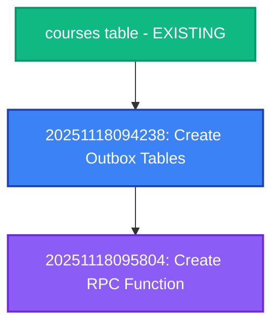

# Database Migrations Reference

**Last Updated:** 2025-11-18
**Project:** MegaCampusAI Course Generation Platform

---

## Table of Contents

1. [Migration Guidelines](#migration-guidelines)
2. [Recent Migrations](#recent-migrations)
3. [Migration Order](#migration-order)
4. [Testing Migrations](#testing-migrations)
5. [Monitoring Post-Migration](#monitoring-post-migration)
6. [Rollback Procedures](#rollback-procedures)

---

## Migration Guidelines

### Naming Convention
```
YYYYMMDDHHMMSS_descriptive_name.sql

Example:
20251118094238_create_transactional_outbox_tables.sql
```

### Best Practices
1. **Idempotent Operations:** Use `IF NOT EXISTS`, `IF EXISTS`, `DROP ... IF EXISTS`
2. **Comments:** Document purpose, dependencies, and expected behavior
3. **Indexes:** Create indexes CONCURRENTLY in production
4. **Foreign Keys:** Always specify ON DELETE behavior (CASCADE, SET NULL, RESTRICT)
5. **RLS Policies:** Enable RLS and create policies in same migration
6. **Testing:** Test on local database before applying to production

### Migration Structure Template
```sql
-- ============================================================================
-- Migration Title
-- Purpose: Brief description
-- Date: YYYY-MM-DD
-- Dependencies: Previous migration file name (if any)
-- ============================================================================

-- Table creation
CREATE TABLE IF NOT EXISTS table_name (...);

-- Indexes
CREATE INDEX IF NOT EXISTS idx_name ON table_name(...);

-- RLS
ALTER TABLE table_name ENABLE ROW LEVEL SECURITY;
CREATE POLICY policy_name ON table_name ...;

-- Functions
CREATE OR REPLACE FUNCTION function_name() ...;

-- Permissions
GRANT ... TO role_name;

-- Comments
COMMENT ON TABLE table_name IS '...';
```

---

## Recent Migrations

### Transactional Outbox Pattern (2025-11-18)

**Purpose:** Implement atomic FSM initialization with transactional outbox pattern to eliminate race conditions.

#### Migration 1: Create Outbox Tables
**File:** `20251118094238_create_transactional_outbox_tables.sql`
**Applied:** 2025-11-18

**Changes:**
- Created table `job_outbox` (pending BullMQ jobs)
- Created table `idempotency_keys` (request deduplication)
- Created table `fsm_events` (FSM audit trail)
- Created 8 indexes (3 + 2 + 3) for performance
- Configured RLS policies (system-only access)
- Configured pg_cron cleanup jobs (30 day retention)
- Foreign keys to `courses.id` with CASCADE delete

**Tables Created:**

**1. job_outbox**
```sql
CREATE TABLE job_outbox (
  outbox_id UUID PRIMARY KEY DEFAULT gen_random_uuid(),
  entity_id UUID NOT NULL REFERENCES courses(id) ON DELETE CASCADE,
  queue_name VARCHAR(100) NOT NULL,
  job_data JSONB NOT NULL DEFAULT '{}',
  job_options JSONB NOT NULL DEFAULT '{}',
  created_at TIMESTAMPTZ NOT NULL DEFAULT NOW(),
  processed_at TIMESTAMPTZ DEFAULT NULL,
  attempts INT NOT NULL DEFAULT 0,
  last_error TEXT DEFAULT NULL,
  last_attempt_at TIMESTAMPTZ DEFAULT NULL
);
```

**2. idempotency_keys**
```sql
CREATE TABLE idempotency_keys (
  key VARCHAR(255) PRIMARY KEY,
  result JSONB NOT NULL DEFAULT '{}',
  created_at TIMESTAMPTZ NOT NULL DEFAULT NOW(),
  expires_at TIMESTAMPTZ NOT NULL DEFAULT (NOW() + INTERVAL '24 hours'),
  entity_id UUID REFERENCES courses(id) ON DELETE CASCADE
);
```

**3. fsm_events**
```sql
CREATE TABLE fsm_events (
  event_id UUID PRIMARY KEY DEFAULT gen_random_uuid(),
  entity_id UUID NOT NULL REFERENCES courses(id) ON DELETE CASCADE,
  event_type VARCHAR(50) NOT NULL,
  event_data JSONB NOT NULL DEFAULT '{}',
  created_at TIMESTAMPTZ NOT NULL DEFAULT NOW(),
  created_by VARCHAR(20) NOT NULL CHECK (created_by IN ('API', 'QUEUE', 'WORKER')),
  user_id UUID DEFAULT NULL REFERENCES auth.users(id) ON DELETE SET NULL
);
```

**Verification:**
```sql
-- Check tables exist
\dt job_outbox idempotency_keys fsm_events

-- Check indexes
\di idx_job_outbox_unprocessed idx_idempotency_expires idx_fsm_events_entity

-- Check RLS policies
SELECT tablename, policyname FROM pg_policies
WHERE tablename IN ('job_outbox', 'idempotency_keys', 'fsm_events');

-- Check pg_cron jobs
SELECT jobname, schedule, command FROM cron.job
WHERE jobname IN ('cleanup_expired_idempotency_keys', 'cleanup_old_outbox_entries');
```

**Rollback:** NOT RECOMMENDED (data loss)
```sql
-- Only use in emergency situations
DROP TABLE IF EXISTS fsm_events;
DROP TABLE IF EXISTS idempotency_keys;
DROP TABLE IF EXISTS job_outbox;

-- Remove pg_cron jobs
SELECT cron.unschedule('cleanup_expired_idempotency_keys');
SELECT cron.unschedule('cleanup_old_outbox_entries');
```

---

#### Migration 2: Create RPC Function
**File:** `20251118095804_create_initialize_fsm_with_outbox_rpc.sql`
**Applied:** 2025-11-18

**Changes:**
- Created function `initialize_fsm_with_outbox(...)`
- SECURITY DEFINER with search_path protection
- Atomic transaction (FSM + outbox + events + idempotency)
- Input validation and error handling

**Function Signature:**
```sql
initialize_fsm_with_outbox(
  p_entity_id UUID,
  p_user_id UUID,
  p_organization_id UUID,
  p_idempotency_key TEXT,
  p_initiated_by TEXT,
  p_initial_state TEXT,
  p_job_data JSONB,
  p_metadata JSONB DEFAULT '{}'
) RETURNS JSONB
```

**Verification:**
```sql
-- Check function exists
\df initialize_fsm_with_outbox

-- Check function attributes
SELECT
  proname,
  prosecdef as is_security_definer,
  provolatile as volatility
FROM pg_proc
WHERE proname = 'initialize_fsm_with_outbox';

-- Test function (requires test course)
SELECT initialize_fsm_with_outbox(
  p_entity_id := '<test-course-uuid>',
  p_user_id := '<test-user-uuid>',
  p_organization_id := '<test-org-uuid>',
  p_idempotency_key := 'test-' || NOW()::text,
  p_initiated_by := 'TEST',
  p_initial_state := 'stage_2_init',
  p_job_data := '[]'::jsonb,
  p_metadata := '{}'::jsonb
);
```

**Rollback:** NOT RECOMMENDED
```sql
-- Only use in emergency situations
DROP FUNCTION IF EXISTS initialize_fsm_with_outbox;
```

**Expected Result:**
```json
{
  "fsmState": {
    "entity_id": "uuid",
    "state": "stage_2_init",
    "version": 1,
    "created_by": "uuid",
    "created_at": "2025-11-18T..."
  },
  "outboxEntries": []
}
```

---

## Migration Order

Transactional Outbox migrations MUST be applied in order:

1. `20251118094238` - Tables first (dependencies for RPC)
2. `20251118095804` - RPC function (references tables)

**Dependency Chain:**
```
courses table (existing)
  ↓
job_outbox table (FK to courses.id)
idempotency_keys table (FK to courses.id)
fsm_events table (FK to courses.id, auth.users.id)
  ↓
initialize_fsm_with_outbox() function (references all 3 tables)
```

**Migration Dependencies:**


---

## Testing Migrations

### Local Testing (Development)

**Step 1: Apply migrations**
```bash
cd packages/course-gen-platform

# Apply all pending migrations
pnpm supabase migration up

# Or apply specific migration
pnpm supabase migration up --name 20251118094238_create_transactional_outbox_tables
```

**Step 2: Verify tables created**
```bash
pnpm supabase db test
```

**Step 3: Test RPC function**
```sql
-- Create test course (if needed)
INSERT INTO courses (id, title, slug, user_id, organization_id)
VALUES (
  '00000000-0000-0000-0000-000000000001',
  'Test Course',
  'test-course',
  '<user-uuid>',
  '<org-uuid>'
);

-- Test RPC function
SELECT initialize_fsm_with_outbox(
  p_entity_id := '00000000-0000-0000-0000-000000000001',
  p_user_id := '<user-uuid>',
  p_organization_id := '<org-uuid>',
  p_idempotency_key := 'test-migration-' || NOW()::text,
  p_initiated_by := 'TEST',
  p_initial_state := 'stage_2_init',
  p_job_data := '[{"queue": "test-queue", "data": {}, "options": {}}]'::jsonb,
  p_metadata := '{}'::jsonb
);

-- Verify outbox entry created
SELECT * FROM job_outbox WHERE entity_id = '00000000-0000-0000-0000-000000000001';

-- Verify FSM event created
SELECT * FROM fsm_events WHERE entity_id = '00000000-0000-0000-0000-000000000001';

-- Verify idempotency key created
SELECT * FROM idempotency_keys WHERE key LIKE 'test-migration-%';
```

**Step 4: Test idempotency**
```sql
-- Call function again with same idempotency key
-- Should return cached result without creating new entries
SELECT initialize_fsm_with_outbox(
  p_entity_id := '00000000-0000-0000-0000-000000000001',
  p_user_id := '<user-uuid>',
  p_organization_id := '<org-uuid>',
  p_idempotency_key := 'test-migration-<timestamp>',  -- Same key as above
  p_initiated_by := 'TEST',
  p_initial_state := 'stage_2_init',
  p_job_data := '[]'::jsonb,
  p_metadata := '{}'::jsonb
);

-- Verify no duplicate entries created
SELECT COUNT(*) FROM job_outbox WHERE entity_id = '00000000-0000-0000-0000-000000000001';
-- Should still be 1
```

**Step 5: Test CASCADE delete**
```sql
-- Delete test course
DELETE FROM courses WHERE id = '00000000-0000-0000-0000-000000000001';

-- Verify cascading deletes worked
SELECT COUNT(*) FROM job_outbox WHERE entity_id = '00000000-0000-0000-0000-000000000001';
-- Should be 0

SELECT COUNT(*) FROM fsm_events WHERE entity_id = '00000000-0000-0000-0000-000000000001';
-- Should be 0

SELECT COUNT(*) FROM idempotency_keys WHERE entity_id = '00000000-0000-0000-0000-000000000001';
-- Should be 0
```

### Production Testing (Staging)

**Step 1: Backup database**
```bash
# Create backup before applying migrations
pg_dump -h <staging-host> -U postgres -Fc megacampus > backup_$(date +%Y%m%d_%H%M%S).dump

# Verify backup size
ls -lh backup_*.dump
```

**Step 2: Apply migrations via Supabase dashboard**
```bash
# Push migrations to staging
pnpm supabase db push --db-url "<staging-connection-string>"
```

**Step 3: Smoke test**
```bash
# Test RPC function via API
curl -X POST https://staging.megacampus.ai/api/trpc/generation.initiate \
  -H "Content-Type: application/json" \
  -H "Authorization: Bearer <token>" \
  -d '{"courseId": "<test-course-id>"}'

# Check outbox processor health
curl https://staging.megacampus.ai/api/trpc/metrics.getOutbox
```

**Step 4: Monitor for 24 hours**
```bash
# Check error rate
curl https://staging.megacampus.ai/api/trpc/metrics.getFSM | jq '.failureRate'

# Check outbox queue depth
psql -h <staging-host> -U postgres -d megacampus -c "SELECT COUNT(*) FROM job_outbox WHERE processed_at IS NULL;"
```

---

## Monitoring Post-Migration

### Database Health Checks

**Check outbox processing:**
```sql
-- Pending jobs count (should be 0 or low)
SELECT COUNT(*) FROM job_outbox WHERE processed_at IS NULL;

-- Jobs processed in last hour
SELECT COUNT(*) FROM job_outbox
WHERE processed_at >= NOW() - INTERVAL '1 hour';

-- Average processing time
SELECT AVG(EXTRACT(EPOCH FROM (processed_at - created_at))) as avg_seconds
FROM job_outbox
WHERE processed_at IS NOT NULL
  AND created_at >= NOW() - INTERVAL '1 hour';
```

**Check FSM events:**
```sql
-- Recent FSM events
SELECT event_type, COUNT(*) as count
FROM fsm_events
WHERE created_at >= NOW() - INTERVAL '1 hour'
GROUP BY event_type;

-- FSM events by source
SELECT created_by, COUNT(*) as count
FROM fsm_events
WHERE created_at >= NOW() - INTERVAL '1 hour'
GROUP BY created_by;
```

**Check idempotency cache:**
```sql
-- Cache size
SELECT COUNT(*) FROM idempotency_keys;

-- Recent cache hits (via application metrics)
-- See /api/trpc/metrics.getFSM endpoint
```

### Application Metrics

**API Endpoints:**
```bash
# Overall system health
curl http://localhost:3000/api/trpc/metrics.healthCheck

# FSM initialization metrics
curl http://localhost:3000/api/trpc/metrics.getFSM | jq '.'

# Outbox processor metrics
curl http://localhost:3000/api/trpc/metrics.getOutbox | jq '.'

# Defense layer activations
curl http://localhost:3000/api/trpc/metrics.getFallbacks | jq '.'
```

**Expected Values (Healthy System):**
```json
{
  "healthCheck": {
    "healthy": true,
    "outboxAlive": true,
    "lastProcessedOk": true
  },
  "fsm": {
    "initiated": 1000,
    "succeeded": 998,
    "failed": 2,
    "failureRate": 0.002,
    "cacheHitRate": 0.35,
    "avgDuration": 85
  },
  "outbox": {
    "pending": 5,
    "processed": 995,
    "failed": 0,
    "avgProcessingTime": 1.2
  },
  "fallbacks": {
    "layer2Activations": 0,
    "layer3Activations": 1
  }
}
```

---

## Rollback Procedures

### Emergency Rollback (NOT RECOMMENDED)

**⚠️ WARNING:** Rollback will cause data loss. Only use in critical situations.

**Prerequisites:**
- System in maintenance mode
- No active course generations
- Database backup available

**Step 1: Stop services**
```bash
# Stop application servers
pm2 stop course-gen-platform

# Or via systemd
systemctl stop course-gen-platform
```

**Step 2: Verify no active generations**
```sql
SELECT COUNT(*) FROM job_outbox WHERE processed_at IS NULL;
-- Should be 0 before rollback
```

**Step 3: Drop RPC function**
```sql
DROP FUNCTION IF EXISTS initialize_fsm_with_outbox;
```

**Step 4: Drop tables (data loss)**
```sql
DROP TABLE IF EXISTS fsm_events;
DROP TABLE IF EXISTS idempotency_keys;
DROP TABLE IF EXISTS job_outbox;
```

**Step 5: Remove pg_cron jobs**
```sql
SELECT cron.unschedule('cleanup_expired_idempotency_keys');
SELECT cron.unschedule('cleanup_old_outbox_entries');
```

**Step 6: Verify rollback**
```sql
-- Tables should not exist
\dt job_outbox idempotency_keys fsm_events

-- Function should not exist
\df initialize_fsm_with_outbox

-- pg_cron jobs should be removed
SELECT * FROM cron.job WHERE jobname LIKE '%idempotency%' OR jobname LIKE '%outbox%';
```

**Step 7: Restart services with old code**
```bash
# Checkout previous version
git checkout <previous-commit>

# Rebuild
pnpm build

# Restart
pm2 restart course-gen-platform
```

---

### Partial Rollback (Keep Data)

If you need to rollback code but preserve data:

**Step 1: Disable outbox processor**
```typescript
// src/orchestrator/index.ts
// Comment out:
// import './outbox-processor';
```

**Step 2: Switch to old FSM initialization**
```typescript
// src/server/routers/generation.ts
// Revert to direct BullMQ job creation (old pattern)
```

**Step 3: Data remains intact**
- job_outbox table: Data preserved, processor stopped
- idempotency_keys: Cache still valid
- fsm_events: Audit trail intact

**Step 4: Monitor for issues**
```bash
# Check queue depth (will grow)
psql -c "SELECT COUNT(*) FROM job_outbox WHERE processed_at IS NULL;"

# Jobs will NOT be created until processor restarted
```

---

## Troubleshooting

### Migration Failed to Apply

**Error: "relation already exists"**
```sql
-- Check if migration already applied
SELECT version, name FROM supabase_migrations.schema_migrations
WHERE version = '20251118094238';

-- If exists, skip migration or manually verify state
```

**Error: "column does not exist"**
```sql
-- Check current schema
\d+ courses

-- Verify all dependencies exist
SELECT tablename FROM pg_tables WHERE tablename = 'courses';
```

**Error: "function does not exist"**
```sql
-- Check if helper functions exist
\df cleanup_expired_idempotency_keys
\df cleanup_old_outbox_entries

-- If missing, recreate functions from migration file
```

### RPC Function Not Working

**Error: "search_path hijacking"**
```sql
-- Verify SECURITY DEFINER and search_path
SELECT proname, prosecdef, proconfig
FROM pg_proc
WHERE proname = 'initialize_fsm_with_outbox';

-- Should see: search_path = public, pg_temp
```

**Error: "permission denied"**
```sql
-- Check grants
SELECT has_function_privilege('authenticated', 'initialize_fsm_with_outbox(uuid, uuid, uuid, text, text, text, jsonb, jsonb)', 'EXECUTE');

-- Should return 't' (true)
```

---

**End of Migrations Reference** | Last Updated: 2025-11-18
