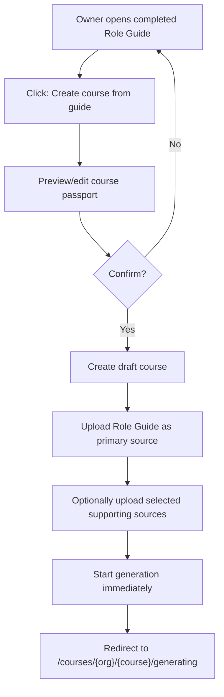

# Career Playbook — Course Bridge Flow

Цель: владелец завершённой должностной инструкции может нажать
`Создать курс из инструкции`, проверить предзаполненный паспорт курса и сразу
запустить генерацию курса через существующий course pipeline.

## Product Flow



The flow intentionally does not reuse the full `/create` form. The Role Guide is
already the edited, reviewed artifact, so the bridge shows a compact review
step instead of asking the user to re-enter course setup.

## Preview Passport

The dialog is opened from library cards and from the private viewer inspector.
It first calls:

```ts
careerPlaybook.courseBridge.previewCourseFromPlaybook({ playbookId });
```

The preview is generated from the final Role Guide and returns:

- `title`
- `courseDescription`
- `targetAudience`
- `learningOutcomes`
- `language`
- `courseSize`
- `style`
- supporting-source availability

Editable fields in the dialog map directly to the create payload. Empty text
overrides fall back to the generated preview values on the backend.

Business-context source availability is best-effort in preview. If optional
source listing is temporarily unavailable, the preview still returns the Role
Guide course passport with business-context sources disabled.

## Source Rules

The final Role Guide markdown is always the primary source.

Supporting sources are opt-in and default to off:

- `includeWebResearch: false`
- `includeBusinessContextSources: false`

Web research can be enabled by the user. When enabled, the bridge first reuses
persisted Career Playbook web research and falls back to a fresh research call.
If web research fails, course creation continues with the Role Guide source.

Business-context sources can be enabled only when selected uploaded sources are
available. The bridge loads authoritative uploaded-source excerpts through the
Career Playbook business-context source evidence helper and writes them as a
separate synthetic markdown source. The helper returns structured availability
metadata (`hasAuthoritativeEvidence` and `unavailableReason`) so bridge gating
does not depend on parsing warning-only prompt text. If the user explicitly
enables business-context sources but authoritative source evidence cannot be
loaded, creation fails with a user-visible error and the draft course is rolled
back instead of silently starting generation without those sources.

## Backend Contract

```ts
previewCourseFromPlaybook: query({
  playbookId: uuid
})

createCourseFromPlaybook: mutation({
  playbookId: uuid,
  includeWebResearch: boolean = false,
  includeBusinessContextSources: boolean = false,
  overrides?: {
    title?: string,
    courseDescription?: string,
    targetAudience?: string,
    learningOutcomes?: string[],
    language?: Language,
    courseSize?: CourseSize,
    style?: CourseStyle
  }
})
```

`createCourseFromPlaybook`:

1. Loads and authorizes the completed playbook.
2. Builds the default course brief from the Role Guide.
3. Applies preview overrides.
4. Creates a draft course with `status = draft`, `has_files = true`,
   `course_size`, and `style`.
5. Persists synthetic source markdown rows through bridge storage.
6. Calls `initiateCourseGeneration({ courseId, webhookUrl: null })`.
7. Returns the generating redirect URL.

Rollback deletes the created course if explicit business-context evidence
loading, source upload, or generation initiation fails. Bridge storage quota is
reserved and released by
`course-bridge-storage.ts`.

## Frontend Contract

- `CreateCourseFromPlaybookDialog` owns preview loading, local edits, source
  toggles, create submission, and redirect.
- `ActionsBar` accepts a `createCourseAction(trigger)` wrapper so the existing
  viewer button can become a dialog trigger without firing the old placeholder
  action.
- Library cards keep using the same dialog component.

## Verification Scope

Targeted coverage:

- backend service preview, overrides, source defaults, optional business-context
  degraded preview, source upload, strict evidence checks, rollback
- backend router defaults
- dialog preview/edit/create behavior
- private viewer button opens the real dialog instead of the placeholder
- private viewer hides course creation when permissions deny it
- library card rendering still exposes the course-create action only when
  permissions allow it
