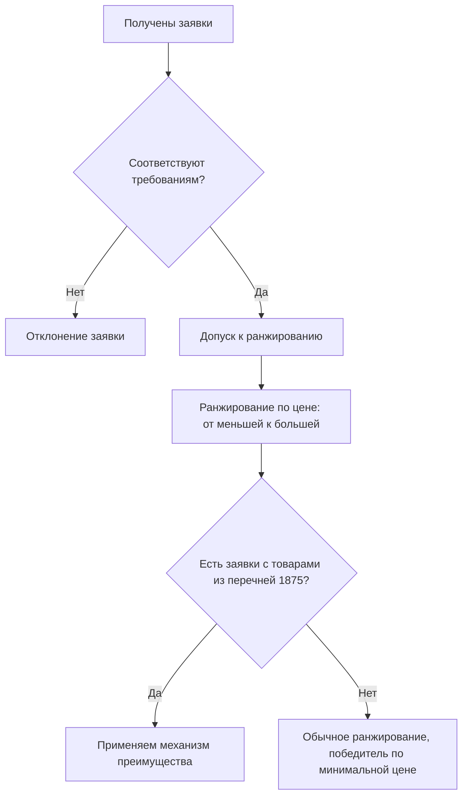
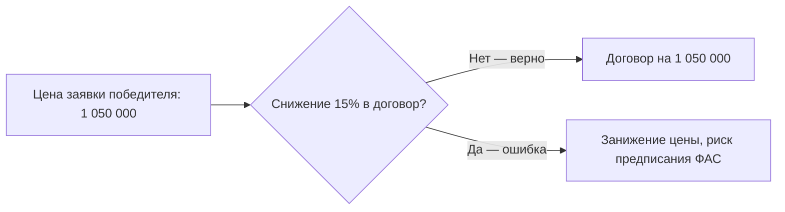

По данным контрольных органов, ошибки при ранжировании заявок с применением ценового преимущества — одна из самых частых причин предписаний ФАС в сфере национального режима по 223-ФЗ. Заказчики либо забывают снизить цену российской заявки на 15% для целей сравнения, либо ошибочно снижают реальную цену контракта — и оба варианта влекут отмену итогов закупки.

Этот урок — практическая инструкция для члена закупочной комиссии. Мы разберем алгоритм по шагам: от первичного ранжирования по цене до оформления протокола, на условных числовых примерах. Займет это 15 минут, а сэкономить может недели разбирательств и репутацию заказчика.

## Порядок ранжирования заявок по цене до применения преимущества

Прежде чем применять преимущество, комиссия должна корректно отранжировать заявки «как есть». Это базовый шаг, который часто выполняют небрежно — а ведь именно от исходного ранжирования зависит, сработает ли преимущество и для кого.

Алгоритм первичного ранжирования:

1. Проверить соответствие каждой заявки требованиям извещения и документации. Несоответствующие заявки отклоняются и в ранжировании не участвуют.
2. Проверить, что предмет закупки подпадает под действие перечней Постановления № 1875 и что в закупке вообще применяется преимущество (а не запрет или ограничение — вспомним «светофор» национального режима).
3. Ранжировать допущенные заявки по возрастанию предложенной цены: заявка с минимальной ценой — первая.

> [!TIP]
> Зафиксируйте цены всех допущенных заявок в рабочей таблице комиссии сразу — это исходные данные для всех последующих расчетов. Ошибка на этом шаге каскадом искажает весь итог.

## Механизм искусственного снижения цены российской заявки на 15%

Ключевой инструмент преимущества — условное, «для целей сравнения», снижение цены заявки, в которой предложен товар российского происхождения (из перечней № 1 и № 2 Постановления № 1875). Формула:

$$Ц_{сравн} = Ц_{заявки} \times 0{,}85$$

Важные характеристики этого механизма:

| Параметр           | Как работает                                             |
| ------------------ | -------------------------------------------------------- |
| Что снижается      | Цена только для целей сопоставления заявок               |
| Размер снижения    | 15% от цены, предложенной в заявке                       |
| Реальная цена      | Не меняется — контракт заключается по цене из заявки     |
| Кому применяется   | Заявкам с товарами российского происхождения из перечней |
| Условие применения | Наличие минимум двух заявок, допущенных к участию        |

Гипотетический пример. Допущены две заявки:

- Заявка А: товар иностранного происхождения, цена 1 000 000 руб.
- Заявка Б: товар российского происхождения (есть реестровая запись), цена 1 100 000 руб.

Считаем цену для сравнения заявки Б: 1 100 000 × 0,85 = 935 000 руб. Сравниваем: 935 000 < 1 000 000 — заявка Б становится первой в очередности, несмотря на более высокую фактическую цену.

> [!WARNING]
> Снижение применяется к цене заявки, а не к начальной (максимальной) цене договора и не к ценам всех заявок подряд. Иностранная заявка сравнивается со своей фактической ценой.

## Сценарий победы российской заявки с более высокой начальной ценой

Разберем полный сценарий, в котором ценовое преимущество меняет очередность заявок. Условия (гипотетические): закупка офисной мебели из перечня № 1, НМЦ — 1 200 000 руб., допущены три заявки:

| Заявка | Происхождение товара | Цена заявки, руб. | Цена для сравнения (×0,85), руб. | Итоговый ранг |
| ------ | -------------------- | ----------------- | -------------------------------- | ------------- |
| № 1    | Импортный товар      | 950 000           | — (не снижается)                 | 2             |
| № 2    | Российский товар     | 1 050 000         | 892 500                          | **1**         |
| № 3    | Российский товар     | 1 180 000         | 1 003 000                        | 3             |

Пошаговая логика комиссии:

1. Ранг «до преимущества»: № 1 (950 000) → № 2 (1 050 000) → № 3 (1 180 000).
2. Применяем снижение на 15% к заявкам № 2 и № 3 (российские товары).
3. Новый ранг: № 2 (892 500) → № 1 (950 000) → № 3 (1 003 000).
4. Победитель — заявка № 2, хотя ее фактическая цена на 100 000 руб. выше, чем у заявки № 1. Контракт заключается по цене, указанной в заявке, — 1 050 000 руб., без учета снижения.

**Граница применимости преимущества.** Снижение на 15% работает, пока сравнительная цена российской заявки не превышает цену иностранной. Математически условие: $Ц_{рф} \times 0{,}85 \leq Ц_{иностр}$, то есть $Ц_{рф} \leq Ц_{иностр} / 0{,}85 \approx 1{,}1765 \times Ц_{иностр}$. Иными словами, разрыв в ценах не должен превышать примерно 17,65% (точнее — 1/0,85 − 1 = 0,17647).

Проверим границу: если бы заявка № 2 предложила 1 120 000 руб., ее сравнительная цена составила бы 952 000 руб. — выше, чем у заявки № 1 (950 000), и преимущество уже не изменило бы очередность. Преимущество дает фору, но не гарантию.

> [!TIP]
> Проверяйте условие «минимум две заявки»: если допущены одна российская и одна иностранная заявки — механизм применяется. Если российская заявка единственная допущенная — сравнивать не с чем, и снижение не имеет практического эффекта.

По итогам комиссия оформляет протокол: в нем фиксируются все заявки, их фактические цены, сравнительные цены с учетом снижения 15% и итоговая очередность — это обеспечивает проверяемость решения.

## Формирование цены контракта с победителем (без снижения реальной цены)

Самая распространенная ошибка заказчиков — заключение договора по «сниженной» цене. Запомните принцип: преимущество — это инструмент ранжирования, а не скидка. Договор заключается по цене, указанной в заявке победителя, без учета 15-процентного условного снижения.

В нашем сценарии договор с победителем (заявка № 2) заключается по цене **1 050 000 руб.**, а не 892 500 руб. Разница существенна — и именно на этой разнице чаще всего «спотыкаются» комиссии, автоматически перенося сравнительную цену в проект договора.

Что отразить в протоколе подведения итогов:

- итоговое ранжирование всех допущенных заявок с указанием фактических цен;
- какие заявки получили преимущество и на каком основании (реестровая запись, перечень);
- расчет сравнительных цен (снижение на 15%) и итоговую очередность;
- цену договора с победителем — фактическую, из заявки.

> [!WARNING]
> Если в протоколе не отражен расчет сравнительных цен, контролирующие органы и участники не могут проверить правильность определения победителя. Прозрачный расчет — ваша защита при обжаловании.

## Особенности применения преимущества в аукционах и конкурсах

Механизм работает по-разному в зависимости от способа закупки, и это важно учитывать при настройке процедуры.

**Конкурс (в том числе электронный).** Классический сценарий: комиссия оценивает заявки по критериям, а ценовое преимущество применяется при сопоставлении ценовых предложений. Итоговое ранжирование фиксируется в протоколе вскрытия/оценки заявок.

**Аукцион.** Здесь преимущество проявляется иначе. В ходе аукциона участники «шагами» снижают цену (шаг — от 0,5% до 5% НМЦ). При подведении итогов цена заявки с российским товаром условно снижается на 15% для определения победителя. При этом контракт заключается по цене, указанной в заявке, без учёта снижения.

**Числовой пример.** НМЦ — 10 млн руб. По итогам торгов участник А (иностранный товар) предложил 8,0 млн руб., участник Б (российский товар) — 8,3 млн руб. Для определения победителя цена заявки Б условно снижается: 8,3 × 0,85 = 7,055 млн руб. Поскольку 7,055 < 8,0, победителем признаётся участник Б. Однако контракт с ним заключается по цене его заявки — 8,3 млн руб., а не по «условной» сумме.

На практике заказчики нередко выносят условие о применении преимущества в извещение и документацию, чтобы участники заранее понимали правила игры.

| Аспект            | Конкурс                                  | Аукцион                                     |
| ----------------- | ---------------------------------------- | ------------------------------------------- |
| Момент применения | При оценке заявок комиссией              | При подведении итогов торгов                |
| Что сравнивается  | Ценовые предложения заявок               | Итоговые предложения после «шагов»          |
| Роль документации | Критерии оценки + условие о преимуществе | Порядок применения преимущества в извещении |
| Фиксация          | Протокол оценки с расчетом               | Протокол подведения итогов с расчетом       |

**Пошаговый алгоритм для комиссии:**

1. Проверить заявки на соответствие требованиям документации.
2. Подтвердить страну происхождения товара (документы из заявки, перечни №1 и №2).
3. Применить преимущество: условно снизить цену заявки с российским товаром на 15%.
4. Проранжировать участников по результатам сравнения.
5. Оформить протокол с указанием расчёта и заключить контракт по цене, указанной в заявке победителя.

> [!TIP]
> Независимо от способа закупки, пошагово применяйте национальный режим в правильной последовательности: сначала запрет, затем ограничение, и только потом преимущество. Пропуск шага (например, применение преимущества там, где должен быть запрет на иностранный товар) — самостоятельное нарушение.

## Упражнения

### Упражнение 1

Расчет очередности с преимуществом

**Задание:** Определите победителя и постройте итоговое ранжирование.

**Сценарий:** Закупка товаров из перечня № 1 Постановления № 1875. Допущены заявки: № 1 — иностранный товар, 800 000 руб.; № 2 — российский товар, 900 000 руб.; № 3 — российский товар, 1 010 000 руб.

**Ваш ответ:**

> **Подсказка:** Снизьте на 15% только цены заявок № 2 и № 3, затем проранжируйте сравнительные цены.
> **Образец ответа:** Сравнительные цены: № 1 — 800 000 (без снижения); № 2 — 900 000 × 0,85 = 765 000; № 3 — 1 010 000 × 0,85 = 858 500. Итоговый ранг: № 2 (765 000) → № 3 (858 500) → № 1 (800 000 — вне очередности между ними). Победитель — заявка № 2 с фактической ценой 900 000 руб.

---

### Упражнение 2

Цена договора и оформление протокола

**Задание:** Укажите цену договора с победителем из упражнения 1 и перечислите минимум четыре обязательных элемента протокола подведения итогов.

**Сценарий:** Коллега предлагает заключить договор по 765 000 руб., «раз уж преимущество снизило цену».

**Ваш ответ:**

> **Подсказка:** Преимущество — инструмент сопоставления, а не скидка. Вспомните состав протокола из урока.
> **Образец ответа:** Договор заключается по 900 000 руб. — цене, указанной в заявке победителя; предложение коллеги ошибочно. В протоколе необходимо отразить: (1) итоговое ранжирование допущенных заявок с фактическими ценами; (2) перечень заявок, получивших преимущество, с указанием основания (реестровая запись, товар из перечня); (3) расчет сравнительных цен со снижением на 15%; (4) цену договора с победителем — фактическую, без учета условного снижения.
