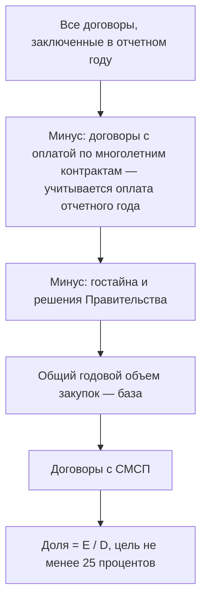
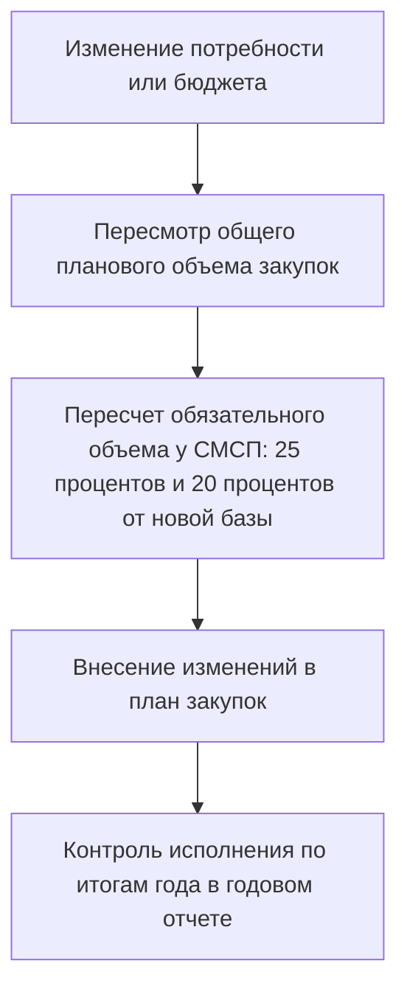

По данным годовой отчетности заказчиков по 223-ФЗ, значительная часть компаний ежегодно не выполняет обязательный норматив закупок у субъектов малого и среднего предпринимательства — и типичная причина не в отсутствии желания, а в ошибках расчета: неправильно определена расчетная база, не исключены «непрофильные» закупки или неверно применены поправочные коэффициенты.

Постановление Правительства РФ № 1352 от 11.12.2014 — ключевой документ, который определяет, кто обязан закупать у СМСП, сколько именно и как считать. Неправильный расчет норматива — это не просто бухгалтерская неточность: это риск административного контроля ФАС и репутационные потери. В этом уроке разберем формулы и методику так, чтобы вы могли воспроизвести расчет на собственных цифрах.

## Постановление № 1352: сфера действия и субъекты обязанности

Постановление № 1352, утвержденное Правительством РФ 11 декабря 2014 г., утверждает Положение об особенностях участия субъектов малого и среднего предпринимательства (СМСП) в закупках отдельных видов юридических лиц, годовом объеме таких закупок и порядке его расчета. Документ неоднократно корректировался — изменения вносились, в частности, постановлениями № 1169 от 29.10.2015, № 1909 от 24.11.2020, № 2323 от 16.12.2021, а также самыми свежими на сегодняшний день: № 858 от 26.06.2024 и № 895 от 29.06.2024. Поэтому перед расчетом всегда проверяйте актуальную редакцию.

Кто подпадает под действие Положения:

| Категория заказчика                                                       | Обязанность по нормативу |
| ------------------------------------------------------------------------- | ------------------------ |
| Госкорпорации, госкомпании                                                | Да                       |
| Субъекты естественных монополий                                           | Да                       |
| Организации, осуществляющие регулируемые виды деятельности                | Да                       |
| Дочерние общества, в которых доля обязательных заказчиков превышает 50%   | Да                       |
| Бюджетные учреждения (при закупках за счет грантов и собственных средств) | Да                       |
| Унитарные предприятия                                                     | Да                       |

Ключевая логика: норматив распространяется на заказчиков, которые ведут закупки по 223-ФЗ, но не являются классическими государственными органами. Для них устанавливается обязанность обеспечить долю закупок у СМСП в общем годовом объеме: общий норматив — 25% (в том числе не менее 20% — только у СМСП, а из них — в рамках торгов, участниками которых могут быть исключительно СМСП).

> [!TIP]
> Проверьте структуру владения своей организации: если более 50% голосов принадлежит «обязательному» заказчику (госкорпорации, естественной монополии и т.п.), норматив применяется и к вам, даже если юридически вы коммерческое общество.

Важно понимать, что не входит в расчетную базу. Положение прямо исключает из нее: закупки для обеспечения обороны и безопасности государства; закупки в области использования атомной энергии; закупки в сфере деятельности естественных монополий; закупки за пределами территории РФ; закупки финансовых услуг (банковские, страховые, лизинг, операции с денежными средствами); закупки, сведения о которых составляют государственную тайну (при определенных условиях). Не учитываются и закупки по трудовым договорам.

От правильного определения базы зависит и числитель, и знаменатель формулы расчета — этому посвящены следующие разделы курса.

## Формула расчета общего объема закупок за отчетный год

Общий годовой объем закупок (расчетная база) складывается из стоимости договоров, заключенных заказчиком по результатам закупок в отчетном году, с учетом объемов оплаты по договорам, срок исполнения которых превышает один календарный год. Из этой суммы исключаются закупки, сведения о которых составляют гостайну (при условии, что такие сведения содержатся в документации или проекте договора), и закупки, в отношении которых принято решение Правительства РФ.

Формула норматива в общем виде:

$$\text{Доля СМСП} = \frac{\text{Стоимость договоров, заключенных с СМСП}}{\text{Общий объем закупок (за вычетом исключений)}} \times 100\%$$

Обязательные ориентиры:

| Показатель                                                                            | Норматив                     |
| ------------------------------------------------------------------------------------- | ---------------------------- |
| Общая доля закупок у СМСП                                                             | не менее 25% годового объема |
| Доля закупок только у СМСП (торги, участниками которых могут быть исключительно СМСП) | не менее 20% в составе 25%   |

В годовом отчете заказчик рассчитывает доли по установленной форме: строка «Годовой объем закупок у СМСП» определяется как отношение суммы показателей по договорам, заключенным с СМСП (включая договоры по результатам торгов среди СМСП и закупки у единственного поставщика — СМСП), к общему объему закупок. Отдельно выделяется строка по закупкам, проведенным среди только СМСП.

> [!WARNING]
> Частая ошибка — брать в базу сумму всех договоров без корректировки на многолетние контракты. В расчет включается не полная цена договора, а объем оплаты в отчетном году по договорам со сроком исполнения более одного календарного года.

## Методика выделения закупок, проводимых исключительно среди СМСП

Специализированный норматив — не менее 20% от общего объема закупок — должен быть достигнут за счет закупок, участниками которых могут быть только СМСП. Это не «любые» договоры с малыми компаниями, а договоры по результатам торгов и иных способов закупки, предусмотренных положением о закупке, где конкуренция ограничена именно этим кругом участников.

Какие договоры засчитываются в специализированный норматив:

- договоры по результатам торгов (конкурсов, аукционов), извещения которых устанавливают требование об участии только СМСП;
- договоры по иным способам закупки из положения о заказчике, если они проводятся среди СМСП;
- договоры с единственным поставщиком — СМСП (засчитываются в общий норматив 25%, но не в специализированный 20%).

Форма годового отчета прямо разделяет эти показатели: строка 11 — общий объем закупок у СМСП (отношение суммы показателей позиций 3, 5, 7 и 9 к общему объему), строка 12 — объем закупок по результатам торгов среди только СМСП (отношение показателя позиции 5 к общему объему). Аналогично, строки 13–14 выделяют закупки у субъектов малого предпринимательства.

> [!TIP]
> Планируйте специализированный норматив с запасом: если часть «СМСП-лотов» сорвется (одна заявка, отказ от договора), у заказчика должен быть резерв закупок, которые можно провести среди СМСП до конца года. Практика показывает, что целевой план стоит закладывать на уровне 22–23%.

Гипотетический пример (иллюстративный): общий объем закупок заказчика после исключений — 1 млрд руб. Общий норматив 25% = 250 млн руб., специализированный 20% = 200 млн руб. Если заказчик заключил с СМСП договоров на 260 млн руб., но из них только 150 млн — по торгам среди исключительно СМСП, общий норматив выполнен, а специализированный — нет. Потребуется доначислить закупки среди СМСП на 50 млн руб.

## Исключаемые закупки: гостайна, финансовые услуги, естественные монополии

Из расчетной базы исключаются виды закупок, где участие СМСП объективно ограничено или нецелесообразно. Положение № 1352 закрепляет закрытый перечень:

| Вид закупки                                                                                                                         | Основание исключения                      |
| ----------------------------------------------------------------------------------------------------------------------------------- | ----------------------------------------- |
| Оборона страны и безопасность государства                                                                                           | Специфика режима и допуск                 |
| Использование атомной энергии                                                                                                       | Регулируемая сфера с особыми требованиями |
| Сфера деятельности субъектов естественных монополий (по Закону о естественных монополиях)                                           | Ограниченный круг поставщиков             |
| Закупки за пределами территории РФ (поставка, работы, услуги за рубежом)                                                            | Вне юрисдикции российского рынка СМСП     |
| Финансовые услуги: банковские, страховые, услуги на рынке ценных бумаг, лизинг, услуги по привлечению и размещению денежных средств | Особый статус финансовых организаций      |
| Закупки, сведения о которых составляют гостайну (если такие сведения есть в документации или проекте договора)                      | Режим секретности                         |

> [!WARNING]
> Исключение работает только при корректном оформлении. Например, для гостайны условие — наличие соответствующих сведений в документации о закупке или проекте договора. Просто объявить закупку «секретной» без документального подтверждения нельзя — при проверке такая позиция вернется в расчетную базу и снизит долю.

Практический смысл исключений: они уменьшают и числитель, и знаменатель, но, поскольку исключаемые категории почти всегда закупаются у крупных игроков, их вывод из базы фактически повышает достижимую долю СМСП. Поэтому точное применение перечня — это легальный инструмент выполнения норматива. Гипотетический пример: у заказчика 1,2 млрд руб. закупок, из них 200 млн — банковские услуги и лизинг. База после исключения — 1 млрд руб., и норматив 25% считается уже от этой суммы (250 млн вместо 300 млн).

## Корректировка плановых показателей при изменении потребностей заказчика

Норматив — это не только отчет о прошлом, но и план на будущее. Заказчики ежегодно формируют планы закупок с указанием объема, который планируется закупить у СМСП, и эти плановые показатели должны обеспечивать соблюдение нормативов 25% и 20%.

Когда потребности меняются (сокращение бюджета, реорганизация, появление новых направлений), плановые показатели подлежат корректировке. Логика такова:

Ключевые правила корректировки:

- при уменьшении общего объема закупок пропорционально снижается и обязательный объем у СМСП, но нормативные доли сохраняются;
- при увеличении объема обязательный объем СМСП растет — планируйте дополнительные лоты среди СМСП заранее;
- изменения плана должны быть размещены в ЕИС, как и сам план;
- по итогам года фактическое исполнение отражается в годовом отчете, дата составления которого — дата размещения отчета в ЕИС (или на официальном сайте до ввода ЕИС в эксплуатацию).

> [!TIP]
> Синхронизируйте график закупок с планом: разносите «СМСП-лоты» равномерно по кварталам. Это снижает риск ситуации, когда в декабре выясняется недобор по специализированному нормативу и приходится проводить закупки в авральном режиме.

Годовой отчет составляется по установленным требованиям (приложение к Положению № 1352) и включает, помимо долей, сведения о количестве и общей стоимости договоров, заключенных по результатам закупок у СМСП, с учетом объемов оплаты в отчетном году по многолетним договорам — за исключением договоров по закупкам с гостайной и закупок по решениям Правительства РФ.

## Упражнения

### Упражнение 1

Расчет нормативов на цифрах

**Задание:** Рассчитайте общий и специализированный нормативы и определите, выполнены ли они.
**Сценарий:** Заказчик заключил в отчетном году договоров на 900 млн руб. Из них: 100 млн руб. — страховые услуги (исключение), 180 млн руб. — договоры с СМСП по всем закупкам, в том числе 140 млн руб. — по торгам среди исключительно СМСП.
**Ваш ответ:**

> **Подсказка:** Сначала исключите страховые услуги из базы, затем посчитайте две доли.
> **Образец ответа:** База = 900 − 100 = 800 млн руб. Общая доля СМСП = 180/800 = 22,5% — норматив 25% не выполнен. Специализированная доля = 140/800 = 17,5% — норматив 20% также не выполнен. Заказчику нужно закупить у СМСП дополнительно минимум на 20 млн руб. (до 200 млн) и обеспечить, чтобы торги среди только СМСП дали не менее 160 млн руб.

---

### Упражнение 2

Определение расчетной базы

**Задание:** Определите, какие позиции включаются в расчетную базу, а какие исключаются.
**Сценарий:** В годовом объеме заказчика: (а) поставка оборудования для атомной станции; (б) договор лизинга автопарка; (в) закупка канцелярии у единственного поставщика — СМСП; (г) закупка с гостайной, сведения о которой есть в проекте договора; (д) аукцион среди только СМСП на ремонт помещений.
**Ваш ответ:**

> **Подсказка:** Вспомните закрытый перечень исключений и правило о документальном подтверждении гостайны.
> **Образец ответа:** Исключаются: (а) — сфера атомной энергии, (б) — лизинг как финансовая услуга, (г) — гостайна при наличии сведений в документации. Включаются в базу: (в) — засчитывается в общий норматив 25%, но не в специализированный 20% (закупка у единственного поставщика); (д) — засчитывается и в общий, и в специализированный норматив.
