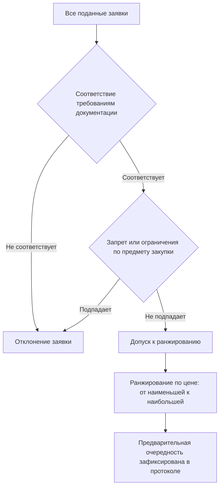
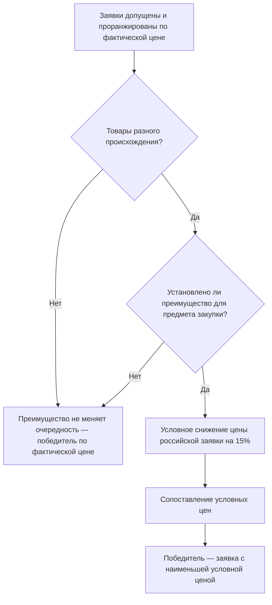
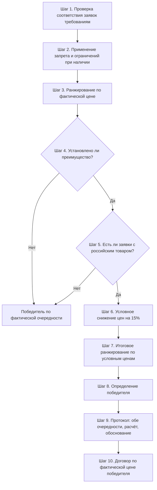

# 3.2

## Введение

Представьте: комиссия заказчика подводит итоги аукциона. Два участника, «Альфа» и «Бета». «Альфа» предложила 950 000 рублей, «Бета» — 1 000 000 рублей. Кажется, победитель очевиден? Не спешите. В заявке «Беты» — товар российского происхождения из установленного перечня, и её ценовое предложение подлежит условному снижению на 15%. После пересчёта расклад меняется кардинально: условная цена «Беты» — 850 000 рублей. Кто теперь победитель и по какой цене будет заключён договор? Если вы ответили «по 1 000 000 рублей» — вы уже знакомы с механикой. Если сомневаетесь — этот урок для вас.

Ошибка в применении преимущества — один из самых частых поводов для жалоб в ФАС и оспаривания итогов закупки. Заказчик, который не владеет пошаговым алгоритмом оценки заявок с учётом преимущества, рискует получить предписание об отмене протокола, повторное проведение процедуры и репутационные потери. Разберём алгоритм до последнего шага — на числах, сценариях и готовых формулировках для протокола.

## Порядок ранжирования заявок по цене до применения преимущества

Прежде чем говорить о преимуществе, нужно чётко понимать базовую механику: как комиссия заказчика ранжирует заявки в «обычной» ситуации, когда преимущество не применяется или все заявки содержат российский товар.

Отправная точка — заявки, допущенные к оценке. Комиссия рассматривает только те заявки, которые соответствуют требованиям документации о закупке и не содержат предложений о поставке товаров, подпадающих под запрет или ограничения (если такие применяются к предмету закупки). Это принципиально: преимущество применяется только к заявкам, которые «прошли фильтр» допуска. Заявка, отклонённая на этапе рассмотрения, уже не участвует в ранжировании — даже если в ней российский товар из перечня.

Далее комиссия ранжирует заявки по возрастанию цены договора. Логика зависит от типа процедуры:

| Процедура        | Критерий ранжирования                                                  | Кто признаётся победителем                                                                                                  |
| ---------------- | ---------------------------------------------------------------------- | --------------------------------------------------------------------------------------------------------------------------- |
| Аукцион          | Наименьшая цена договора, достигнутая в ходе торгов                    | Участник, предложивший наиболее низкую цену договора путём снижения начальной (максимальной) цены на величину шага аукциона |
| Конкурс          | Наилучшая заявка по совокупности критериев (цена, квалификация и т.д.) | Участник, заявка которого получила наиболее высокий итоговый рейтинг                                                        |
| Запрос котировок | Наименьшая цена                                                        | Участник с наиболее низкой ценой заявки                                                                                     |

Ключевой момент: если цена договора в ходе аукциона снижена до нуля, аукцион проводится на право заключить договор, и победителем признаётся участник, предложивший наиболее высокую цену за право заключить договор. Это редкий, но важный сценарий, который комиссия должна уметь идентифицировать.

Результат ранжирования фиксируется в протоколе: заявки выстраиваются в очередность от лучшей к худшей по ценовому критерию. Именно эта очередность — «до применения преимущества» — станет отправной точкой для следующего шага алгоритма. Комиссия фактически работает с двумя ранжированиями: предварительным (по фактическим ценам) и итоговым (с учётом преимущества). Ошибка многих заказчиков в том, что они смешивают эти два этапа в один и не документируют промежуточный результат.

> [!TIP]
> В протоколе подведения итогов полезно отражать обе очередности: предварительную (по фактическим ценовым предложениям) и итоговую (после применения преимущества). Это делает логику решения прозрачной и существенно снижает риск успешной жалобы.

Практический нюанс: при ранжировании комиссия работает с ценами, фактически указанными в заявках и сложившимися в ходе торгов. Никаких «условных» пересчётов на этом этапе не производится. Преимущество — это отдельный, самостоятельный шаг алгоритма, который запускается только после того, как предварительная очередность сформирована и комиссия установила, что заявки содержат товары разного происхождения.

## Механизм искусственного снижения цены российской заявки на 15%

Теперь переходим к ядру темы — механизму преимущества. Правительство Российской Федерации вправе установить преимущество в отношении товаров российского происхождения, и при его применении действует следующее правило: при рассмотрении, оценке и сопоставлении заявок ценовое предложение участника, являющегося российским лицом и предложившего товар российского происхождения, условно снижается на 15%. Если же участник подал предложение о размере платы за заключение с ним договора (сценарий аукциона «на право заключить договор»), действует зеркальная механика — его предложение увеличивается на 15%.

Важно сразу зафиксировать три принципиальных свойства этого механизма:

**Первое — условность снижения.** Снижение цены на 15% существует только для целей сопоставления заявок. Это «виртуальная» цена, используемая комиссией исключительно для определения победителя. Реальная цена договора формируется иначе — об этом следующий раздел.

**Второе — адресность.** Преимущество применяется не ко всем заявкам, а только к тем, которые содержат предложение о поставке товара российского происхождения. При этом комиссия обязана рассмотреть информацию и документы, подтверждающие страну происхождения товаров, — в том числе с учётом отнесения товара к перечням № 1 и № 2, установленным Правительством РФ. Заявка получает преимущество, если содержит предложение о поставке товаров российского происхождения и участник подтвердил это надлежащими документами.

**Третье — математика проста и единообразна.** Условная цена рассчитывается по формуле:

$$Ц_{усл} = Ц_{заявки} \times 0{,}85$$

где $Ц_{заявки}$ — фактическое ценовое предложение участника, а $Ц_{усл}$ — условная цена для целей сопоставления.

Разберём на числах (гипотетический пример). Пусть в закупке три допущенные заявки:

| Участник   | Цена заявки, руб. | Происхождение товара  | Условная цена (−15%), руб. |
| ---------- | ----------------- | --------------------- | -------------------------- |
| Участник А | 900 000           | Иностранное           | 900 000 (без снижения)     |
| Участник Б | 950 000           | Российское (перечень) | 807 500                    |
| Участник В | 1 000 000         | Российское (перечень) | 850 000                    |

Предварительная очередность: А (900 000) → Б (950 000) → В (1 000 000). Итоговая очередность после применения преимущества: Б (807 500) → В (850 000) → А (900 000). Российские заявки «перепрыгнули» иностранную, хотя обе были дороже.

> [!WARNING]
> Преимущество применяется только в том случае, если оно установлено Правительством РФ для данного предмета закупки. Заказчик не вправе применять снижение «по собственному усмотрению», равно как и не вправе игнорировать установленное преимущество. Шаг первый алгоритма — всегда проверка: установлено ли преимущество для этого товара, и подпадает ли предмет закупки под соответствующий акт Правительства.

Отдельно остановимся на документарной стороне. Комиссия проверяет, указал ли участник в заявке страну происхождения товара и приложены ли подтверждающие документы (декларация о происхождении, сертификат о происхождении, иные предусмотренные документацией подтверждения). Если участник декларирует российское происхождение, но не подтверждает его документально в соответствии с требованиями документации о закупке, заявка не получает преимущества — и это должно быть отражено в протоколе с мотивировкой.

Механика «увеличения на 15%» для предложений о плате за право заключить договора встречается реже, но комиссия должна её помнить: если аукцион дошёл до нулевой цены и перешёл в формат «на право заключить договор», российская заявка с предложением платы 100 000 рублей сопоставляется как 115 000 рублей — то есть преимущество работает в пользу участника, предлагающего более высокую плату.

## Сценарий победы российской заявки с более высокой начальной ценой

Самый показательный и практически значимый сценарий применения преимущества — когда российская заявка побеждает, несмотря на то что её фактическая цена выше, чем у конкурента с иностранным товаром. Разберём его пошагово, как это делает комиссия.

**Гипотетический пример.** Заказчик проводит аукцион. Начальная (максимальная) цена договора — 1 200 000 рублей. Предмет закупки — товар из перечня, для которого установлено преимущество. По итогам торгов:

- Участник 1 (иностранное происхождение): цена договора 1 000 000 рублей;
- Участник 2 (российское происхождение, подтверждено): цена договора 1 100 000 рублей.

Шаг 1. Комиссия фиксирует предварительную очередность: Участник 1 — лучший по цене, Участник 2 — второй.

Шаг 2. Комиссия устанавливает, что заявки содержат товары разного происхождения, и к предмету закупки установлено преимущество. Запускается механизм условного снижения.

Шаг 3. Расчёт условных цен:

$$Ц_{усл}^{(1)} = 1\,000\,000 \text{ (без снижения)}$$
$$Ц_{усл}^{(2)} = 1\,100\,000 \times 0{,}85 = 935\,000$$

Шаг 4. Сопоставление условных цен: 935 000 < 1 000 000. Итоговая очередность меняется: Участник 2 — первый, Участник 1 — второй.

Шаг 5. Победителем признаётся Участник 2 — с более высокой фактической ценой. Это законный и корректный результат: преимущество именно для того и установлено, чтобы российский товар имел ценовое преимущество при сопоставлении.

Визуально логика принятия решения выглядит так:

Обратите внимание на границы сценария. Российская заявка побеждает с более высокой ценой не всегда, а только когда разрыв в ценах меньше «запаса», создаваемого преимуществом. Порог, при котором российская заявка с ценой $Ц_р$ обгоняет иностранную заявку с ценой $Ц_и$:

$$Ц_р \times 0{,}85 < Ц_и \quad \Rightarrow \quad Ц_р < \frac{Ц_и}{0{,}85} \approx 1{,}176 \times Ц_и$$

Иными словами, российская заявка может быть дороже иностранной максимум примерно на 17,6% и всё равно победить. Если разрыв больше — преимущество не переломит очередность. В нашем примере: 1 100 000 / 1 000 000 = 1,10 — разрыв 10%, меньше порога, поэтому победа российской заявки закономерна. Если бы Участник 2 предложил 1 200 000 рублей, условная цена составила бы 1 020 000 рублей — выше цены Участника 1, и победил бы Участник 1.

> [!TIP]
> Проверяйте пороговое соотношение до голосования комиссии: если разрыв между ценами заявок превышает ~17,6% в пользу иностранного товара, преимущество очередность не изменит — и протокол можно готовить по фактическим ценам.

Ещё один важный подслучай: обе заявки — российские. Преимущество применяется к обеим, обе цены снижаются на 15%, соотношение между ними не меняется, очередность остаётся прежней. Преимущество «работает» только тогда, когда заявки различаются по происхождению товара. Это логично следует из цели механизма — создать ценовой зазор между российскими и иностранными товарами, а не между российскими поставщиками.

## Формирование цены контракта с победителем (без снижения реальной цены)

Здесь кроется самая частая ошибка заказчиков. Условное снижение на 15% применяется только для сопоставления заявок — и ни в коем случае не переносится в договор. Контракт с победителем заключается по цене, указанной в его заявке (или сложившейся в ходе аукциона), без учёта снижения.

Вернёмся к примеру из предыдущего раздела: победил Участник 2 с фактической ценой 1 100 000 рублей. Именно эта сумма — цена договора. Условная цена 935 000 рублей существует только в протоколе как расчётная величина для обоснования решения. Заказчик не вправе заключить договор на 935 000 рублей, а победитель не обязан поставлять товар «со скидкой 15%».

Сравним, что куда попадает:

| Величина                           | Где используется                                                       | Значение в примере |
| ---------------------------------- | ---------------------------------------------------------------------- | ------------------ |
| Фактическая цена заявки победителя | Предварительное ранжирование, проект договора, итоговая цена контракта | 1 100 000 руб.     |
| Условная цена (−15%)               | Только сопоставление заявок и определение победителя                   | 935 000 руб.       |
| Начальная (максимальная) цена      | Извещение, документация, контроль экономии                             | 1 200 000 руб.     |

Почему механизм устроен именно так? Экономическая логика преимущества — не субсидия поставщику и не скидка для заказчика, а сдвиг конкурентного баланса. Российский производитель получает шанс выиграть закупку даже при цене на несколько процентов выше иностранного аналога, но если он победил — он поставляет по своей цене. Заказчик получает российский товар, заплатив рыночную (по его заявке) цену. Государство не тратит бюджет на прямое субсидирование, а стимулирует спрос на отечественную продукцию через процедурный механизм.

Практические следствия для заказчика:

1. **Проект договора готовится по фактической цене победителя.** Условия договора (цена, график платежей, обеспечение) формируются от суммы, указанной в заявке победителя.
2. **В протоколе указываются обе цены.** Корректный протокол отражает: фактическую цену заявки победителя, применённое преимущество, расчёт условной цены и итоговую очередность. Формулировка вида: «Победителем признан Участник 2, предложивший цену договора 1 100 000 руб. С учётом преимущества (снижение ценового предложения на 15% для целей сопоставления) условная цена заявки составила 935 000 руб., что является наименьшей среди допущенных заявок».
3. **Экономия и бюджетирование считаются от фактической цены.** Если заказчик планировал закупку от НМЦ 1 200 000 рублей, экономия составит 100 000 рублей (8,3%), а не 265 000 рублей — «экономия» от условного снижения не существует в бухгалтерском смысле.
4. **Обеспечение исполнения и другие относительные величины считаются от цены договора** — то есть от фактической цены победителя, а не от условной.

> [!WARNING]
> Заключение договора по условной (сниженной) цене — прямое нарушение порядка применения преимущества. Контрольные органы квалифицируют это как нарушение процедуры определения победителя и условий исполнения договора. Столь же опасна обратная ошибка — включение условной цены в договор «в пользу заказчика» без согласия поставщика.

Частый вопрос от комиссий: «А если победитель — российская заявка, но она была единственной допущенной?» Преимущество сопоставляет заявки между собой; при единственной заявке сопоставлять не с чем, очередность состоит из одной позиции, и победителем признаётся этот участник по своей фактической цене. Механизм снижения в этой ситуации не производит никакого эффекта, хотя формально заявка соответствует критериям преимущества — и это можно отразить в протоколе для полноты обоснования.

## Особенности применения преимущества в аукционах и конкурсах

Финальный блок — процедурные различия. Механизм преимущества един по своей сути (условное снижение на 15%), но точка его приложения и порядок оформления различаются в зависимости от формы закупки.

**Аукцион.** Цена формируется в ходе торгов: участники последовательно снижают начальную (максимальную) цену на величину шага аукциона (от 0,5% до 5% НМЦ). Преимущество применяется на этапе подведения итогов — когда торги завершены и комиссия сопоставляет итоговые предложения участников. Условное снижение применяется к итоговой цене, сложившейся по результатам аукциона, а не к начальной. Особый случай — аукцион на право заключить договора (цена снижена до нуля): здесь преимущество реализуется через увеличение на 15% предложения о размере платы, и побеждает участник с наибольшей «улучшенной» платой.

**Конкурс.** Цена — один из критериев оценки (наряду с квалификацией, сроками, качеством и др.). Преимущество применяется при оценке и сопоставлении заявок: ценовое предложение российской заявки условно снижается на 15% до выставления баллов по ценовому критерию. Это означает, что преимущество влияет не только на очередность, но и на итоговый рейтинг заявки — российская заявка получает более выгодную позицию по ценовому критерию, что может изменить весь расклад баллов.

Сравнительная таблица:

| Параметр                             | Аукцион                                                       | Конкурс                                                    |
| ------------------------------------ | ------------------------------------------------------------- | ---------------------------------------------------------- |
| Момент применения преимущества       | Подведение итогов торгов                                      | Этап оценки и сопоставления заявок                         |
| К какой цене применяется             | Итоговая цена, сложившаяся в ходе торгов                      | Ценовое предложение в заявке                               |
| Влияние на результат                 | Изменение очередности по цене                                 | Изменение баллов по ценовому критерию и итогового рейтинга |
| Особый сценарий                      | Аукцион «на право заключить договор»: увеличение платы на 15% | Не применим                                                |
| Документарная проверка происхождения | При рассмотрении заявок / подведении итогов                   | При рассмотрении и оценке заявок                           |

**Запрос котировок и неконкурентные закупки.** Положение о снижении на 15% распространяется и на рассмотрение, оценку, сопоставление заявок на участие в неконкурентной закупке и окончательных предложений. Механика та же: условное снижение при сопоставлении, заключение договора по фактической цене.

**Общие процедурные требования, единые для всех форм:**

- Заказчик применяет меры пошагово: сначала запрет (если установлен), затем ограничения, затем преимущество. Каждый шаг — отдельная аналитическая операция комиссии с фиксацией в протоколе.
- Заявки с предложением поставить товар иностранного происхождения из перечней № 1 и № 2 (при установленном запрете) отклоняются — они до преимущества не доходят.
- Комиссия рассматривает информацию и документы, подтверждающие страну происхождения, в том числе при объединении нескольких товаров в один лот: если лот содержит товары из перечней, происхождение каждого товара подлежит проверке.
- Итоги оформляются протоколом с отражением применённых мер и обоснованием решения.

Пошаговый сводный алгоритм комиссии, объединяющий весь материал урока:

> [!TIP]
> Внедрите чек-лист комиссии из этих десяти шагов как приложение к регламенту закупочной деятельности. По опыту практиков, формализация алгоритма снижает количество ошибок при подведении итогов и существенно ускоряет подготовку протоколов: комиссия не «вспоминает» порядок, а проходит по контрольным точкам.

### Упражнение

Расчёт победителя с применением преимущества

**Задание:** Выполните полный расчёт по алгоритму комиссии: определите предварительную и итоговую очередность заявок, назовите победителя и укажите цену заключаемого договора.

**Сценарий:** Заказчик проводит аукцион на поставку товара, включённого в перечень, для которого установлено преимущество. НМЦ — 2 000 000 руб. По итогам торгов допущены три заявки:

- Участник А: 1 800 000 руб., товар иностранного происхождения;
- Участник Б: 1 900 000 руб., товар российского происхождения, происхождение подтверждено документально;
- Участник В: 1 850 000 руб., товар российского происхождения, происхождение подтверждено документально.

**Ваш ответ:**

> **Подсказка:** Рассчитайте условную цену для каждой заявки по формуле $Ц_{усл} = Ц_{заявки} \times 0{,}85$, но помните: снижение применяется только к заявкам с российским товаром. Затем сравните условные цены и не забудьте про цену договора.
>
> **Образец ответа:** Предварительная очередность (по фактическим ценам): А (1 800 000) → В (1 850 000) → Б (1 900 000). Условные цены: А — 1 800 000 (без снижения); В — 1 850 000 × 0,85 = 1 572 500 руб.; Б — 1 900 000 × 0,85 = 1 615 000 руб. Итоговая очередность: В (1 572 500) → Б (1 615 000) → А (1 800 000). Победитель — Участник В. Договор заключается по фактической цене заявки победителя — 1 850 000 руб., без учёта условного снижения. Условная цена 1 572 500 руб. используется только в протоколе для обоснования решения.

---

Решение: См. содержание урока для получения рекомендаций.

### Упражнение

Анализ граничного сценария — «переломит» ли преимущество очередность

**Задание:** Определите, изменит ли преимущество очередность заявок в каждом из трёх случаев, и обоснуйте ответ расчётом порогового соотношения.

**Сценарий:** Во всех случаях закупается товар из перечня с установленным преимуществом; в паре — одна заявка с иностранным товаром (цена $Ц_и$), одна с российским (цена $Ц_р$):

- Случай 1: $Ц_и$ = 500 000 руб., $Ц_р$ = 560 000 руб.
- Случай 2: $Ц_и$ = 500 000 руб., $Ц_р$ = 610 000 руб.
- Случай 3: обе заявки содержат российский товар, $Ц_1$ = 500 000 руб., $Ц_2$ = 560 000 руб.

**Ваш ответ:**

> **Подсказка:** Российская заявка побеждает при условии $Ц_р \times 0{,}85 < Ц_и$, то есть при разрыве в ценах менее ~17,6%. Для случая 3 вспомните: как работает преимущество, когда происхождение товаров одинаково?
>
> **Образец ответа:** Случай 1: 560 000 × 0,85 = 476 000 < 500 000 — преимущество переламывает очередность, побеждает российская заявка по цене 560 000 руб. (разрыв 12% — меньше порога 17,6%). Случай 2: 610 000 × 0,85 = 518 500 > 500 000 — преимущество не меняет очередность, побеждает иностранная заявка по 500 000 руб. (разрыв 22% — больше порога). Случай 3: преимущество применяется к обеим заявкам, обе цены снижаются на 15% (425 000 и 476 000), соотношение между ними не меняется — очередность остаётся прежней, победитель — заявка с ценой 500 000 руб. Преимущество создаёт зазор только между товарами разного происхождения.

Решение: См. содержание урока для получения рекомендаций.
