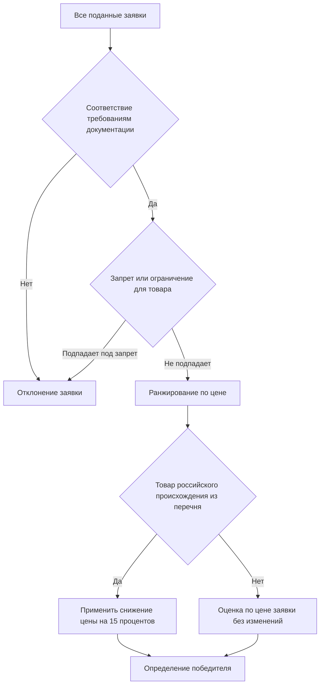
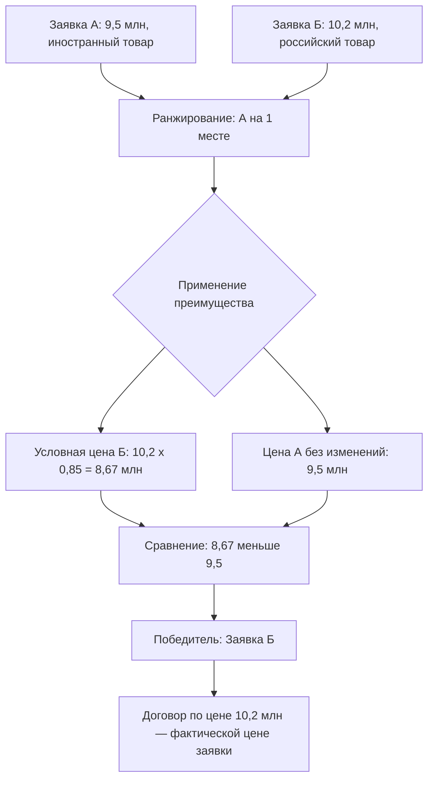

# 3.2

## Введение

Представьте: комиссия заказчика подводит итоги аукциона. Два участника, две заявки. Участник А предложил 9,5 млн рублей за товар иностранного происхождения. Участник Б предложил 10,2 млн — но его товар российского происхождения и включён в реестр. Кто победитель? Если вы ответили «участник А», потому что его цена ниже, — вы упустили ключевую механику национального режима: преимущество в виде условного снижения цены на 15% способно полностью перевернуть рейтинг заявок.

Ошибки на этом этапе — одни из самых дорогих для заказчика: неправильно определённый победитель означает жалобу в ФАС, административную ответственность, срыв сроков закупки и репутационные потери. При этом алгоритм оценки с применением преимущества строго формализован — его можно и нужно отработать до автоматизма. В этом уроке мы разберём пошаговый порядок ранжирования заявок, механизм «виртуального» снижения цены, сценарии, когда заявка с более высокой ценой обходит конкурентов, и правила оформления итогового протокола. Материал построен на практических примерах с расчётами — вы сможете сверить каждый шаг со своей реальной практикой.

## Порядок ранжирования заявок по цене до применения преимущества

Прежде чем говорить о преимуществе, важно зафиксировать базовую логику: преимущество — это надстройка над стандартной процедурой оценки, а не её замена. Комиссия заказчика всегда начинает с классического алгоритма, и только на определённом шаге подключает механизм национального режима.

**Базовый алгоритм работы комиссии** при оценке заявок включает следующие шаги:

1. **Проверка соответствия требованиям документации о закупке.** Каждая заявка проверяется на соответствие формальным требованиям: состав участников, комплектность документов, отсутствие оснований для отклонения.
2. **Применение запретов и ограничений.** Если предмет закупки включает товары из перечней, к которым применяются запрет или ограничение допуска иностранной продукции, комиссия проверяет страну происхождения предлагаемых товаров. Заявки с предложением товара иностранного происхождения, попадающего под запрет, отклоняются. Здесь же проверяются документы, подтверждающие происхождение: реестровые записи, декларации, сертификаты.
3. **Ранжирование допущенных заявок по цене.** Заявки выстраиваются по возрастанию цены: от наиболее низкой к наиболее высокой. Лидер рейтинга — участник, предложивший наименьшую цену договора.
4. **Применение преимущества** — если товар из заявки попадает в перечень товаров российского происхождения, к которому установлена ценовая преференция.
5. **Определение победителя и заключение договора.**

Ключевой принцип: **ранжирование по «чистой» цене выполняется до применения преимущества**. Это значит, что сначала комиссия видит объективную картину — кто сколько предложил. Преимущество подключается только после того, как сформирован первоначальный рейтинг. Такой порядок исключает путаницу: комиссия не должна «заранее» корректировать цены, не разобравшись, есть ли вообще основания для применения преференции.

> [!TIP]
> Зафиксируйте в регламенте работы закупочной комиссии: ранжирование по цене и применение преимущества — два отдельных шага, каждый из которых отражается в протоколе отдельно. Это упрощает проверку ваших действий контролирующими органами и снижает риск признания процедуры нарушенной.

Рассмотрим типичную стартовую ситуацию (гипотетический пример). Заказчик закупает товар, включённый в перечень с преимуществом. Поданы три заявки:

| Участник   | Цена заявки | Происхождение товара   | Ранг до преимущества |
| ---------- | ----------- | ---------------------- | -------------------- |
| Участник 1 | 8,0 млн ₽   | Иностранное            | 1                    |
| Участник 2 | 9,2 млн ₽   | Российское (в перечне) | 2                    |
| Участник 3 | 10,5 млн ₽  | Российское (в перечне) | 3                    |

На этом этапе лидер — Участник 1 с ценой 8,0 млн рублей. Однако именно теперь вступает в игру механизм преимущества, который может изменить расстановку сил. Как именно — разберём в следующем разделе.

Отдельно подчеркнем: преимущество применяется только к тем заявкам, в которых товар **подтверждённо** относится к российскому происхождению из установленного перечня. Если участник декларирует российский товар, но не представил надлежащее подтверждение (реестровую запись или иной предусмотренный документ), преимущество к его заявке не применяется — она оценивается на общих основаниях. Комиссия обязана проверить подтверждающие документы на этапе рассмотрения, а не после подведения итогов.

## Механизм искусственного снижения цены российской заявки на 15%

Центральный элемент национального режима в части преимуществ — **условное снижение ценового предложения заявки с российским товаром на 15%**. Разберём механику предельно точно, потому что именно здесь чаще всего возникают ошибки.

Суть механизма: если участник предложил товар российского происхождения, включённый в соответствующий перечень, его цена **для целей сравнения** уменьшается на 15%. Важно понимать формулу:

$$Ц_{усл} = Ц_{заявки} \times 0{,}85$$

где $Ц_{усл}$ — условная (преференциальная) цена для ранжирования, $Ц_{заявки}$ — цена, фактически предложенная участником.

> [!WARNING]
> Снижение на 15% применяется к цене заявки участника с преимуществом, а не к ценам конкурентов и не к начальной (максимальной) цене договора. Распространённая ошибка — «надбавить» 15% к иностранным заявкам. Правильный алгоритм — уменьшать цену российской заявки.

Продолжим наш пример. Условные цены после применения преимущества:

| Участник   | Цена заявки | Преимущество | Условная цена                 | Ранг после преимущества |
| ---------- | ----------- | ------------ | ----------------------------- | ----------------------- |
| Участник 1 | 8,0 млн ₽   | Нет          | 8,0 млн ₽                     | 2                       |
| Участник 2 | 9,2 млн ₽   | Да           | 9,2 × 0,85 = **7,82 млн ₽**   | 1                       |
| Участник 3 | 10,5 млн ₽  | Да           | 10,5 × 0,85 = **8,925 млн ₽** | 3                       |

Как видим, расстановка изменилась: Участник 2 с фактической ценой 9,2 млн рублей после условного снижения «обошёл» Участника 1 с ценой 8,0 млн рублей. Именно Участник 2 признаётся победителем.

Критически важный момент, который необходимо понимать дословно: **контракт заключается по цене, указанной в заявке победителя, без учёта условного снижения**. Преимущество — это исключительно инструмент ранжирования, «виртуальная» корректировка. Никаких финансовых последствий для цены договора оно не несёт. В нашем примере договор с Участником 2 заключается по цене **9,2 млн рублей**, а не 7,82 млн.

Это принципиально отличает механизм преимущества от, например, механизма «второй цены»: здесь нет пересчёта цены по предложению конкурента, нет снижения до цены следующего участника. Цена победителя остаётся ровно той, которую он сам предложил.

Практические следствия этого правила:

- **Для заказчика:** закупка может обойтись дороже, чем если бы победил участник с иностранным товаром. Это осознанная ценовая «надбавка» за поддержку отечественного производителя, предусмотренная национальным режимом. Заказчик не вправе требовать от победителя снизить цену до условной.
- **Для участника с российским товаром:** преимущество даёт стратегический запас конкурентоспособности. Участник может позволить себе цену примерно на 15% выше, чем у конкурентов с иностранным товаром, и всё равно выиграть.
- **Для участника с иностранным товаром:** при формировании ценового предложения следует учитывать, что реальный конкурентный порог — это не цена соперника, а его цена, умноженная на 0,85.

> [!TIP]
> Участникам полезно заранее просчитывать порог: чтобы победить участника с российским товаром, заявка с иностранным товаром должна быть ниже его цены на величину, компенсирующую 15-процентную преференцию. Формула порога: $Ц_{иностранная} < Ц_{российская} \times 0{,}85$.

Ещё один нюанс: если **несколько** участников предложили российский товар из перечня, преимущество применяется к каждому из них — все их цены условно снижаются на 15%, и они сравниваются между собой уже на равных. В этом случае преимущество фактически «нейтрализуется» внутри группы российских поставщиков и работает только против иностранных заявок.

## Сценарий победы российской заявки с более высокой начальной ценой

Теперь отработаем самый показательный сценарий — тот, с которого мы начали урок: заявка с более высокой ценой побеждает заявку с более низкой ценой. Разберём его пошагово, как это должна фиксировать комиссия.

**Исходные данные (гипотетический пример).** Заказчик проводит аукцион на поставку товара, включённого в перечень товаров российского происхождения с преимуществом. Начальная (максимальная) цена договора — 12 млн рублей. Поданы две заявки, обе допущены:

- **Заявка А:** цена 9,5 млн рублей, товар иностранного происхождения;
- **Заявка Б:** цена 10,2 млн рублей, товар российского происхождения из перечня, подтверждён реестровой записью.

**Шаг 1. Проверка допуска.** Обе заявки соответствуют требованиям документации. Товар из заявки А не подпадает под запрет (перечень предусматривает преимущество, а не запрет), заявка допускается.

**Шаг 2. Первичное ранжирование.** По фактическим ценам лидирует Заявка А (9,5 млн ₽), Заявка Б — вторая (10,2 млн ₽).

**Шаг 3. Применение преимущества.** Товар Заявки Б — российский, из перечня. Условная цена: \$10{,}2 \times 0{,}85 = 8{,}67$ млн рублей. Заявка А оценивается по фактической цене 9,5 млн рублей.

**Шаг 4. Переранжирование.** Сравниваем условные величины: 8,67 млн ₽ (Заявка Б) против 9,5 млн ₽ (Заявка А). Лидер — Заявка Б.

**Шаг 5. Определение победителя.** Победителем признаётся участник по Заявке Б. Договор заключается по цене **10,2 млн рублей** — фактической цене его заявки.

Обратите внимание на масштаб эффекта: разница в фактических ценах составила 700 тысяч рублей (примерно 7,4% в пользу Заявки А), но преимущество в 15% дало российской заявке условный запас около 1,53 млн рублей — этого хватило для победы. Порог, при котором Заявка А всё-таки победила бы: её цена должна была быть ниже 8,67 млн рублей.

Разберём и **обратный сценарий** — когда преимущество не меняет исход. Допустим, Заявка А предложила 8,0 млн рублей. Условная цена Заявки Б — 8,67 млн рублей. Сравнение: 8,0 < 8,67 — побеждает Заявка А с иностранным товаром. Преимущество применено, зафиксировано в протоколе, но не повлияло на результат. Комиссия обязана отразить применение преимущества в протоколе **даже в том случае, когда оно не изменило очередность**, — это подтверждает соблюдение процедуры.

И **третий сценарий** — оба участника с российским товаром. Заявка В: 9,0 млн ₽, Заявка Г: 9,8 млн ₽, оба товара из перечня. Условные цены: 7,65 и 8,33 млн ₽. Очередность не меняется, побеждает Заявка В по цене 9,0 млн ₽. Преимущество здесь работает «вхолостую» относительно внутреннего сравнения, но остаётся значимым, если бы в закупке участвовал и поставщик иностранного товара.

> [!WARNING]
> Победа заявки с более высокой ценой — законный результат, если преимущество применено корректно. Однако именно такие итоги чаще всего вызывают жалобы проигравших участников. Защитите решение: в протоколе зафиксируйте фактические цены, условные цены, применённый процент снижения и подтверждающие документы о происхождении товара. Полная и прозрачная арифметика в протоколе — ваша главная линия обороны в ФАС.

## Формирование цены контракта с победителем (без снижения реальной цены)

Мы уже затронули это правило, но заслуживает отдельного детального разбора, поскольку на практике именно вокруг цены договора возникает наибольшее число споров и ошибок.

**Базовое правило:** цена договора равна цене, предложенной победителем в его заявке. Условное снижение на 15%, применённое для ранжирования, в цену договора **не переносится**. Никаких «пересчётов», «уточнений» или «приведений к условной цене» быть не должно.

Рассмотрим все элементы формирования итоговых условий на сквозном примере (гипотетические данные):

| Параметр                                    | Значение                                                                   |
| ------------------------------------------- | -------------------------------------------------------------------------- |
| Цена в заявке победителя (российский товар) | 10,2 млн ₽                                                                 |
| Условная цена для ранжирования              | 8,67 млн ₽                                                                 |
| Цена договора                               | **10,2 млн ₽**                                                             |
| Основание для применения преимущества       | Товар российского происхождения из перечня, подтверждён реестровой записью |
| Документы в составе заявки                  | Реестровая запись, декларация о стране происхождения                       |

Что это означает на практике для заказчика:

1. **Проект договора готовится по цене заявки победителя.** Если победитель — участник с преимуществом, в договоре указывается его полная предложенная цена, а не условная.
2. **В извещении и документации о закупке** условие о применении преимущества и порядке определения победителя должно быть установлено заранее. Участники должны понимать правила игры до подачи заявок — включение этих положений в документацию обязательно.
3. **Протокол подведения итогов** должен содержать раздельные данные: фактические цены всех допущенных заявок, условные цены (для заявок с преимуществом), итоговое ранжирование и обоснование выбора победителя.

Что это означает для участника:

- Победив с преимуществом, участник **не получает скидку** — он исполняет договор по своей заявленной цене. Преимущество — это конкурентный инструмент, а не ценовая льгота.
- Проигравший участник с более низкой ценой не вправе требовать заключения договора по своей цене или оспаривать цену договора только на основании того, что она выше его предложения: основание победы конкурента — корректно применённая ценовая преференция, предусмотренная национальным режимом.

> [!NOTE]
> Экономическая логика механизма: государство сознательно допускает, что закупка российского товара может обойтись дороже аналогичного иностранного (в пределах ~15%), и компенсирует производителю эту разницу через гарантированный доступ к заказам. Для заказчика это не «переплата по ошибке», а исполнение требований национального режима.

Типичная ошибка заказчика, которая встречается в практике и признаётся нарушением: заключение договора по условной (сниженной) цене — как правило, из-за путаницы в расчётах или неверной интерпретации механизма. Это создаёт риск признания договора заключённым на условиях, не соответствующих заявке победителя, и претензий со стороны контролирующих органов. Вторая зеркальная ошибка — попытка заказчика «уравнять» условия, потребовав от победителя с преимуществом снизить цену до уровня конкурента. Обе ошибки исключаются одним простым правилом: **цена договора = цена заявки победителя, точка**.

Ещё один практический аспект — **проверка подтверждения происхождения до заключения договора**. Если победитель представил реестровую запись или иной документ, комиссия должна убедиться в его действительности и соответствии предложенному товару. Отзыв реестровой записи или выявление недостоверности сведений о происхождении после подведения итогов — основание для пересмотра результатов: преимущество применено необоснованно, победитель определён неправомерно.

## Особенности применения преимущества в аукционах и конкурсах

Механизм преимущества универсален, но его «встраивание» в процедуру зависит от формы закупки. Разберём отличия.

**Аукцион.** В аукционе участники в ходе торгов снижают цену от начальной (максимальной), побеждает тот, кто предложил наименьшую цену путём снижения НМЦ на величину шага аукциона. Преимущество подключается **после завершения торгов**, на этапе подведения итогов: итоговые ценовые предложения участников, заявки которых содержат российский товар из перечня, условно снижаются на 15%, и победитель определяется по результатам этого сравнения. Таким образом, в аукционе преимущество — это пост-обработка результатов торгов, а не фактор, влияющий на ход самих торгов.

Практический сценарий (гипотетический): по итогам аукциона участник 1 (иностранный товар) остановился на цене 8,5 млн ₽, участник 2 (российский товар) — на 9,6 млн ₽. Условная цена участника 2: \$9{,}6 \times 0{,}85 = 8{,}16$ млн ₽. Победитель — участник 2, договор по 9,6 млн ₽. Если бы торги остановились на 8,0 млн ₽ у участника 1, победил бы он (8,0 < 8,16).

**Конкурс.** В конкурсе заявки оцениваются по совокупности критериев (цена, качественные, функциональные и эксплуатационные характеристики, квалификация). Здесь преимущество реализуется через **корректировку ценового предложения при расчёте ценового критерия**: заявка с российским товаром из перечня оценивается с условным снижением цены на 15%, что улучшает её балл по критерию «цена». Остальные критерии (качество, квалификация и т.д.) оцениваются без изменений. Итоговый рейтинг складывается уже с учётом преференциальной корректировки.

Сравнительная таблица:

| Параметр                       | Аукцион                                        | Конкурс                                              |
| ------------------------------ | ---------------------------------------------- | ---------------------------------------------------- |
| Момент применения преимущества | После завершения торгов, при подведении итогов | При оценке заявок по ценовому критерию               |
| Объект корректировки           | Итоговое ценовое предложение                   | Цена в составе интегральной оценки                   |
| Величина условного снижения    | 15% от цены предложения                        | 15% от цены предложения                              |
| Влияние на неценовые критерии  | Отсутствует (торгуется только цена)            | Отсутствует — корректируется только ценовой критерий |
| Цена договора                  | Цена, предложенная победителем, без снижения   | Цена, предложенная победителем, без снижения         |
| Влияние на ход процедуры       | Не влияет на торги напрямую                    | Влияет на итоговый рейтинг заявки                    |

Общие правила для обеих форм:

1. **Основание применения — перечень.** Преимущество применяется только к товарам, включённым в установленный перечень товаров российского происхождения. Наличие товара «в принципе российского» без включения в перечень оснований не создаёт.
2. **Подтверждение происхождения — обязательно.** Реестровые записи и предусмотренные документы проверяются комиссией до применения преимущества. Радиоэлектронная продукция, например, подтверждается реестровыми записями с учётом уровней локализации — продукция, не подтвердившая требуемый уровень, приравнивается к иностранной и преимуществом не пользуется.
3. **Пошаговость.** Заказчик обязан применять меры национального режима последовательно: сначала проверить запрет, затем ограничения, затем преимущество. Пропуск шага или применение меры к товару, на который она не распространяется, — нарушение.
4. **Фиксация в протоколе.** И в аукционе, и в конкурсе протокол подведения итогов должен отражать: перечень допущенных заявок, факт применения (или неприменения) преимущества к каждой заявке, расчёт условных цен, итоговое ранжирование и победителя.

> [!TIP]
> Внедрите в закупочную практику чек-лист комиссии из четырёх вопросов по каждой заявке: (1) товар в перечне? (2) происхождение подтверждено надлежащим документом? (3) условная цена рассчитана верно (цена × 0,85)? (4) цена договора в проекте = цене заявки? Четыре «да» — заявка обработана корректно.

Отдельно отметим связь с ограничениями допуска: если предмет закупки — товар из «ограничительного» перечня, заявки с иностранным товаром могут быть отклонены вовсе, и тогда преимущество не требуется — конкуренция идёт только между российскими поставщиками. Преимущество как мера работает там, где иностранные заявки **допущены**, и задача — обеспечить российским товарам ценовую фору. Правильная квалификация перечня (запрет / ограничение / преимущество) на этапе подготовки документации — половина успеха всей процедуры.

### Упражнение

Расчёт победителя с применением преимущества

**Задание:** Определите победителя аукциона и цену договора, примените алгоритм пошагово.

**Сценарий:** Заказчик проводит аукцион на поставку товара из перечня товаров российского происхождения с преимуществом. НМЦ — 15 млн ₽. Допущены три заявки: Участник А — 11,0 млн ₽, товар иностранного происхождения; Участник Б — 12,1 млн ₽, товар российского происхождения из перечня, реестровая запись представлена; Участник В — 12,5 млн ₽, товар российского происхождения из перечня, реестровая запись представлена. Определите итоговое ранжирование, победителя и цену договора.

**Ваш ответ:**

> **Подсказка:** Сначала рассчитайте условные цены российских заявок (цена × 0,85), затем сравните все три величины. Помните: цена договора — фактическая цена заявки победителя.
>
> **Образец ответа:** Условная цена Участника Б: 12,1 × 0,85 = 10,285 млн ₽. Условная цена Участника В: 12,5 × 0,85 = 10,625 млн ₽. Участник А оценивается по фактической цене 11,0 млн ₽. Ранжирование по условным ценам: 1) Участник Б — 10,285 млн ₽; 2) Участник В — 10,625 млн ₽; 3) Участник А — 11,0 млн ₽. Победитель — Участник Б. Договор заключается по фактической цене его заявки — 12,1 млн ₽. Условное снижение в цену договора не переносится.

---

Решение: См. содержание урока для получения рекомендаций.

### Упражнение

Протоколирование итогов и защита решения

**Задание:** Составьте структуру протокола подведения итогов и сформулируйте обоснование победы заявки с более высокой ценой.

**Сценарий:** По итогам закупки победила заявка с ценой 9,8 млн ₽ (российский товар из перечня), тогда как участник с иностранным товаром предложил 9,0 млн ₽. Проигравший участник готовит жалобу: «Победитель предложил цену на 800 тысяч выше — итоги незаконны». Какие разделы и расчёты должен содержать протокол, чтобы защитить решение комиссии? Укажите минимальный состав сведений.

**Ваш ответ:**

> **Подсказка:** Вспомните четыре обязательных элемента фиксации: допущенные заявки и их фактические цены, основание применения преимущества, расчёт условных цен, итоговое ранжирование. Добавьте подтверждающие документы о происхождении товара.
>
> **Образец ответа:** Протокол должен содержать: (1) перечень всех допущенных заявок с фактическими ценами (9,0 млн ₽ и 9,8 млн ₽); (2) указание, что товар победителя включён в перечень товаров российского происхождения, с реквизитами подтверждающего документа (реестровая запись); (3) расчёт условной цены: 9,8 × 0,85 = 8,33 млн ₽, которая ниже фактической цены конкурента 9,0 млн ₽; (4) итоговое ранжирование: победителем признаётся участник с условно сниженной ценой; (5) цену договора — 9,8 млн ₽ (цена заявки победителя без учёта условного снижения). Ключевой аргумент против жалобы: преимущество применено в соответствии с национальным режимом, заявка победителя содержала надлежащее подтверждение происхождения, расчёт прозрачен, а более высокая цена договора — законное следствие ценовой преференции, а не нарушение процедуры.

Решение: См. содержание урока для получения рекомендаций.
