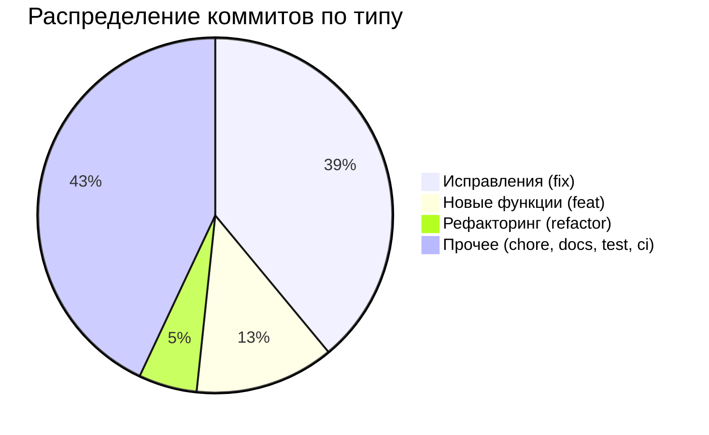
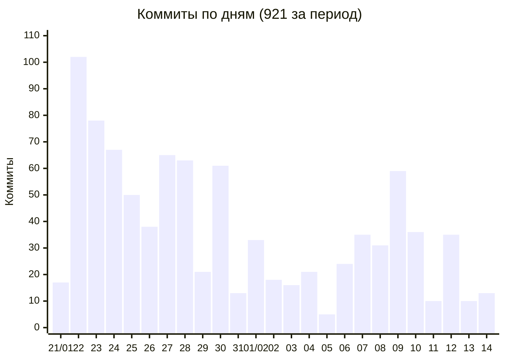
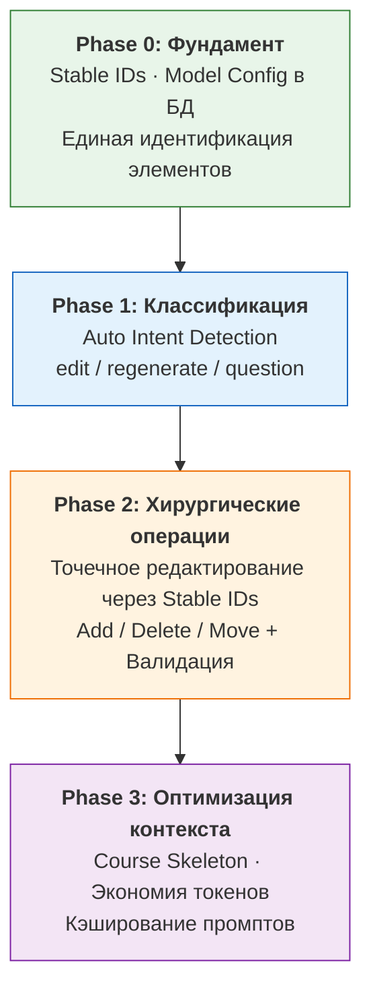
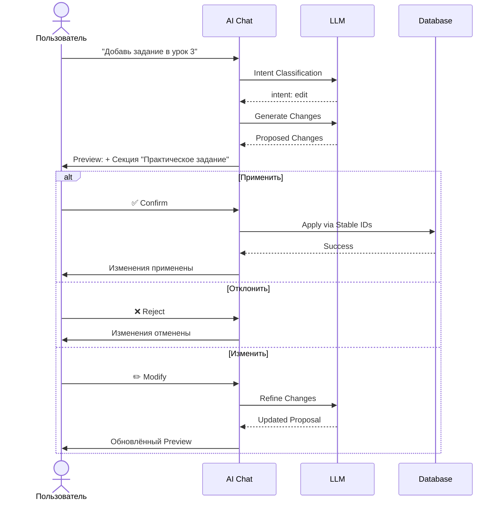
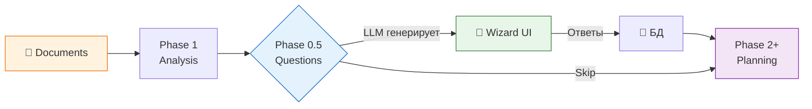
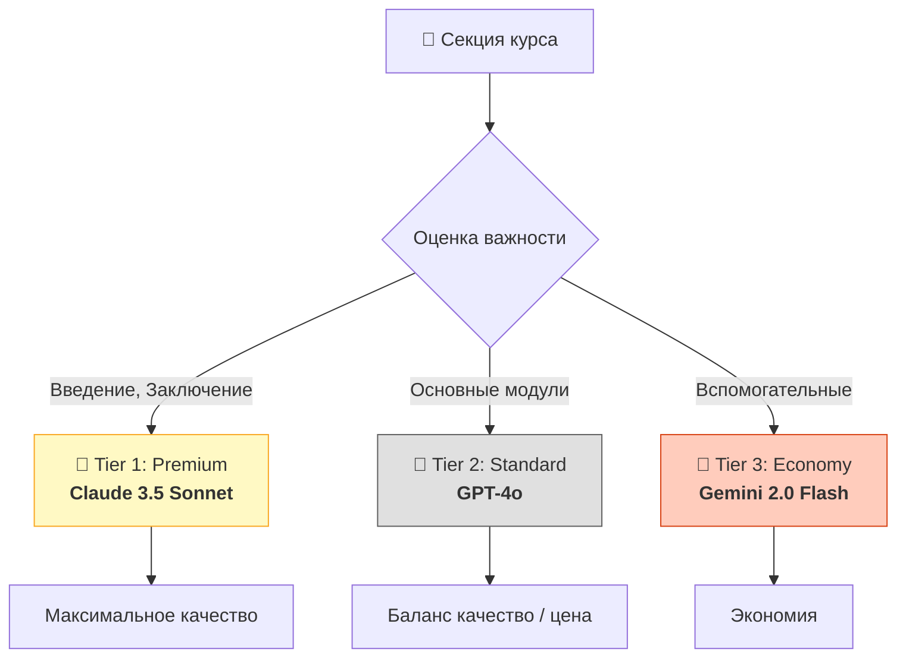
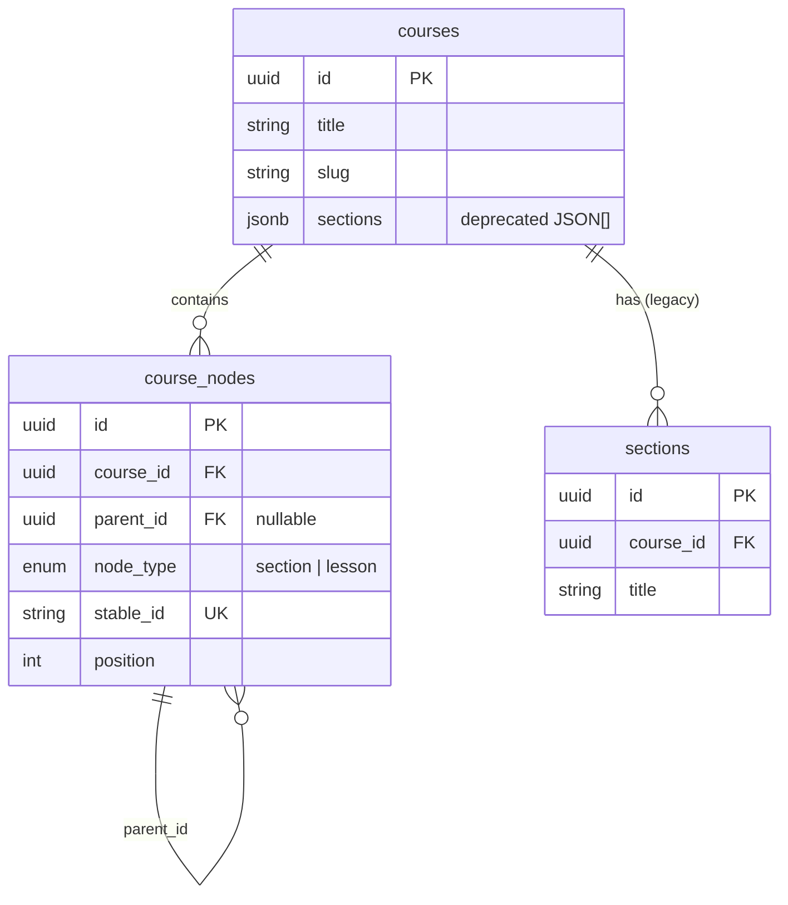
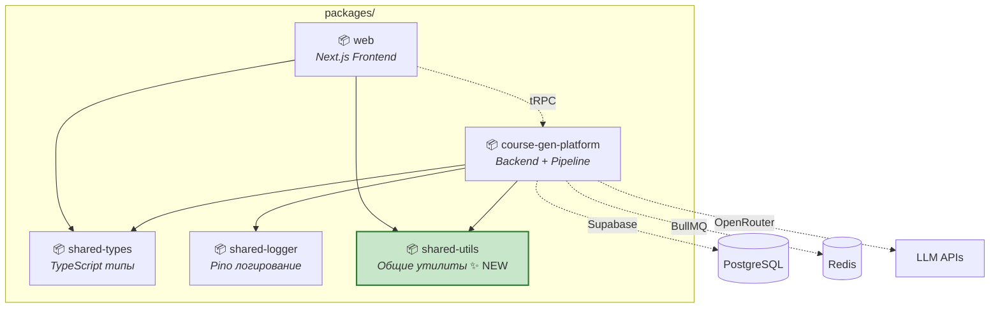
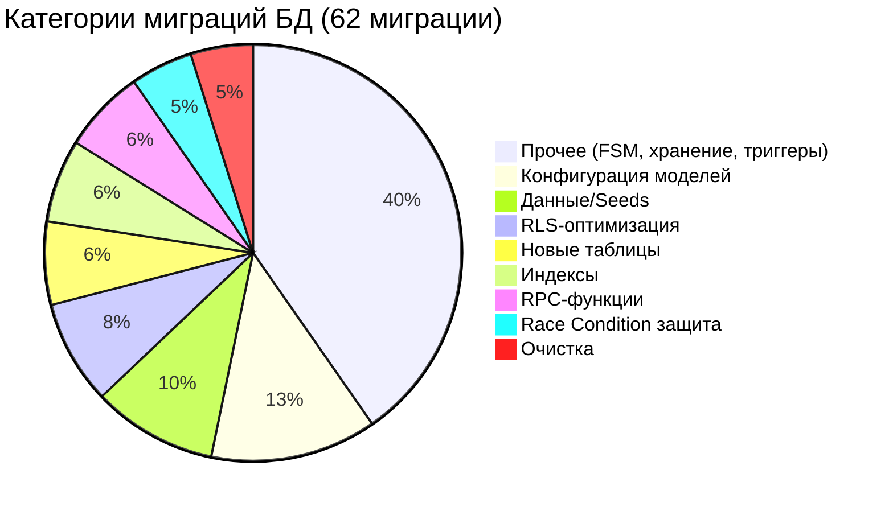
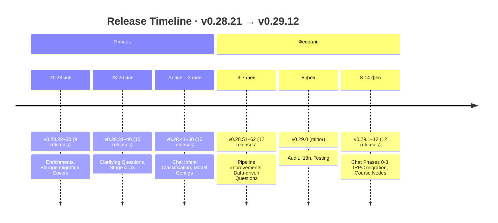

# Отчёт о проделанной работе

**Период:** 21 января — 14 февраля 2026 (25 дней)
**Проект:** MegaCampus AI Course Generation Platform
**Версии:** v0.28.21 → v0.29.12

---

## Содержание

1. [Ключевые показатели](#1-ключевые-показатели)
2. [AI-чат для редактирования курсов](#2-ai-чат-для-редактирования-курсов)
3. [Уточняющие вопросы (Clarifying Questions)](#3-уточняющие-вопросы-clarifying-questions)
4. [Страницы уроков и редактор контента](#4-страницы-уроков-и-редактор-контента)
5. [LLM Benchmarks — публичная страница](#5-llm-benchmarks--публичная-страница)
6. [Медиа-обогащение и хранение файлов](#6-медиа-обогащение-и-хранение-файлов)
7. [Улучшения AI Pipeline](#7-улучшения-ai-pipeline)
8. [Инфраструктура и DevOps](#8-инфраструктура-и-devops)
9. [Безопасность и база данных](#9-безопасность-и-база-данных)
10. [Масштабный рефакторинг](#10-масштабный-рефакторинг)
11. [Качество кода и тестирование](#11-качество-кода-и-тестирование)
12. [Интернационализация (i18n)](#12-интернационализация-i18n)
13. [UX-улучшения](#13-ux-улучшения)
14. [Версионирование](#14-версионирование)
15. [Резюме](#15-резюме)

---

## 1. Ключевые показатели

| Метрика                   | Значение  |
| ------------------------- | --------- |
| **Релизов**               | 53 версии |
| **Коммитов (значимых)**   | 921       |
| **Новых функций (feat)**  | 117       |
| **Исправлений (fix)**     | 359       |
| **Рефакторингов**         | 49        |
| **Новых TS/TSX файлов**   | 340       |
| **Новых тестовых файлов** | 47        |
| **Миграций БД**           | 62        |
| **Новых страниц**         | 12        |
| **Среднее коммитов/день** | 37        |

### Распределение коммитов по типу



### Кодовая база на текущий момент

| Метрика               | Значение |
| --------------------- | -------- |
| **TypeScript файлов** | 1 927    |
| **React компонентов** | 493      |
| **Тестовых файлов**   | 247      |

### Динамика по дням



---

## 2. AI-чат для редактирования курсов

Самая масштабная функция периода — полная реализация **AI-ассистента для редактирования курсов** через чат-интерфейс. Пользователь может в чате попросить изменить структуру курса, содержание уроков, переформулировать материал — и система применяет изменения хирургически, не затрагивая остальной контент.

### Четырёхфазная архитектура



### Confirm-then-Apply

Перед применением изменений система показывает пользователю предварительный просмотр — что будет изменено, добавлено или удалено. Пользователь подтверждает или отклоняет предложение.



### Ключевые возможности

| Функция                        | Описание                                                            |
| ------------------------------ | ------------------------------------------------------------------- |
| **Auto-Intent Classification** | AI автоматически определяет, что хочет пользователь                 |
| **Stable IDs**                 | Каждый элемент курса имеет уникальный ID для точного редактирования |
| **Confirm-then-Apply**         | Предпросмотр изменений перед применением                            |
| **Stage-specific Models**      | Разные LLM-модели для разных типов операций                         |
| **Conversation History**       | История диалога передаётся в LLM для контекстных ответов            |
| **Rate Limiting**              | Защита от злоупотреблений                                           |
| **Inline Feedback**            | Обратная связь после применения каждого предложения                 |
| **Stage 6 CTA**                | Генерация контента для новых уроков прямо из чата                   |

### 16 раундов code review

Реализация прошла через **16 раундов code review** для обеспечения качества — от архитектуры до edge cases.

---

## 3. Уточняющие вопросы (Clarifying Questions)

Новая функция **Phase 0.5** в Stage 4 — система задаёт пользователю уточняющие вопросы перед анализом курса, чтобы лучше понять его потребности.

### Типы вопросов

```
┌─────────────────────────────────────────────────────────────┐
│  Stage 4: Уточняющие вопросы                    [Пропустить]│
├─────────────────────────────────────────────────────────────┤
│                                                              │
│  Вопрос 1 из 5                     ████░░░░░░░░░ 20%       │
│                                                              │
│  Какой уровень подготовки у целевой аудитории?              │
│                                                              │
│  ○ Начинающий — без предварительных знаний                  │
│  ○ Средний — базовые знания есть                            │
│  ● Продвинутый — опыт работы с темой                        │
│  ○ Свой вариант: [________________]                          │
│                                                              │
│                                              [Продолжить →] │
└─────────────────────────────────────────────────────────────┘
```

### Возможности

| Функция               | Описание                                                      |
| --------------------- | ------------------------------------------------------------- |
| **Wizard UI**         | Пошаговый интерфейс для ответов на вопросы                    |
| **3 типа вопросов**   | Открытые, single choice, multi choice                         |
| **Custom Input**      | Возможность ввести свой вариант ответа                        |
| **Progress Tracking** | Индикатор прогресса с количеством оставшихся вопросов         |
| **Auto-Answer**       | В автоматическом режиме AI сам отвечает на свои вопросы       |
| **Data-Driven**       | Вопросы генерируются на основе анализа загруженных документов |
| **Skip Option**       | Можно пропустить и перейти к анализу без уточнений            |

### Архитектура



---

## 4. Страницы уроков и редактор контента

### Страница уроков курса

Новая страница `/courses/{org}/{course}/lessons` — каталог всех уроков курса с карточками.

```
┌─────────────────────────────────────────────────────────────┐
│  Введение в Python                                           │
│  ┌────────────────────────────────────────────────────┐     │
│  │  Прогресс курса                                     │     │
│  │  ████████████░░░░░░░░ 60% (12/20 уроков)           │     │
│  └────────────────────────────────────────────────────┘     │
│                                                              │
│  ┌──────────┐  ┌──────────┐  ┌──────────┐  ┌──────────┐   │
│  │ Урок 1   │  │ Урок 2   │  │ Урок 3   │  │ Урок 4   │   │
│  │ Введение │  │ Типы     │  │ Функции  │  │ Классы   │   │
│  │ ✅ Готов │  │ ✅ Готов │  │ 🔄 В про.│  │ ⏳ Ожид. │   │
│  └──────────┘  └──────────┘  └──────────┘  └──────────┘   │
│                                                              │
│  Навигация: [Тулбар]  [Боковая панель]                      │
└─────────────────────────────────────────────────────────────┘
```

### Inline Markdown Editor

Возможность редактировать контент урока прямо в интерфейсе просмотра — без перехода в отдельный редактор.

### Действия с уроками

```typescript
// ModuleDashboard tRPC mutations
const lessonActions = {
  regenerate: 'Перегенерировать контент урока',
  delete: 'Удалить урок',
  moveUp: 'Переместить вверх',
  moveDown: 'Переместить вниз',
  generateContent: 'Запустить генерацию Stage 6',
};
```

---

## 5. LLM Benchmarks — публичная страница

Создана публичная страница `/benchmarks` для сравнения качества различных LLM-моделей в генерации образовательного контента.

```
┌─────────────────────────────────────────────────────────────┐
│  LLM Model Benchmarks                                        │
├─────────────────────────────────────────────────────────────┤
│                                                              │
│  Фильтры: [Сценарий ▼]  [Дата ▼]                           │
│                                                              │
│  #  Модель              Score   Структура  Качество  Цена   │
│  1  Claude 3.5 Sonnet   92.4    ★★★★★      ★★★★★    $$     │
│  2  GPT-4o              89.1    ★★★★★      ★★★★☆    $$$    │
│  3  Kimi K2             87.3    ★★★★☆      ★★★★★    $      │
│  4  Gemini 2.0 Flash    85.7    ★★★★☆      ★★★★☆    $      │
│                                                              │
│  [▼ Развернуть] — просмотр примера сгенерированного контента│
│                                                              │
└─────────────────────────────────────────────────────────────┘
```

### Возможности

| Функция                   | Описание                                          |
| ------------------------- | ------------------------------------------------- |
| **Point-Based Scoring**   | Балльная система оценки моделей                   |
| **Sample Content Viewer** | Просмотр примера сгенерированного контента        |
| **Scenario Filters**      | Фильтрация по типу задачи (урок, quiz, структура) |
| **Date Filters**          | Фильтрация по дате тестирования                   |
| **Expandable Rows**       | Раскрытие строки для детальной информации         |
| **Test-Model Command**    | CLI-команда для запуска тестирования новой модели |

---

## 6. Медиа-обогащение и хранение файлов

### Миграция хранения: Supabase → Локальное

Произведена полная миграция хранения медиа-файлов обогащений с Supabase Storage на локальную файловую систему сервера — сокращение расходов и ускорение доступа.

```
┌───────────────────────────────────────────────────────────┐
│  Было:                                                     │
│  Browser → Supabase Storage → CDN → Browser               │
│  Latency: 200-500ms, Cost: $$/GB                          │
│                                                            │
│  Стало:                                                    │
│  Browser → Next.js Proxy → Local FS → Browser             │
│  Latency: 20-50ms, Cost: $0                               │
└───────────────────────────────────────────────────────────┘
```

### Unified Storage Service

```typescript
// Автоматическое переключение между бэкендами
const storageService = createStorageService({
  backend: process.env.STORAGE_BACKEND, // 'local' | 'supabase'
  localPath: '/opt/megacampus/storage',
  supabaseBucket: 'enrichments',
});
```

### Визуальные улучшения

| Улучшение                    | Описание                                              |
| ---------------------------- | ----------------------------------------------------- |
| **Cinematic 21:9 Covers**    | Обложки уроков в кинематографическом формате          |
| **Grayscale → Color Hover**  | Карточки в серых тонах, цвет появляется при наведении |
| **Skeleton Placeholders**    | Плавная загрузка изображений со скелетонами           |
| **Shimmer Effect**           | Анимация ожидания при генерации обогащений            |
| **Rotating Status Messages** | Разнообразные сообщения статуса при генерации         |

---

## 7. Улучшения AI Pipeline

### 3-уровневая маршрутизация моделей (Stage 5)

Секции курса теперь генерируются разными моделями в зависимости от их важности:



### Course Nodes — реляционная миграция

Переход от JSON-массивов к плоской реляционной структуре для элементов курса:



**Dual-Write:** Параллельная запись в обе структуры для безопасной миграции.

### Защита LLM-enum от галлюцинаций

```typescript
// Было: LLM мог вернуть несуществующее значение
z.enum(['MICRO', 'MINI', 'COMPACT', 'STANDARD']);

// Стало: 23 enum-схемы защищены helper'ом
const schema = createLLMEnumSchema(
  ['MICRO', 'MINI', 'COMPACT', 'STANDARD'],
  'STANDARD' // fallback при невалидном значении
);
```

### Unified Token Tracking

Сквозной подсчёт использованных токенов на уровне всего курса с агрегацией в ModuleDashboard.

### Иерархия ошибок Pipeline

```typescript
// Структурированная обработка ошибок
PipelineError
  ├── StageError          // Ошибка конкретной стадии
  │   ├── RetryableError  // Можно повторить
  │   └── FatalError      // Нельзя повторить
  ├── LLMError            // Ошибка LLM-провайдера
  └── ValidationError     // Ошибка валидации данных
```

---

## 8. Инфраструктура и DevOps

### Node.js 20 → 22 (Active LTS)

Обновление рантайма до последней LTS-версии с улучшенной производительностью и поддержкой новых возможностей.

### Миграция на tRPC Client (4 фазы)

Замена всех `fetch()` вызовов на типобезопасный tRPC-клиент:

```
Phase 1: Server Actions → tRPC mutations       ✅
Phase 2: useEffect fetch → tRPC queries        ✅
Phase 3: Client hooks → tRPC subscriptions      ✅
Phase 4: Cleanup — удаление 25 as-any casts    ✅
```

**Результат:** Полная типобезопасность от бэкенда до фронтенда.

### Новый пакет: shared-utils



### Валидация ENV-переменных

```typescript
// Миграция на @t3-oss/env-nextjs
import { createEnv } from '@t3-oss/env-nextjs';

export const env = createEnv({
  server: {
    SUPABASE_SERVICE_ROLE_KEY: z.string().min(1),
    OPENROUTER_API_KEY: z.string().min(1),
  },
  client: {
    NEXT_PUBLIC_SUPABASE_URL: z.string().url(),
  },
});
```

**Результат:** Приложение падает при старте, если ENV-переменные невалидны — вместо скрытых ошибок в рантайме.

### Распределённый Rate Limiting (Jina API)

```
Было:                                  Стало:
In-process limiter                     Redis-based distributed limiter
├── Один сервер ✅                     ├── Несколько серверов ✅
├── Несколько серверов ❌              ├── Атомарные операции ✅
└── Рестарт = сброс                    └── Рестарт = состояние сохранено
```

### Tiered CI Testing

```
Unit tests:     pnpm test           # Быстрые, всегда
Contract tests: pnpm test:contract  # Средние, при push
Full tests:     pnpm test:full      # Все, при PR/deploy
```

### Мониторинг

- **Sentry** — интеграция для автоматического отслеживания ошибок
- **BLOCK_REGENERATION** job type — предотвращение двойной генерации
- **ConcurrencyLimiter metrics** — мониторинг ограничителей параллелизма

---

## 9. Безопасность и база данных

### 62 миграции за период



| Категория                 | Миграций | Описание                                       |
| ------------------------- | -------- | ---------------------------------------------- |
| **Новые таблицы**         | 4        | course_chat_messages, course_nodes, benchmarks |
| **RLS-оптимизация**       | 5        | Устранение initplan, security definer views    |
| **Индексы**               | 4        | GIN, composite для производительности          |
| **Race Condition защита** | 3        | Атомарные операции, блокировки                 |
| **Конфигурация моделей**  | 8        | Chat models, tier routing, Kimi K2             |
| **Очистка**               | 3        | Drop unused tables, deprecated fields          |
| **RPC-функции**           | 4        | Token tracking, error resolution               |
| **Данные/Seeds**          | 6        | Chat configs, intent classification            |
| **Прочее**                | 25       | FSM-состояния, хранение, триггеры              |

### Ключевые улучшения БД

```sql
-- Атомарное удаление курса (каскад по всем зависимостям)
CREATE OR REPLACE FUNCTION atomic_course_deletion(p_course_id UUID)
RETURNS void AS $$
BEGIN
  DELETE FROM course_nodes WHERE course_id = p_course_id;
  DELETE FROM course_chat_messages WHERE course_id = p_course_id;
  DELETE FROM lesson_contents WHERE lesson_id IN (
    SELECT id FROM lessons WHERE section_id IN (
      SELECT id FROM sections WHERE course_id = p_course_id
    )
  );
  -- ... каскад по всем таблицам
  DELETE FROM courses WHERE id = p_course_id;
END;
$$ LANGUAGE plpgsql;
```

```sql
-- Parent integrity trigger для course_nodes
CREATE TRIGGER enforce_parent_integrity
BEFORE INSERT OR UPDATE ON course_nodes
FOR EACH ROW
EXECUTE FUNCTION validate_course_node_parent();
```

---

## 10. Масштабный рефакторинг

За отчётный период проведён системный рефакторинг кодовой базы — **49 refactor-коммитов** и **4 спринта аудита**, направленных на устранение технического долга, повышение типобезопасности и подготовку архитектуры к масштабированию.

### 4 спринта аудита

| Спринт       | Фокус                                                                                                               |
| ------------ | ------------------------------------------------------------------------------------------------------------------- |
| **Sprint 1** | Безопасность, удаление dead code, очистка неиспользуемых зависимостей                                               |
| **Sprint 2** | Извлечение захардкоженных русских строк в систему переводов (i18n)                                                  |
| **Sprint 3** | Стандартизация TypeScript, очистка localhost, дедупликация Zustand, удаление legacy tRPC                            |
| **Sprint 4** | Безопасные обновления зависимостей, оптимизация производительности, триггер очистки storage, аудит типобезопасности |

### Структурное разделение файлов (4 батча)

Крупные файлы были систематически разбиты на модули:

```
Batch 1: 3 крупнейших router-файла             → 18 warnings устранено
Batch 2: 7 крупных файлов                       → 30 warnings устранено
Batch 2+: phase-2-scope + phase-6-summarization → 8 warnings устранено
Batch 3: 14 top-warning файлов → helpers        → 158 → 119 warnings

Итого: 4 батча, 31+ файл разбит на модули, ~76 ESLint warnings устранено
```

Примеры:

```
lifecycle.router.ts          → lifecycle/ (subdirectory с модулями)
prompt-registry.ts           → per-stage modules
UnifiedEnrichmentCard.tsx    → subcomponents (6 карточек → 1 grid)
5 крупнейших файлов          → modular structure
```

### Удаление мёртвого кода

Систематическое удаление устаревших и неиспользуемых частей кодовой базы:

| Что удалено                        | Откуда           |
| ---------------------------------- | ---------------- |
| **Bloom's Taxonomy** код           | Pipeline prompts |
| **content_strategy** field         | analysis_result  |
| **expansion_areas** field          | Stage 4 Phase 3  |
| **practical_exercises** field      | Stage 5          |
| **assessment_strategy** field      | Stage 5          |
| **assessment_types** field         | Вся кодовая база |
| **pedagogical_patterns** field     | Вся кодовая база |
| **Phase 6 RAG Planning** код       | Stage 4          |
| **complexity/criticality scoring** | Stage 5          |
| **InitializeJobHandler**           | Pipeline         |
| **Two-stage cover** код            | CoverPreview     |
| **approveCoverDraft**              | Enrichments      |

### Повышение типобезопасности

```
Было:                                    Стало:
─────────────────────────────────────    ─────────────────────────────────────
result as string                     →   getTextContent(result)
25 as-any casts в server actions     →   Типизированные tRPC hooks
Upload as-any casts                  →   Строгая типизация
Ручные JSON парсеры                  →   safeJSONParse (unified)
Разрозненные утилиты                →   shared-utils package
Дублированные Zod-схемы              →   Консолидированные shared schemas
```

| Улучшение                                | Масштаб                       |
| ---------------------------------------- | ----------------------------- |
| **as-any casts удалено**                 | 25+ штук                      |
| **as string → getTextContent()**         | LangChain messages            |
| **Type guards добавлено**                | Chat, enrichments, validation |
| **Zod-схемы консолидированы**            | languageSchema, shared        |
| **safeJSONParse унифицирован**           | Stage 5 + Stage 6             |
| **formatNumber/formatFileSize** → shared | shared-utils package          |
| **validation-utils** → validation.ts     | Web package                   |

### Архитектурные миграции

| Миграция             | Было                       | Стало                           |
| -------------------- | -------------------------- | ------------------------------- |
| **tRPC Client**      | `fetch()` + `as any`       | `@trpc/react-query` + typesafe  |
| **TanStack Query**   | useEffect + useState       | React Query с кэшированием      |
| **next-intl**        | GRAPH_TRANSLATIONS (const) | next-intl translation files     |
| **ENV Validation**   | `process.env.X!`           | `@t3-oss/env-nextjs` + Zod      |
| **Storage Backend**  | Supabase Storage           | Unified Storage Service (local) |
| **Course URLs**      | `/courses/{uuid}`          | `/courses/{org}/{slug}`         |
| **User Preferences** | localStorage               | Supabase (серверное хранение)   |
| **Enrichment Cards** | 6 отдельных компонентов    | 1 UnifiedEnrichmentCard         |

### DRY-консолидация

Вынесение повторяющегося кода в переиспользуемые модули:

```
completePhaseWithTrace()    — общий хелпер для трейсинга фаз
getErrorMessage()           — единый парсер ошибок
PATTERNS constant           — regex-паттерны в одном месте
lock pattern utility        — шаблон блокировок
toActionError()             — shared обработка ошибок в server actions
```

### Результат рефакторинга

```
┌────────────────────────────────────────────────────────────┐
│                                                            │
│   49 refactor-коммитов  │   4 спринта аудита              │
│                                                            │
│   31+ файлов разбито    │   76 ESLint warnings устранено  │
│                                                            │
│   12+ dead fields       │   25+ as-any удалено            │
│   удалено               │                                 │
│                                                            │
│   8 архитектурных       │   6 DRY-консолидаций            │
│   миграций              │                                 │
│                                                            │
└────────────────────────────────────────────────────────────┘
```

---

## 11. Качество кода и тестирование

### Code Review

За период проведено масштабное code review в **16 раундах**, покрывающее:

| Раунд | Фокус                                                |
| ----- | ---------------------------------------------------- |
| 1-3   | Архитектура, соответствие плану                      |
| 4-6   | Parent integrity, delete validation, edge cases      |
| 7-9   | Integration tests, backfill retry, flaky regex       |
| 10-12 | Heuristics, Phase 4 alignment, intent classification |
| 13-16 | FULL_REGENERATE, positional references, fail-fast    |

### Тестирование

| Метрика                 | Значение            |
| ----------------------- | ------------------- |
| **Новых тестов**        | 47 файлов           |
| **CI failures fixed**   | 32 (одним коммитом) |
| **ESLint errors fixed** | 23                  |
| **Judge tests updated** | 14                  |

### Ключевые тестовые улучшения

- **Contract tests** — исправлены JWT secret, stale enums, namespace
- **Mock Supabase Auth** — локальные JWT токены для изоляции от внешних сервисов
- **CategoryBadge** — 44 unit теста с ARIA labels
- **Intent Classification** — полное покрытие unit тестами

---

## 12. Интернационализация (i18n)

### Sprint 2: Извлечение захардкоженных строк

Продолжение миграции с русских строк в коде на систему переводов:

```typescript
// Было:
toast.success('Курс успешно создан');

// Стало:
toast.success(t('course.created'));
```

### Мигрированные компоненты

| Компонент                   | Описание                            |
| --------------------------- | ----------------------------------- |
| **CascadeStageDeleteModal** | Модалка каскадного удаления         |
| **RefinementChat**          | Чат редактирования курса            |
| **Quick Action Prompts**    | Быстрые действия в GlobalCourseChat |
| **useLessonActions**        | Хук действий с уроками              |

---

## 13. UX-улучшения

### Миграция URL-структуры курсов

```
Было:  /courses/abc123-uuid
Стало: /courses/my-org/introduction-to-python
```

Человекочитаемые URL с организацией и slug курса.

### Новые страницы

| Страница                   | URL                                  | Описание                |
| -------------------------- | ------------------------------------ | ----------------------- |
| **Benchmarks**             | `/benchmarks`                        | Сравнение LLM-моделей   |
| **Lessons**                | `/courses/{org}/{course}/lessons`    | Каталог уроков курса    |
| **Course Overview**        | `/courses/{org}/{course}`            | Обзор курса (новый URL) |
| **Generating**             | `/courses/{org}/{course}/generating` | Страница генерации      |
| **Visuals**                | `/courses/{org}/{course}/visuals`    | Визуальные материалы    |
| **Password Recovery**      | `/update-password`                   | Восстановление пароля   |
| **Card Overlays Demo**     | `/demo/card-overlays`                | Демо-страница оверлеев  |
| **Placeholder Comparison** | `/demo/placeholder-comparison`       | Сравнение плейсхолдеров |

### Userback Feedback Widget

Встроенный виджет обратной связи для сбора отзывов от пользователей прямо из интерфейса:

```typescript
// SPA-совместимая интеграция с CSP
<UserbackWidget
  token={process.env.USERBACK_TOKEN}
  onFeedback={(feedback) => trackEvent('feedback', feedback)}
/>
```

### Keyboard Navigation

- ARIA labels для всех интерактивных элементов графа генерации
- Keyboard navigation для Generation Graph UI
- Screen reader support для CategoryBadge

---

## 14. Версионирование

### Release Timeline



### Основные версии

| Версия   | Дата   | Ключевые изменения                                |
| -------- | ------ | ------------------------------------------------- |
| v0.28.25 | 22 янв | Storage migration, cinematic covers               |
| v0.28.30 | 23 янв | RLS optimization, DB cleanup                      |
| v0.28.40 | 26 янв | Clarifying Questions (Phase 0.5)                  |
| v0.28.50 | 3 фев  | Chat intent classification                        |
| v0.28.62 | 7 фев  | Pipeline: 3-tier routing, data-driven questions   |
| v0.29.0  | 8 фев  | Audit: bundle, ESLint, i18n, tiered tests         |
| v0.29.5  | 10 фев | Sentry, distributed rate limiting, env validation |
| v0.29.10 | 12 фев | tRPC migration, Node.js 22, CI fixes              |
| v0.29.12 | 14 фев | Chat Phases 0-3, course_nodes migration           |

### Статистика релизов

```
Patch releases:  51 (96%)
Minor releases:   2 (4%)   — v0.29.0, отдельные minor-бампы
Major releases:   0 (0%)

Среднее: 2.1 релиза в день
Максимум: 5 релизов (22 января)
```

---

## 15. Резюме

### Достижения периода

| Категория                      | Достижение                                                         |
| ------------------------------ | ------------------------------------------------------------------ |
| **AI Chat для редактирования** | Полноценный чат-ассистент для хирургического редактирования курсов |
| **Clarifying Questions**       | Система уточняющих вопросов для улучшения качества генерации       |
| **Lesson Pages**               | Полноценный каталог уроков с действиями и прогрессом               |
| **LLM Benchmarks**             | Публичная страница сравнения моделей                               |
| **Storage Migration**          | Переход на локальное хранение — снижение расходов и задержки       |
| **3-Tier Model Routing**       | Оптимизация затрат через маршрутизацию моделей по важности         |
| **tRPC Migration**             | Полная типобезопасность от бэкенда до фронтенда                    |
| **Node.js 22**                 | Обновление до Active LTS                                           |
| **Course Nodes**               | Реляционная структура вместо JSON — масштабируемость               |
| **62 DB Migrations**           | Масштабная работа над безопасностью и производительностью БД       |
| **16 Code Review Rounds**      | Высочайший стандарт качества кода                                  |
| **ENV Validation**             | Fail-fast при невалидных переменных окружения                      |
| **Масштабный рефакторинг**     | 49 refactor-коммитов, 4 спринта аудита, 12+ dead fields удалено    |

### Ключевые метрики

```
┌────────────────────────────────────────────────────────────┐
│                                                            │
│   53 релиза             │   921 значимый коммит            │
│                                                            │
│   117 новых функций     │   359 исправлений                │
│                                                            │
│   340 новых файлов      │   47 новых тестов                │
│                                                            │
│   62 миграции БД        │   12 новых страниц               │
│                                                            │
│   16 раундов review     │   4 фазы Chat системы            │
│                                                            │
│   49 refactor-коммитов  │   4 спринта аудита               │
│                                                            │
│   1 927 TS-файлов       │   493 React-компонента            │
│                                                            │
└────────────────────────────────────────────────────────────┘
```

### Итог

За 25 дней платформа получила:

1. **AI-ассистент для редактирования курсов** — пользователь может в чате попросить изменить структуру курса, добавить уроки, переписать контент, и система применяет изменения хирургически через Stable ID. Четыре фазы разработки (от фундамента до оптимизации контекста) обеспечили надёжную и масштабируемую систему.

2. **Систему уточняющих вопросов** — перед анализом курса AI задаёт умные вопросы о целевой аудитории, уровне сложности, акцентах. Это значительно повышает релевантность генерируемого контента.

3. **Полноценные страницы уроков** — каталог уроков с карточками, прогрессом, действиями и inline-редактором. Вместе с миграцией URL на человекочитаемые адреса это делает навигацию интуитивной.

4. **Систему бенчмарков LLM-моделей** — публичная страница для сравнения качества генерации разными моделями с балльной оценкой и примерами контента.

5. **Оптимизацию затрат** — 3-уровневая маршрутизация моделей позволяет использовать премиум-модели только для ключевых секций, а для вспомогательных — экономичные. Миграция хранения на локальную ФС убирает расходы на Supabase Storage.

6. **Масштабный рефакторинг** — 49 refactor-коммитов и 4 спринта аудита систематически устранили технический долг: разбиение 31+ крупных файлов на модули, удаление 12+ устаревших полей из всей кодовой базы, ликвидация 25+ `as any` приведений типов, унификация утилит в shared-пакеты. Это фундамент для масштабирования.

7. **Промышленное качество кода** — полная миграция на tRPC (типобезопасность), валидация ENV-переменных, Node.js 22, распределённый rate limiting, 16 раундов code review и 62 миграции БД.

8. **Непрерывную поставку** — 53 релиза за 25 дней (2+ релиза в день) демонстрируют зрелость CI/CD процессов и стабильность платформы.

### Roadmap: Ближайшие шаги

| Приоритет | Задача                                   |
| --------- | ---------------------------------------- |
| **P1**    | Завершение chat editing для всех стадий  |
| **P1**    | Course Nodes полная миграция (drop JSON) |
| **P1**    | Video Pipeline MVP (TTS + Slides)        |
| **P2**    | Multi-tenant improvements                |
| **P2**    | Analytics Dashboard для инструкторов     |
| **P3**    | AI Tutor (real-time)                     |

---

_Отчёт сгенерирован: 14 февраля 2026_
_Период: 21 января — 14 февраля 2026_
_Версии: v0.28.21 → v0.29.12_
