# Отчёт о проделанной работе

**Период:** 15 февраля — 2 апреля 2026 (47 дней)
**Проект:** MegaCampus AI Course Generation Platform
**Версии:** v0.29.14 → v0.31.33

---

## Содержание

1. [Ключевые показатели](#1-ключевые-показатели)
2. [Качество генерации уроков (Stage 6)](#2-качество-генерации-уроков-stage-6)
3. [Интеграция NotebookLM (Stage 7)](#3-интеграция-notebooklm-stage-7)
4. [Редизайн системы обогащений](#4-редизайн-системы-обогащений)
5. [PromptService — типобезопасные промпты](#5-promptservice--типобезопасные-промпты)
6. [Оптимизация Pipeline](#6-оптимизация-pipeline)
7. [Hardening FSM и стабильность](#7-hardening-fsm-и-стабильность)
8. [Инфраструктура и DevOps](#8-инфраструктура-и-devops)
9. [Безопасность и база данных](#9-безопасность-и-база-данных)
10. [Качество кода и тестирование](#10-качество-кода-и-тестирование)
11. [UX-улучшения](#11-ux-улучшения)
12. [Версионирование](#12-версионирование)
13. [Резюме](#13-резюме)

---

## 1. Ключевые показатели

| Метрика                   | Значение  |
| ------------------------- | --------- |
| **Релизов**               | 46 версий |
| **Коммитов (значимых)**   | 373       |
| **Новых функций (feat)**  | 50        |
| **Исправлений (fix)**     | 188       |
| **Рефакторингов**         | 19        |
| **Тестов (test)**         | 16        |
| **Новых TS/TSX файлов**   | 205       |
| **Новых тестовых файлов** | 102       |
| **Миграций БД**           | 27        |
| **Среднее коммитов/день** | 7.9       |

### Распределение коммитов по типу

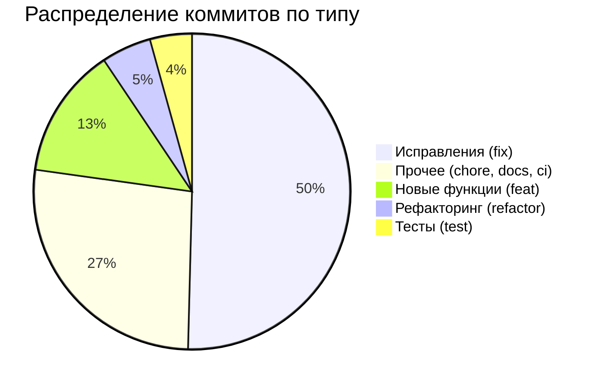

### Кодовая база на текущий момент

| Метрика               | Значение |
| --------------------- | -------- |
| **TypeScript файлов** | 2 712    |
| **React компонентов** | 483      |
| **Тестовых файлов**   | 338      |

### Динамика по дням

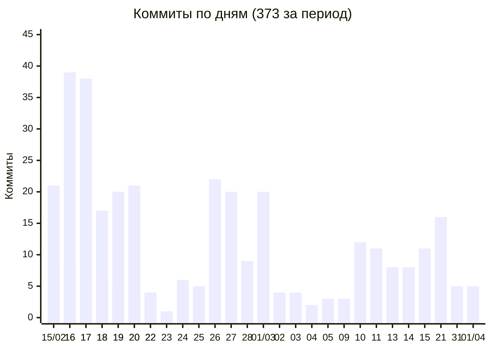

### Характер периода

В отличие от предыдущего периода, где акцент был на новых функциях (117 feat), этот период сфокусирован на **качестве и стабильности**: 188 исправлений против 50 новых функций. Соотношение fix/feat = **3.8:1** показывает зрелую фазу — платформа активно тестировалась на реальных курсах и приводилась к промышленному качеству.

---

## 2. Качество генерации уроков (Stage 6)

Самая масштабная работа периода — **46 коммитов**, направленных на радикальное повышение качества генерируемого контента уроков. Пользователи получают более связные, грамотные и точные уроки.

### Two-Tier RAG — устранение 75% пустых запросов

Новая двухуровневая система извлечения контекста из исходных документов:

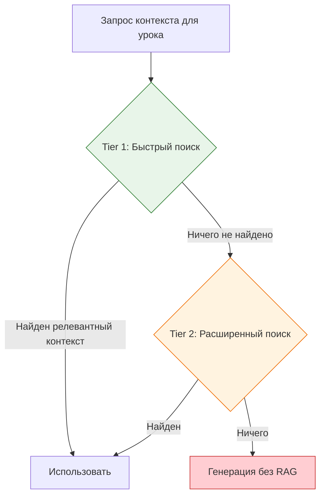

**Результат:** 75% запросов, ранее возвращавших пустой результат, теперь находят релевантный контекст. Уроки стали точнее соответствовать исходным материалам.

### Self-Reviewer Phase 2.5 — обнаружение опечаток и ошибок

Добавлена промежуточная фаза автоматической проверки сгенерированного контента:

| Проверка                    | Описание                                                      |
| --------------------------- | ------------------------------------------------------------- |
| **Spelling & Typos**        | Автоматическое обнаружение орфографических ошибок             |
| **Coherence Patcher**       | Проверка и исправление логической связности текста            |
| **Rejection Telemetry**     | Отслеживание причин отклонения контента для улучшения моделей |
| **Truncation Continuation** | Автоматическое продолжение обрезанного контента               |

### Обновление моделей оценки качества (CLEV Judge)

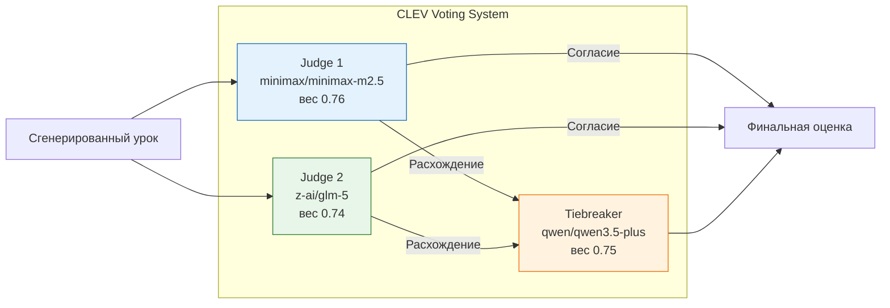

Обновлены модели для оценки качества уроков — система голосования из 3 судей с весовыми коэффициентами обеспечивает объективную оценку.

### Дополнительные улучшения Stage 6

| Улучшение                       | Описание                                                          |
| ------------------------------- | ----------------------------------------------------------------- |
| **Course Position Awareness**   | Генератор учитывает позицию урока в курсе (введение vs середина)  |
| **Lesson Digest**               | Накопление знаний между уроками для связности                     |
| **sanitizeContent**             | Централизованная очистка контента при записи в БД                 |
| **Cache Hit Tracing**           | Отслеживание попаданий в кэш для оптимизации                      |
| **Single-Call Generation**      | Замена посекционной генерации на единый вызов — быстрее и дешевле |
| **Actual Model Usage Tracking** | Реальная модель записывается в трейс (а не запрошенная)           |

### Stage 5: Последовательная генерация секций

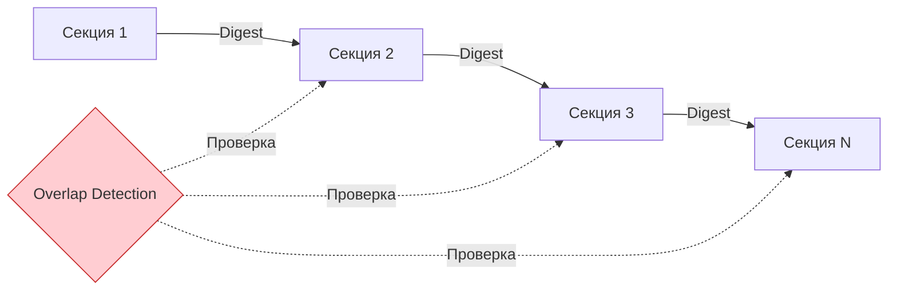

Секции курса теперь генерируются **последовательно** с передачей дайджеста (краткого содержания) от предыдущей секции к следующей. Это устраняет дублирование материала между секциями. Дополнительно работает **Overlap Retry Loop** — если обнаружено пересечение контента, секция перегенерируется.

---

## 3. Интеграция NotebookLM (Stage 7)

Полноценная интеграция с Google NotebookLM для автоматической генерации аудио- и видеоматериалов к курсам.

### Архитектура

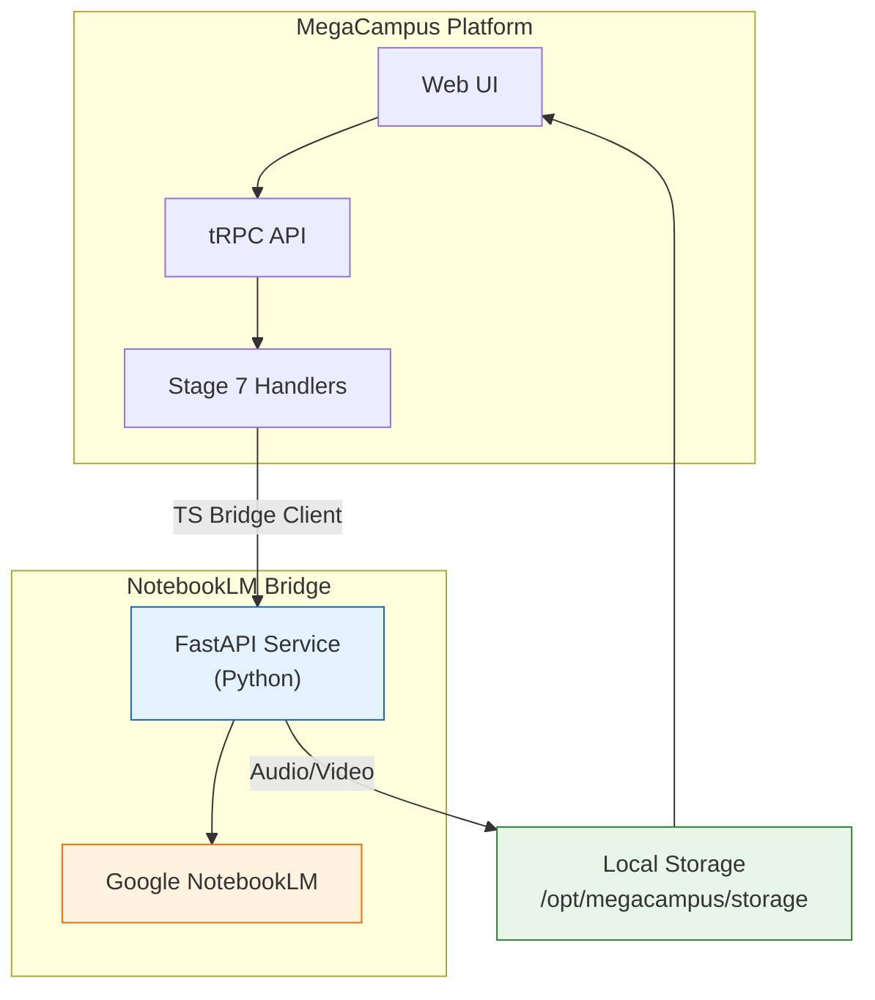

### NotebookLM Bridge — FastAPI сервис

Создан отдельный Python-сервис (FastAPI), который взаимодействует с Google NotebookLM:

| Компонент                      | Описание                                         |
| ------------------------------ | ------------------------------------------------ |
| **12 REST эндпоинтов**         | start/status/result для каждого типа артефакта   |
| **TS Bridge Client**           | TypeScript клиент с типизированными методами     |
| **Параллельная генерация**     | Audio + Video генерируются одновременно          |
| **Local Media Storage**        | Медиафайлы сохраняются локально, не в облаке     |
| **Async Lifecycle**            | Асинхронный жизненный цикл с recovery-механизмом |
| **Health Check в Admin Panel** | Мониторинг состояния Bridge из панели управления |

### 4 новых типа обогащений

```
┌─────────────────────────────────────────────────────────────┐
│  Новые типы обогащений NotebookLM                            │
├─────────────────────────────────────────────────────────────┤
│                                                              │
│  🎙️  NLM Study Guide    — Учебное пособие (аудио)           │
│  📝  NLM Flashcards     — Карточки для повторения            │
│  🧠  NLM Mind Map       — Интеллект-карта                    │
│  📊  NLM Infographic    — Инфографика (PNG)                  │
│                                                              │
│  + существующие NLM Audio / NLM Video                        │
│                                                              │
└─────────────────────────────────────────────────────────────┘
```

Все новые типы хранятся в базе данных как JSONB-контент (текстовые) или в Supabase Storage (изображения), с уникальными placeholder-изображениями для каждого типа.

### Hardening Pipeline

- **Оптимизация метаданных**: из bridge-ответов извлекаются только существенные поля (~73 МБ экономии на существующих данных)
- **Recovery Logic**: автоматическое восстановление после сбоев генерации
- **Refuse Fallback**: система отказывается от нечёткого fallback-матчинга для повышения точности

---

## 4. Редизайн системы обогащений

Масштабный рефакторинг системы обогащений — поддержка **14 типов**, новый batch UI и полная интернационализация.

### 14 типов обогащений

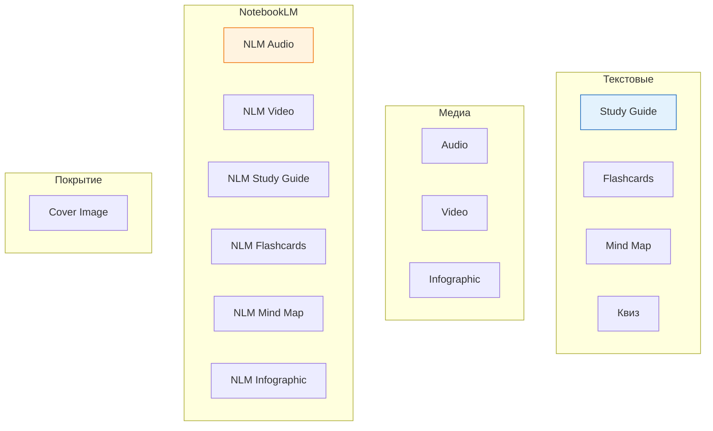

### Переработанные компоненты

| Компонент                   | Изменение                                                         |
| --------------------------- | ----------------------------------------------------------------- |
| **Unified Enrichment Grid** | Единая сетка карточек вместо разрозненных компонентов             |
| **FlashcardViewer**         | Полностью переработан — fullscreen study mode с flip-анимацией    |
| **MindMapViewer**           | Заменён на интерактивный markmap-view вместо статичного рендера   |
| **Quiz (Квиз)**             | Разблокирован: multi-select, андрагогический подход, переименован |
| **Single-Click Video**      | Воспроизведение видео одним кликом без дополнительных шагов       |
| **Compact Audio Overlay**   | Компактный аудиоплеер поверх карточки обогащения                  |
| **Batch Generation UI**     | Групповой запуск генерации нескольких обогащений одновременно     |

### i18n обогащений

Все 14 типов полностью локализованы (русский + английский) — названия, описания, статусы, ошибки.

---

## 5. PromptService — типобезопасные промпты

Создан сервис типобезопасного управления промптами, устраняющий целый класс ошибок — несоответствие переменных в шаблонах.

### Архитектура PromptService

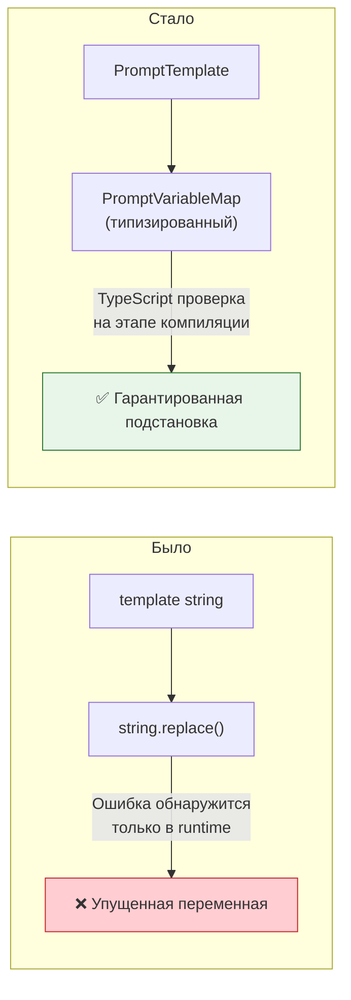

### Что мигрировано

| Стадия         | Фазы                 | Описание                               |
| -------------- | -------------------- | -------------------------------------- |
| **Stage 4**    | Phase 1, 3, 4        | Анализ документов, планирование        |
| **Stage 5**    | Section Generation   | Генерация структуры секций             |
| **Stages 4-5** | Pedagogical Guidance | Педагогические рекомендации в промптах |

### Contract Validation Tests

Каждый промпт теперь имеет контрактный тест, проверяющий что все необходимые переменные передаются корректно.

---

## 6. Оптимизация Pipeline

### Budget-Aware Phase 3 (Stage 4)

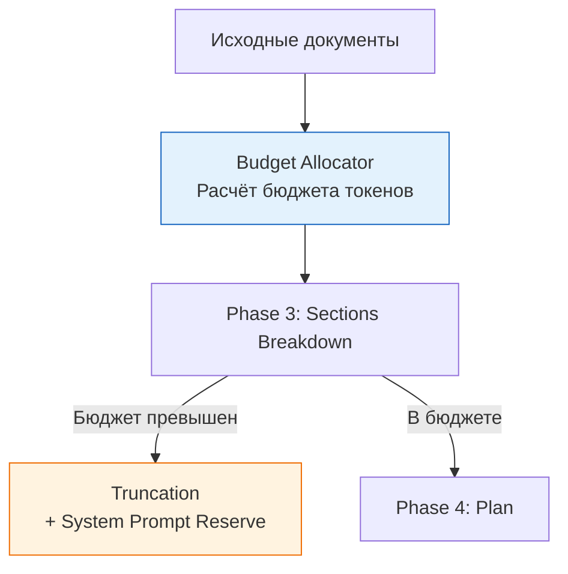

Этап анализа документов (Stage 4) теперь учитывает бюджет токенов — слишком объёмные документы автоматически обрезаются с сохранением резерва для системного промпта.

### Redis Cache-Aside

```
┌───────────────────────────────────────────────────────────┐
│  Redis кэширование файлового контента                      │
├───────────────────────────────────────────────────────────┤
│                                                            │
│  Stage 3/4: File Content Cache                             │
│  ├── Cache Hit  → 0ms доступ к содержимому файла          │
│  └── Cache Miss → Supabase → Redis → ответ                │
│                                                            │
│  Stage 6: Lesson Content Cache                             │
│  ├── Кэш-aside для результатов генерации                  │
│  └── Экономия повторных запросов при retry/regeneration    │
│                                                            │
└───────────────────────────────────────────────────────────┘
```

### Semantic Overlap Detection (Stage 4)

При разбиении документа на секции система теперь обнаруживает семантические пересечения и устраняет дублирование ещё на этапе планирования.

---

## 7. Hardening FSM и стабильность

Критическая работа по устранению ~31 000 ошибок/день на staging — система конечных автоматов (FSM) была полностью переработана.

### Definitive FSM

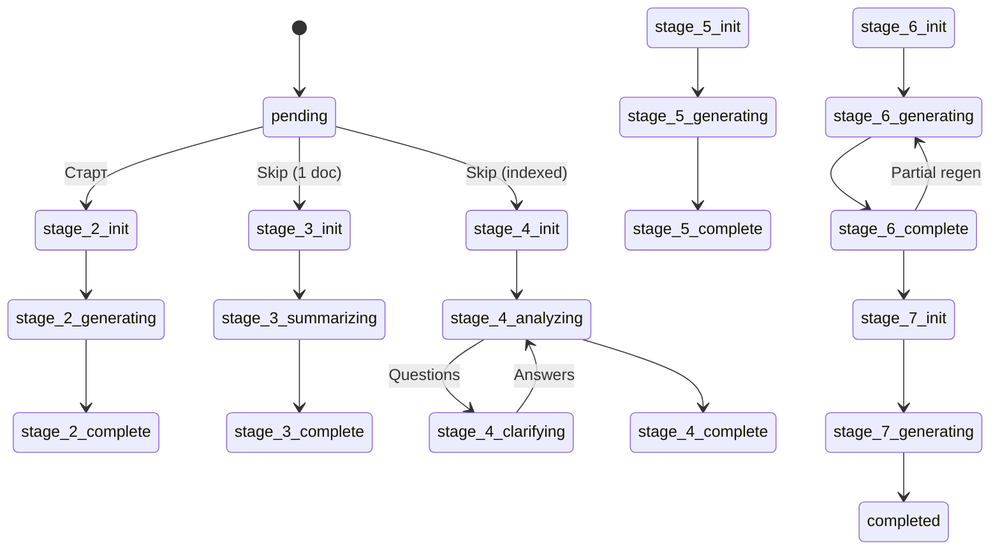

### Исправленные проблемы

| Проблема                         | Решение                                              |
| -------------------------------- | ---------------------------------------------------- |
| **31K ошибок/день**              | `--remove-orphans` убивал Redis при каждом деплое    |
| **Race Condition при старте**    | DB-level guard: атомарная проверка + обновление      |
| **Пропущенные FSM-переходы**     | Добавлены все переходы включая skip и back           |
| **Enum несоответствия**          | Имена состояний синхронизированы с фактическими enum |
| **awaiting_approval блокировки** | Добавлены переходы из состояний ожидания одобрения   |
| **Bypass Support**               | Возможность обхода FSM валидации для admin-операций  |

### Two-Layer Protection

```typescript
// Двухуровневая защита от race conditions
// Слой 1: Application guard — быстрая проверка перед дорогими операциями
// Слой 2: DB guard — атомарный check-and-update, нет окна гонки

// Migration: add_status_guard_to_fsm_init_rpc.sql
// WHERE clause в initialize_fsm_with_outbox: только NULL/pending/completed/failed/cancelled
```

---

## 8. Инфраструктура и DevOps

### Миграция на Gemini 3 Flash

```
Было:                                    Стало:
──────────────────────────────────────   ──────────────────────────────────────
google/gemini-2.0-flash-001          →   google/gemini-3-flash-preview
google/gemini-2.5-flash              →   google/gemini-3-flash-preview
google/gemini-2.5-flash-preview      →   google/gemini-3-flash-preview
google/gemini-2.0-flash-thinking     →   google/gemini-3-flash-preview

23 файла, ~85 замен
Цена: $0.50/$3.00 за 1M токенов (input/output)
```

Включено **Gemini Caching** для кэширования промптов на стороне провайдера — дополнительная экономия на повторных вызовах.

### Config-Seed Auto-Load

```
Было:                                    Стало:
290 строк DEFAULT_PHASE_CONFIGS      →   Автозагрузка из config-seed.json
(захардкожено в коде)                    (16 конфигураций, единый источник)
```

### Generation Trace Audit Page

Новая страница `/admin/generation/{courseId}/audit` для детального аудита генерации:

```
┌─────────────────────────────────────────────────────────────┐
│  Generation Trace Audit                                      │
├─────────────────────────────────────────────────────────────┤
│  Summary Stats: 127 traces | 3 models | 45min total        │
│                                                              │
│  ┌──────────────────────────────────────────────────┐       │
│  │  Stage  │ Phase │ Model  │ Lesson │ Retries │ ⏱️ │       │
│  │  6      │ gen   │ gemini │ L1     │ 0       │ 12s │      │
│  │  6      │ judge │ minimax│ L1     │ 0       │  3s │      │
│  │  6      │ gen   │ gemini │ L2     │ 1       │ 18s │      │
│  └──────────────────────────────────────────────────┘       │
│                                                              │
│  Server-side sorting (6 cols) + filtering                    │
│  SQL RPC для агрегации на стороне БД                        │
└─────────────────────────────────────────────────────────────┘
```

### Telegram Notifications

Уведомления о событиях генерации в Telegram — статус завершения, ошибки, прогресс.

### Мониторинг и observability

| Улучшение                       | Описание                                             |
| ------------------------------- | ---------------------------------------------------- |
| **Stuck Courses Detection**     | Cron-job обнаруживает курсы, застрявшие >2 часов     |
| **Recent Failures Alert**       | Алерт при >=3 сбоях за 24 часа                       |
| **Error Retention Cron**        | Автоудаление error_logs старше 14 дней               |
| **Content Retention Cron**      | Автоудаление rejected lesson_contents старше 30 дней |
| **Mermaid Pipeline Monitoring** | Мониторинг coherence patcher в admin                 |
| **Auto-Mute Rules**             | 76 правил (было ~60) для подавления шума в логах     |

---

## 9. Безопасность и база данных

### 27 миграций за период

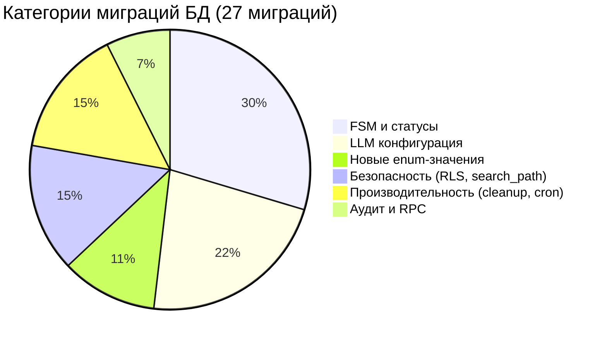

| Категория               | Миграций | Описание                                                |
| ----------------------- | -------- | ------------------------------------------------------- |
| **FSM и статусы**       | 8        | Definitive FSM, bypass support, guard, transitions      |
| **LLM конфигурация**    | 6        | Gemini 3, judges, 3-tier routing, caching               |
| **Новые enum-значения** | 3        | NLM enrichment types, stage error codes                 |
| **Безопасность**        | 4        | search_path fix, pg_trgm move, RLS clarifying_questions |
| **Производительность**  | 4        | DB cleanup (391→153 MB), stuck detection cron           |
| **Аудит**               | 2        | Audit summary RPC, failed_at_stage tracking             |

### Database Health Cleanup

Масштабная очистка базы данных:

```
Было: 391 MB                         Стало: 153 MB (-61%)
──────────────────────                ──────────────────────
lesson_enrichments: 76 MB         →   16 KB (VACUUM FULL)
generation_trace: bloated         →   Reduced (SELECT * → specific cols)
Realtime subscription removed     →   Saved 10-500 KB per trace row

Дополнительно:
- Drop 9 unused indexes (40+ MB, 0 scans)
- Trace prompts → local JSONL files (не в Supabase)
- TRACE_STORE_PROMPTS env flag для контроля
```

### Security Improvements

| Исправление                  | Описание                                      |
| ---------------------------- | --------------------------------------------- |
| **search_path fix**          | Исправлен mutable search_path на 3 функциях   |
| **pg_trgm extension**        | Перемещён из public в extensions schema       |
| **RLS clarifying_questions** | Ограничен доступ до service_role              |
| **RLS pwa_analytics**        | INSERT ограничен для anon+authenticated ролей |
| **Zod regex validation**     | Защита search inputs от SQL injection         |

---

## 10. Качество кода и тестирование

### Тестирование

| Метрика               | Значение         |
| --------------------- | ---------------- |
| **Новых тестов**      | 102 файла        |
| **Test commits**      | 16               |
| **Contract tests**    | PromptService    |
| **Coherence patcher** | Rejection tests  |
| **Recovery logic**    | Fallback refusal |

### Ключевые тестовые улучшения

- **Contract Validation Tests** для PromptService — каждый промпт проверяется на соответствие типизированному контракту
- **Coherence Patcher Tests** — тесты отклонения некачественного контента
- **Recovery Logic Tests** — проверка отказа от нечёткого fallback-матчинга
- **Qdrant Integration Tests** — проверка существования коллекций перед тестами
- **Python Bridge Tests** — проверка отклонения лишних полей (extra="forbid")

### Observability

- **Trace Events**: cache_hit, tier1_pass, max_score
- **Reject Telemetry**: трекинг причин отклонения контента
- **Error Classification**: 5 новых stage_error_code enum-значений

---

## 11. UX-улучшения

### Lesson Viewer

- Убраны ограничения max-width — контент урока занимает всё доступное пространство
- Lesson Materials Switcher — переключатель между материалами урока

### Tester Feedback Fixes

По результатам тестирования реальными пользователями:

| Исправление              | Описание                                                   |
| ------------------------ | ---------------------------------------------------------- |
| **CJK Patching**         | Корректная обработка китайских/японских/корейских символов |
| **Header Replacement**   | Исправлена замена заголовков                               |
| **Mermaid Wrapping**     | Корректное отображение Mermaid-диаграмм                    |
| **Sidebar Descriptions** | Описания в боковой панели навигации                        |

### Enrichment UI

- **Unique Placeholder Images** — уникальные плейсхолдеры для 4 новых NLM-типов
- **Hide/Unhide Logic** — динамическое скрытие/показ типов обогащений
- **Enrichment Settings** — нормализация пустых настроек

---

## 12. Версионирование

### Release Timeline

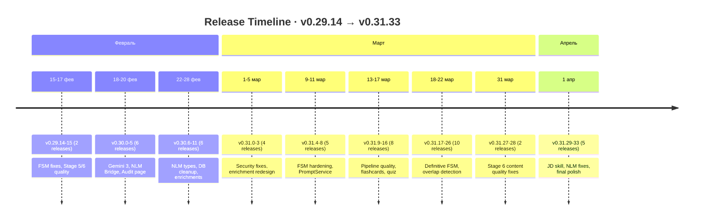

### Основные версии

| Версия   | Дата   | Ключевые изменения                              |
| -------- | ------ | ----------------------------------------------- |
| v0.29.15 | 16 фев | Stage 5 sequential generation, Stage 6 cache    |
| v0.30.0  | 17 фев | Gemini 3 Flash migration, CLEV judge update     |
| v0.30.5  | 20 фев | NLM Bridge, Trace Audit page                    |
| v0.30.11 | 27 фев | DB cleanup (391→153 MB), NLM enrichment types   |
| v0.31.0  | 1 мар  | Security fixes, enrichment redesign             |
| v0.31.8  | 11 мар | PromptService migration, FSM hardening          |
| v0.31.16 | 17 мар | Flashcards redesign, Quiz, Pipeline quality     |
| v0.31.26 | 22 мар | Definitive FSM, Two-Tier RAG, overlap detection |
| v0.31.33 | 1 апр  | JD Role Guide skill, NLM fixes, content quality |

### Статистика релизов

```
Patch releases:  43 (93%)
Minor releases:   3 (7%)   — v0.30.0, v0.31.0, отдельные minor-бампы
Major releases:   0 (0%)

Среднее: 1.0 релиза в день
Максимум: 3 релиза (16-17 февраля)
```

---

## 13. Резюме

### Достижения периода

| Категория                        | Достижение                                                                          |
| -------------------------------- | ----------------------------------------------------------------------------------- |
| **Качество генерации (Stage 6)** | Two-Tier RAG, Self-Reviewer, CLEV Judge обновление — уроки стали точнее и грамотнее |
| **NotebookLM интеграция**        | FastAPI Bridge, 4 новых типа обогащений, аудио/видео генерация                      |
| **Редизайн обогащений**          | 14 типов, batch UI, markmap mind maps, flashcard redesign, quiz                     |
| **PromptService**                | Типобезопасные промпты с контрактными тестами                                       |
| **FSM Hardening**                | Definitive FSM с 27 миграциями, устранение 31K ошибок/день                          |
| **Gemini 3 Flash**               | Миграция на новую модель + caching, 23 файла, ~85 замен                             |
| **DB Health**                    | Сокращение БД с 391 до 153 MB (-61%), 9 неиспользуемых индексов удалено             |
| **Мониторинг**                   | Audit page, stuck detection, Telegram notifications, auto-mute rules                |
| **Безопасность**                 | RLS фиксы, search_path, SQL injection protection                                    |
| **Стабильность**                 | 188 исправлений — платформа приведена к промышленному качеству                      |

### Ключевые метрики

```
┌────────────────────────────────────────────────────────────┐
│                                                            │
│   46 релизов             │   373 коммита                  │
│                                                            │
│   50 новых функций       │   188 исправлений               │
│                                                            │
│   205 новых файлов       │   102 новых теста               │
│                                                            │
│   27 миграций БД         │   14 типов обогащений           │
│                                                            │
│   46 Stage 6 коммитов    │   76 auto-mute rules            │
│                                                            │
│   2 712 TS-файлов        │   483 React-компонента          │
│                                                            │
└────────────────────────────────────────────────────────────┘
```

### Итог

За 47 дней платформа прошла фазу **промышленной стабилизации**:

1. **Радикальное улучшение качества генерации уроков** — Two-Tier RAG устраняет 75% пустых запросов к документам, Self-Reviewer автоматически проверяет орфографию и связность, обновлённая система CLEV Judge с 3 AI-судьями обеспечивает объективную оценку. Секции теперь генерируются последовательно с дайджестом, что исключает дублирование материала.

2. **Полноценная интеграция с Google NotebookLM** — отдельный FastAPI-сервис (Python Bridge) автоматически генерирует аудио-подкасты, видео-лекции, учебные пособия, карточки, интеллект-карты и инфографики из содержания уроков. 6 типов NotebookLM-обогащений доступны в один клик.

3. **Редизайн системы обогащений** — 14 типов обогащений с единой сеткой карточек, интерактивные markmap-диаграммы вместо статичных, обновлённые flashcard-карточки с fullscreen study mode, разблокированный Quiz с мульти-выбором.

4. **Типобезопасные промпты (PromptService)** — все промпты Stages 4-5 мигрированы на типизированную систему с контрактными тестами, что исключает класс runtime-ошибок от несоответствия переменных.

5. **Definitive FSM** — полная переработка конечного автомата генерации: 27 миграций, двухуровневая защита от race conditions, bypass для admin-операций. Устранена корневая причина ~31 000 ошибок/день.

6. **Оптимизация инфраструктуры** — миграция на Gemini 3 Flash с caching, Redis cache-aside, сокращение БД на 61% (391→153 MB), удаление 9 неиспользуемых индексов, новая страница аудита генерации.

7. **Промышленная стабильность** — соотношение fix/feat = 3.8:1 показывает зрелую фазу развития. 188 исправлений по результатам реального тестирования, 76 auto-mute rules для чистых логов, cron-задачи для обнаружения зависших генераций и очистки устаревших данных.

### Roadmap: Ближайшие шаги

| Приоритет | Задача                                         |
| --------- | ---------------------------------------------- |
| **P1**    | Стабилизация NLM Pipeline для продакшена       |
| **P1**    | Расширение PromptService на все стадии         |
| **P1**    | Stage 6 quality — финальная калибровка моделей |
| **P2**    | Video Pipeline MVP (TTS + Slides)              |
| **P2**    | Analytics Dashboard для инструкторов           |
| **P3**    | AI Tutor (real-time)                           |

---

_Отчёт сгенерирован: 2 апреля 2026_
_Период: 15 февраля — 2 апреля 2026_
_Версии: v0.29.14 → v0.31.33_
