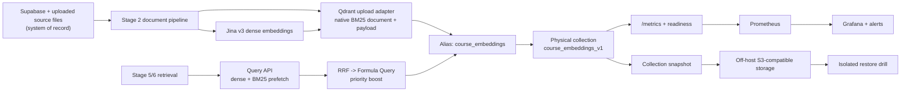

# Self-Hosted Qdrant Platform Design

Date: 2026-07-10
Owner: Codex
Implementation epic: `mc2-jz6y0`
Planning task: `mc2-jz6y0.1`
Status: approved for implementation planning by the product owner

> Implementation status (2026-07-12): Q6-Q9 are accepted locally. Runtime truth
> is pinned Qdrant 1.18.2 with native multilingual BM25/IDF, server RRF nested in
> Formula, strict indexes, recoverable reindex/snapshots, and pinned monitoring.
> The “Current runtime” and “correctness gaps” below are the superseded discovery
> baseline, not current runtime guidance. Q12 remote activation remains unauthorized.

## Executive Decision

MegaCampus will replace the unusable Qdrant Cloud dependency with a version-pinned, single-node, self-hosted Qdrant service on the existing server. The old Cloud database was test-only and is lost, so there is no cloud-data migration. Qdrant remains a derived search index; source documents and their database metadata remain the system of record.

The implementation will adopt the useful OSS features that are currently missing:

- Qdrant-native BM25 documents with collection-side IDF;
- server-side RRF followed by Formula Query priority scoring;
- tenant-aware and filter-complete payload indexes;
- strict mode with Cloud-like safety limits;
- physical collection versioning behind the stable `course_embeddings` alias;
- optional result grouping by `document_id`, enabled only after the retrieval regression gate passes;
- Qdrant-native S3-compatible snapshot storage and an automated restore drill;
- `/metrics`, readiness checks, Grafana dashboards, and actionable alerts;
- API-key security, a read-only operations key, private networking, and loopback-only operator access to the built-in Web UI;
- deterministic bootstrap, schema verification, reindex, cutover, and rollback tools.

This design does not create a multi-node cluster, enable quantization, or move hot vectors and indexes to disk. Current volume and server capacity do not justify those accuracy, latency, and operational trade-offs.

## Context And Evidence

### Current runtime

> Historical discovery snapshot from 2026-07-10; superseded by the accepted
> implementation described in this design and the operator runbook.

- The live local Qdrant server reports version `1.18.2`; the application uses `@qdrant/js-client-rest` `1.18.0`.
- Dev already has a local `qdrant-dev` container, but the image is `latest`, has no readiness health check, and exposes only an admin API key.
- Staging applications still receive the broken Cloud endpoint. A read-only `GET /collections` returns plain `404 page not found`, so the endpoint is not a working Qdrant database API.
- `course_embeddings` currently has a named 768-dimensional `dense` vector, a `sparse` vector, and only three payload indexes: `document_id`, `organization_id`, and `course_id`.
- Native server-side RRF and grouping work on the current local server.
- A `qdrant/bm25` document query is accepted by the server, but it cannot match existing points because the stored sparse vectors use the project's custom hash space.

### Correctness gaps found in the application

1. `packages/course-gen-platform/src/shared/embeddings/bm25.ts` keeps corpus statistics in a process-local singleton. Stage 2 ingestion and Stage 5/6 retrieval run in different workers, so query-time IDF and average length are not the corpus used during ingestion.
2. `metadata-enricher.ts` already produces `document_priority` and `document_weight`, but `upload-helpers.ts` manually rebuilds the payload and drops both fields. Current client-side priority boosting therefore receives the fallback weight `0.5` and is effectively a no-op.
3. `tests/integration/qdrant.test.ts` decides whether to skip the suite before its asynchronous availability check runs. The broad integration scenarios can be silently skipped.
4. `chunk_id` and every optional search-filter field lack indexes. Strict mode cannot be enabled safely until the index set matches actual filters and delete/scroll operations.
5. User and operations docs still describe Qdrant Cloud as the default setup.

## Approaches Considered

### A. Minimal lift-and-shift

Run the current image locally and only replace `QDRANT_URL`.

This is fast, but it preserves inconsistent BM25, missing priority payloads, `latest` drift, weak tests, no recovery, and no observability. Rejected.

### B. Production-ready single-node self-hosting

Use one persistent Qdrant node per environment, correct the retrieval contract, add operational safety and recovery, and keep migration paths behind aliases.

This provides the Cloud-like protections and the OSS search features that matter now, while matching the available server resources. Selected.

### C. Distributed cluster immediately

Run three Qdrant peers with replication, shard movement, and automated failover.

This would consume substantially more RAM and operator time while all peers would still share one physical server and failure domain. It would add complexity without meaningful availability. Deferred until a second failure domain and measured load exist.

## Goals

- Make self-hosted Qdrant the only supported dev and staging runtime target.
- Restore correct RU/EN hybrid retrieval from a fresh derived index.
- Make document priority affect ranking on the server without mutating scores in application code.
- Fail fast on unindexed filters and unsafe query shapes.
- Make collection creation, validation, version migration, backup, restore, and rollback repeatable.
- Detect availability, error-rate, memory, point-count, and snapshot failures before users find them.
- Preserve the existing hard-fail policy when document-backed RAG is required and unavailable.

## Non-Goals

- Recovering the lost Qdrant Cloud database.
- Replacing Jina v3 dense embeddings.
- Moving primary source documents or authoritative metadata into Qdrant.
- Exposing Qdrant, Prometheus, Grafana, or the Web UI on a public interface.
- Deploying or mutating staging as part of the implementation branch without explicit current-task authorization.
- Building multi-node HA on a single physical host.

## Target Architecture



### Environment topology

| Environment | Service                                | Network access                                     | Persistent storage      | Application URL          |
| ----------- | -------------------------------------- | -------------------------------------------------- | ----------------------- | ------------------------ |
| CI          | `qdrant` service container             | job-local `localhost:6333`                         | ephemeral               | `http://localhost:6333`  |
| Dev         | `qdrant-dev`                           | Docker network plus `127.0.0.1:6333`               | `megacampus_qdrant-dev` | `http://qdrant-dev:6333` |
| Staging     | `qdrant` in `docker-compose.infra.yml` | Docker network plus operator-only `127.0.0.1:6335` | `megacampus_qdrant`     | `http://qdrant:6333`     |

The staging API, main worker, and Stage 6 worker must set `QDRANT_URL=http://qdrant:6333` explicitly in Compose so a stale Cloud URL in `.env.production` cannot override the self-hosted target. Dev keeps the same explicit override pattern with `qdrant-dev`.

## Version And Resource Baseline

- Qdrant Docker image: `qdrant/qdrant:v1.18.2` in dev, staging, and CI.
- JavaScript client: exact `@qdrant/js-client-rest` version `1.18.0`; remove the caret range.
- Staging resource limit: 2 CPU and 2 GiB RAM.
- Dev resource limit: 1 CPU and 1 GiB RAM.
- One shard, replication factor 1, write consistency factor 1.
- Dense vectors, sparse index, payload, and payload indexes stay in memory at current scale.
- Qdrant anonymous telemetry is disabled; application-owned Prometheus metrics remain enabled.

An upgrade is a tracked operation: snapshot, read release notes, update the pinned server/client pair, run the full local integration suite and restore drill, then use alias cutover. `latest` is not accepted anywhere, including CI.

## Security Model

- Qdrant is never bound to `0.0.0.0` and is not exposed through nginx.
- Application services use `QDRANT_API_KEY` for read/write operations.
- Prometheus and human read-only inspection use `QDRANT_READ_ONLY_API_KEY`.
- Both keys are runtime secrets and never appear in tracked files, generated reports, command output, or GitHub Actions logs.
- Readiness endpoints may remain unauthenticated because they expose only liveness state and are loopback/private-network reachable.
- The built-in Web UI is accessed through an SSH tunnel to `127.0.0.1:6335/dashboard` and uses the read-only key for ordinary inspection.
- TLS is not required between containers on the same host/private Docker bridge. It becomes mandatory before any non-loopback or cross-host exposure.
- JWT RBAC is deferred while one trusted application and one collection are the only consumers. Enable it when collection-scoped third-party access appears.

## Collection Contract

### Names

- Logical application name: environment variable `QDRANT_COLLECTION_NAME`, default `course_embeddings`.
- Initial physical name: `course_embeddings_v1`.
- Application reads and writes through the logical alias only.
- Bootstrap and reindex tools may target an explicit physical collection.

The dev legacy physical collection named `course_embeddings` is test data and may be removed only by an explicit `--allow-drop-legacy` bootstrap flag. The tool must refuse an alias conflict without that flag.

### Vector configuration

```typescript
{
  vectors: {
    dense: {
      size: 768,
      distance: 'Cosine',
      hnsw_config: { m: 16, ef_construct: 100 },
      on_disk: false,
    },
  },
  sparse_vectors: {
    sparse: {
      index: { on_disk: false },
      modifier: 'idf',
    },
  },
  shard_number: 1,
  replication_factor: 1,
  write_consistency_factor: 1,
  optimizers_config: { indexing_threshold: 20000 },
}
```

### Native BM25 contract

Every ingested chunk and every sparse query use the same document object:

```typescript
{
  text,
  model: 'qdrant/bm25',
  options: {
    language: 'none',
    tokenizer: 'multilingual',
    lowercase: true,
    k: 1.2,
    b: 0.75,
    avg_len: 256,
  },
}
```

`language: 'none'` avoids applying English stemming and stop words to Russian content. `tokenizer: 'multilingual'` provides one consistent RU/EN token space. The exact options must be shared by ingestion and retrieval from one exported constant. Language-specific sparse vector fields may be evaluated later, but mixing different BM25 preprocessing options in one vector field is not allowed.

### Payload indexes

All fields used by current filters, filtered updates, hierarchy lookups, or grouping are indexed before points are uploaded.

| Field             | Schema                     | Reason                                   |
| ----------------- | -------------------------- | ---------------------------------------- |
| `organization_id` | keyword, `is_tenant: true` | tenant partition and organization filter |
| `course_id`       | keyword                    | dominant course filter and delete        |
| `document_id`     | keyword                    | document filter, delete, and grouping    |
| `chunk_id`        | keyword                    | parent/sibling lookup                    |
| `level`           | keyword                    | parent/child filter                      |
| `chapter`         | keyword                    | hierarchy filter                         |
| `section`         | keyword                    | hierarchy filter                         |
| `has_code`        | bool                       | content filter                           |
| `has_formulas`    | bool                       | content filter                           |
| `has_tables`      | bool                       | content filter                           |
| `has_images`      | bool                       | content filter                           |

`document_weight` remains a numeric payload value for Formula Query. It is not a filter and does not need an index.

### Strict mode

The physical collection is created with:

```typescript
{
  enabled: true,
  unindexed_filtering_retrieve: false,
  unindexed_filtering_update: false,
  max_query_limit: 100,
  max_timeout: 120,
  upsert_max_batchsize: 128,
  search_max_batchsize: 64,
  filter_max_conditions: 16,
  condition_max_size: 256,
  max_payload_index_count: 16,
  max_resident_memory_percent: 90,
}
```

Rate limits and maximum collection byte/point limits are not guessed. They are added only after at least seven days of observed traffic and growth metrics.

## Ingestion Contract

`toQdrantPoint()` must call the existing `toQdrantPayload()` function and remove only `null` or `undefined` values. It must not maintain a second hand-written list of payload fields.

Each point contains:

- `dense`: the existing 768-dimensional Jina v3 vector;
- `sparse`: the native BM25 document object above;
- the complete enriched payload, including `document_priority` and `document_weight`.

The custom `BM25Scorer`, its global singleton, corpus-statistics accumulation, hash vocabulary, and client-side sparse-vector generation are removed from runtime code.

## Retrieval Contract

### Hybrid query

Hybrid retrieval uses one Qdrant Query API request:

1. sparse native-BM25 prefetch with the configured filter;
2. dense prefetch with the same filter and dense threshold;
3. server-side RRF over both prefetches;
4. optional Formula Query over the fused score;
5. optional grouping by `document_id`.

Dense-only search remains available for explicit callers and as the current operational fallback when hybrid search fails. A hybrid failure must be logged with enough context to alert on persistent fallback rates.

### Priority Formula

When `enable_priority_boost` is true, Qdrant applies the existing product formula on the server:

```text
finalScore = $score * (1 + (clamp(document_weight, 0.5, 1.0) - 0.5) * boostFactor)
```

The default `boostFactor` remains `0.4`: CORE receives at most +20%, IMPORTANT +12%, and SUPPLEMENTARY no boost. A missing or invalid `document_weight` defaults to `0.5`. Client-side score mutation and sorting are removed.

### Document diversity

Add `group_by_document` and `group_size` search options. Stage 5/6 retrieval may enable `group_by_document: true` with `group_size: 2` only after the RU/EN regression fixture proves that required evidence remains retrievable. The adapter flattens groups round-robin and preserves the caller's total `limit`.

## Alias, Reindex, And Cutover

### Bootstrap

The bootstrap command is idempotent and performs this order:

1. connect and verify server/client compatibility;
2. create the physical collection if absent;
3. create all payload indexes;
4. verify dense, sparse, index, and strict-mode configuration;
5. create or verify the logical alias;
6. refuse drift instead of silently accepting an incompatible collection.

### Reindex source

Qdrant is rebuilt from authoritative `file_catalog` rows and their source files. The reindex tool has `plan`, `execute`, and `verify` modes and accepts `--target-collection`.

Plan mode reports:

- total eligible documents;
- documents whose source file is available;
- documents missing a recoverable source;
- expected course, organization, and point counts;
- estimated Jina request volume.

Execute mode reuses the Stage 2 parsing, chunking, metadata, dense embedding, and upload path. It is idempotent by document/chunk identity, concurrency-bounded, and writes to the explicit physical target. Missing source files are reported, not represented as successfully indexed.

Verify mode compares source document counts with distinct `document_id` payloads, validates tenant/course isolation, and runs the RU/EN hybrid relevance fixture.

### First cutover

Because the old Cloud index is unavailable, the first staging cutover has no data-preservation dependency:

1. deploy the self-hosted service without pointing application containers at it;
2. bootstrap `course_embeddings_v1` and alias;
3. run reindex plan and execute;
4. pass schema, count, hybrid, priority, and restore checks;
5. with explicit deploy authorization, recreate API/main worker/Stage 6 worker using the local URL;
6. run document-backed Stage 2 -> Stage 5/6 smoke;
7. observe metrics and logs before declaring the cloud blocker superseded.

### Future cutover

Create `course_embeddings_vN`, backfill and verify it, then swap alias actions atomically. Keep the previous physical collection until the rollback window and a successful snapshot complete. Rollback is another alias swap; it does not require application redeploy.

## Backups And Recovery

- Recovery objective: RPO 6 hours, RTO 60 minutes for the derived index.
- Create a collection snapshot every 6 hours.
- Configure staging Qdrant's native `storage.snapshots_config` with `snapshots_storage: s3`; a MinIO volume on the same server does not satisfy off-host recovery.
- Keep snapshots for 30 days using bucket lifecycle policy. Dev may use local snapshot storage for integration drills.
- Record snapshot name, collection, point count, size, SHA-256 checksum, creation time, and remote URI in a manifest.
- Run an automated monthly restore drill into an isolated temporary collection.
- A restore drill passes only when counts, payload indexes, strict mode, one dense query, one RU BM25 query, one EN BM25 query, and one priority Formula Query pass.
- The drill deletes only its temporary collection after recording evidence.

Credentials and bucket names are deployment secrets. Implementation must support Qdrant's `QDRANT__STORAGE__SNAPSHOTS_CONFIG__S3_CONFIG__BUCKET`, `REGION`, `ACCESS_KEY`, `SECRET_KEY`, and `ENDPOINT_URL` environment mapping without committing values.

## Monitoring And Web UI

Qdrant's `/metrics?per_collection=true` endpoint is scraped by a self-hosted Prometheus service. Grafana is provisioned with a Qdrant dashboard and alert rules. Both services bind to loopback only and use persistent volumes with bounded retention.

Minimum dashboard panels:

- readiness and recovery mode;
- Qdrant version;
- collection points and vectors by vector name;
- REST request rate, failures, and p95 latency;
- memory allocated/resident and process limits;
- active/running optimizations;
- snapshot creation and restore activity;
- dense/hybrid fallback count from application logs/metrics;
- last successful off-host backup and restore drill age.

Minimum alerts:

| Alert                            | Condition                                                     | Severity |
| -------------------------------- | ------------------------------------------------------------- | -------- |
| `QdrantDown`                     | readiness absent for 2 minutes                                | critical |
| `QdrantRecoveryMode`             | recovery mode equals 1 for 5 minutes                          | critical |
| `QdrantRestErrorRateHigh`        | failures exceed 2% for 10 minutes                             | warning  |
| `QdrantMemoryHigh`               | resident memory exceeds 85% of container limit for 15 minutes | warning  |
| `QdrantPointCountUnexpectedDrop` | active collection loses more than 10% between scrapes         | critical |
| `QdrantSnapshotStale`            | no successful off-host backup for 8 hours                     | critical |
| `QdrantRestoreDrillStale`        | no successful restore drill for 35 days                       | warning  |
| `QdrantHybridFallbackHigh`       | dense fallbacks exceed 5% of hybrid requests for 15 minutes   | warning  |

Notification delivery uses a provisioned secret-backed Grafana/Alertmanager contact point. No token or chat identifier is embedded in configuration.

## Failure Semantics

- Missing source documents during reindex: report a bounded data gap; do not invent vectors or mark the row indexed.
- Schema drift: bootstrap/verify fails and prints the mismatched field; it does not mutate an existing collection automatically.
- Native BM25 or Formula Query incompatibility: fail CI/integration; do not silently ship the custom BM25 fallback.
- Hybrid runtime failure: retain the existing logged dense fallback for availability, while alerting on fallback rate.
- Qdrant unavailable for a course with uploaded documents: preserve the existing `RAG_INFRA_UNAVAILABLE` hard-fail behavior.
- Snapshot upload failure: keep the local snapshot, alert, and retry without deleting the last known-good remote snapshot.
- Restore failure: leave the active alias untouched.

## Verification Strategy

### Unit

- collection schema and strict-mode constants;
- alias conflict and drift behavior;
- native BM25 document options are identical on upload and query;
- complete payload includes priority fields;
- Formula Query request shape and default weight;
- grouped-result flattening preserves limit and diversity;
- backup manifest/retention logic;
- reindex plan classification.

### Local integration

- create physical collection and alias on pinned Qdrant `1.18.2`;
- upload RU and EN chunks through the production adapter;
- verify dense, BM25, RRF, Formula Query, grouping, filters, deletes, and strict-mode rejection of an unindexed field;
- snapshot and restore to an isolated collection;
- prove tenant/course isolation;
- run the broad integration suite without the current skip bug.

### CI and repository gates

- pin all CI Qdrant service images;
- expand the blocking CI Qdrant smoke beyond create/upsert/retrieve/delete;
- run focused unit and integration tests;
- run Compose config validation for dev and staging files;
- run `pnpm type-check` and `pnpm build`;
- run process verification, documentation review, Graphify refresh, and stage closeout.

### Authorized live smoke

Live staging mutation is a separate permission gate. When authorized, prove:

- the active API and both RAG-capable workers resolve the Docker-local Qdrant URL;
- a source document reaches `vector_status='indexed'`;
- Stage 5/6 retrieves that document with hybrid search;
- CORE priority changes ordering in a controlled fixture;
- backup and monitoring evidence are present;
- no application container uses the retired Cloud hostname.

## Implementation Task Catalogue

| ID  | Task                                                                     | Depends on                     | Acceptance                                                      |
| --- | ------------------------------------------------------------------------ | ------------------------------ | --------------------------------------------------------------- |
| Q1  | Central config, pinned versions, collection schema, indexes, strict mode | none                           | pure schema tests and Compose config pass                       |
| Q2  | Physical collection bootstrap, alias management, schema verifier         | Q1                             | idempotency, drift refusal, and alias tests pass                |
| Q3  | Complete payload and native BM25 ingestion                               | Q1                             | priority fields and native sparse document persist              |
| Q4  | Native BM25 query, RRF, Formula Query, grouping                          | Q1, Q3                         | RU/EN ranking and diversity integration gates pass              |
| Q5  | Repair/expand local and CI integration coverage                          | Q2-Q4                          | broad suite executes and blocks regressions                     |
| Q6  | Self-hosted dev/staging Compose, security, health, URL wiring            | Q1                             | pinned private services and health dependencies validate        |
| Q7  | Reindex plan/execute/verify tooling                                      | Q2, Q3                         | dry-run report, idempotent target writes, and count checks pass |
| Q8  | Snapshot, off-host copy, retention, and restore drill                    | Q2, Q6                         | isolated restore evidence passes                                |
| Q9  | Prometheus, Grafana, alerts, and Web UI runbook                          | Q6                             | scrape/dashboard rules validate without public exposure         |
| Q10 | Docs, environment examples, deploy/rollback runbook                      | Q1-Q9                          | Cloud instructions retired; operator path complete              |
| Q11 | Dev activation and smoke                                                 | Q1-Q10                         | local/dev document-backed RAG smoke passes                      |
| Q12 | Authorized staging cutover and observation                               | Q1-Q11, explicit authorization | local URL, reindex, smoke, backup, and monitoring evidence pass |

## Parallel Decomposition For The Implementation Orchestrator

| Stream                    | Goal    | Suggested agent                              | Write zone                                                                     | Dependencies            | Verification                              | Decision                   |
| ------------------------- | ------- | -------------------------------------------- | ------------------------------------------------------------------------------ | ----------------------- | ----------------------------------------- | -------------------------- |
| S1 search correctness     | Q1-Q5   | high-reasoning worker + correctness reviewer | `packages/course-gen-platform/src/shared/{qdrant,embeddings}` and Qdrant tests | schema first            | focused Vitest + pinned local integration | parallel after Q1 contract |
| S2 runtime infrastructure | Q6      | deploy specialist                            | Compose, CI service definitions, deploy scripts, env examples                  | Q1 env/version contract | Compose config + shell tests              | parallel after Q1 contract |
| S3 data lifecycle         | Q7-Q8   | worker with data-migration reasoning         | Qdrant tools/scripts and their tests                                           | Q2/Q3 contracts         | plan fixture + snapshot restore drill     | sequential after Q2/Q3     |
| S4 observability/docs     | Q9-Q10  | deploy specialist + docs reviewer            | monitoring config and operator docs                                            | S2 topology             | config validation + docs review           | parallel with S3 after S2  |
| S5 acceptance             | Q11-Q12 | orchestrator + correctness/deploy reviewers  | evidence, Beads, stage artifacts                                               | all prior streams       | full gates; live only with permission     | sequential                 |

The fresh orchestrator must create/claim Beads children before file-changing delegated streams, use dedicated worktrees, and keep write zones disjoint.

## Explicit Defers

- Multi-node replication and automatic shard movement: requires a second failure domain.
- Scalar/product quantization: current scale does not justify recall risk; evaluate when memory or vector count crosses an observed threshold.
- On-disk dense vectors, HNSW, sparse index, or payload: keep hot data in memory while it fits; evaluate against NVMe latency when RAM exceeds 70% persistently.
- Custom sharding beyond the tenant-aware `organization_id` index: evaluate when tenant cardinality or hot-tenant skew becomes measurable.
- JWT RBAC and collection-scoped external keys: enable when consumers exist beyond the trusted application and operators.
- Qdrant-managed dense inference: Jina v3 remains the approved dense model; self-hosted native BM25 is the only inference feature adopted here.
- Language-specific `sparse_ru` and `sparse_en` vector fields: evaluate only if the multilingual/no-stemming regression set underperforms.

Each defer is a capacity or product trigger, not unfinished implementation scope.

## Documentation Impact

Implementation updates at least:

- `docs/quickstart.md`;
- `.claude/docs/deployment-guide.md`;
- `.env.production.example`;
- `packages/course-gen-platform/.env.example`;
- `packages/course-gen-platform/src/shared/qdrant/README.md` and collection/upload guides;
- a new self-hosted Qdrant operations runbook;
- `.codex/project-index.md`, stage summary, and current-state handoff at closeout.

## Authoritative References

- [Qdrant installation and deployment choices](https://qdrant.tech/documentation/installation/)
- [Native BM25 and text-processing options](https://qdrant.tech/documentation/search/text-search/full-text-search/)
- [Hybrid queries, RRF, Formula Query, and grouping](https://qdrant.tech/documentation/search/hybrid-queries/)
- [Payload indexing, tenant indexes, and IDF](https://qdrant.tech/documentation/manage-data/indexing/)
- [Collections and aliases](https://qdrant.tech/documentation/manage-data/collections/)
- [Strict mode and administration](https://qdrant.tech/documentation/operations/administration/)
- [Snapshots and recovery](https://qdrant.tech/documentation/operations/snapshots/)
- [Monitoring and health endpoints](https://qdrant.tech/documentation/ops-monitoring/monitoring/)
- [Self-hosted security](https://qdrant.tech/documentation/tutorials-operations/secure-qdrant/)
- [Built-in Web UI](https://qdrant.tech/documentation/web-ui/)
