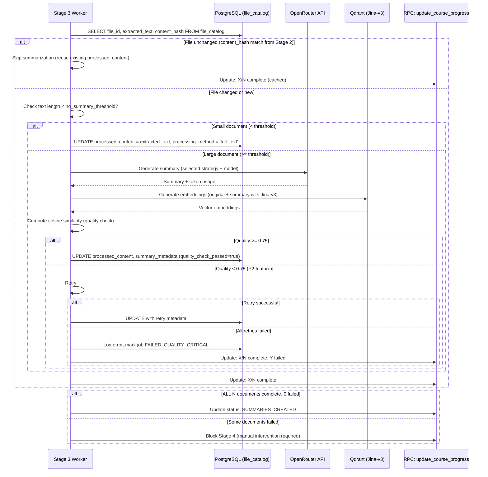

# Data Model: Stage 3 - Document Summarization

**Feature**: Stage 3 - Document Summarization
**Created**: 2025-10-28
**Status**: Draft (pending research decisions)

## Overview

Stage 3 extends existing `file_catalog` table with processed_content and metadata to support LLM-generated summaries. No new tables required - leverages existing infrastructure from Stage 0-2.

**Key Principles**:
- **Reuse existing schema**: Extend `file_catalog` table (no new tables)
- **Overwrite strategy**: No version history (regenerate on file change only)
- **Metadata-rich**: Track processing method, costs, quality metrics
- **Change detection**: Reuse Stage 2 vectorization logic to skip unchanged files

---

## Entity Definitions

### 1. File Catalog (Extended)

**Purpose**: Store document summaries and processing metadata (extends existing Stage 2 schema)

**Table**: `file_catalog` (existing table, add columns)

**New Columns** (migration required):

| Column Name | Type | Nullable | Default | Description |
|------------|------|----------|---------|-------------|
| `processed_content` | TEXT | YES | NULL | LLM-generated summary or full text (if < threshold) |
| `processing_method` | VARCHAR(50) | YES | NULL | How content was processed: 'full_text', 'map_reduce', 'refine', 'map_rerank', etc. |
| `summary_metadata` | JSONB | YES | NULL | Metadata: token counts, cost, quality score, model used, timestamps |

**Existing Columns** (from Stage 0-2, reused):

| Column Name | Type | Description |
|------------|------|-------------|
| `file_id` | UUID | Primary key |
| `course_id` | UUID | Foreign key to courses table |
| `organization_id` | UUID | Multi-tenant isolation (RLS) |
| `original_filename` | VARCHAR(255) | User-uploaded file name |
| `storage_path` | TEXT | Supabase Storage path |
| `mime_type` | VARCHAR(100) | File content type |
| `file_size_bytes` | BIGINT | Original file size |
| `upload_status` | VARCHAR(50) | 'pending', 'completed', 'failed' |
| `extracted_text` | TEXT | Raw text from Stage 2 (source for summarization) |
| `content_hash` | VARCHAR(64) | SHA-256 hash for deduplication |
| `created_at` | TIMESTAMPTZ | Upload timestamp |
| `updated_at` | TIMESTAMPTZ | Last modification timestamp |

**Constraints**:
- `file_id` PRIMARY KEY
- `course_id` FOREIGN KEY REFERENCES courses(course_id) ON DELETE CASCADE
- `organization_id` NOT NULL (RLS enforcement)
- `processed_content` length limit: ~1M characters (200K tokens × ~5 chars/token)

**Indexes** (existing + new):
- ✅ Existing: `idx_file_catalog_course_id` (course_id)
- ✅ Existing: `idx_file_catalog_organization_id` (organization_id)
- 🆕 New: `idx_file_catalog_processing_method` (processing_method) - for analytics queries

**RLS Policies** (existing, no changes):
- SELECT: `organization_id = auth.jwt() -> 'organization_id'`
- INSERT: `organization_id = auth.jwt() -> 'organization_id'`
- UPDATE: `organization_id = auth.jwt() -> 'organization_id'`
- DELETE: `organization_id = auth.jwt() -> 'organization_id'`

---

### 2. Summary Metadata (JSONB Schema)

**Purpose**: Store summarization job metadata in `file_catalog.summary_metadata` JSONB column

**Schema**:

```typescript
interface SummaryMetadata {
  // Processing details
  processing_timestamp: string;           // ISO 8601 timestamp
  processing_duration_ms: number;         // End-to-end latency

  // Token usage
  input_tokens: number;                   // Tokens sent to LLM
  output_tokens: number;                  // Tokens generated by LLM
  total_tokens: number;                   // input_tokens + output_tokens

  // Cost tracking
  estimated_cost_usd: number;             // API cost for this job
  model_used: string;                     // e.g., "openai/gpt-oss-20b"

  // Quality metrics
  quality_score: number;                  // Semantic similarity (0.0-1.0)
  quality_check_passed: boolean;          // Did summary meet >0.75 threshold?

  // Retry tracking (if applicable)
  retry_attempts?: number;                // How many retries (0 = first attempt)
  retry_strategy_changes?: string[];      // e.g., ["map_reduce->refine", "llama->gpt4"]

  // Language detection
  detected_language?: string;             // ISO 639-1 code (e.g., "ru", "en")
  character_to_token_ratio?: number;      // Language-specific ratio used

  // Strategy-specific metadata (optional)
  chunk_count?: number;                   // For Map-Reduce: how many chunks
  chunk_size_tokens?: number;             // For Map-Reduce: chunk size
  hierarchical_levels?: number;           // For Hierarchical: depth of tree
}
```

**Example**:
```json
{
  "processing_timestamp": "2025-10-28T12:34:56.789Z",
  "processing_duration_ms": 8450,
  "input_tokens": 125000,
  "output_tokens": 3500,
  "total_tokens": 128500,
  "estimated_cost_usd": 0.0456,
  "model_used": "openai/gpt-oss-20b",
  "quality_score": 0.82,
  "quality_check_passed": true,
  "retry_attempts": 0,
  "detected_language": "ru",
  "character_to_token_ratio": 3.2,
  "chunk_count": 12,
  "chunk_size_tokens": 115000
}
```

**Validation Rules**:
- `quality_score` MUST be between 0.0 and 1.0
- `quality_check_passed` MUST be true if `quality_score >= 0.75`
- `estimated_cost_usd` MUST be >= 0
- `model_used` MUST match OpenRouter model ID format: `provider/model-name`
- `processing_timestamp` MUST be valid ISO 8601 timestamp

---

### 3. Error Logs (Reuse Existing)

**Purpose**: Log LLM API failures, quality check failures, timeout errors

**Table**: `error_logs` (existing from Stage 0-1, no schema changes)

**Error Types** (extend existing classification):
- **TRANSIENT_LLM_RATE_LIMIT**: API rate limit exceeded (429)
- **TRANSIENT_LLM_OVERLOAD**: Model overloaded (503/502/504)
- **TRANSIENT_LLM_TIMEOUT**: Request timeout
- **PERMANENT_LLM_INVALID_MODEL**: Model not found or deprecated
- **PERMANENT_LLM_AUTH_FAILED**: API key invalid or expired
- **UNKNOWN_LLM_ERROR**: Unclassified LLM errors
- **QUALITY_CHECK_FAILED**: Summary quality < 0.75 threshold after all retries

**Logging Strategy**:
- Log ALL LLM API errors with correlation ID
- Include request/response payloads (truncated to 1000 chars)
- Track retry attempts and strategy changes
- Include semantic similarity score for quality failures

---

### 4. BullMQ Job Schema

**Purpose**: Define job payload for Stage 3 summarization jobs

**Job Type**: `STAGE_3_SUMMARIZATION`

**Job Payload** (TypeScript interface):

```typescript
interface Stage3SummarizationJobData {
  // Identifiers
  course_id: string;                    // UUID
  organization_id: string;              // UUID
  file_id: string;                      // UUID
  correlation_id: string;               // For distributed tracing

  // Content to summarize
  extracted_text: string;               // From file_catalog.extracted_text
  original_filename: string;            // For logging/debugging

  // Processing config (from research decisions)
  strategy: 'map_reduce' | 'refine' | 'map_rerank' | 'full_text';
  model: string;                        // OpenRouter model ID

  // Thresholds (from research or defaults)
  no_summary_threshold_tokens?: number; // Default: 3000 (TBD in research)
  quality_threshold?: number;           // Default: 0.75
  max_output_tokens?: number;           // Default: 200000 (TBD in research)

  // Retry config (if job is retry)
  retry_attempt?: number;               // 0 = first attempt, 1+ = retry
  previous_strategy?: string;           // For retry escalation tracking
}
```

**Job Options** (BullMQ configuration):

```typescript
const jobOptions = {
  attempts: 3,                          // Max retries for transient errors
  backoff: {
    type: 'exponential',
    delay: 1000                         // 1s, 2s, 4s
  },
  removeOnComplete: false,              // Keep completed jobs for audit
  removeOnFail: false,                  // Keep failed jobs for debugging
  timeout: 600000                       // 10 minutes (for large documents)
};
```

---

### 5. Course Progress Updates (Reuse Existing RPC)

**Purpose**: Update UI with "X/N documents summarized" progress

**RPC Function**: `update_course_progress` (existing from Stage 1)

**Stage 3 Progress Values**:

| Status | Russian Display | English Translation | When Updated |
|--------|----------------|---------------------|--------------|
| `DOCUMENTS_PROCESSED` | "Обработка документов завершена" | "Document processing complete" | After Stage 2 (before Stage 3) |
| `CREATING_SUMMARIES` | "Создание резюме... (X/N)" | "Creating summaries... (X/N)" | During Stage 3 (update after each job) |
| `SUMMARIES_CREATED` | "Резюме создано" | "Summaries created" | After Stage 3 (ALL jobs at 100%, no failures) |

**Progress Calculation**:

```typescript
// Update progress after each job completion
const completed_count = await countCompletedSummaries(course_id);
const total_count = await countTotalDocuments(course_id);
const progress_message = `Создание резюме... (${completed_count}/${total_count})`;

await updateCourseProgress(course_id, 'CREATING_SUMMARIES', progress_message);

// Transition to next stage ONLY when ALL complete
if (completed_count === total_count && failed_count === 0) {
  await updateCourseProgress(course_id, 'SUMMARIES_CREATED', 'Резюме создано');
  // Stage 4 can now start
}
```

**Failure Handling**:
- If ANY document fails after exhausting retries → BLOCK Stage 4
- Display: "X/N документов завершено, Y не удалось - требуется ручное вмешательство"
- (Translation: "X/N documents completed, Y failed - manual intervention required")

---

## Data Flow

### Summarization Lifecycle



---

## Migration Plan

### Migration File: `20251028_stage3_summary_metadata.sql`

**Location**: `packages/course-gen-platform/supabase/migrations/`

**Operations**:
1. Add `processed_content` column (TEXT, nullable)
2. Add `processing_method` column (VARCHAR(50), nullable)
3. Add `summary_metadata` column (JSONB, nullable)
4. Create index on `processing_method`
5. Add check constraint: `processing_method IN ('full_text', 'map_reduce', 'refine', 'map_rerank', 'stuffing', ...)`
6. Update existing rows: SET `processed_content = NULL` (initialize for Stage 3)

**Rollback Plan**:
- Drop columns: `processed_content`, `processing_method`, `summary_metadata`
- Drop index: `idx_file_catalog_processing_method`
- No data loss (columns start NULL, no production data yet)

**Testing**:
- Verify columns exist and nullable
- Verify index created
- Verify check constraint enforced
- Verify RLS policies still apply (organization_id isolation)

---

## Type Definitions (Shared)

### Location: `packages/shared-types/src/`

**File**: `summarization-job.ts`

```typescript
export interface SummarizationJobData {
  course_id: string;
  organization_id: string;
  file_id: string;
  correlation_id: string;
  extracted_text: string;
  original_filename: string;
  strategy: SummarizationStrategy;
  model: string;
  no_summary_threshold_tokens?: number;
  quality_threshold?: number;
  max_output_tokens?: number;
  retry_attempt?: number;
  previous_strategy?: string;
}

export type SummarizationStrategy =
  | 'full_text'
  | 'map_reduce'
  | 'refine'
  | 'map_rerank'
  | 'stuffing'
  | 'hierarchical';
```

**File**: `summarization-result.ts`

```typescript
export interface SummarizationResult {
  file_id: string;
  processed_content: string;
  processing_method: SummarizationStrategy;
  summary_metadata: SummaryMetadata;
}

export interface SummaryMetadata {
  processing_timestamp: string;
  processing_duration_ms: number;
  input_tokens: number;
  output_tokens: number;
  total_tokens: number;
  estimated_cost_usd: number;
  model_used: string;
  quality_score: number;
  quality_check_passed: boolean;
  retry_attempts?: number;
  retry_strategy_changes?: string[];
  detected_language?: string;
  character_to_token_ratio?: number;
  chunk_count?: number;
  chunk_size_tokens?: number;
  hierarchical_levels?: number;
}
```

**File**: `file-catalog.ts` (extend existing)

```typescript
// Extend existing FileCatalog interface
export interface FileCatalog {
  // ... existing fields ...

  // Stage 3 additions
  processed_content?: string;
  processing_method?: SummarizationStrategy;
  summary_metadata?: SummaryMetadata;
}
```

---

## Validation Rules

### Database Constraints

1. **processed_content**:
   - Length <= 1M characters (~200K tokens)
   - NULL allowed (not yet summarized)

2. **processing_method**:
   - ENUM: 'full_text', 'map_reduce', 'refine', 'map_rerank', 'stuffing', 'hierarchical'
   - NULL allowed (not yet processed)

3. **summary_metadata**:
   - Valid JSONB structure
   - NULL allowed (not yet processed or full_text bypass)

### Application-Level Validation

1. **Quality Score**:
   - MUST be 0.0 <= quality_score <= 1.0
   - quality_check_passed = true IFF quality_score >= 0.75

2. **Cost Estimation**:
   - estimated_cost_usd >= 0
   - Formula: (input_tokens / 1M × input_price) + (output_tokens / 1M × output_price)

3. **Token Counts**:
   - total_tokens = input_tokens + output_tokens
   - input_tokens > 0 (always have input)
   - output_tokens >= 0 (may be 0 for full_text bypass)

4. **Model ID**:
   - Format: `provider/model-name` (e.g., "openai/gpt-oss-20b")
   - Validate against OpenRouter API supported models

---

## Analytics Queries

### Cost Tracking (Per Organization)

```sql
-- Total summarization cost per organization (last 30 days)
SELECT
  organization_id,
  COUNT(*) as documents_summarized,
  SUM((summary_metadata->>'estimated_cost_usd')::numeric) as total_cost_usd,
  AVG((summary_metadata->>'estimated_cost_usd')::numeric) as avg_cost_per_doc
FROM file_catalog
WHERE
  summary_metadata IS NOT NULL
  AND (summary_metadata->>'processing_timestamp')::timestamptz >= NOW() - INTERVAL '30 days'
GROUP BY organization_id;
```

### Quality Metrics

```sql
-- Quality score distribution by strategy
SELECT
  processing_method,
  COUNT(*) as count,
  AVG((summary_metadata->>'quality_score')::numeric) as avg_quality,
  STDDEV((summary_metadata->>'quality_score')::numeric) as quality_stddev,
  COUNT(*) FILTER (WHERE (summary_metadata->>'quality_check_passed')::boolean = true) as passed_count
FROM file_catalog
WHERE processing_method IS NOT NULL
GROUP BY processing_method;
```

### Performance Monitoring

```sql
-- Processing latency percentiles by strategy
SELECT
  processing_method,
  PERCENTILE_CONT(0.50) WITHIN GROUP (ORDER BY (summary_metadata->>'processing_duration_ms')::numeric) as p50_latency_ms,
  PERCENTILE_CONT(0.95) WITHIN GROUP (ORDER BY (summary_metadata->>'processing_duration_ms')::numeric) as p95_latency_ms,
  PERCENTILE_CONT(0.99) WITHIN GROUP (ORDER BY (summary_metadata->>'processing_duration_ms')::numeric) as p99_latency_ms
FROM file_catalog
WHERE processing_method IS NOT NULL
GROUP BY processing_method;
```

### Bypass Rate (Cost Savings)

```sql
-- Percentage of documents using full_text bypass
SELECT
  COUNT(*) FILTER (WHERE processing_method = 'full_text') * 100.0 / COUNT(*) as bypass_percentage,
  COUNT(*) FILTER (WHERE processing_method = 'full_text') as bypassed_count,
  COUNT(*) as total_count
FROM file_catalog
WHERE processing_method IS NOT NULL;
```

---

## Future Enhancements (Out of Scope for MVP)

1. **Version History**: Track summary versions on file updates (requires new `summary_versions` table)
2. **Custom Formats**: Structured outputs (JSON, tables, diagrams) instead of plain text
3. **Multi-Document Synthesis**: Cross-document summarization (Stage 4 responsibility)
4. **PII Anonymization**: Integration with Anonymizer project (see `/docs/FUTURE/PII-ANONYMIZATION-INTEGRATION.md`)
5. **A/B Testing**: Multiple summaries per document with quality comparison
6. **User Feedback**: Allow users to rate summary quality (requires new `summary_feedback` table)

---

## Dependencies

**Upstream** (Stage 3 requires):
- ✅ Stage 0: PostgreSQL schema, RLS policies, error_logs table
- ✅ Stage 1: BullMQ orchestrator, course_progress RPC, error handler
- ✅ Stage 2: `file_catalog.extracted_text`, content_hash for change detection, Qdrant client

**Downstream** (Stages that depend on Stage 3):
- ⏳ Stage 4: Course Structure Analyze (reads `file_catalog.processed_content`)
- ⏳ Stage 5: Course Structure Generate (uses Stage 4 output, indirectly depends on summaries)
- ⏳ Stage 6: Text Generation (uses Stage 5 output, indirectly depends on summaries)

**External Dependencies**:
- OpenRouter API (or selected LLM provider)
- Jina-v3 API (for quality validation embeddings, existing from Stage 2)
- Qdrant Cloud (for semantic similarity computation, existing from Stage 0)
