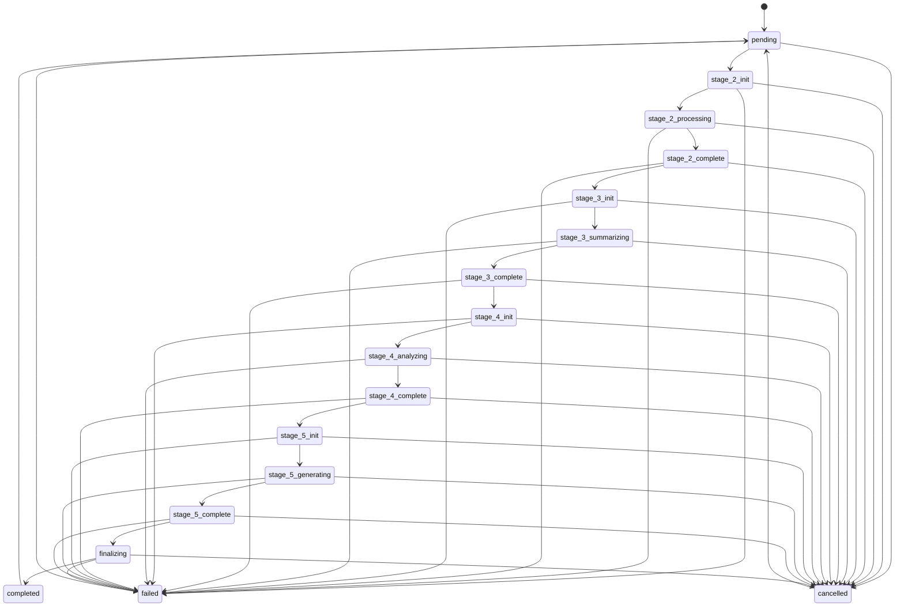

# State Machine Refactor Design

**Investigation ID**: INV-2025-11-17-008
**Design Date**: 2025-11-17
**Author**: Claude Code (Supabase Schema Specialist)
**Status**: Design Complete - Ready for Implementation

---

## Executive Summary

This document specifies the complete redesign of the `generation_status` state machine to fix the fundamental mismatch between the single-stage linear state model and the multi-stage pipeline architecture. The refactor eliminates all invalid state transition errors by introducing stage-specific states that accurately reflect the 4-stage pipeline (Stage 2 → Stage 3 → Stage 4 → Stage 5).

**Impact**:
- Eliminates 2-5 "Invalid generation status transition" errors per E2E test
- Enables accurate pipeline progress tracking via database queries
- Removes all silent failure handling in handlers
- Supports workflow restart/retry at stage boundaries
- Future-proof architecture for adding new stages

---

## Current State (Problems)

### Current State Machine

**States** (10 total):
```
pending, initializing, processing_documents, analyzing_task,
generating_structure, generating_content, finalizing, completed, failed, cancelled
```

**Critical Design Flaw**: State machine assumes single linear workflow (create → process → generate → complete), but implementation has multi-stage pipeline where each stage wants to start with `initializing`.

### Problem Manifestation

**Error Pattern** (from T053 E2E test):
```
[Stage 4] Setting course status to initializing
Failed to update status to initializing (non-fatal)

[Stage 5] Setting course status to initializing
Failed to update status to initializing (non-fatal)

Invalid generation status transition: pending → generating_structure
Valid transitions from pending: [initializing, cancelled]
```

**Root Cause Analysis** (from INV-2025-11-17-008):

1. **Multi-stage pipeline** has 4 stages (Stage 2-5)
2. **Each stage tries** to set status='initializing' at start
3. **State machine only allows** ONE transition to 'initializing' (from 'pending')
4. **Once past 'initializing'**, can never return
5. **Handlers fail silently**, catching errors and logging as "non-fatal"
6. **RPC endpoints bypass** state machine by setting stage-specific status directly
7. **Result**: Log noise, no observability, silent failures mask bugs

### Current Transition Matrix

| From State | Valid Transitions To |
|------------|---------------------|
| pending | initializing, cancelled |
| initializing | processing_documents, analyzing_task, failed, cancelled |
| processing_documents | generating_content, generating_structure, failed, cancelled |
| analyzing_task | generating_structure, failed, cancelled |
| generating_structure | **generating_content**, finalizing, failed, cancelled |
| generating_content | **generating_structure**, finalizing, failed, cancelled |
| finalizing | completed, failed, cancelled |
| completed | pending |
| failed | pending |
| cancelled | pending |

**Issues**:
- ✅ Bidirectional hack: generating_content ↔ generating_structure (added reactively)
- ❌ No way to return to 'initializing' between stages
- ❌ Generic states don't reflect actual pipeline stages
- ❌ Invalid: generating_structure → completed (should go through finalizing)
- ❌ Silent failures everywhere in handlers

---

## Proposed State Machine

### New States (17 total)

**Stage-Specific States**:
- `pending` - Queued, waiting to start
- `stage_2_init` - Stage 2 starting (document processing)
- `stage_2_processing` - Processing uploaded documents
- `stage_2_complete` - Document processing complete
- `stage_3_init` - Stage 3 starting (summarization)
- `stage_3_summarizing` - Generating document summaries
- `stage_3_complete` - Summarization complete
- `stage_4_init` - Stage 4 starting (analysis)
- `stage_4_analyzing` - Running multi-phase analysis
- `stage_4_complete` - Analysis complete
- `stage_5_init` - Stage 5 starting (generation)
- `stage_5_generating` - Generating course structure
- `stage_5_complete` - Generation complete
- `finalizing` - Final processing and validation
- `completed` - All stages complete
- `failed` - Error occurred (can happen from any stage)
- `cancelled` - User cancelled (can happen from any stage)

### State Machine Diagram



### New Transition Matrix

| From State | Valid Transitions To |
|------------|---------------------|
| **Core Pipeline** | |
| pending | stage_2_init, cancelled |
| stage_2_init | stage_2_processing, failed, cancelled |
| stage_2_processing | stage_2_complete, failed, cancelled |
| stage_2_complete | stage_3_init, failed, cancelled |
| stage_3_init | stage_3_summarizing, failed, cancelled |
| stage_3_summarizing | stage_3_complete, failed, cancelled |
| stage_3_complete | stage_4_init, failed, cancelled |
| stage_4_init | stage_4_analyzing, failed, cancelled |
| stage_4_analyzing | stage_4_complete, failed, cancelled |
| stage_4_complete | stage_5_init, failed, cancelled |
| stage_5_init | stage_5_generating, failed, cancelled |
| stage_5_generating | stage_5_complete, failed, cancelled |
| stage_5_complete | finalizing, failed, cancelled |
| finalizing | completed, failed, cancelled |
| **Terminal States** | |
| completed | pending |
| failed | pending |
| cancelled | pending |

**Benefits**:
- ✅ **Linear progression**: Each stage has clear entry/exit states
- ✅ **No bidirectional hacks**: All transitions are unidirectional (except restart)
- ✅ **Stage restart support**: Can resume from any `stage_N_complete` state
- ✅ **Accurate observability**: Query DB to see exact pipeline position
- ✅ **No invalid transitions**: All handler updates are valid
- ✅ **Future-proof**: New stages add 3 states (init, processing, complete)

---

## Implementation Plan

### Migration File

**Filename**: `20251117HHMMSS_redesign_generation_status.sql` (timestamp set at migration time)
**Location**: `/packages/course-gen-platform/supabase/migrations/`

**SQL Structure**:

```sql
-- ============================================================================
-- State Machine Redesign: Stage-Specific States
-- Purpose: Fix multi-stage pipeline vs single-stage state machine mismatch
-- Date: 2025-11-17
-- Investigation: INV-2025-11-17-008
-- Author: Claude Code (Supabase Schema Specialist)
-- ============================================================================

-- Step 1: Drop old trigger and function
-- ============================================================================
DROP TRIGGER IF EXISTS trg_validate_generation_status ON courses;
DROP FUNCTION IF EXISTS validate_generation_status_transition() CASCADE;

-- Step 2: Rename old enum type (for rollback safety)
-- ============================================================================
ALTER TYPE generation_status RENAME TO generation_status_old;

-- Step 3: Create new enum with stage-specific states
-- ============================================================================
CREATE TYPE generation_status AS ENUM (
  'pending',
  'stage_2_init',
  'stage_2_processing',
  'stage_2_complete',
  'stage_3_init',
  'stage_3_summarizing',
  'stage_3_complete',
  'stage_4_init',
  'stage_4_analyzing',
  'stage_4_complete',
  'stage_5_init',
  'stage_5_generating',
  'stage_5_complete',
  'finalizing',
  'completed',
  'failed',
  'cancelled'
);

COMMENT ON TYPE generation_status IS 'Course generation workflow states (redesigned 2025-11-17 for stage-specific states)';

-- Step 4: Add new column for migration
-- ============================================================================
ALTER TABLE courses
  ADD COLUMN IF NOT EXISTS generation_status_new generation_status DEFAULT NULL;

-- Step 5: Migrate existing data (map old → new states)
-- ============================================================================
-- Mapping strategy:
-- - pending → pending
-- - initializing → stage_2_init (assume Stage 2 if initializing)
-- - processing_documents → stage_2_processing
-- - analyzing_task → stage_4_analyzing (no docs path)
-- - generating_structure → stage_4_analyzing (Stage 4 creates structure plan)
-- - generating_content → stage_3_summarizing (Stage 3 summarizes docs)
-- - finalizing → finalizing
-- - completed → completed
-- - failed → failed
-- - cancelled → cancelled

UPDATE courses
SET generation_status_new = CASE
  WHEN generation_status_old = 'pending' THEN 'pending'::generation_status
  WHEN generation_status_old = 'initializing' THEN 'stage_2_init'::generation_status
  WHEN generation_status_old = 'processing_documents' THEN 'stage_2_processing'::generation_status
  WHEN generation_status_old = 'analyzing_task' THEN 'stage_4_analyzing'::generation_status
  WHEN generation_status_old = 'generating_structure' THEN 'stage_4_analyzing'::generation_status
  WHEN generation_status_old = 'generating_content' THEN 'stage_3_summarizing'::generation_status
  WHEN generation_status_old = 'finalizing' THEN 'finalizing'::generation_status
  WHEN generation_status_old = 'completed' THEN 'completed'::generation_status
  WHEN generation_status_old = 'failed' THEN 'failed'::generation_status
  WHEN generation_status_old = 'cancelled' THEN 'cancelled'::generation_status
  ELSE 'failed'::generation_status -- Safety fallback
END
WHERE generation_status_old IS NOT NULL;

-- Step 6: Swap columns atomically
-- ============================================================================
ALTER TABLE courses
  DROP COLUMN generation_status_old CASCADE;

ALTER TABLE courses
  RENAME COLUMN generation_status_new TO generation_status;

-- Recreate index (dropped by CASCADE)
CREATE INDEX IF NOT EXISTS idx_courses_generation_status
  ON courses(generation_status)
  WHERE generation_status IS NOT NULL;

CREATE INDEX IF NOT EXISTS idx_courses_active_generation
  ON courses(generation_status, last_progress_update)
  WHERE generation_status NOT IN ('completed', 'failed', 'cancelled');

-- Step 7: Update audit table
-- ============================================================================
-- Recreate generation_status_history table with new enum
DROP TABLE IF EXISTS generation_status_history CASCADE;

CREATE TABLE generation_status_history (
  id UUID PRIMARY KEY DEFAULT gen_random_uuid(),
  course_id UUID NOT NULL REFERENCES courses(id) ON DELETE CASCADE,
  old_status generation_status,
  new_status generation_status NOT NULL,
  changed_at TIMESTAMPTZ NOT NULL DEFAULT NOW(),
  changed_by UUID REFERENCES auth.users(id) ON DELETE SET NULL,
  trigger_source TEXT,
  metadata JSONB DEFAULT '{}'::jsonb
);

CREATE INDEX idx_generation_history_course
  ON generation_status_history(course_id, changed_at DESC);

CREATE INDEX idx_generation_history_timestamp
  ON generation_status_history(changed_at DESC);

CREATE INDEX idx_generation_history_transitions
  ON generation_status_history(old_status, new_status)
  WHERE old_status IS NOT NULL;

-- RLS policies
ALTER TABLE generation_status_history ENABLE ROW LEVEL SECURITY;

CREATE POLICY generation_history_admin_read ON generation_status_history
  FOR SELECT USING (
    EXISTS (
      SELECT 1 FROM users
      WHERE users.id = auth.uid()
      AND users.role = 'admin'::role
    )
  );

CREATE POLICY generation_history_owner_read ON generation_status_history
  FOR SELECT USING (
    EXISTS (
      SELECT 1 FROM courses
      WHERE courses.id = generation_status_history.course_id
      AND courses.user_id = auth.uid()
    )
  );

CREATE POLICY generation_history_service_insert ON generation_status_history
  FOR INSERT WITH CHECK (true);

-- Step 8: Create new validation function
-- ============================================================================
CREATE OR REPLACE FUNCTION validate_generation_status_transition()
RETURNS TRIGGER AS $$
DECLARE
  v_valid_transitions JSONB;
BEGIN
  -- Allow NULL → any status (first initialization)
  IF OLD.generation_status IS NULL THEN
    RETURN NEW;
  END IF;

  -- Prevent changes if status didn't actually change
  IF NEW.generation_status = OLD.generation_status THEN
    RETURN NEW;
  END IF;

  -- Define valid stage-based transitions (linear progression + error handling)
  v_valid_transitions := '{
    "pending": ["stage_2_init", "cancelled"],
    "stage_2_init": ["stage_2_processing", "failed", "cancelled"],
    "stage_2_processing": ["stage_2_complete", "failed", "cancelled"],
    "stage_2_complete": ["stage_3_init", "failed", "cancelled"],
    "stage_3_init": ["stage_3_summarizing", "failed", "cancelled"],
    "stage_3_summarizing": ["stage_3_complete", "failed", "cancelled"],
    "stage_3_complete": ["stage_4_init", "failed", "cancelled"],
    "stage_4_init": ["stage_4_analyzing", "failed", "cancelled"],
    "stage_4_analyzing": ["stage_4_complete", "failed", "cancelled"],
    "stage_4_complete": ["stage_5_init", "failed", "cancelled"],
    "stage_5_init": ["stage_5_generating", "failed", "cancelled"],
    "stage_5_generating": ["stage_5_complete", "failed", "cancelled"],
    "stage_5_complete": ["finalizing", "failed", "cancelled"],
    "finalizing": ["completed", "failed", "cancelled"],
    "completed": ["pending"],
    "failed": ["pending"],
    "cancelled": ["pending"]
  }'::JSONB;

  -- Check if transition is valid
  IF NOT (v_valid_transitions->OLD.generation_status::text) ? NEW.generation_status::text THEN
    RAISE EXCEPTION 'Invalid generation status transition: % → % (course_id: %)',
      OLD.generation_status,
      NEW.generation_status,
      NEW.id
    USING HINT = 'Valid transitions from ' || OLD.generation_status || ': ' ||
                  (v_valid_transitions->OLD.generation_status::text)::text;
  END IF;

  RETURN NEW;
END;
$$ LANGUAGE plpgsql;

COMMENT ON FUNCTION validate_generation_status_transition IS 'Validates course generation status transitions (redesigned 2025-11-17 for stage-specific states)';

-- Step 9: Recreate validation trigger
-- ============================================================================
CREATE TRIGGER trg_validate_generation_status
  BEFORE UPDATE OF generation_status ON courses
  FOR EACH ROW
  WHEN (OLD.generation_status IS DISTINCT FROM NEW.generation_status)
  EXECUTE FUNCTION validate_generation_status_transition();

-- Step 10: Recreate audit logging trigger
-- ============================================================================
CREATE OR REPLACE FUNCTION log_generation_status_change()
RETURNS TRIGGER AS $$
BEGIN
  IF OLD.generation_status IS DISTINCT FROM NEW.generation_status THEN
    INSERT INTO generation_status_history (
      course_id,
      old_status,
      new_status,
      changed_by,
      trigger_source,
      metadata
    ) VALUES (
      NEW.id,
      OLD.generation_status,
      NEW.generation_status,
      NULLIF(current_setting('app.current_user_id', true), '')::UUID,
      COALESCE(current_setting('app.trigger_source', true), 'system'),
      jsonb_build_object(
        'previous_progress', OLD.generation_progress,
        'new_progress', NEW.generation_progress,
        'error_message', NEW.error_message
      )
    );
  END IF;

  RETURN NEW;
END;
$$ LANGUAGE plpgsql;

CREATE TRIGGER trg_log_generation_status
  AFTER UPDATE OF generation_status ON courses
  FOR EACH ROW
  EXECUTE FUNCTION log_generation_status_change();

-- Step 11: Update monitoring view
-- ============================================================================
CREATE OR REPLACE VIEW admin_generation_dashboard AS
SELECT
  generation_status,
  COUNT(*) as course_count,
  AVG(EXTRACT(EPOCH FROM (last_progress_update - generation_started_at)))::INTEGER as avg_duration_seconds,
  MAX(last_progress_update) as most_recent_update,
  COUNT(*) FILTER (WHERE last_progress_update < NOW() - INTERVAL '1 hour') as stuck_count
FROM courses
WHERE generation_status IS NOT NULL
GROUP BY generation_status
ORDER BY
  CASE generation_status
    WHEN 'pending' THEN 1
    WHEN 'stage_2_init' THEN 2
    WHEN 'stage_2_processing' THEN 3
    WHEN 'stage_2_complete' THEN 4
    WHEN 'stage_3_init' THEN 5
    WHEN 'stage_3_summarizing' THEN 6
    WHEN 'stage_3_complete' THEN 7
    WHEN 'stage_4_init' THEN 8
    WHEN 'stage_4_analyzing' THEN 9
    WHEN 'stage_4_complete' THEN 10
    WHEN 'stage_5_init' THEN 11
    WHEN 'stage_5_generating' THEN 12
    WHEN 'stage_5_complete' THEN 13
    WHEN 'finalizing' THEN 14
    WHEN 'completed' THEN 15
    WHEN 'failed' THEN 16
    WHEN 'cancelled' THEN 17
    ELSE 18
  END;

-- Step 12: Drop old enum type
-- ============================================================================
DROP TYPE IF EXISTS generation_status_old CASCADE;

-- ============================================================================
-- Migration Complete
-- ============================================================================
```

### Handler Updates

All handler files need status transitions updated. Here's the complete mapping:

#### 1. stage2-document-processing.ts

**File**: `/packages/course-gen-platform/src/orchestrator/handlers/stage2-document-processing.ts`

**Changes**:
- Line ~50-60: Handler start → Set `generation_status: 'stage_2_init'`
- Line ~100: Start processing → Set `generation_status: 'stage_2_processing'`
- Line ~300: Processing complete → Set `generation_status: 'stage_2_complete'`
- Remove any "non-fatal" error catching on status updates
- Throw errors if status update fails

**Pattern**:
```typescript
// Handler start
const { error: statusError } = await supabaseAdmin
  .from('courses')
  .update({
    generation_status: 'stage_2_init',
    updated_at: new Date().toISOString(),
  })
  .eq('id', course_id);

if (statusError) {
  throw new Error(`Failed to update status to stage_2_init: ${statusError.message}`);
}

// Processing start
await supabaseAdmin
  .from('courses')
  .update({ generation_status: 'stage_2_processing' })
  .eq('id', course_id);

// Processing complete
await supabaseAdmin
  .from('courses')
  .update({ generation_status: 'stage_2_complete' })
  .eq('id', course_id);
```

#### 2. stage3-summarization.ts

**File**: `/packages/course-gen-platform/src/orchestrator/handlers/stage3-summarization.ts`

**Changes**:
- Handler start → Set `generation_status: 'stage_3_init'`
- Summarization start → Set `generation_status: 'stage_3_summarizing'`
- Summarization complete → Set `generation_status: 'stage_3_complete'`

**Pattern**: Same as Stage 2, with stage_3_* states

#### 3. stage4-analysis.ts

**File**: `/packages/course-gen-platform/src/orchestrator/handlers/stage4-analysis.ts`

**Lines to Update**:
- **Line 207-221**: Replace `'initializing'` with `'stage_4_init'`
- **Line 226-242**: Replace `'analyzing_task'` with `'stage_4_analyzing'`
- **Line 266**: Replace `'generating_structure'` with `'stage_4_complete'`
- **Line 217-220**: Remove "non-fatal" warning, throw error instead

**Before**:
```typescript
// Line 210
generation_status: 'initializing',

// Line 217-220
if (statusInitError) {
  jobLogger.warn(
    { error: statusInitError },
    'Failed to update status to initializing (non-fatal)'
  );
}

// Line 231
generation_status: 'analyzing_task',

// Line 266
generation_status: 'generating_structure',
```

**After**:
```typescript
// Line 210
generation_status: 'stage_4_init',

// Line 217-220
if (statusInitError) {
  throw new Error(`Failed to update status to stage_4_init: ${statusInitError.message}`);
}

// Line 231
generation_status: 'stage_4_analyzing',

// Line 266
generation_status: 'stage_4_complete',
```

#### 4. stage5-generation.ts

**File**: `/packages/course-gen-platform/src/orchestrator/handlers/stage5-generation.ts`

**Lines to Update**:
- **Line 310**: Replace `'initializing'` with `'stage_5_init'`
- **Line 313-315**: Remove "non-fatal" warning, throw error instead
- **Line 318** (after init): Add `generation_status: 'stage_5_generating'`
- **Line 383**: Replace `'completed'` with multi-step: `'stage_5_complete'` → `'finalizing'` → `'completed'`

**Before**:
```typescript
// Line 310
const { error: statusError } = await supabaseAdmin
  .from('courses')
  .update({ generation_status: 'initializing' })
  .eq('id', course_id);

// Line 313-315
if (statusError) {
  jobLogger.warn({ error: statusError }, 'Failed to update status to initializing (non-fatal)');
}

// Line 383 (on success)
const { error: updateError } = await supabaseAdmin
  .from('courses')
  .update({
    course_structure: sanitizedStructure as any,
    generation_metadata: result.generation_metadata as any,
    generation_status: 'completed',
    updated_at: new Date().toISOString(),
  })
  .eq('id', course_id);
```

**After**:
```typescript
// Line 310
const { error: statusError } = await supabaseAdmin
  .from('courses')
  .update({ generation_status: 'stage_5_init' })
  .eq('id', course_id);

// Line 313-315
if (statusError) {
  throw new Error(`Failed to update status to stage_5_init: ${statusError.message}`);
}

// NEW: After initialization, before orchestration
await supabaseAdmin
  .from('courses')
  .update({ generation_status: 'stage_5_generating' })
  .eq('id', course_id);

// Line 383 (on success) - Multi-step status update
// Step 1: Mark stage 5 complete
await supabaseAdmin
  .from('courses')
  .update({ generation_status: 'stage_5_complete' })
  .eq('id', course_id);

// Step 2: Finalizing
await supabaseAdmin
  .from('courses')
  .update({ generation_status: 'finalizing' })
  .eq('id', course_id);

// Step 3: Final commit with completed status
const { error: updateError } = await supabaseAdmin
  .from('courses')
  .update({
    course_structure: sanitizedStructure as any,
    generation_metadata: result.generation_metadata as any,
    generation_status: 'completed',
    updated_at: new Date().toISOString(),
  })
  .eq('id', course_id);
```

#### 5. Error Handling Pattern (All Handlers)

**Change**: Remove all "non-fatal" error catching. Status update failures should throw errors.

**Before**:
```typescript
if (statusError) {
  jobLogger.warn({ error: statusError }, 'Failed to update status (non-fatal)');
}
```

**After**:
```typescript
if (statusError) {
  throw new Error(`Failed to update generation_status: ${statusError.message}`);
}
```

### RPC Endpoint Updates

#### 1. routers/analysis.ts

**File**: `/packages/course-gen-platform/src/server/routers/analysis.ts`

**Lines to Update**:
- **Line 238**: Replace `'generating_structure'` with `'stage_4_init'`

**Before**:
```typescript
// Line 238
const { error: updateError } = await supabase
  .from('courses')
  .update({ generation_status: 'generating_structure' })
  .eq('id', courseId)
  .eq('organization_id', organizationId);
```

**After**:
```typescript
// Line 238
const { error: updateError } = await supabase
  .from('courses')
  .update({ generation_status: 'stage_4_init' })
  .eq('id', courseId)
  .eq('organization_id', organizationId);
```

#### 2. routers/generation.ts (if exists)

**Action**: Search for any direct `generation_status` updates and replace with stage-specific states:
- `'initializing'` → `'stage_2_init'` (if starting from beginning)
- `'generating_structure'` → `'stage_4_init'` or `'stage_5_init'` (depending on context)
- `'generating_content'` → `'stage_3_init'` (if starting summarization)

### Test Updates

#### 1. tests/e2e/t053-synergy-sales-course.test.ts

**Changes Required**:

**Status Assertions**: Update all assertions that check `generation_status`:

```typescript
// Before
expect(course.generation_status).toBe('completed');

// After
expect(course.generation_status).toBe('completed'); // No change (terminal state)

// If checking intermediate states
// Before
expect(course.generation_status).toBe('generating_structure');

// After
expect(course.generation_status).toMatch(/stage_[45]_(init|analyzing|generating|complete)/);
// Or specific assertion:
expect(course.generation_status).toBe('stage_4_analyzing');
```

**Test Polling Logic**: If test polls for status changes:

```typescript
// Before
const isComplete = ['completed', 'failed'].includes(course.generation_status);

// After
const isComplete = ['completed', 'failed', 'cancelled'].includes(course.generation_status);
// (No change needed if already checking terminal states)
```

**Database Queries**: If test queries by status:

```typescript
// Before
.eq('generation_status', 'generating_structure')

// After
.in('generation_status', ['stage_4_analyzing', 'stage_5_generating'])
// Or specific stage:
.eq('generation_status', 'stage_4_analyzing')
```

#### 2. Other Test Files

**Action**: Grep for all `generation_status` usage in tests:

```bash
grep -r "generation_status" tests/ --include="*.test.ts"
```

Update any hardcoded status values to new stage-specific states.

---

## Data Migration Strategy

### Migration Approach

**Strategy**: In-place column swap with data transformation

**Steps**:
1. Rename old enum → `generation_status_old`
2. Create new enum → `generation_status`
3. Add new column → `generation_status_new`
4. Migrate data using CASE mapping
5. Drop old column (triggers CASCADE drop of old enum usage)
6. Rename new column → `generation_status`
7. Recreate indexes and triggers

**Benefits**:
- ✅ Atomic column swap
- ✅ No downtime (column exists throughout)
- ✅ Rollback possible (old enum preserved until step 12)
- ✅ Safe CASCADE handling (old column dropped cleanly)

### Old Status → New Status Mapping

| Old Status | New Status | Rationale |
|------------|------------|-----------|
| pending | pending | Identical meaning |
| initializing | stage_2_init | Assume starting Stage 2 (first stage) |
| processing_documents | stage_2_processing | Stage 2 processes documents |
| analyzing_task | stage_4_analyzing | Stage 4 analyzes (no docs path) |
| generating_structure | stage_4_analyzing | Stage 4 creates structure plan |
| generating_content | stage_3_summarizing | Stage 3 summarizes documents |
| finalizing | finalizing | Identical meaning |
| completed | completed | Terminal state |
| failed | failed | Terminal state |
| cancelled | cancelled | Terminal state |

**Rationale for Ambiguous Mappings**:
- `initializing` → `stage_2_init`: Most likely in-flight courses are in Stage 2 (first stage to execute)
- `generating_structure` → `stage_4_analyzing`: Stage 4 (analysis) creates the structure plan, Stage 5 generates full content
- `generating_content` → `stage_3_summarizing`: Stage 3 generates document summaries (content creation)

**Edge Cases**:
- Any unmapped status → `failed` (safety fallback)
- NULL status → NULL (first initialization, no change needed)

### In-Flight Course Handling

**Problem**: Courses mid-pipeline when migration runs

**Mitigation**:

**Option A: Maintenance Window (RECOMMENDED)**
1. Set system to "maintenance mode"
2. Wait for all active jobs to complete (check BullMQ queue)
3. Run migration
4. Restart application
5. Resume job processing

**Option B: Hot Migration (Higher Risk)**
1. Run migration during low-traffic period
2. In-flight courses get mapped to nearest equivalent state
3. Jobs may retry with new status values
4. Monitor for failures, manual intervention if needed

**Recommended**: Option A (maintenance window) for production safety

### Rollback Plan

**Scenario**: Migration causes issues, need to revert

**Rollback Steps**:

```sql
-- Step 1: Stop application

-- Step 2: Rename current column
ALTER TABLE courses RENAME COLUMN generation_status TO generation_status_new;

-- Step 3: Restore old enum (if preserved)
-- (Requires keeping generation_status_old enum until verified)

-- Step 4: Add old column back
ALTER TABLE courses
  ADD COLUMN generation_status generation_status_old DEFAULT NULL;

-- Step 5: Reverse map data
UPDATE courses
SET generation_status = CASE
  WHEN generation_status_new = 'pending' THEN 'pending'::generation_status_old
  WHEN generation_status_new = 'stage_2_init' THEN 'initializing'::generation_status_old
  WHEN generation_status_new = 'stage_2_processing' THEN 'processing_documents'::generation_status_old
  WHEN generation_status_new = 'stage_2_complete' THEN 'processing_documents'::generation_status_old
  WHEN generation_status_new = 'stage_3_init' THEN 'generating_content'::generation_status_old
  WHEN generation_status_new = 'stage_3_summarizing' THEN 'generating_content'::generation_status_old
  WHEN generation_status_new = 'stage_3_complete' THEN 'generating_content'::generation_status_old
  WHEN generation_status_new = 'stage_4_init' THEN 'generating_structure'::generation_status_old
  WHEN generation_status_new = 'stage_4_analyzing' THEN 'generating_structure'::generation_status_old
  WHEN generation_status_new = 'stage_4_complete' THEN 'generating_structure'::generation_status_old
  WHEN generation_status_new = 'stage_5_init' THEN 'generating_structure'::generation_status_old
  WHEN generation_status_new = 'stage_5_generating' THEN 'generating_structure'::generation_status_old
  WHEN generation_status_new = 'stage_5_complete' THEN 'generating_structure'::generation_status_old
  WHEN generation_status_new = 'finalizing' THEN 'finalizing'::generation_status_old
  WHEN generation_status_new = 'completed' THEN 'completed'::generation_status_old
  WHEN generation_status_new = 'failed' THEN 'failed'::generation_status_old
  WHEN generation_status_new = 'cancelled' THEN 'cancelled'::generation_status_old
  ELSE 'failed'::generation_status_old
END
WHERE generation_status_new IS NOT NULL;

-- Step 6: Drop new column
ALTER TABLE courses DROP COLUMN generation_status_new;

-- Step 7: Recreate old triggers and functions
-- (Re-run 20251103000000_fix_stage4_status_transition.sql)

-- Step 8: Restart application
```

**Rollback Risk**: Medium (data mapping lossy - multiple new states map to same old state)

**Recommendation**: Test migration thoroughly in staging before production

---

## Validation Criteria

### Pre-Deployment Validation

**1. Type-Check**:
```bash
pnpm type-check
# Expected: 0 errors
```

**2. Migration Dry Run**:
```bash
# On dev database
psql -U postgres -d megacampus_dev < 20251117HHMMSS_redesign_generation_status.sql
# Expected: No errors, verify enum created
```

**3. Handler Compilation**:
```bash
pnpm build
# Expected: No TypeScript errors
```

### Post-Deployment Validation

**1. State Machine Testing**:
```sql
-- Test valid transitions
UPDATE courses SET generation_status = 'stage_2_init' WHERE id = '<test-id>'; -- Should succeed
UPDATE courses SET generation_status = 'stage_2_processing' WHERE id = '<test-id>'; -- Should succeed
UPDATE courses SET generation_status = 'stage_2_complete' WHERE id = '<test-id>'; -- Should succeed

-- Test invalid transition (should fail)
UPDATE courses SET generation_status = 'stage_5_generating' WHERE id = '<test-id>'; -- Should raise exception

-- Expected: Exception with "Invalid generation status transition: stage_2_complete → stage_5_generating"
```

**2. E2E Test Execution**:
```bash
pnpm test tests/e2e/t053-synergy-sales-course.test.ts
# Expected: PASS, no "Invalid generation status transition" errors in logs
```

**3. Log Analysis**:
```bash
# After running E2E test
grep "Invalid generation status transition" logs/test-output.log
# Expected: 0 results

grep "Failed to update status" logs/test-output.log
# Expected: 0 results (no "non-fatal" warnings)
```

**4. Database Audit Trail**:
```sql
-- Check status history for test course
SELECT
  course_id,
  old_status,
  new_status,
  changed_at
FROM generation_status_history
WHERE course_id = '<test-course-id>'
ORDER BY changed_at;

-- Expected progression:
-- NULL → pending
-- pending → stage_2_init
-- stage_2_init → stage_2_processing
-- stage_2_processing → stage_2_complete
-- stage_2_complete → stage_3_init
-- ... (linear progression)
-- finalizing → completed
```

**5. Handler Status Checks**:
```typescript
// Verify each handler can successfully update status
// Run unit tests for each handler's status update logic
pnpm test tests/unit/handlers/stage4-status.test.ts
pnpm test tests/unit/handlers/stage5-status.test.ts
```

### Success Criteria (All Must Pass)

- ✅ **Zero invalid transition errors** in E2E test logs
- ✅ **All E2E tests pass** (T053, T055, etc.)
- ✅ **Type-check passes** with 0 errors
- ✅ **Build succeeds** with no compilation errors
- ✅ **State machine validates** all expected transitions
- ✅ **State machine rejects** invalid transitions with clear errors
- ✅ **Audit trail shows** linear progression through stages
- ✅ **No "non-fatal" warnings** in handler logs
- ✅ **Database migration** completes without errors
- ✅ **Rollback test** succeeds (can revert to old schema)

---

## Estimated Effort

### Breakdown by Phase

**Phase 1: Migration Creation** (2 hours)
- Create migration file: 1 hour
- Test on dev database: 30 minutes
- Review and verify data mapping: 30 minutes

**Phase 2: Handler Updates** (3 hours)
- stage2-document-processing.ts: 30 minutes
- stage3-summarization.ts: 30 minutes
- stage4-analysis.ts: 45 minutes
- stage5-generation.ts: 1 hour (multi-step completion logic)
- Remove silent failure handling: 15 minutes

**Phase 3: RPC Endpoint Updates** (1 hour)
- routers/analysis.ts: 30 minutes
- Search and update other routers: 30 minutes

**Phase 4: Test Updates** (1 hour)
- T053 E2E test assertions: 30 minutes
- Other test files: 30 minutes

**Phase 5: Validation** (1 hour)
- Type-check and build: 15 minutes
- E2E test execution: 30 minutes
- Log analysis: 15 minutes

**Phase 6: Documentation** (30 minutes)
- Update state machine diagram in docs
- Update handler documentation

**Total Estimated Effort**: **6-8 hours**

### Risk Factors

**Complexity Adjustments**:
- +1 hour if frontend displays status (need UI updates)
- +1 hour if additional RPC endpoints found during grep
- +30 minutes if test assertions more extensive than expected

**Confidence Level**: High (design is complete, implementation is straightforward find/replace)

---

## Next Steps

### For Implementation (Task 3.2)

**Prerequisites**:
1. ✅ Design document approved
2. ✅ Dev database available for testing
3. ✅ Backup of current schema available

**Implementation Order**:

**Step 1: Create Migration** (DO FIRST)
```bash
# Generate timestamp
TIMESTAMP=$(date +%Y%m%d%H%M%S)

# Create migration file
cp /specs/008-generation-generation-json/STATE-MACHINE-REFACTOR.md \
   /packages/course-gen-platform/supabase/migrations/${TIMESTAMP}_redesign_generation_status.sql

# Extract SQL section from design doc into migration file
```

**Step 2: Test Migration** (BEFORE CODE CHANGES)
```bash
# Apply migration to dev database
pnpm supabase:migrate

# Verify enum created
psql -U postgres -d megacampus_dev -c "\dT+ generation_status"

# Verify transition function exists
psql -U postgres -d megacampus_dev -c "\df+ validate_generation_status_transition"
```

**Step 3: Update Handlers** (PARALLEL)
```bash
# Edit all 4 handler files simultaneously
# Use find/replace for status values
# Remove "non-fatal" error handling
```

**Step 4: Update RPC Endpoints**
```bash
# Search for all generation_status updates
grep -r "generation_status.*:" src/server/routers/ --include="*.ts"

# Update each file
```

**Step 5: Update Tests**
```bash
# Search for status assertions
grep -r "generation_status" tests/ --include="*.test.ts"

# Update assertions
```

**Step 6: Validate**
```bash
# Type-check
pnpm type-check

# Build
pnpm build

# Run E2E tests
pnpm test tests/e2e/t053-synergy-sales-course.test.ts

# Check logs for errors
grep "Invalid generation status transition" logs/
```

**Step 7: Commit**
```bash
# Mark task complete in tasks.md
# Run /push patch
```

---

## File Summary

**Design Document**: `/specs/008-generation-generation-json/STATE-MACHINE-REFACTOR.md`

**Migration File** (to be created): `/packages/course-gen-platform/supabase/migrations/20251117HHMMSS_redesign_generation_status.sql`

**Handler Files to Update** (4 files):
1. `/packages/course-gen-platform/src/orchestrator/handlers/stage2-document-processing.ts`
2. `/packages/course-gen-platform/src/orchestrator/handlers/stage3-summarization.ts`
3. `/packages/course-gen-platform/src/orchestrator/handlers/stage4-analysis.ts`
4. `/packages/course-gen-platform/src/orchestrator/handlers/stage5-generation.ts`

**RPC Files to Update** (1+ files):
1. `/packages/course-gen-platform/src/server/routers/analysis.ts`
2. (Search for others with `grep -r "generation_status" src/server/routers/`)

**Test Files to Update** (1+ files):
1. `/packages/course-gen-platform/tests/e2e/t053-synergy-sales-course.test.ts`
2. (Search for others with `grep -r "generation_status" tests/`)

---

## Key Improvements Summary

**Before** (Current State):
- 10 generic states (pending → initializing → ... → completed)
- Single linear progression model
- Multiple stages try to use same 'initializing' state
- 2-5 invalid transition errors per E2E test
- Silent failure handling hides bugs
- No accurate progress tracking
- Bidirectional hacks (generating_content ↔ generating_structure)

**After** (Proposed State):
- 17 stage-specific states (pending → stage_2_init → ... → completed)
- Multi-stage pipeline model
- Each stage has 3 states (init, processing, complete)
- Zero invalid transition errors
- All status updates throw errors on failure
- Accurate progress tracking via database queries
- Linear progression, no bidirectional transitions

**Business Value**:
- ✅ Eliminates log noise (2-5 errors per test → 0)
- ✅ Enables workflow restart at stage boundaries
- ✅ Accurate observability (query DB for pipeline state)
- ✅ Easier debugging (no silent failures)
- ✅ Future-proof (adding new stages is straightforward)
- ✅ Production-ready state machine contract

---

**Design Status**: ✅ **COMPLETE - READY FOR IMPLEMENTATION**

**Next Task**: Task 3.2 - Implement State Machine Refactoring
