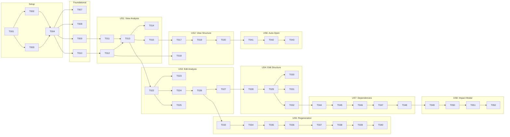

# Implementation Tasks: Stage 4-5 UI Redesign

**Feature Branch**: `016-stage45-ui-redesign`
**Generated**: 2025-12-05
**Spec**: [spec.md](./spec.md) | **Plan**: [plan.md](./plan.md)

---

## Overview

| Metric | Value |
|--------|-------|
| Total Tasks | 63 |
| Phases | 11 (Setup + Foundational + 8 User Stories + Polish) |
| Estimated Hours | 68ч (63ч base + 5ч integration buffer) |
| Parallelization | 19 tasks [P] |
| Deferred to v2 | Token billing (FR-029-032) |

### User Story Mapping

| Story | Priority | Tasks | Description |
|-------|----------|-------|-------------|
| Setup | - | 6 | Dependency install, types, directories |
| Foundational | - | 4 | Prerequisites T0.1/T0.2, phase-names, types |
| US1 | P1 | 6 | Просмотр результатов анализа (Stage 4) |
| US2 | P1 | 5 | Просмотр структуры курса (Stage 5) |
| US3 | P2 | 6 | Редактирование результатов анализа |
| US4 | P2 | 7 | Редактирование структуры курса (+addElement) |
| US5 | P2 | 8 | Перегенерация блока через AI |
| US6 | P3 | 3 | Автоматическое открытие результатов |
| US7 | P3 | 5 | Индикация зависимостей и устаревших данных |
| US8 | P3 | 4 | Предупреждение о каскадных изменениях |
| Polish | - | 11 | Accessibility, virtualization, language switcher, read-only mode, caching, undo/redo |

### Phase Mapping (plan.md → tasks.md)

| plan.md | tasks.md | Description |
|---------|----------|-------------|
| Phase 0 (Prerequisites) | Phase 2 (Foundational) | T0.1-T0.2 blocking fixes |
| Phase 1 (P0 MVP) | Phase 3-4 (US1-US2) | View components |
| Phase 2 (P1) | Phase 5-6 (US3-US4) | Editing |
| Phase 3 (P2) | Phase 7 (US5) | Regeneration |
| Phase 4 (P3) | Phase 8-10 (US6-US8) | Auto-open, dependencies |
| Phase 5 (P4) | Phase 11 (Polish) | Optimization |

### Existing Patterns (MUST REUSE)

| Pattern | Location | Usage |
|---------|----------|-------|
| **Localization (generation-graph)** | `lib/generation-graph/translations.ts` + `useTranslation.ts` | Add new keys to GRAPH_TRANSLATIONS, use `t('key')` in components |
| **Localization (global)** | `messages/ru.json`, `messages/en.json` + `next-intl` | For non-graph components |
| **LanguageSwitcher** | `components/language-switcher.tsx` | Already exists, uses NEXT_LOCALE cookie |
| **Sonner Toasts** | `import { toast } from 'sonner'` | For save status notifications |
| **Radix Accordion** | `@radix-ui/react-accordion` | Installed, use for PhaseAccordion |
| **use-debounce** | `useDebouncedCallback` from `use-debounce` | For autosave with `.flush()` method |
| **Zustand + Immer** | State management pattern | For edit state with undo/redo |
| **react-virtuoso** | `GroupedVirtuoso` for sections/lessons | Sticky headers, grouped lists, auto variable height |

---

## Phase 1: Setup

> Project initialization and dependency installation

- [X] T001 [EXECUTOR: MAIN] Install react-virtuoso in packages/web via `pnpm add react-virtuoso -F @megacampus/web`
  → Artifacts: [package.json](packages/web/package.json)
- [X] T002 [P] [EXECUTOR: typescript-types-specialist] Create type file `packages/shared-types/src/regeneration-types.ts` with ContextTier, RegenerateBlockInput, RegenerationResponse, UpdateFieldInput schemas
  → Artifacts: [regeneration-types.ts](packages/shared-types/src/regeneration-types.ts)
- [X] T003 [P] [EXECUTOR: typescript-types-specialist] Create type file `packages/shared-types/src/dependency-graph.ts` with DependencyNode, DependencyEdge, StaleIndicator, ImpactAnalysis types
  → Artifacts: [dependency-graph.ts](packages/shared-types/src/dependency-graph.ts)
- [X] T004 [EXECUTOR: MAIN] Export new types from `packages/shared-types/src/index.ts`
  → Artifacts: [index.ts](packages/shared-types/src/index.ts)
- [X] T005 [P] [EXECUTOR: MAIN] Create directory structure `packages/web/components/generation-graph/panels/output/`
  → Artifacts: [output/](packages/web/components/generation-graph/panels/output/)
- [X] T006 [P] [EXECUTOR: MAIN] Create directory structure `packages/course-gen-platform/src/shared/regeneration/`
  → Artifacts: [regeneration/](packages/course-gen-platform/src/shared/regeneration/) (already existed)

---

## Phase 2: Foundational (Blocking Prerequisites)

> Production-readiness fixes that MUST complete before user stories

- [X] T007 [EXECUTOR: fullstack-nextjs-specialist] Add AbortController to `packages/web/lib/hooks/useRefinement.ts` for request cancellation on unmount
  → Artifacts: [useRefinement.ts](packages/web/components/generation-graph/hooks/useRefinement.ts), [refinement.ts](packages/web/app/actions/refinement.ts)
- [X] T008 [EXECUTOR: typescript-types-specialist] Add Zod validation for API responses in frontend tRPC calls (create validation wrapper utility)
  → Artifacts: [trpc-response-validator.ts](packages/web/lib/utils/trpc-response-validator.ts)
- [X] T009 [EXECUTOR: typescript-types-specialist] Create `packages/web/lib/generation-graph/phase-names.ts` with PHASE_NAMES constant and getPhaseName/getPhaseDescription helpers
  → Artifacts: [phase-names.ts](packages/web/lib/generation-graph/phase-names.ts)
- [X] T010 [P] [EXECUTOR: typescript-types-specialist] Create `packages/web/components/generation-graph/panels/output/types.ts` with EditorFieldType, FieldConfig, ANALYSIS_RESULT_FIELDS, COURSE_STRUCTURE_LESSON_FIELDS
  → Artifacts: [types.ts](packages/web/components/generation-graph/panels/output/types.ts)

---

## Phase 3: User Story 1 — Просмотр результатов анализа (P1)

> **Goal**: Пользователь видит результаты Stage 4 в понятном виде вместо JSON
>
> **Independent Test**: Загрузить материалы курса, дождаться завершения анализа, открыть панель Stage 4 и убедиться, что информация читаема без технических знаний

- [X] T011 [US1] [EXECUTOR: fullstack-nextjs-specialist] Create `packages/web/components/generation-graph/panels/PhaseSelector.tsx` replacing AttemptSelector with semantic phase names from phase-names.ts
  → Artifacts: [PhaseSelector.tsx](packages/web/components/generation-graph/panels/PhaseSelector.tsx)
- [X] T012 [P] [US1] [EXECUTOR: fullstack-nextjs-specialist] Create `packages/web/components/generation-graph/panels/output/PhaseAccordion.tsx` wrapper component using @radix-ui/react-accordion
  → Artifacts: [PhaseAccordion.tsx](packages/web/components/generation-graph/panels/output/PhaseAccordion.tsx)
- [X] T013 [US1] [EXECUTOR: fullstack-nextjs-specialist] Create `packages/web/components/generation-graph/panels/output/AnalysisResultView.tsx` with 6 sections: CourseClassification, TopicAnalysis, RecommendedStructure, PedagogicalStrategy, GenerationGuidance, DocumentRelations
  → Artifacts: [AnalysisResultView.tsx](packages/web/components/generation-graph/panels/output/AnalysisResultView.tsx)
- [X] T014 [US1] [EXECUTOR: fullstack-nextjs-specialist] Add skeleton loading states to AnalysisResultView for each section
  → Artifacts: [AnalysisResultView.tsx](packages/web/components/generation-graph/panels/output/AnalysisResultView.tsx) (AnalysisResultViewSkeleton export added)
- [X] T015 [US1] [EXECUTOR: fullstack-nextjs-specialist] Modify `packages/web/components/generation-graph/panels/OutputTab.tsx` to render AnalysisResultView for stage_4 instead of JsonViewer
  → Artifacts: [OutputTab.tsx](packages/web/components/generation-graph/panels/OutputTab.tsx)
- [X] T016 [US1] [EXECUTOR: fullstack-nextjs-specialist] Add Russian localization strings to `packages/web/lib/generation-graph/translations.ts` for all Stage 4 section headers and labels
  → Artifacts: [translations.ts](packages/web/lib/generation-graph/translations.ts)

---

## Phase 4: User Story 2 — Просмотр структуры курса (P1)

> **Goal**: Пользователь видит структуру Stage 5 как дерево секций → уроков
>
> **Independent Test**: Завершить генерацию структуры, открыть панель Stage 5, убедиться что видна иерархия с метаданными

- [X] T017 [US2] [EXECUTOR: fullstack-nextjs-specialist] Create `packages/web/components/generation-graph/panels/output/CourseStructureView.tsx` with course metadata header (title, description, target_audience)
  → Artifacts: [CourseStructureView.tsx](packages/web/components/generation-graph/panels/output/CourseStructureView.tsx)
- [X] T018 [P] [US2] [EXECUTOR: fullstack-nextjs-specialist] Create SectionAccordion sub-component within CourseStructureView for expandable sections with lesson count and duration
  → Artifacts: [SectionAccordion.tsx](packages/web/components/generation-graph/panels/output/SectionAccordion.tsx)
- [X] T019 [US2] [EXECUTOR: fullstack-nextjs-specialist] Create LessonRow sub-component within CourseStructureView showing lesson number (1.1, 1.2), title, duration, learning_objectives, key_topics
  → Artifacts: [LessonRow.tsx](packages/web/components/generation-graph/panels/output/LessonRow.tsx)
- [X] T020 [US2] [EXECUTOR: fullstack-nextjs-specialist] Modify `packages/web/components/generation-graph/panels/OutputTab.tsx` to render CourseStructureView for stage_5 instead of JsonViewer
  → Artifacts: [OutputTab.tsx](packages/web/components/generation-graph/panels/OutputTab.tsx)
- [X] T021 [US2] [EXECUTOR: fullstack-nextjs-specialist] Add Russian localization strings for Stage 5 labels to translations.ts
  → Artifacts: [translations.ts](packages/web/lib/generation-graph/translations.ts)

---

## Phase 5: User Story 3 — Редактирование результатов анализа (P2)

> **Goal**: Методолог может редактировать поля Stage 4 с автосохранением
>
> **Independent Test**: Открыть результат анализа, изменить значение поля, убедиться что изменение сохранилось

- [X] T022 [US3] [EXECUTOR: fullstack-nextjs-specialist] Create `packages/web/components/generation-graph/hooks/useAutoSave.ts` hook using use-debounce with status tracking (idle/saving/saved/error)
  → Artifacts: [useAutoSave.ts](packages/web/components/generation-graph/hooks/useAutoSave.ts)
- [X] T023 [US3] [EXECUTOR: fullstack-nextjs-specialist] Create `packages/web/components/generation-graph/panels/output/SaveStatusIndicator.tsx` component showing save status with Sonner toast
  → Artifacts: [SaveStatusIndicator.tsx](packages/web/components/generation-graph/panels/output/SaveStatusIndicator.tsx)
- [X] T024 [P] [US3] [EXECUTOR: fullstack-nextjs-specialist] Create `packages/web/components/generation-graph/panels/output/EditableField.tsx` supporting text, textarea, number, toggle field types
  → Artifacts: [EditableField.tsx](packages/web/components/generation-graph/panels/output/EditableField.tsx)
- [X] T025 [P] [US3] [EXECUTOR: fullstack-nextjs-specialist] Create `packages/web/components/generation-graph/panels/output/EditableChips.tsx` for add/remove list items (key_concepts, assessment_types)
  → Artifacts: [EditableChips.tsx](packages/web/components/generation-graph/panels/output/EditableChips.tsx)
- [X] T026 [US3] [EXECUTOR: api-builder] Create tRPC endpoint `generation.updateField` in `packages/course-gen-platform/src/server/routers/generation.ts` with owner authorization check
  → Artifacts: [generation.ts](packages/course-gen-platform/src/server/routers/generation.ts)
- [X] T027 [US3] [EXECUTOR: fullstack-nextjs-specialist] Integrate EditableField and EditableChips into AnalysisResultView sections, connecting to updateField mutation
  → Artifacts: [AnalysisResultView.tsx](packages/web/components/generation-graph/panels/output/AnalysisResultView.tsx), [admin-generation.ts](packages/web/app/actions/admin-generation.ts)

---

## Phase 6: User Story 4 — Редактирование структуры курса (P2)

> **Goal**: Инструктор может редактировать структуру Stage 5 с пересчётом длительности
>
> **Independent Test**: Открыть структуру курса, изменить название урока и его цели обучения, убедиться в сохранении

- [X] T028 [US4] [EXECUTOR: api-builder] Create `packages/course-gen-platform/src/stages/stage5-generation/utils/course-structure-editor.ts` with PATCH logic, duration recalculation, lesson renumbering
  → Artifacts: [course-structure-editor.ts](packages/course-gen-platform/src/stages/stage5-generation/utils/course-structure-editor.ts)
- [X] T029 [US4] [EXECUTOR: api-builder] Extend `generation.updateField` endpoint to handle Stage 5 fields using course-structure-editor
  → Artifacts: [regeneration-types.ts](packages/shared-types/src/regeneration-types.ts), [generation.ts](packages/course-gen-platform/src/server/routers/generation.ts)
- [X] T030 [US4] [EXECUTOR: fullstack-nextjs-specialist] Integrate EditableField into CourseStructureView for lesson title, duration
  → Artifacts: [LessonRow.tsx](packages/web/components/generation-graph/panels/output/LessonRow.tsx)
- [X] T031 [US4] [EXECUTOR: fullstack-nextjs-specialist] Integrate EditableChips into CourseStructureView for learning_objectives, key_topics
  → Artifacts: [CourseStructureView.tsx](packages/web/components/generation-graph/panels/output/CourseStructureView.tsx), [LessonRow.tsx](packages/web/components/generation-graph/panels/output/LessonRow.tsx)
- [X] T032 [US4] [EXECUTOR: api-builder] Create tRPC endpoint `generation.deleteElement` in generation.ts with smart confirmation logic (FR-011a)
  → Artifacts: [regeneration-types.ts](packages/shared-types/src/regeneration-types.ts), [generation.ts](packages/course-gen-platform/src/server/routers/generation.ts)
- [X] T032a [US4] [EXECUTOR: api-builder] Create tRPC endpoint `generation.addElement` in generation.ts for AI-assisted lesson/section creation (FR-011b)
  → Artifacts: [regeneration-types.ts](packages/shared-types/src/regeneration-types.ts), [generation.ts](packages/course-gen-platform/src/server/routers/generation.ts)
- [X] T032b [US4] [EXECUTOR: fullstack-nextjs-specialist] Create AddElementChat component for "+ Урок" / "+ Секция" buttons with AI instruction input
  → Artifacts: [AddElementChat.tsx](packages/web/components/generation-graph/panels/output/AddElementChat.tsx), [admin-generation.ts](packages/web/app/actions/admin-generation.ts), [SectionAccordion.tsx](packages/web/components/generation-graph/panels/output/SectionAccordion.tsx), [CourseStructureView.tsx](packages/web/components/generation-graph/panels/output/CourseStructureView.tsx)

→ **Artifacts**: course-structure-editor.ts, generation.ts (modified), CourseStructureView.tsx (modified), AddElementChat.tsx

---

## Phase 7: User Story 5 — Перегенерация блока через AI (P2)

> **Goal**: Пользователь может перегенерировать конкретный блок с помощью AI
>
> **Independent Test**: Открыть результат, нажать кнопку перегенерации на блоке, ввести инструкцию, получить обновлённый результат

- [X] T033 [US5] [EXECUTOR: llm-service-specialist] Create `packages/course-gen-platform/src/shared/regeneration/smart-context-router.ts` with detectContextTier function using keyword patterns
  → Artifacts: [smart-context-router.ts](packages/course-gen-platform/src/shared/regeneration/smart-context-router.ts), [smart-context-router.test.ts](packages/course-gen-platform/tests/unit/regeneration/smart-context-router.test.ts)
- [X] T034 [P] [US5] [EXECUTOR: llm-service-specialist] Create `packages/course-gen-platform/src/shared/regeneration/context-assembler.ts` to build context by tier (atomic/local/structural/global)
  → Artifacts: [context-assembler.ts](packages/course-gen-platform/src/shared/regeneration/context-assembler.ts), [context-assembler.test.ts](packages/course-gen-platform/tests/unit/regeneration/context-assembler.test.ts)
- [X] T035 [US5] [EXECUTOR: llm-service-specialist] Create `packages/course-gen-platform/src/shared/regeneration/bloom-validator.ts` for Bloom's level preservation check
  → Artifacts: [bloom-validator.ts](packages/course-gen-platform/src/shared/regeneration/bloom-validator.ts), [index.ts](packages/course-gen-platform/src/shared/regeneration/index.ts)
- [X] T036 [US5] [EXECUTOR: llm-service-specialist] Create `packages/course-gen-platform/src/shared/regeneration/semantic-diff-generator.ts` to generate SemanticDiff from regeneration response
  → Artifacts: [semantic-diff-generator.ts](packages/course-gen-platform/src/shared/regeneration/semantic-diff-generator.ts), [semantic-diff-generator.test.ts](packages/course-gen-platform/tests/unit/semantic-diff-generator.test.ts)
- [X] T037 [US5] [EXECUTOR: api-builder] Create tRPC endpoint `generation.regenerateBlock` in generation.ts using smart-context-router, context-assembler, XML-structured prompt
  → Artifacts: [generation.ts](packages/course-gen-platform/src/server/routers/generation.ts)
- [X] T038 [US5] [EXECUTOR: fullstack-nextjs-specialist] Create `packages/web/components/generation-graph/panels/output/InlineRegenerateChat.tsx` with instruction input, Quick Actions buttons, loading state
  → Artifacts: [InlineRegenerateChat.tsx](packages/web/components/generation-graph/panels/output/InlineRegenerateChat.tsx), [admin-generation.ts](packages/web/app/actions/admin-generation.ts)
- [X] T039 [US5] [EXECUTOR: fullstack-nextjs-specialist] Create `packages/web/components/generation-graph/panels/output/SemanticDiff.tsx` showing concepts added/removed, alignment score, Bloom's indicator, Accept/Edit/Cancel buttons
  → Artifacts: [SemanticDiff.tsx](packages/web/components/generation-graph/panels/output/SemanticDiff.tsx)
- [X] T040 [US5] [EXECUTOR: fullstack-nextjs-specialist] Integrate InlineRegenerateChat into EditableField for regeneratable fields, connect to regenerateBlock mutation
  → Artifacts: [EditableField.tsx](packages/web/components/generation-graph/panels/output/EditableField.tsx)

→ **Artifacts**: smart-context-router.ts, context-assembler.ts, bloom-validator.ts, semantic-diff-generator.ts, generation.ts (modified), InlineRegenerateChat.tsx, SemanticDiff.tsx, EditableField.tsx (modified)

---

## Phase 8: User Story 6 — Автоматическое открытие результатов (P3)

> **Goal**: Панель результатов открывается автоматически при завершении Stage 4/5
>
> **Independent Test**: Запустить генерацию, дождаться завершения Stage 4 или 5, убедиться что панель открылась автоматически

- [X] T041 [US6] [EXECUTOR: fullstack-nextjs-specialist] Modify `packages/web/components/generation-graph/GraphView.tsx` to auto-select node on stage_4 or stage_5 completion (awaitingApproval or completed status)
  → Artifacts: [GraphView.tsx](packages/web/components/generation-graph/GraphView.tsx)
- [X] T042 [US6] [EXECUTOR: fullstack-nextjs-specialist] Add slide-in animation to NodeDetailsDrawer using Framer Motion
  → Artifacts: [sheet.tsx](packages/web/components/ui/sheet.tsx)
- [X] T043 [US6] [EXECUTOR: fullstack-nextjs-specialist] Add auto-focus to first editable field when panel opens automatically
  → Artifacts: [AnalysisResultView.tsx](packages/web/components/generation-graph/panels/output/AnalysisResultView.tsx), [CourseStructureView.tsx](packages/web/components/generation-graph/panels/output/CourseStructureView.tsx), [useNodeSelection.ts](packages/web/components/generation-graph/hooks/useNodeSelection.ts)

→ **Artifacts**: GraphView.tsx (modified), NodeDetailsDrawer animation

---

## Phase 9: User Story 7 — Индикация зависимостей (P3)

> **Goal**: Методолог видит какие элементы курса связаны друг с другом
>
> **Independent Test**: Изменить цель обучения модуля, убедиться что зависимые уроки помечены как требующие проверки

- [X] T044 [US7] [EXECUTOR: api-builder] Create `packages/course-gen-platform/src/shared/regeneration/dependency-graph-builder.ts` with buildDependencyGraph function from CourseStructure
  → Artifacts: [dependency-graph-builder.ts](packages/course-gen-platform/src/shared/regeneration/dependency-graph-builder.ts), [dependency-graph-builder.test.ts](packages/course-gen-platform/tests/unit/regeneration/dependency-graph-builder.test.ts)
- [X] T045 [US7] [EXECUTOR: api-builder] Create tRPC endpoint `generation.getBlockDependencies` in generation.ts returning upstream/downstream nodes
  → Artifacts: [generation.ts](packages/course-gen-platform/src/server/routers/generation.ts)
- [X] T046 [US7] [EXECUTOR: fullstack-nextjs-specialist] Create `packages/web/components/generation-graph/panels/output/StaleDataIndicator.tsx` with green/yellow/red border states and tooltip
  → Artifacts: [StaleDataIndicator.tsx](packages/web/components/generation-graph/panels/output/StaleDataIndicator.tsx)
- [X] T047 [US7] [EXECUTOR: fullstack-nextjs-specialist] Integrate StaleDataIndicator into LessonRow component, track lastModified timestamps
  → Artifacts: [LessonRow.tsx](packages/web/components/generation-graph/panels/output/LessonRow.tsx)
- [X] T048 [US7] [EXECUTOR: fullstack-nextjs-specialist] Add stale status update logic when parent element (section LO) changes
  → Artifacts: [CourseStructureView.tsx](packages/web/components/generation-graph/panels/output/CourseStructureView.tsx), [SectionAccordion.tsx](packages/web/components/generation-graph/panels/output/SectionAccordion.tsx)

→ **Artifacts**: dependency-graph-builder.ts, generation.ts (modified), StaleDataIndicator.tsx, LessonRow (modified)

---

## Phase 10: User Story 8 — Предупреждение о каскадных изменениях (P3)

> **Goal**: Методолог получает предупреждение перед изменением ключевых элементов
>
> **Independent Test**: Изменить цель обучения курса, увидеть предупреждение о количестве затронутых элементов

- [X] T049 [US8] [EXECUTOR: fullstack-nextjs-specialist] Create `packages/web/components/generation-graph/panels/output/ImpactAnalysisModal.tsx` with affected elements count, 3 action options (mark_stale, auto_regenerate, review_each)
  → Artifacts: [ImpactAnalysisModal.tsx](packages/web/components/generation-graph/panels/output/ImpactAnalysisModal.tsx)
- [X] T050 [US8] [EXECUTOR: api-builder] Create tRPC endpoint `generation.cascadeUpdate` in generation.ts for cascade update modes
  → Artifacts: [generation.ts](packages/course-gen-platform/src/server/routers/generation.ts)
- [X] T051 [US8] [EXECUTOR: fullstack-nextjs-specialist] Integrate ImpactAnalysisModal trigger before saving LO changes in EditableField/EditableChips
  → Artifacts: [EditableField.tsx](packages/web/components/generation-graph/panels/output/EditableField.tsx), [EditableChips.tsx](packages/web/components/generation-graph/panels/output/EditableChips.tsx), [admin-generation.ts](packages/web/app/actions/admin-generation.ts)
- [X] T052 [US8] [EXECUTOR: fullstack-nextjs-specialist] Add danger zone styling (red border) for high-impact changes in ImpactAnalysisModal
  → Artifacts: [ImpactAnalysisModal.tsx](packages/web/components/generation-graph/panels/output/ImpactAnalysisModal.tsx)

→ **Artifacts**: ImpactAnalysisModal.tsx, generation.ts (modified), EditableField.tsx (modified)

---

## Phase 11: Polish & Cross-Cutting Concerns

> Final optimizations, accessibility, and performance

- [X] T053 [EXECUTOR: fullstack-nextjs-specialist] Add keyboard navigation (Tab, Enter, Escape) to all editable components
  → Artifacts: [EditableField.tsx](packages/web/components/generation-graph/panels/output/EditableField.tsx), [EditableChips.tsx](packages/web/components/generation-graph/panels/output/EditableChips.tsx), [LessonRow.tsx](packages/web/components/generation-graph/panels/output/LessonRow.tsx)
- [X] T054 [EXECUTOR: fullstack-nextjs-specialist] Add ARIA labels to all interactive elements in output components
  → Artifacts: [EditableField.tsx](packages/web/components/generation-graph/panels/output/EditableField.tsx), [EditableChips.tsx](packages/web/components/generation-graph/panels/output/EditableChips.tsx), [LessonRow.tsx](packages/web/components/generation-graph/panels/output/LessonRow.tsx), [SectionAccordion.tsx](packages/web/components/generation-graph/panels/output/SectionAccordion.tsx), [InlineRegenerateChat.tsx](packages/web/components/generation-graph/panels/output/InlineRegenerateChat.tsx), [SemanticDiff.tsx](packages/web/components/generation-graph/panels/output/SemanticDiff.tsx), [ImpactAnalysisModal.tsx](packages/web/components/generation-graph/panels/output/ImpactAnalysisModal.tsx)
- [X] T055 [P] [EXECUTOR: fullstack-nextjs-specialist] Implement virtualization using GroupedVirtuoso for sections/lessons in CourseStructureView when sections > 20 or lessons > 15
  → Artifacts: [VirtualizedSectionsList.tsx](packages/web/components/generation-graph/panels/output/VirtualizedSectionsList.tsx), [CourseStructureView.tsx](packages/web/components/generation-graph/panels/output/CourseStructureView.tsx)
- [X] T056 [P] [EXECUTOR: fullstack-nextjs-specialist] Add sticky section headers and smooth scroll-to-section using react-virtuoso API
  → Artifacts: [VirtualizedSectionsList.tsx](packages/web/components/generation-graph/panels/output/VirtualizedSectionsList.tsx), [useSectionNavigation.ts](packages/web/components/generation-graph/hooks/useSectionNavigation.ts)
- [X] T057 [EXECUTOR: MAIN] ~~Create LanguageSwitcher component~~ ALREADY EXISTS: `packages/web/components/language-switcher.tsx` uses next-intl + NEXT_LOCALE cookie
  → Artifacts: [language-switcher.tsx](packages/web/components/language-switcher.tsx) (existing)
- [X] T058 [EXECUTOR: fullstack-nextjs-specialist] Add `readOnly` prop to AnalysisResultView and CourseStructureView, hide edit/regenerate buttons when true
  → Artifacts: [AnalysisResultView.tsx](packages/web/components/generation-graph/panels/output/AnalysisResultView.tsx), [CourseStructureView.tsx](packages/web/components/generation-graph/panels/output/CourseStructureView.tsx), [OutputTab.tsx](packages/web/components/generation-graph/panels/OutputTab.tsx)
- [X] T059 [EXECUTOR: api-builder] Extend API endpoints to return `canEdit: boolean` based on user role (owner vs org admin)
  → Artifacts: [generation.ts](packages/course-gen-platform/src/server/routers/generation.ts)
- [X] T060 [EXECUTOR: fullstack-nextjs-specialist] Expand RefinementChat by default in NodeDetailsDrawer (FR-022)
  → Artifacts: [RefinementChat.tsx](packages/web/components/generation-graph/panels/RefinementChat.tsx)
- [X] T061 [P] [EXECUTOR: llm-service-specialist] Implement Context Caching for static regeneration context (Style Guide, LO list) using OpenRouter cache API
  → Artifacts: [context-cache-manager.ts](packages/course-gen-platform/src/shared/regeneration/context-cache-manager.ts), [context-assembler.ts](packages/course-gen-platform/src/shared/regeneration/context-assembler.ts), [generation.ts](packages/course-gen-platform/src/server/routers/generation.ts)
- [X] T062 [EXECUTOR: fullstack-nextjs-specialist] Implement Undo/Redo for field editing using Zustand history middleware
  → Artifacts: [useEditHistoryStore.ts](packages/web/stores/useEditHistoryStore.ts), [CourseStructureView.tsx](packages/web/components/generation-graph/panels/output/CourseStructureView.tsx), [AnalysisResultView.tsx](packages/web/components/generation-graph/panels/output/AnalysisResultView.tsx), [EditableField.tsx](packages/web/components/generation-graph/panels/output/EditableField.tsx), [EditableChips.tsx](packages/web/components/generation-graph/panels/output/EditableChips.tsx)
- [X] T063 [EXECUTOR: fullstack-nextjs-specialist] Add keyboard shortcuts (Ctrl+S force save, Ctrl+Z undo, Escape cancel edit)
  → Artifacts: [useEditingShortcuts.ts](packages/web/components/generation-graph/hooks/useEditingShortcuts.ts), [CourseStructureView.tsx](packages/web/components/generation-graph/panels/output/CourseStructureView.tsx), [AnalysisResultView.tsx](packages/web/components/generation-graph/panels/output/AnalysisResultView.tsx)

→ **Artifacts**: Accessibility improvements, virtualization, language switcher, read-only mode, context caching, undo/redo

> **Note**: Token billing tasks (estimation, balance check) deferred to v2 per Clarifications Session 2025-12-05

---

## Dependencies



---

## Parallel Execution Opportunities

### Phase 1 (Setup)
```
T001 (install) → then parallel:
  ├── T002 (regeneration-types.ts)
  ├── T003 (dependency-graph.ts)
  ├── T005 (output/ dir)
  └── T006 (regeneration/ dir)
→ then T004 (export types)
```

### Phase 3 (US1)
```
T011 (PhaseSelector) ──┐
T012 (PhaseAccordion) ─┼─→ T013 (AnalysisResultView) → T014, T015, T016
```

### Phase 5 (US3)
```
T022 (useAutoSave) → T023 (SaveStatus)
parallel:
  ├── T024 (EditableField)
  └── T025 (EditableChips)
→ T026 (API) → T027 (integration)
```

### Phase 7 (US5)
```
T033 → T034 (parallel with T035) → T036 → T037 → T038, T039 parallel → T040
```

---

## Implementation Strategy

### MVP Scope (Phases 1-4)
- **Goal**: Users can view Stage 4 and Stage 5 results in human-readable format
- **Tasks**: T001-T021 (21 tasks)
- **Estimate**: ~14ч
- **Deliverable**: Read-only but user-friendly interface

### Iteration 2 (Phases 5-6)
- **Goal**: Users can edit results with autosave, add/delete lessons
- **Tasks**: T022-T032b (13 tasks)
- **Estimate**: ~11ч
- **Deliverable**: Full inline editing capability with AI-assisted add

### Iteration 3 (Phase 7)
- **Goal**: AI-powered block regeneration
- **Tasks**: T033-T040 (8 tasks)
- **Estimate**: ~17ч
- **Deliverable**: InlineRegenerateChat with Quick Actions and Semantic Diff

### Iteration 4 (Phases 8-11)
- **Goal**: Auto-open, dependency tracking, impact analysis, polish
- **Tasks**: T041-T063 (23 tasks)
- **Estimate**: ~26ч
- **Deliverable**: Production-ready feature with language switcher, read-only mode, caching, undo/redo, a11y

---

## Validation Checklist

- [x] All tasks have checkbox prefix `- [ ]`
- [x] All tasks have sequential ID (T001-T063)
- [x] User story tasks have [US#] label
- [x] Parallelizable tasks have [P] marker (19 total)
- [x] All tasks include file path
- [x] Each user story phase has Independent Test criteria
- [x] Dependencies are clearly documented
- [x] MVP scope is defined
- [x] FR-011b (addElement) covered by T032a-T032b
- [x] Context Caching covered by T061
- [x] Undo/Redo covered by T062-T063
- [x] FR-023 (Language Switcher) covered by T057
- [x] FR-028 (Admin read-only) covered by T058-T059
- [x] FR-029-032 (Token billing) deferred to v2
