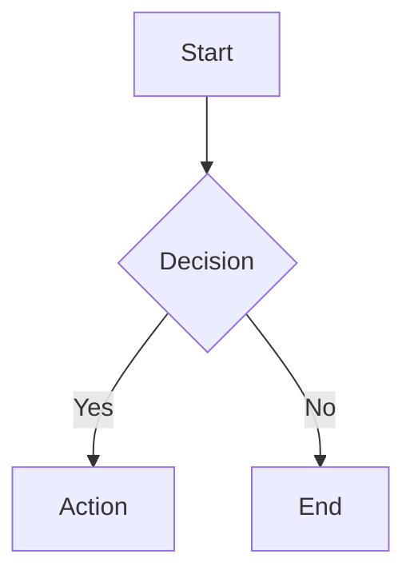

# Markdown Rendering System - Architecture Documentation

**Last Updated**: 2025-12-12
**Status**: Complete
**Feature Branch**: `feature/markdown-renderer`

## Overview

The MegaCampusAI markdown rendering system provides two distinct renderers optimized for different use cases: server-side rendering for static content and client-side rendering for streaming/dynamic content.

## Design Principles

1. **Single Source of Truth**: Unified component API with preset-based configuration
2. **Performance First**: Zero client JS for static content syntax highlighting (Shiki SSR)
3. **Security**: Content sanitization for user-generated content, CSP-compliant Mermaid rendering
4. **Accessibility**: WCAG AA compliant with proper ARIA labels and keyboard navigation
5. **Streaming Support**: Real-time rendering for AI chat responses

## Architecture Overview

```
┌─────────────────────────────────────────────────────────────────────┐
│                    MARKDOWN RENDERING SYSTEM                         │
├─────────────────────────────────────────────────────────────────────┤
│                                                                      │
│  ┌──────────────────────────┐      ┌───────────────────────────┐   │
│  │  MarkdownRenderer (RSC)  │      │ MarkdownRendererClient    │   │
│  │  Server Component        │      │ Client Component          │   │
│  └──────────────────────────┘      └───────────────────────────┘   │
│             │                                    │                  │
│             │                                    │                  │
│  ┌──────────▼─────────────┐         ┌───────────▼──────────────┐   │
│  │  next-mdx-remote       │         │  Streamdown              │   │
│  │  - Shiki highlighting  │         │  - Basic highlighting    │   │
│  │  - KaTeX math          │         │  - Streaming support     │   │
│  │  - Mermaid diagrams    │         │  - Block memoization     │   │
│  │  - Callouts            │         │  - Minimal features      │   │
│  │  - Anchor links        │         │                          │   │
│  └────────────────────────┘         └──────────────────────────┘   │
│                                                                      │
└─────────────────────────────────────────────────────────────────────┘
```

## Two-Renderer Strategy

### Why Two Renderers?

The system uses two separate renderers because **Next.js 15 architectural constraints** prevent a single unified approach:

1. **Server Components (RSC)** cannot be used with client-side data fetching
2. **Server Actions** cannot import `react-dom/server` in production builds
3. **Route Handlers** have the same limitation as Server Actions

### Renderer Selection Guide

| Use Case | Renderer | Reason |
|----------|----------|--------|
| Lesson pages (static) | `MarkdownRenderer` (RSC) | Full features, 0 KB client JS |
| Content previews (static) | `MarkdownRenderer` (RSC) | Accurate preview with full features |
| AI chat (streaming) | `MarkdownRendererClient` | Real-time streaming support |
| Admin previews (dynamic) | `MarkdownRendererClient` | Client-side data fetching |
| User comments | `MarkdownRenderer` (RSC) | Sanitization + full features |

## Component Architecture

### 1. MarkdownRenderer (Server Component)

**Location**: `packages/web/components/markdown/MarkdownRenderer.tsx`

**Purpose**: Server-side rendering for static content with full feature support

**Tech Stack**:
- `next-mdx-remote@5.x` - MDX compilation
- `shiki@1.24+` - Syntax highlighting (SSR)
- `rehype-pretty-code` - Shiki integration
- `remark-math` + `rehype-katex` - Math formulas
- `remark-gfm` - GitHub Flavored Markdown
- Custom plugins for callouts, Mermaid, anchor links

**Features**:
- ✅ Shiki syntax highlighting (SSR, 0 KB client JS)
- ✅ KaTeX math rendering (inline + block)
- ✅ Mermaid diagrams (sandboxed iframe)
- ✅ Callouts/admonitions (GitHub-style)
- ✅ Anchor links on headings
- ✅ Copy-to-clipboard on code blocks
- ✅ Responsive tables
- ✅ Content sanitization (optional)

**Usage**:
```tsx
import { MarkdownRenderer } from '@/components/markdown';

// Server Component or Server Action
export default async function LessonPage() {
  const lesson = await fetchLesson();

  return (
    <MarkdownRenderer
      content={lesson.content}
      preset="lesson"
    />
  );
}
```

### 2. MarkdownRendererClient (Client Component)

**Location**: `packages/web/components/markdown/MarkdownRendererClient.tsx`

**Purpose**: Client-side rendering for streaming and dynamic content

**Tech Stack**:
- `streamdown@latest` - Vercel's streaming markdown renderer
- Built-in basic syntax highlighting
- Optimized for real-time updates

**Features**:
- ✅ Streaming support (token-by-token)
- ✅ Basic syntax highlighting (client-side)
- ✅ GFM support (tables, strikethrough, etc.)
- ✅ Block-level memoization
- ❌ No KaTeX math
- ❌ No Mermaid diagrams
- ❌ No callouts
- ❌ No anchor links

**Usage**:
```tsx
'use client';
import { MarkdownRendererClient } from '@/components/markdown';

export function ChatMessage({ content, isStreaming }) {
  return (
    <MarkdownRendererClient
      content={content}
      isStreaming={isStreaming}
    />
  );
}
```

## Feature Comparison

| Feature | MarkdownRenderer (RSC) | MarkdownRendererClient |
|---------|----------------------|----------------------|
| **Syntax Highlighting** | Shiki (full, SSR) | Streamdown (basic) |
| **Math (KaTeX)** | ✅ Yes | ❌ No |
| **Mermaid Diagrams** | ✅ Yes | ❌ No |
| **Callouts** | ✅ Yes | ❌ No |
| **Anchor Links** | ✅ Yes | ❌ No |
| **Copy Button** | ✅ Yes | ❌ No |
| **Streaming Support** | ❌ No | ✅ Yes |
| **Client JS (syntax)** | 0 KB | ~5-10 KB |
| **Sanitization** | ✅ Yes (optional) | ❌ No |
| **Preset Support** | 4 presets | 2 presets |
| **Custom Components** | ✅ MDX components | ❌ No |

## Preset System

### Available Presets

| Preset | Math | Mermaid | Code | Copy | Anchors | Callouts | Tables | Use Case |
|--------|------|---------|------|------|---------|----------|--------|----------|
| `lesson` | ✅ | ✅ | ✅ | ✅ | ✅ | ✅ | ✅ | Full lesson pages |
| `preview` | ✅ | ❌ | ✅ | ✅ | ❌ | ✅ | ✅ | Admin content preview |
| `chat` | ❌ | ❌ | ✅ | ❌ | ❌ | ❌ | ❌ | AI chat messages |
| `minimal` | ❌ | ❌ | ❌ | ❌ | ❌ | ❌ | ❌ | Simple text only |

**Note**: `MarkdownRendererClient` only supports `chat` and `minimal` presets.

### Preset Configuration

**Location**: `packages/web/components/markdown/presets.ts`

```typescript
export interface FeatureFlags {
  math: boolean;
  mermaid: boolean;
  codeHighlight: boolean;
  copyButton: boolean;
  anchorLinks: boolean;
  callouts: boolean;
  responsiveTables: boolean;
}

export const presets: Record<PresetName, PresetConfig> = {
  lesson: {
    math: true,
    mermaid: true,
    codeHighlight: true,
    copyButton: true,
    anchorLinks: true,
    callouts: true,
    responsiveTables: true,
  },
  // ... other presets
};
```

## Plugin Pipeline

### MarkdownRenderer Plugin Flow

```
Markdown Input
    ↓
┌───────────────────────┐
│   Remark Plugins      │
│   (AST Transform)     │
├───────────────────────┤
│ 1. remark-gfm         │  ← GitHub Flavored Markdown
│ 2. remark-math        │  ← LaTeX syntax detection
│ 3. remark-emoji       │  ← Emoji shortcodes
│ 4. custom-callouts    │  ← > [!NOTE] syntax
└───────────────────────┘
    ↓
┌───────────────────────┐
│   Rehype Plugins      │
│   (HTML Transform)    │
├───────────────────────┤
│ 1. rehype-sanitize*   │  ← XSS protection (optional)
│ 2. rehype-pretty-code │  ← Shiki highlighting
│ 3. rehype-katex       │  ← Math rendering
│ 4. rehype-slug        │  ← Heading IDs
│ 5. rehype-autolink    │  ← Anchor links
│ 6. custom-mermaid     │  ← Diagram sandboxing
└───────────────────────┘
    ↓
┌───────────────────────┐
│   MDX Components      │
├───────────────────────┤
│ - CodeBlock           │
│ - Callout             │
│ - MermaidDiagram      │
│ - Heading             │
│ - Link                │
│ - ResponsiveTable     │
└───────────────────────┘
    ↓
JSX Output
```

**\* Note**: `rehype-sanitize` only runs for `trusted={false}` content.

## Security Architecture

### Content Trust Levels

1. **Trusted Content** (default: `trusted={true}`)
   - AI-generated lessons
   - Admin-authored content
   - **Sanitization**: Disabled for performance
   - **Allowed**: All features including raw HTML

2. **Untrusted Content** (`trusted={false}`)
   - User-generated comments
   - External content
   - **Sanitization**: Enabled via `rehype-sanitize`
   - **Allowed**: Safe subset of HTML + markdown features

### Sanitization Schema

**Location**: `packages/web/components/markdown/security.ts`

```typescript
import { defaultSchema } from 'rehype-sanitize';

export const sanitizeSchema = {
  ...defaultSchema,
  tagNames: [
    ...(defaultSchema.tagNames ?? []),
    'math', 'semantics', 'mrow', 'mi', 'mo', 'mn', // KaTeX MathML
  ],
  attributes: {
    ...defaultSchema.attributes,
    code: ['className'],  // For language-* classes
    span: ['className', 'style'], // For Shiki highlighting
  },
};
```

### Mermaid CSP Compliance

**Challenge**: Mermaid requires `unsafe-eval` for diagram rendering, violating strict CSP.

**Solution**: Sandboxed iframe with isolated CSP

```tsx
<iframe
  sandbox="allow-scripts"
  srcdoc={mermaidHTML}
  className="mermaid-iframe"
  title="Mermaid diagram"
  aria-label={description}
/>
```

**Benefits**:
- Main app maintains strict CSP (`no unsafe-eval`)
- Diagrams render with isolated permissions
- XSS attacks contained to iframe sandbox

## Component Details

### CodeBlock Component

**Location**: `packages/web/components/markdown/components/CodeBlock.tsx`

**Features**:
- Shiki syntax highlighting (180+ languages)
- Copy-to-clipboard button
- Language badge
- Optional filename header
- Line number display
- Line highlighting

**Props**:
```typescript
interface CodeBlockProps {
  children: React.ReactNode;
  language?: string;
  filename?: string;
  showLineNumbers?: boolean;
  highlightLines?: number[];
  className?: string;
}
```

**Markdown Example**:
````markdown
```typescript filename="example.ts" showLineNumbers {2,3}
function greet(name: string) {
  const message = `Hello, ${name}!`;  // highlighted
  return message;                      // highlighted
}
```
````

### Callout Component

**Location**: `packages/web/components/markdown/components/Callout.tsx`

**Types**: `note`, `tip`, `warning`, `danger`, `info`

**Markdown Syntax** (GitHub-style):
```markdown
> [!NOTE]
> Important information

> [!WARNING]
> Critical warning

> [!TIP]
> Helpful suggestion
```

**HTML Output**:
```html
<aside class="callout callout-note" role="note">
  <div class="callout-icon">
    <Info />
  </div>
  <div class="callout-content">
    <div class="callout-title">Note</div>
    <div class="callout-body">Important information</div>
  </div>
</aside>
```

### MermaidDiagram Component

**Location**: `packages/web/components/markdown/components/MermaidDiagram.tsx`

**Features**:
- Lazy loading (only when visible)
- Sandboxed iframe rendering
- Dark mode support
- Loading skeleton
- Error handling

**Markdown Syntax**:
````markdown

````

**Rendering Strategy**:
1. Parse Mermaid syntax
2. Generate HTML with embedded Mermaid library
3. Render in sandboxed iframe with `srcdoc`
4. Auto-resize iframe to content height

## Testing Strategy

### Visual Regression Tests

**Location**: `packages/web/tests/e2e/visual/markdown-visual.spec.ts`

**Coverage**: 20+ visual test cases including:
- Typography and prose styling
- Code blocks with syntax highlighting (multiple languages)
- Math formulas (inline and block)
- Mermaid diagrams (flowcharts, sequence diagrams)
- Callouts (all 5 types)
- Tables (responsive wrapper)
- Links (internal/external)
- Headings with anchor links
- Dark mode variants

**Run Tests**:
```bash
# Run visual tests
pnpm test:visual:markdown

# Update snapshots (after intentional changes)
pnpm test:visual:markdown:update
```

**Playwright Configuration**:
```typescript
// playwright.config.ts
{
  name: 'markdown-visual',
  use: {
    viewport: { width: 1280, height: 720 },
    screenshot: 'only-on-failure',
  },
}
```

### Unit Tests

**Location**: `packages/web/components/markdown/__tests__/`

**Coverage**:
- MarkdownRenderer rendering
- MarkdownRendererClient streaming
- Component prop validation
- Preset configuration merging
- Plugin pipeline execution

## Performance Optimization

### Bundle Size Strategy

| Component | Client JS | Lazy Loaded | Notes |
|-----------|-----------|-------------|-------|
| MarkdownRenderer | 0 KB | N/A | Pure SSR |
| MarkdownRendererClient | ~5-10 KB | No | Always loaded |
| MermaidDiagram | ~200 KB | Yes | Only when diagram present |
| CodeBlock (copy) | ~2 KB | No | Minimal client interaction |

### Rendering Performance

1. **Server-Side (MarkdownRenderer)**:
   - Shiki highlighting: ~50-100ms per code block
   - KaTeX rendering: ~10-20ms per formula
   - Total: <500ms for typical lesson

2. **Client-Side (MarkdownRendererClient)**:
   - Streamdown parsing: <10ms per block
   - Block memoization prevents re-renders
   - Streaming: Incremental without flicker

## Accessibility Compliance

### WCAG AA Requirements

| Component | ARIA | Keyboard | Focus | Screen Reader |
|-----------|------|----------|-------|---------------|
| CodeBlock | `tabIndex={0}` | Tab to focus | Visible outline | Code announced |
| Copy Button | `aria-label="Copy code"` | Enter/Space | Button focus | Action feedback |
| Callout | `role="note"` | - | - | Type + content read |
| MermaidDiagram | `aria-label={desc}` | - | - | Description read |
| Heading Anchor | `aria-hidden="true"` | Tab to anchor | Visible # | Link announced |
| Link (external) | - | Tab | Underline | "External link" |

### Skip Navigation

**Location**: `packages/web/components/markdown/components/SkipToContent.tsx`

```tsx
<a href="#main-content" className="skip-to-content">
  Skip to main content
</a>
```

Visible on keyboard focus for screen reader users.

## Migration Path (Completed)

### Previous Implementation: ServerRenderedMarkdown (Abandoned)

**Why It Was Tried**:
- Admin preview panels needed full-featured rendering
- Client-side data fetching conflicted with Server Components
- Server Actions seemed like a solution

**Why It Failed**:
- Next.js 15 production builds **prohibit** `react-dom/server` imports in:
  - Server Actions (`'use server'` functions)
  - Route Handlers (`/api/*`)
- Error: *"You're importing a component that imports react-dom/server. This only works in a Server Component which is not supported in Server Actions."*

**Attempted Workarounds** (all failed):
1. ✗ Route Handler (`/api/markdown/render`)
2. ✗ `serverExternalPackages: ['react-dom']` in `next.config.ts`
3. ✗ Dynamic imports with `next/dynamic`

**Root Cause**: `react-dom/server` APIs (`renderToStaticMarkup`, `renderToString`) are designed for **build-time SSR/SSG**, not runtime server-side rendering in response to client requests.

### Current Migrations (Completed)

#### 1. ContentPreviewPanel
```diff
- import { ServerRenderedMarkdown } from '@/components/markdown';
+ import { MarkdownRendererClient } from '@/components/markdown';

- <ServerRenderedMarkdown content={rawMarkdown} preset="lesson" />
+ <MarkdownRendererClient content={rawMarkdown} />
```

**Rationale**: Admin preview panels fetch data client-side, so `MarkdownRendererClient` is appropriate despite reduced features.

#### 2. LessonContentView
```diff
- import { ServerRenderedMarkdown } from '@/components/markdown';
+ import { MarkdownRendererClient } from '@/components/markdown';

- <ServerRenderedMarkdown content={content} preset="lesson" />
+ <MarkdownRendererClient content={content} />
```

**Rationale**: Same as ContentPreviewPanel - client-side context requires client renderer.

#### 3. Lesson Pages (Already Completed)
```tsx
// packages/web/app/lesson/[id]/page.tsx
import { MarkdownRenderer } from '@/components/markdown';

export default async function LessonPage({ params }) {
  const lesson = await fetchLesson(params.id);

  return <MarkdownRenderer content={lesson.content} preset="lesson" />;
}
```

**Rationale**: Static pages use Server Components, enabling full features with 0 KB client JS.

## Future Enhancements

### Potential Alternatives for Full-Featured Admin Previews

If 100% rendering parity between admin previews and student lessons becomes critical:

1. **Pre-render on Lesson Save**
   - Render markdown to HTML when lesson is saved
   - Store HTML alongside markdown in database
   - Admin previews fetch pre-rendered HTML
   - **Pros**: Instant preview, accurate rendering
   - **Cons**: Storage overhead, stale on markdown changes

2. **Client-Side Full Renderer**
   - Bundle all plugins (Shiki, KaTeX, Mermaid) to client
   - Use same pipeline as `MarkdownRenderer` but client-side
   - **Pros**: Feature parity
   - **Cons**: Large bundle (~500 KB), slow initial render

3. **Edge Function Rendering**
   - Deploy markdown renderer to Edge Runtime
   - Call Edge Function from client for rendering
   - **Pros**: Full features, no client bundle
   - **Cons**: Requires Vercel Edge, latency on each request

4. **React Server Components with Streaming**
   - Wait for RSC to support dynamic streaming patterns
   - Use Server Components with client-side data
   - **Pros**: Best of both worlds
   - **Cons**: Not yet supported in Next.js

**Current Decision**: Accept feature gap for admin previews. Students see full rendering on lesson pages (primary use case), which is the priority.

## File Organization

```
packages/web/
├── components/
│   └── markdown/
│       ├── MarkdownRenderer.tsx          # Main RSC renderer
│       ├── MarkdownRendererClient.tsx    # Client streaming renderer
│       ├── presets.ts                    # Preset configurations
│       ├── types.ts                      # TypeScript interfaces
│       ├── index.ts                      # Public exports
│       ├── components/
│       │   ├── CodeBlock.tsx             # Code with copy button
│       │   ├── Callout.tsx               # Admonition blocks
│       │   ├── MermaidDiagram.tsx        # Diagram lazy loader
│       │   ├── MermaidIframe.tsx         # Sandboxed iframe
│       │   ├── Heading.tsx               # H1-H6 with anchors
│       │   ├── Link.tsx                  # Smart links
│       │   ├── ResponsiveTable.tsx       # Table wrapper
│       │   ├── SkipToContent.tsx         # A11y skip link
│       │   └── index.ts
│       ├── styles/
│       │   └── katex-overrides.css       # Dark mode fixes
│       └── __tests__/
│           ├── MarkdownRenderer.test.tsx
│           └── components/
│               └── *.test.tsx
├── tests/
│   └── e2e/
│       └── visual/
│           └── markdown-visual.spec.ts   # Visual regression tests
└── app/
    └── layout.tsx                        # KaTeX CSS import

specs/017-markdown-renderer/
├── ARCHITECTURE.md                       # This file
├── quickstart.md                         # Usage guide
├── spec.md                               # Feature specification
├── plan.md                               # Implementation plan
├── refactoring-plan.md                   # ServerRenderedMarkdown story
├── tasks.md                              # Task tracking
├── contracts/
│   └── component-api.md                  # API documentation
└── checklists/
    └── requirements.md                   # Requirements checklist
```

## Key Takeaways

1. **Two-Renderer Pattern is Intentional**: Next.js 15 architectural constraints necessitate separate RSC and client renderers.

2. **ServerRenderedMarkdown Was a Dead End**: `react-dom/server` cannot be used in Server Actions or Route Handlers in production builds.

3. **Feature Gap is Acceptable**: Admin previews use `MarkdownRendererClient` with reduced features. Students see full rendering on lesson pages (primary use case).

4. **Visual Tests Ensure Consistency**: 20+ visual regression tests prevent unintended rendering changes.

5. **Security is Multi-Layered**: Content sanitization + CSP compliance + sandboxed Mermaid = defense in depth.

6. **Performance is Excellent**: 0 KB client JS for syntax highlighting, lazy-loaded Mermaid, block memoization for streaming.

## Related Documentation

- **Quickstart Guide**: [quickstart.md](./quickstart.md)
- **Component API**: [contracts/component-api.md](./contracts/component-api.md)
- **Feature Specification**: [spec.md](./spec.md)
- **Implementation Plan**: [plan.md](./plan.md)
- **Refactoring History**: [refactoring-plan.md](./refactoring-plan.md)
