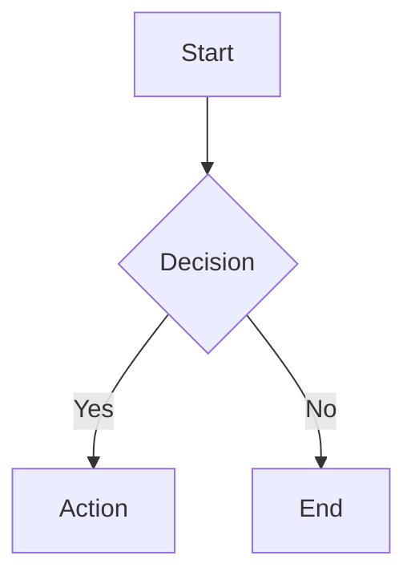

# Component API Contract: Unified Markdown Rendering System

**Date**: 2025-12-11
**Status**: Complete

## 1. MarkdownRenderer (RSC)

### Signature

```typescript
export function MarkdownRenderer(props: MarkdownRendererProps): Promise<JSX.Element>
```

### Props

| Prop | Type | Default | Description |
|------|------|---------|-------------|
| `content` | `string` | *required* | Markdown/MDX content to render |
| `preset` | `'lesson' \| 'chat' \| 'preview' \| 'minimal'` | `'lesson'` | Preset configuration |
| `components` | `Record<string, ComponentType>` | `{}` | Custom MDX components to merge |
| `className` | `string` | preset default | Additional CSS classes |
| `features` | `Partial<FeatureFlags>` | `{}` | Override preset features |
| `trusted` | `boolean` | `true` | Use trusted (no sanitize) or untrusted pipeline |

### Usage Examples

```tsx
// Basic usage with default preset
<MarkdownRenderer content={lessonMarkdown} />

// Chat preset with custom class
<MarkdownRenderer
  content={chatMessage}
  preset="chat"
  className="my-custom-class"
/>

// Lesson preset but disable mermaid
<MarkdownRenderer
  content={lessonContent}
  preset="lesson"
  features={{ mermaid: false }}
/>

// User-generated content (sanitized)
<MarkdownRenderer
  content={userComment}
  preset="minimal"
  trusted={false}
/>

// Custom components
<MarkdownRenderer
  content={mdxContent}
  components={{
    CustomWidget: MyWidgetComponent,
    Quiz: QuizComponent,
  }}
/>
```

### Behavior

1. Reads content string and compiles MDX server-side
2. Applies remark plugins based on preset features
3. Applies rehype plugins (sanitize-first for untrusted)
4. Renders custom components for code blocks, callouts, etc.
5. Returns server-rendered JSX (no client JS for syntax highlighting)

---

## 2. MarkdownRendererClient

### Signature

```typescript
export function MarkdownRendererClient(props: MarkdownRendererClientProps): JSX.Element
```

### Props

| Prop | Type | Default | Description |
|------|------|---------|-------------|
| `content` | `string` | *required* | Streaming markdown content |
| `preset` | `'chat' \| 'minimal'` | `'chat'` | Limited preset options |
| `className` | `string` | preset default | Additional CSS classes |
| `isStreaming` | `boolean` | `false` | Whether content is actively streaming |
| `features` | `Partial<FeatureFlags>` | `{}` | Override features |

### Usage Examples

```tsx
// AI chat with streaming indicator
<MarkdownRendererClient
  content={streamingMessage}
  isStreaming={isLoading}
/>

// Minimal preset
<MarkdownRendererClient
  content={simpleText}
  preset="minimal"
/>
```

### Behavior

1. Uses Streamdown library for rendering
2. Automatically handles incomplete markdown during streaming
3. Block-level memoization for performance
4. Minimal feature set (no math, mermaid, anchor links)

---

## 3. CodeBlock

### Signature

```typescript
export function CodeBlock(props: CodeBlockProps): JSX.Element
```

### Props

| Prop | Type | Default | Description |
|------|------|---------|-------------|
| `children` | `ReactNode` | *required* | Code content |
| `language` | `string` | `'plaintext'` | Programming language |
| `filename` | `string` | - | Optional filename header |
| `showLineNumbers` | `boolean` | `false` | Display line numbers |
| `highlightLines` | `number[]` | `[]` | Lines to highlight (1-indexed) |
| `className` | `string` | - | Additional CSS classes |

### Usage Examples

```tsx
// Basic code block
<CodeBlock language="typescript">
  {`const foo = 'bar';`}
</CodeBlock>

// With filename and line numbers
<CodeBlock
  language="javascript"
  filename="example.js"
  showLineNumbers
>
  {code}
</CodeBlock>

// With highlighted lines
<CodeBlock
  language="python"
  highlightLines={[2, 3]}
>
  {pythonCode}
</CodeBlock>
```

### Rendered HTML Structure

```html
<figure class="code-block" data-language="typescript">
  <figcaption class="code-header">
    <span class="language-badge">TypeScript</span>
    <span class="filename">example.ts</span>
    <button class="copy-button" aria-label="Copy code">
      <!-- Icon -->
    </button>
  </figcaption>
  <pre tabindex="0">
    <code>
      <!-- Shiki-highlighted spans -->
    </code>
  </pre>
</figure>
```

---

## 4. Callout

### Signature

```typescript
export function Callout(props: CalloutProps): JSX.Element
```

### Props

| Prop | Type | Default | Description |
|------|------|---------|-------------|
| `type` | `'note' \| 'tip' \| 'warning' \| 'danger' \| 'info'` | *required* | Callout type |
| `title` | `string` | Type name | Custom title |
| `children` | `ReactNode` | *required* | Callout content |
| `className` | `string` | - | Additional CSS classes |

### Usage Examples

```tsx
// Basic note
<Callout type="note">
  This is important information.
</Callout>

// Warning with custom title
<Callout type="warning" title="Deprecation Notice">
  This API will be removed in v2.0.
</Callout>
```

### Markdown Syntax (GitHub-style)

```markdown
> [!NOTE]
> This is a note callout

> [!WARNING]
> This is a warning

> [!TIP]
> This is a helpful tip

> [!DANGER]
> This is dangerous

> [!INFO]
> Additional information
```

### Rendered HTML Structure

```html
<aside class="callout callout-warning" role="note">
  <div class="callout-icon">
    <!-- Lucide icon -->
  </div>
  <div class="callout-content">
    <div class="callout-title">Warning</div>
    <div class="callout-body">
      <!-- Content -->
    </div>
  </div>
</aside>
```

---

## 5. MermaidDiagram

### Signature

```typescript
export function MermaidDiagram(props: MermaidDiagramProps): JSX.Element
```

### Props

| Prop | Type | Default | Description |
|------|------|---------|-------------|
| `chart` | `string` | *required* | Mermaid syntax definition |
| `className` | `string` | - | Additional CSS classes |
| `ariaLabel` | `string` | - | Accessible description |

### Usage Examples

```tsx
// Flowchart
<MermaidDiagram
  chart={`
    flowchart TD
      A[Start] --> B{Decision}
      B -->|Yes| C[Action]
      B -->|No| D[End]
  `}
  ariaLabel="Flowchart showing decision process"
/>
```

### Markdown Syntax

````markdown

````

### Rendered HTML Structure

```html
<figure class="mermaid-container">
  <iframe
    sandbox="allow-scripts"
    srcdoc="<!-- Mermaid HTML -->"
    class="mermaid-iframe"
    title="Mermaid diagram"
    aria-label="Flowchart showing decision process"
  />
  <figcaption class="sr-only">
    Flowchart showing decision process
  </figcaption>
</figure>
```

### Loading State

```html
<div class="mermaid-loading animate-pulse bg-muted rounded-lg h-48 flex items-center justify-center">
  <span class="text-muted-foreground">Loading diagram...</span>
</div>
```

### Error State

```html
<div class="mermaid-error bg-destructive/10 border border-destructive rounded-lg p-4">
  <span class="text-destructive">Failed to render diagram: {error}</span>
</div>
```

---

## 6. Heading

### Signature

```typescript
export function Heading(props: HeadingProps): JSX.Element
```

### Props

| Prop | Type | Default | Description |
|------|------|---------|-------------|
| `level` | `1 \| 2 \| 3 \| 4 \| 5 \| 6` | *required* | Heading level |
| `id` | `string` | auto-generated | Anchor ID |
| `children` | `ReactNode` | *required* | Heading text |
| `showAnchor` | `boolean` | `true` | Show anchor on hover |
| `className` | `string` | - | Additional CSS classes |

### Rendered HTML Structure

```html
<h2 id="my-heading" class="heading">
  <a href="#my-heading" class="anchor-link" aria-hidden="true">
    <span class="anchor-icon">#</span>
  </a>
  My Heading
</h2>
```

---

## 7. ResponsiveTable

### Signature

```typescript
export function ResponsiveTable(props: ResponsiveTableProps): JSX.Element
```

### Props

| Prop | Type | Default | Description |
|------|------|---------|-------------|
| `children` | `ReactNode` | *required* | Table content |
| `className` | `string` | - | Additional CSS classes |

### Rendered HTML Structure

```html
<div class="table-container overflow-x-auto">
  <table class="responsive-table">
    <!-- Table content -->
  </table>
</div>
```

---

## 8. Link

### Signature

```typescript
export function Link(props: LinkProps): JSX.Element
```

### Props

| Prop | Type | Default | Description |
|------|------|---------|-------------|
| `href` | `string` | - | Link URL |
| `children` | `ReactNode` | *required* | Link text |
| `className` | `string` | - | Additional CSS classes |
| `title` | `string` | - | Title attribute |

### Behavior

- Internal links (same origin) → normal navigation
- External links → `target="_blank"` + `rel="noopener noreferrer"` + external icon

### Rendered HTML Structure (External)

```html
<a
  href="https://example.com"
  target="_blank"
  rel="noopener noreferrer"
  class="external-link"
>
  Example
  <span class="external-icon" aria-hidden="true">
    <!-- External link icon -->
  </span>
</a>
```

---

## 9. Utility Functions

### getPresetConfig

```typescript
function getPresetConfig(
  preset?: PresetName,
  overrides?: Partial<PresetConfig>
): PresetConfig
```

Returns merged preset configuration with any overrides applied.

### getRemarkPlugins

```typescript
function getRemarkPlugins(features: FeatureFlags): PluginList
```

Returns remark plugins based on feature flags.

### getRehypePluginsTrusted

```typescript
function getRehypePluginsTrusted(features: FeatureFlags): PluginList
```

Returns rehype plugins for trusted content (no sanitization).

### getRehypePluginsUntrusted

```typescript
function getRehypePluginsUntrusted(features: FeatureFlags): PluginList
```

Returns rehype plugins for untrusted content (sanitization first).

---

## 10. CSS Custom Properties

The system uses CSS custom properties for theming:

```css
:root {
  /* Code blocks */
  --code-bg: #f6f8fa;
  --code-line-highlight: rgba(255, 255, 0, 0.1);

  /* Typography */
  --prose-body: var(--foreground);
  --prose-headings: var(--foreground);
  --prose-links: var(--primary);
  --prose-code: var(--foreground);
}

.dark {
  --code-bg: #161b22;
  --code-line-highlight: rgba(255, 255, 0, 0.05);
}
```

---

## 11. Accessibility Requirements

| Component | ARIA | Keyboard | Focus |
|-----------|------|----------|-------|
| CodeBlock | `tabIndex={0}` | Tab to focus | Visible outline |
| CodeBlock Copy | `aria-label="Copy code"` | Enter/Space | Button focus |
| Callout | `role="note"` or `role="alert"` | - | - |
| MermaidDiagram | `aria-label={description}` | - | - |
| Heading Anchor | `aria-hidden="true"` | Tab to anchor | Visible # |
| Link (external) | - | Tab | Underline on focus |
| Table | Native semantics | Tab through cells | Row highlight |
