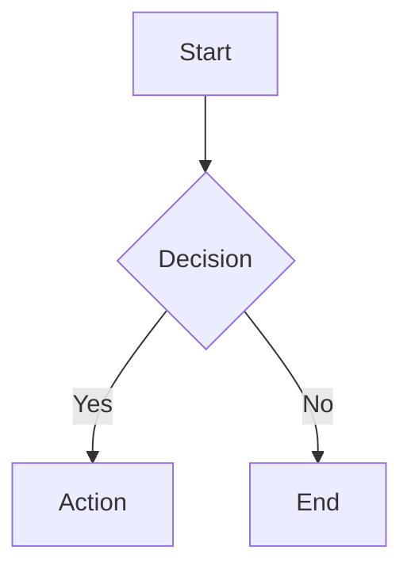

# Quickstart: Unified Markdown Rendering System

**Date**: 2025-12-11
**Last Updated**: 2025-12-12

## Prerequisites

- Node.js 20+
- pnpm 8+
- Next.js 15.5+ with App Router

## Important: Two-Renderer Architecture

This system uses **two separate renderers** for different use cases:

1. **MarkdownRenderer** (Server Component) - For static content with full features
2. **MarkdownRendererClient** (Client Component) - For streaming/dynamic content with basic features

See [ARCHITECTURE.md](./ARCHITECTURE.md) for technical details on why this approach is necessary.

## Installation

```bash
# Install new dependencies
pnpm add next-mdx-remote@^5.0.0 \
  shiki@^1.24.0 \
  rehype-pretty-code@^0.14.0 \
  remark-math@^6.0.0 \
  rehype-katex@^7.0.1 \
  rehype-slug@^6.0.0 \
  rehype-autolink-headings@^7.1.0 \
  mermaid@^11.4.0 \
  streamdown@latest

# Install KaTeX CSS (dev dependency for types)
pnpm add -D katex@^0.16.11

# Remove old dependency
pnpm remove rehype-highlight
```

## Basic Usage

### 1. Server-Side Rendering (Lessons, Static Content)

```tsx
// app/lesson/[id]/page.tsx
import { MarkdownRenderer } from '@/components/markdown';

export default async function LessonPage({ params }: { params: { id: string } }) {
  const lesson = await fetchLesson(params.id);

  return (
    <article className="max-w-4xl mx-auto p-8">
      <h1>{lesson.title}</h1>
      <MarkdownRenderer
        content={lesson.content}
        preset="lesson"
      />
    </article>
  );
}
```

### 2. Client-Side Streaming (AI Chat)

```tsx
// components/chat/ChatMessage.tsx
'use client';

import { MarkdownRendererClient } from '@/components/markdown';

export function ChatMessage({
  content,
  isStreaming
}: {
  content: string;
  isStreaming: boolean;
}) {
  return (
    <div className="chat-bubble">
      <MarkdownRendererClient
        content={content}
        isStreaming={isStreaming}
        preset="chat"
      />
    </div>
  );
}
```

### 3. Content Preview (Admin Panel - Client-Side Data)

```tsx
// components/admin/ContentPreview.tsx
'use client';

import { MarkdownRendererClient } from '@/components/markdown';

export function ContentPreview({ markdown }: { markdown: string }) {
  return (
    <div className="preview-panel border rounded-lg p-4">
      <MarkdownRendererClient
        content={markdown}
      />
    </div>
  );
}
```

**Note**: Admin panels that fetch data client-side must use `MarkdownRendererClient`. This renderer has reduced features (no math, mermaid, callouts) but supports dynamic content. See [Feature Comparison](#feature-comparison).

### 4. User-Generated Content (Comments)

```tsx
// components/comments/Comment.tsx
import { MarkdownRenderer } from '@/components/markdown';

export function Comment({ content }: { content: string }) {
  return (
    <div className="comment">
      <MarkdownRenderer
        content={content}
        preset="minimal"
        trusted={false} // Enable sanitization
      />
    </div>
  );
}
```

## Adding KaTeX CSS

Add to your root layout:

```tsx
// app/layout.tsx
import 'katex/dist/katex.min.css';
import '@/components/markdown/styles/katex-overrides.css';

export default function RootLayout({ children }: { children: React.ReactNode }) {
  return (
    <html lang="en">
      <body>{children}</body>
    </html>
  );
}
```

## Preset Reference

### MarkdownRenderer (RSC) Presets

| Preset | Math | Mermaid | Code | Copy | Anchors | Callouts | Tables | Use Case |
|--------|------|---------|------|------|---------|----------|--------|----------|
| `lesson` | ✅ | ✅ | ✅ | ✅ | ✅ | ✅ | ✅ | Full lesson pages |
| `preview` | ✅ | ❌ | ✅ | ✅ | ❌ | ✅ | ✅ | Static previews |
| `chat` | ❌ | ❌ | ✅ | ❌ | ❌ | ❌ | ❌ | Simple chat |
| `minimal` | ❌ | ❌ | ❌ | ❌ | ❌ | ❌ | ❌ | Text only |

### MarkdownRendererClient Presets

| Preset | Code | Tables | Use Case |
|--------|------|--------|----------|
| `chat` (default) | ✅ | ❌ | AI streaming chat |
| `minimal` | ❌ | ❌ | Plain text only |

**Note**: `MarkdownRendererClient` does **not** support math, mermaid, callouts, or anchor links due to streaming constraints.

## Content Examples

### Math Formulas

```markdown
Inline math: $E = mc^2$

Block math:
$$
\int_0^\infty x^2 dx = \frac{1}{3}x^3
$$
```

### Code Blocks

````markdown
```typescript filename="example.ts" showLineNumbers {2,3}
function greet(name: string) {
  const message = `Hello, ${name}!`;  // highlighted
  return message;                      // highlighted
}
```
````

### Callouts

```markdown
> [!NOTE]
> This is a note callout

> [!WARNING]
> This is a warning

> [!TIP]
> This is a helpful tip
```

### Mermaid Diagrams

````markdown

````

## Feature Overrides

Override preset features for specific use cases:

```tsx
// Enable math in chat preset
<MarkdownRenderer
  content={content}
  preset="chat"
  features={{ math: true }}
/>

// Disable copy button in lesson
<MarkdownRenderer
  content={content}
  preset="lesson"
  features={{ copyButton: false }}
/>
```

## Custom Components

Extend with custom MDX components:

```tsx
import { MarkdownRenderer } from '@/components/markdown';
import { Quiz, VideoPlayer, InteractiveDemo } from '@/components/interactive';

<MarkdownRenderer
  content={mdxContent}
  components={{
    Quiz,
    VideoPlayer,
    InteractiveDemo,
  }}
/>
```

Then in MDX content:

```mdx
# Lesson Title

Here's an interactive quiz:

<Quiz questions={[...]} />

Watch this video:

<VideoPlayer src="/videos/intro.mp4" />
```

## Migration Guide

### From lesson-content.tsx

```diff
- import { LessonContent } from '@/components/common/lesson-content';
+ import { MarkdownRenderer } from '@/components/markdown';

- <LessonContent content={markdown} />
+ <MarkdownRenderer content={markdown} preset="lesson" />
```

### From ContentPreviewPanel.tsx

```diff
- import ReactMarkdown from 'react-markdown';
- import remarkGfm from 'remark-gfm';
- import rehypeHighlight from 'rehype-highlight';
+ import { MarkdownRenderer } from '@/components/markdown';

- <ReactMarkdown remarkPlugins={[remarkGfm]} rehypePlugins={[rehypeHighlight]}>
-   {content}
- </ReactMarkdown>
+ <MarkdownRenderer content={content} preset="preview" />
```

### From RefinementChat.tsx (Streaming)

```diff
- import ReactMarkdown from 'react-markdown';
+ import { MarkdownRendererClient } from '@/components/markdown';

- <ReactMarkdown>{streamingMessage}</ReactMarkdown>
+ <MarkdownRendererClient
+   content={streamingMessage}
+   isStreaming={isLoading}
+ />
```

## Feature Comparison

| Feature | MarkdownRenderer (RSC) | MarkdownRendererClient |
|---------|----------------------|----------------------|
| **Syntax Highlighting** | Shiki (full, 180+ languages) | Streamdown (basic) |
| **Math (KaTeX)** | ✅ Yes | ❌ No |
| **Mermaid Diagrams** | ✅ Yes | ❌ No |
| **Callouts** | ✅ Yes | ❌ No |
| **Anchor Links** | ✅ Yes | ❌ No |
| **Copy Button** | ✅ Yes | ❌ No |
| **Streaming Support** | ❌ No | ✅ Yes |
| **Client JS (syntax)** | 0 KB | ~5-10 KB |
| **Use Context** | Server Components | Client Components |

## Troubleshooting

### KaTeX fonts not loading

**Solution**: Ensure `katex/dist/katex.min.css` is imported in root layout.

```tsx
// app/layout.tsx
import 'katex/dist/katex.min.css';
```

### Mermaid diagram not rendering

**Solution**: Check browser console for CSP violations. Mermaid runs in sandboxed iframe to avoid `unsafe-eval` in main app CSP.

**Note**: Mermaid only works with `MarkdownRenderer` (RSC), not `MarkdownRendererClient`.

### Code highlighting not working

**Solution**:
1. Verify `shiki` and `rehype-pretty-code` are installed
2. Ensure using `MarkdownRenderer` (RSC) for full Shiki highlighting
3. `MarkdownRendererClient` only has basic highlighting (Streamdown)

### Math formulas not rendering

**Solution**: Math formulas only work with `MarkdownRenderer` (RSC). If you need math in client components with dynamic data, consider:
1. Pre-rendering on server and passing HTML
2. Using a client-side math library (increases bundle size)

### Admin preview doesn't match student lesson view

**Explanation**: This is expected behavior. Admin previews using `MarkdownRendererClient` show reduced features (no math, diagrams, callouts). Students see full rendering on lesson pages using `MarkdownRenderer` (RSC).

**Alternative**: If you need accurate previews, fetch lesson data server-side and use `MarkdownRenderer` in a Server Component.

### Streaming content flickering

**Solution**: Use `MarkdownRendererClient` with `isStreaming` prop for streaming content:

```tsx
<MarkdownRendererClient
  content={streamingMessage}
  isStreaming={isLoading}
/>
```

## Visual Testing

Visual regression tests ensure consistent rendering across changes.

### Run Visual Tests

```bash
# Run all markdown visual tests
pnpm test:visual:markdown

# Run with Playwright UI
pnpm exec playwright test tests/e2e/visual/markdown-visual.spec.ts --ui

# View test report
pnpm exec playwright show-report
```

### Update Visual Snapshots (After Intentional Changes)

```bash
# Update all markdown visual snapshots
pnpm test:visual:markdown:update

# Update specific test
pnpm exec playwright test tests/e2e/visual/markdown-visual.spec.ts:21 --update-snapshots
```

**Coverage**: 20+ visual tests including typography, code blocks, math, diagrams, callouts, tables, and dark mode variants.

## Next Steps

1. **Read Architecture**: [ARCHITECTURE.md](./ARCHITECTURE.md) - Understand two-renderer design
2. **Run Type Check**: `pnpm type-check`
3. **Run Tests**: `pnpm test`
4. **Run Visual Tests**: `pnpm test:visual:markdown`
5. **Check Bundle Size**: `pnpm build && npx @next/bundle-analyzer`

## Related Documentation

- **Architecture**: [ARCHITECTURE.md](./ARCHITECTURE.md) - Technical deep dive
- **Component API**: [contracts/component-api.md](./contracts/component-api.md) - Props and interfaces
- **Feature Specification**: [spec.md](./spec.md) - User stories and requirements
- **Refactoring History**: [refactoring-plan.md](./refactoring-plan.md) - Why ServerRenderedMarkdown was removed
