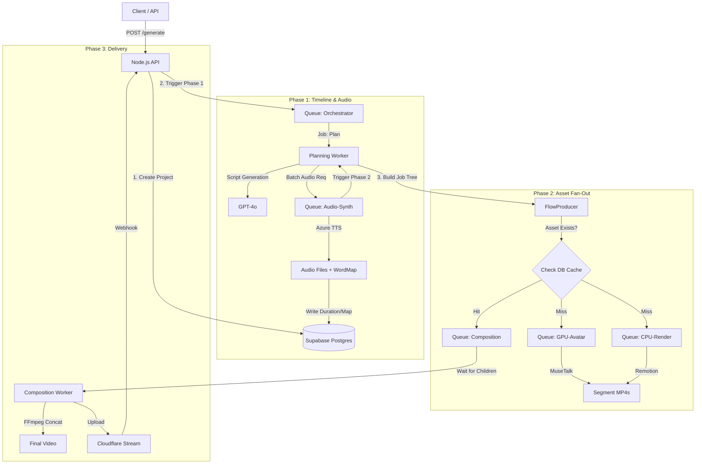

# Deep Think: Video Generation Pipeline Architecture Design

> Generated by DeepThink model, January 2025

This architecture meets the **100+ videos/day** scale at the **$0.50-$1.00** price point by strictly enforcing a **Segment-Based, Content-Addressed** strategy.

The core philosophy is: **"Audio is the Master Clock."**
We cannot render visuals until we know exactly how long the audio is. Therefore, the pipeline is split into two distinct phases: **Phase 1 (Timeline Construction)** and **Phase 2 (Asset Manufacturing)**.

---

## 1. High-Level Architecture Diagram



---

## 2. BullMQ Job Orchestration

To handle **Partial Regeneration** and **Multi-Language Batches**, we use a **Dynamic Tree Construction** pattern.

### Queue Topology

| Queue Name       | Type       | Concurrency | Priority | Description                                              |
| ---------------- | ---------- | ----------- | -------- | -------------------------------------------------------- |
| `q-orchestrator` | CPU        | 50          | High     | Logic-heavy: Hashing, Flow construction, Cache lookups.  |
| `q-audio`        | Network    | 20          | High     | Azure TTS. Rate-limited to prevent 429 errors.           |
| `q-render-cpu`   | Sandboxed  | 50          | Medium   | Remotion rendering (Slides, Code). Scales on simple VPS. |
| `q-render-gpu`   | HTTP Proxy | _Dynamic_   | Critical | Connects to RunPod. 1 concurrent job per active GPU.     |
| `q-compose`      | I/O        | 10          | Low      | FFmpeg stitching. Disk I/O bound.                        |

### Flow Scenarios

#### A) Full Video Generation

The `q-orchestrator` builds a dependency tree where **Composition** is the parent, and **Segments** are children.

1. **Script & Audio:** Orchestrator generates script, sends to `q-audio`.
2. **Wait:** Orchestrator waits for Audio (or uses a "Step" pattern).
3. **Construct Tree:** Once audio durations are known, it builds:
   - **Root:** `ComposeJob` (Data: `[path_to_intro, path_to_slide1, ...]`)
   - **Children:**
     - `AvatarJob` (Input: Audio URL + Image)
     - `SlideJob_1` (Input: Audio Duration + JSON)
     - `SlideJob_N` ...

#### B) Partial Regeneration ("Surgical Repair")

_Scenario: Typo fixed in Slide 5._

1. **Hashing:** Orchestrator calculates hashes for all 20 slides.
2. **Diff:** Checks `asset_cache` table. Finds matches for 1-4, 6-20. Miss for Slide 5.
3. **Tree Construction:**
   - **Root:** `ComposeJob` (Data: `segments: [cached_path, ..., JOB_ID_5, ..., cached_path]`)
   - **Children:** Only **ONE** child: `SlideJob_5`.
4. **Result:** System renders 15s of video. Composition runs immediately after.

#### C) Multi-Language Batch

_Scenario: 5 languages triggered._

1. **Shared Assets:** Background loops, Code Hike (without comments), and Intro Images are identified.
2. **Race Condition Handling:**
   - Orchestrator calculates Hash `X` for a generic code animation.
   - It performs an `INSERT ON CONFLICT DO NOTHING` into a `pending_assets` table.
   - First job wins and queues the render. Others subscribe/poll or simply wait (BullMQ dependency allows pointing multiple parents to one child).

---

## 3. Database Schema: Content-Addressed Caching

We utilize **Supabase** for strict asset tracking.

```sql
-- 1. Global Asset Cache (The "Store")
CREATE TABLE assets (
    hash CHAR(64) PRIMARY KEY, -- SHA256(Content + Config + Duration)
    type VARCHAR(20) NOT NULL, -- 'avatar', 'slide', 'code', 'audio'
    storage_path TEXT NOT NULL, -- s3://bucket/path.mp4
    metadata JSONB, -- { "duration": 15.2, "width": 1920 }
    created_at TIMESTAMPTZ DEFAULT NOW(),
    last_used_at TIMESTAMPTZ DEFAULT NOW() -- For GC
);

-- 2. Project State
CREATE TABLE projects (
    id UUID PRIMARY KEY DEFAULT gen_random_uuid(),
    status TEXT DEFAULT 'processing',
    lesson_json JSONB,
    final_url TEXT
);

-- 3. The "Edit List" (Links Projects to Assets)
CREATE TABLE project_segments (
    project_id UUID REFERENCES projects(id),
    sequence_index INT NOT NULL,
    segment_type TEXT NOT NULL,
    target_hash CHAR(64) NOT NULL, -- What we need
    resolved_asset_hash CHAR(64) REFERENCES assets(hash), -- What we found (nullable)
    PRIMARY KEY (project_id, sequence_index)
);
```

### Hashing Strategy

- **Audio:** `SHA256(Text + VoiceID + Speed + LangCode)`
- **Visual (Slide):** `SHA256(SlideJSON + ThemeID + AudioDurationMS)`
- **Visual (Avatar):** `SHA256(AudioHash + AvatarModelID + ReferenceImageID)`

---

## 4. GPU Resource Management (RunPod)

**Strategy: Hybrid (Reserved Baseline + Serverless Burst)**

Given the high avatar volume, a purely on-demand strategy introduces too much cold-start latency (15-30s). A purely reserved strategy is wasteful during lulls.

1. **Baseline (The "Workhorse"):**
   - **Resource:** 1x Reserved RTX 4090 (~$0.70/hr).
   - **Capacity:** Handles ~3,000 avatar seconds/hour. Sufficient for ~200 videos/day.
   - **State:** Model is always loaded in VRAM. Instant generation.

2. **Burst (The "Overflow"):**
   - **Resource:** RunPod Serverless Endpoint.
   - **Trigger:** If `q-render-gpu` depth > 10.
   - **Trade-off:** Higher cost per second + cold start, but ensures zero queue wait time.

**Failover:** If the Reserved instance health check fails, the Orchestrator automatically routes all jobs to the Serverless endpoint.

---

## 5. Error Handling & Recovery Matrix

| Failure Scenario    | Component | Recovery Strategy                                                                                                                          |
| ------------------- | --------- | ------------------------------------------------------------------------------------------------------------------------------------------ |
| **TTS > 10 mins**   | Audio     | **Chunking:** Orchestrator splits text by paragraph, generates N audio files, merges them.                                                 |
| **TTS Rate Limit**  | Audio     | **Smart Backoff:** BullMQ `exponential` backoff (start 5s, max 60s).                                                                       |
| **Avatar GPU Fail** | GPU       | **Graceful Degradation:** Retry 2x. If fails, fallback to **Static Image** (Avatar Photo + Audio). Do not fail the job; mark as `warning`. |
| **Render Timeout**  | CPU       | **Isolation:** Only the specific slide fails. Retry with higher timeout.                                                                   |
| **Missing Segment** | Compose   | **Self-Repair:** Compositor detects missing file -> Triggers high-priority "Repair Job" -> Pauses -> Resumes.                              |

---

## 6. Quality Assurance Pipeline

QA is **Automated & Blocking** for critical errors, **Flagged** for soft errors.

**A) Automated Checks (in `Composition` Worker)**

1. **Drift Check:** `abs(video_duration - audio_duration) < 0.1s`.
2. **Silence Detection:** `ffmpeg silencedetect`. Fail if silence > 3s inside a segment.
3. **Loudness:** If integrated LUFS is not -14 to -18, run `ffmpeg-normalize`.

**B) Triggers for Human Review**

- First video generated in a new `language`.
- Any video where `Avatar Fallback` (Static Image) occurred.
- Random 5% sample.

---

## 7. Cost Model (Per 5-min Video)

**Assumptions:** 5 min video, 15s Avatar Intro, 1920x1080.

| Item                 | Details                                    | Cost               |
| -------------------- | ------------------------------------------ | ------------------ |
| **Azure TTS**        | 4,500 chars \* $4/1M (Standard/Neural Mix) | $0.03              |
| **Avatar (GPU)**     | 15s \* $0.0002/s (RunPod)                  | $0.005             |
| **Visuals (CPU)**    | Remotion on commodity VPS                  | $0.05              |
| **Storage & Stream** | Cloudflare Stream + S3                     | $0.15              |
| **Compute Overhead** | DB, Queue, Orchestrator                    | $0.05              |
| **Scripting**        | GPT-4o-mini                                | $0.02              |
| **TOTAL**            |                                            | **~$0.30 - $0.35** |

_Note: This is comfortably below the $0.50 target, allowing margin for error._

---

## 8. Implementation Phases

**Phase 1: MVP (Weeks 1-3)**

- **Goal:** Functional pipeline, linear execution.
- **Tech:** BullMQ, Azure TTS, Remotion (local render), FFmpeg.
- **Languages:** Russian + English (both required from MVP).
- **Limitations:** No caching, on-demand GPU only.

**Phase 2: The Engine (Weeks 4-5)**

- **Goal:** Speed & Cost optimization.
- **Tech:** Implement `assets` table & Hashing logic. Deploy Reserved GPU worker.
- **Feature:** Partial Regeneration enabled.

**Phase 3: Scale (Week 6)**

- **Goal:** Global support.
- **Tech:** Multi-language fonts/RTL support. Automated QA Gates. Dashboard for manual review.
